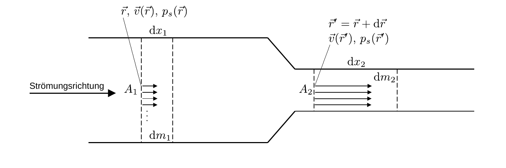

# Hinweise für den Versuch Aeromechnik

## Fluide

Im Rahmen dieses Versuchs untersuchen Sie die Eigenschaften von **Luftströmungen**. Dabei lernen Sie Gesetzmäßigkeiten der Stömungslehre kennen, die für alle [Fluide](https://de.wikipedia.org/wiki/Fluid) gelten. Der Begriff Fluid bezeichnet Stoffe die fließen. Ein Stoff fließt, wenn er sich unter dem Einfluss von [Scherkräften](https://de.wikipedia.org/wiki/Scherkraft) kontinuierlich [verformt](https://de.wikipedia.org/wiki/Verformung). Dazu zählen 

- Flüssigkeiten, 
- Gase und 
- Plasmen. 

Der [Schubmodul](https://de.wikipedia.org/wiki/Schubmodul) (siehe Versuch [Elastizität](https://gitlab.kit.edu/kit/etp-lehre/p1-praktikum/students/-/tree/main/Elastizitaet?ref_type=heads)) **idealer Fluide** (ohne innere Reibung) ist Null. In diesem Versuch machen Sie Experimente mit Luft. Wir betrachten die Luft als **inkompressibel**. Das Flüssigkeiten, wie z.B. Wasser, inkompressibel sind wirkt nachvollziehnbar. Luft kann jedoch bis zu Strömungsgeschwindigkeiten in der Größenordnung der Schallgeschwindigkeit (von $v_{s}=343.2\ \mathrm{m/s}$ unter Normbedingungen) ebenfalls als inkompressibel angenommen werden. 

In den folgenden Ausführungen werden wir zum leichteren Verständnis, je nach Zusammenhang von einer Flüssigkeit oder von Luft, als einem Gas, augehen. Alle Gesetzmäßigkeiten sind jedoch **auf alle Fluide anwendbar**.

## Kontinuitätsgleichung

Wir betrachten den Strom einer inkompressiblen Flüssigkeit durch ein sich verjüngendes Rohr, wie in **Abbildung 1** gezeigt:

---

**Abbildung 1**: (Stationärer Strom einer inkompressiblen Flüssigkeit (von links nach rechts) durch ein sich verjüngendes Rohr. Zusätzlich eingezeichnet sind die Massenelemente $\mathrm{d}m_{1}$ und $\mathrm{d}m_{2}$ und die Geschwindigkeiten an den Punkten $\vec{r}$ und $\vec{r}'$)

---

Für zwei gleichgroße Massenelemente $\mathrm{d}m_{1}=\mathrm{d}m_{2}=\mathrm{d}m$ gilt:
$$
\begin{equation*}
\begin{split}
\mathrm{d}m &= \rho\,\mathrm{d}V \\
&= \rho\,A_{1}\,\mathrm{d}x_{1} \\
&= \rho\,A_{2}\,\mathrm{d}x_{2}, \\
\end{split}
\end{equation*}
$$
d.h. wenn sich die Flüssigkeit mit dem Massenfluss 
$$
\begin{equation*}
\frac{\mathrm{d}m}{\mathrm{d}t}
\end{equation*}
$$
durch das Rohr bewegt verhalten sich die Fließgeschwindigkeiten der Massenelemente wie
$$
\begin{equation}
\begin{split}
&\frac{\mathrm{d}m}{\mathrm{d}t} = \rho\,A_{1}\,v_{1} =
\rho\,A_{2}\,v_{2}; \\
&\\
&\frac{v_{2}}{v_{1}} = \frac{A_{1}}{A_{2}};\\
&\\
&\text{mit:} \\
&\\
&v_{1}\equiv\frac{\mathrm{d}x_{1}}{\mathrm{d}t};
\qquad
v_{2}\equiv\frac{\mathrm{d}x_{2}}{\mathrm{d}t}, \\
\end{split}
\end{equation}
$$
Gleichung **(1)** bezeichnet man als **Kontinuitätsgleichung**. Sie folgt aus dem Prinzip der **Massenerhaltung**.  

## Strömungsgleichungen

### Geschwindigkeitsfeld

In der Punktmechanik betrachtet man einzelne Massenpunkte im Raum. Bei Flüssigkeiten wie hier betrachtet man stattdessen die Geschwindigkeit $\vec{v}(\vec{r},t)$ gedachter Massenelemente $\mathrm{d}m$ an festen Punkten $(\vec{r},t)$ in Raum und Zeit. Die Strömung der Flüssigkeit kann auf diese Weise als ganze durch das **Vektorfeld** $\vec{v}(\vec{r},t)$ beschrieben werden, wodurch die Betrachtung einzelner Massenpunkte entfällt. 

Hängt $\vec{v}(\vec{r})$ nicht explizit von $t$ ab, spricht man von einer **stationären Strömung**. Die Massenelemente $\mathrm{d}m$ können in diesem Fall immer noch Beschleunigungen auf ihrem Weg durch das Feld erfahren, indem sie sich z.B. vom Punkt $\vec{r}$ an einen Punkt $\vec{r}'=\vec{r}+\mathrm{d}\vec{r}$ mit $\vec{v}(\vec{r}')\neq\vec{v}(\vec{r})$ bewegen. Für die Beschleunigung gilt dann
$$
\begin{equation*}
\frac{\mathrm{d}\vec{v}}{\mathrm{d}t} = \frac{\mathrm{d}\vec{r}}{\mathrm{d}t} \frac{\partial\vec{v}}{\partial\vec{r}} = \left(\vec{v}\cdot\vec{\nabla}\right)\vec{v}(\vec{r}).
\end{equation*}
$$
Eine solche Situation ist z.B. in **Abbildung 1** gegeben. Kommt für eine nicht-stationäre Strömung noch eine explizite Abhängigkeit von $t$ hinzu ergibt sich die Beschleunigung allgemein zu: 
$$
\begin{equation*}
\frac{\mathrm{d}\vec{v}}{\mathrm{d}t} = \frac{\partial\vec{v}}{\partial t} + \left(\vec{v}\cdot\vec{\nabla}\right)\vec{v}(\vec{r}).
\end{equation*}
$$
Ein Massenelement in einer Flüssigkeit wird beschleunigt, wenn sich die Geschwindigkeit des Feldes $\vec{v}(\vec{r},t)$ am Ort $\vec{r}$ mit der Zeit ändert, oder wenn es an einen Ort $\vec{r}'$ mit $\vec{v}(\vec{r},t)\neq\vec{v}(\vec{r}',t)$ verschoben wird. 

### Euler-Gleichungen

Zur Herleitung der Euler-Gleichungen betrachten wir die Kräfte, die auf ein Massenelement $\mathrm{d}m$ in einer Flüssigkeit wirken. Dabei berücksichtigen wir die Gewichtskraft
$$
\begin{equation*}
\vec{F}_{g} = -\vec{g}\,\mathrm{d}m = -\rho\,\vec{g}\,\mathrm{d}V
\end{equation*}
$$
und die Kraft aufgrund eines Drucks $p_{s}$
$$
\begin{equation*}
\vec{F}_{s} = -\vec{\nabla}p_{s}\,\mathrm{d}V.
\end{equation*}
$$
Das Vorzeichen ergibt sich daraus, dass die Änderung des Bewegungszustands vom hohen zum niedrigen Druck (also entgegen dem Gradienten des Drucks) erfolgt. Aus dem [**Newtonschen Aktionsprinzip**](https://de.wikipedia.org/wiki/Newtonsche_Gesetze) erhalten wir daraus
$$
\begin{equation}
\begin{split}
&\underbrace{\left(\frac{\partial\vec{v}}{\partial t} + \left(\vec{v}\cdot\vec{\nabla}\right)\vec{v}\right)}\mathrm{d}m = 
\vec{F}_{g} + \vec{F}_{s}; \\
&\hphantom{cccccc}=\frac{\mathrm{d}\vec{v}}{\mathrm{d}t}\\
&\\
&\left(\frac{\partial\vec{v}}{\partial t} + \left(\vec{v}\cdot\vec{\nabla}\right)\vec{v}\right)\mathrm{d}V = 
-\vec{g}\,\mathrm{d}V - \frac{1}{\rho}\vec{\nabla}p_{s}\,\mathrm{d}V; \\
&\\
&\frac{\partial\vec{v}}{\partial t} + \left(\vec{v}\cdot\vec{\nabla}\right)\vec{v} = -\vec{g} - \frac{1}{\rho}\vec{\nabla}p_{s}. \\
\end{split}
\end{equation}
$$
Dabei handelt es sich um eine **Gleichung zur Beschreibung einer inkompressiblen Flüssigkeit ohne innere Reibung**, die nach [Leonard Euler](https://de.wikipedia.org/wiki/Leonhard_Euler) benannt ist.

### Bernoulli-Gleichung

Die Bernoulli-Gleichung für den Fall einer **stationären Strömung** folgt aus Gleichung **(2)** , durch Richtungsintegration entlang einer Kontour $\mathcal{C}$, die den Richtungsvektoren $\hat{v}(\vec{r})$ folgt:
$$
\begin{equation}
\begin{split}
&\int\limits_{\mathcal{C}}\left(\rho\,\left(\vec{v}\cdot\vec{\partial}_{r}\right)\vec{v} + 
\rho\,\vec{g} + 
\vec{\partial}_{r}p_{s}\right)\,\mathrm{d}\vec{r} = const.; \\
&\\
&\int\limits_{\mathcal{C}}\rho\,v\,\frac{\partial v}{\partial r}\,\mathrm{d}r + \int\limits_{\mathcal{C}}\rho\,g\,\mathrm{d}h
+ \int\limits_{\mathcal{C}} \frac{\partial p_{s}}{\partial r}\,\mathrm{d}r = const.; \\
&\\
&\int\limits_{\mathcal{C}}\rho\,v\,\mathrm{d}v + \int\limits_{\mathcal{C}}\rho\,g\,\mathrm{d}h
+ \int\limits_{\mathcal{C}} \mathrm{d}p_{s}=const.;\\
&\\
&\text{mit:}\\
&\\
&\hat{z}\cdot\mathrm{d}\vec{r}\equiv\mathrm{d}h \\
&\\
&\text{ergibt:}\\
&\\
&\underbrace{\frac{1}{2}\,\rho\,v^{2}} + 
\underbrace{
\vphantom{\frac{1}{2}\,\rho\,v^{2}}\rho\,g\,h} + p_{s} = const.;\\
&\equiv p_{d}
\hphantom{ccc}\equiv p_{g}\\
&\\
&\text{mit:}\\
&\\
&E_{\mathrm{kin}} = \frac{1}{2}\,\rho\,v^{2}\,\mathrm{d}V; \\
&\\
&E_{\mathrm{pot}} = \,\rho\,g\,h\,\mathrm{d}V; \\
&\\
&E_{\mathrm{p}} = p_{s}\,\mathrm{d}V, \\
\end{split}
\end{equation}
$$
wobei $E_{\mathrm{kin}}$ der kinetischen, $E_{\mathrm{pot}}$ der potentiellen und $E_{\mathrm{p}}$ der Druckenergie des Volumenelements $\mathrm{d}V$ entsprechen. Man kann diese nach [Daniel Bernoulli](https://de.wikipedia.org/wiki/Daniel_Bernoulli) benannte Gleichung also auch als Ausdruck der Energieerhaltung für das Massenelement $\mathrm{d}m$ im Volumenelement $\mathrm{d}V$ verstehen. 

Gleichung **(3)** setzt Größen jeweils der Einheit Druck in Beziehung zueinander: 

- $p_{s}$ ist der **hydrostatische Druck**.
- $p_{g}$ ist ein Spezialfall eines hydrostatischen Drucks der durch das Schwerefeld der Erde erzeugt und auch als **Schweredruck** bezeichnet wird. 
- $p_{d}$ wird als **dynamischer Druck** oder Staudruck bezeichnet. 

Wir bezeichnen die Kontour $\mathcal{C}$ als **Stromlinie**. Entlang einer Stromlinie ist der Gesamtdruck $p_{0}=p_{s}+p_{g}+p_{d}$ konstant. Gleichung **(3)** gilt zunächst nur für den Druckverlauf entlang einer Stromlinie.

Mikroskopisch betrachtet kommt der dynamische Druck dadurch zustande, dass es zum Impulsübertrag 
$$
\begin{equation*}
\mathrm{d}\vec{p} = \frac{\mathrm{d}\left(m\,\vec{v}\right)}{\mathrm{d}t}
\end{equation*}
$$
kommt, sobald das Massenelement $\mathrm{d}m$ im Feld $\vec{v}(\vec{r})$ beschleunigt wird. Der dynamische Druck wirkt in der Richtung von $\mathrm{d}\vec{p}$ und ist damit im Gegensatz zum [allseitig wirkenden hydrostatischen Druck](https://de.wikipedia.org/wiki/Hydrostatischer_Druck) gerichtet!   

## Essentials

Was Sie ab jetzt wissen sollten:

- Neben dem allseitig wirkenden **hydrostatischen Druck $p_{s}$** gibt es in strömenden Flüssigkeiten einen gerichteten **dynamischen Druck $p_{d}$**.  
- Es gilt $p_{s}+p_{d}=const.$, d.h. $p_{s}$ nimmt in dem Maße ab, in dem $p_{d}$ zunimmt! Den Schweredruck können Sie in den meisten Fällen vernachlässigen.

## Testfragen

1. Wir stellen uns vor, dass in **Abbildung 1** ein Stempel auf der linken Seite von links nach rechts *gedrückt* wird, um $p_{s}$ zu erzeugen. Wo ist $p_{s}$ höher, im linken oder im rechten Teil des Rohrs?
2. Wir stellen uns jetzt vor, dass im gleichen Bild ein Stempel auf der rechten Seite von links nach rechts *gezogen* wird. Wo ist $p_{s}$ höher, im linken oder im rechten Teil des Rohrs? 
4. Was ist in Gleichung **(3)** die Bedeutung von $h$? Wo liegt also der Ursprung des implizit gewählten Koordinatensystems? 

# Navigation

[Main](https://gitlab.kit.edu/kit/etp-lehre/p1-praktikum/students/-/tree/main/Aeromechanik)

