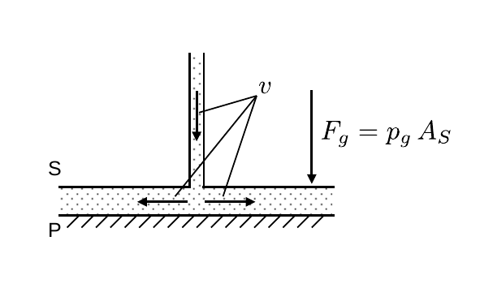

# Hinweise für den Versuch Aeromechnik

## Aeromechanisches Paradoxon

Beim **aerodynamischen Paradoxon** handelt es sich um das folgende Phänomen: 

Man setzt an eine Platte P einen Stempel S mit einer Rohröffnung in der Mitte der Stempelfläche $A_{S}$ an. Presst man Luft mit der Geschwindigkeit $v$ durch die Öffnung, strömt diese radial zwischen S und P nach außen ab. Entgegen der naiven Erwartung wird P durch die ausströmende Luft nicht vom Stempel abgestoßen, sondern angedrückt! 

Eine Skizze zur Erklärung dieses Phänomens ist in **Abbildung 1** gezeigt:

---

**Abbildung 1**: (Skizze zur Veranschaulichung des Paradoxons der Aerodynamik)

---

Die Luft strömt von oben durch die Rohröffnung aus und wird radial über $A_{S}$ nach außen gepresst. Wir gehen davon aus, dass die Luft inkompressibel und reibungsfrei ist, so dass $\vec{v}$ nur seine Richtung ändert, während der Betrag $v=|\vec{v}|$ jeweils gleich bleibt. Aus der Bernoulli-Gleichung folgt damit:
$$
\begin{equation*}
\begin{split}
&p_{0} = \frac{1}{2}\,\rho\,v^{2} + p_{s};\\
&\\
&p_{s} = p_{0} - \frac{1}{2}\,\rho\,v^{2}.\\
\end{split}
\end{equation*}
$$
$p_{s}$ wirkt allseitig, also auch nach oben auf S. Für den Fall $v=0$ gilt 
$$
\begin{equation*}
p_{0} = p_{s}
\end{equation*}
$$
und es kommt zu keiner resultierenden Kraft zwischen S und P aufgrund eines Unter- oder Überdrucks. Für $v\gt0$ wird S mit der Kraft
$$
\begin{equation}
F = - \frac{1}{2}\,\rho\,v^{2}A_{S}
\end{equation}
$$
auf P gedrückt. Selbst für ein inkompressibles und reibungsfreies Gas kann der maximale Druck, den man so auf P so ausüben kann den Atmosphärendruck $p_{0}$ nicht übersteigen. In diesem Fall gilt 
$$
\begin{equation*}
p_{s}=0;\qquad v_{0}=\sqrt{\frac{2p_{0}}{\rho}}.
\end{equation*}
$$
Die Gaspartikel können nicht weiter beschleunigt werden und erreichen die Grenzgeschwindigkeit $v_{0}$. Für die Dichte von Luft gilt: 
$$
\begin{equation*}
\rho=1.22\ \mathrm{N/m^{3}};\qquad p_{0}=1013\ \mathrm{hPa};\qquad \vartheta=15^{\circ}\mathrm{C},
\end{equation*}
$$
woaus lässt sich $v_{0}$ berechnen lässt:
$$
\begin{equation*}
v_{0} = \sqrt{\frac{2\,p_{0}}{\rho}} = \sqrt{\frac{2\cdot1013\times10^{2}\, \mathrm{N/m^{2}}}{1.225\ \mathrm{kg/m^{3}}}} =1.3\times10^{6} \ \mathrm{m/s}.
\end{equation*}
$$
Anwendung findet das beschriebene Phänomen, dass auch als [Bernoulli-Effekt](https://de.wikipedia.org/wiki/Bernoulli-Gleichung#Hydrodynamisches_Paradoxon) gekannt ist, bei [Strahlpumpen](https://de.wikipedia.org/wiki/Strahlpumpe), beim [Bunsenbrenner](https://de.wikipedia.org/wiki/Bunsenbrenner) oder als [Kamineffekt](https://de.wikipedia.org/wiki/Kamineffekt) in Schornsteinen. Vielen ist der Effekt in Form des folgenden Experiments bekannt, das man überall leicht selbst durchführen kann: 

Hängt man zwei Papierbögen jeweils über zwei Bleistifte und pustet Luft zwischen diese Papierbögen, dann entfernen diese sich nicht voneinander. Stattdessen bewegen Sie sich aufeinander zu.

# Navigation

[Main](https://gitlab.kit.edu/kit/etp-lehre/p1-praktikum/students/-/tree/main/Aeromechanik)
