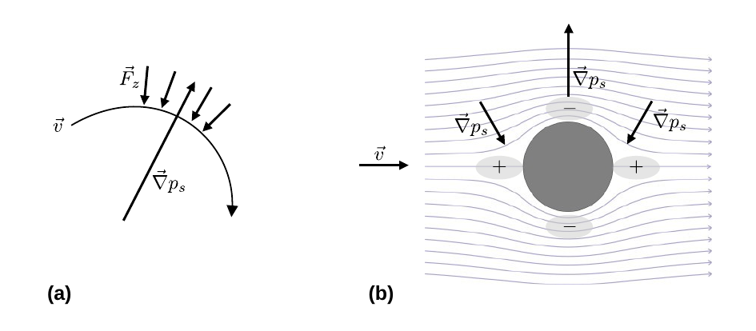
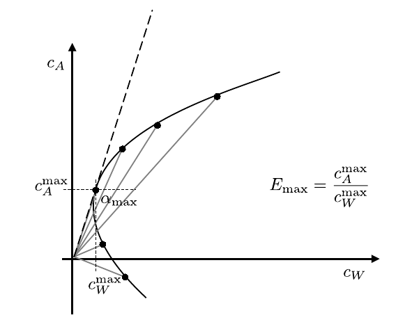

# Hinweise für den Versuch Aeromechnik

## Druck senkrecht zu gekrümmten Stromlinien

Die Diskussion der Bernouli-Gleichung [hier](https://gitlab.kit.edu/kit/etp-lehre/p1-praktikum/students/-/blob/main/Aeromechanik/doc/Hinweise-Druck.md) berücksichtigt nur den Druckgradienten *entlang* einer Stromlinie im Geschwindigkeitsfeld $\vec{v}(\vec{r})$. Die Bernoulli-Gleichung gilt, im Fall von gekrümmten Stromlinien, jedoch auch für Druckgradienten senkrecht zur Stromlinie, wie in **Abbildung 1** gezeigt:

---

**Abbildung 1**: ((a) Druck- und Kraftverhältnisse in der Umgebung einer kreisförmigen Stromlinie und (b) gekrümmte Stromlinien einer, einen Zylinder umströmenden idealen Flüssigkeit. Die Strömung verläuft von links nach rechts. Das Bild der umströmten Kugel stamm aus dem Artikel [*Hydrodynamics of highly visvous flow past a compound particle: Analytical solution*, Fluids 2016 1 (4)](https://www.mdpi.com/2311-5521/1/4/36))

---

Beschreibt eine Stromlinie eine kreisförmige Bahn wirkt auf die Massenelemente $\mathrm{d}m$ zu jedem Zeitpunkt eine Zentripetalkraft $\vec{F}_{z}$ in Richtung des Zentrums der Bahn, wie in **Abbildung 1a** gezeigt. Diese Kraft wird durch einen Druckgradienten $\vec{\nabla}p_{s}$ in radialer Richtung erzeugt. Dieser weist in radiale Richtung, weil $\vec{F}_{z}$ in Richtung des niedrigeren Drucks wirkt.  

In einem flüssigkeitsumströmten Zylinder, wie in **Abbildung 1b** gezeigt, verlaufen die Stromlinien in der Umgebung des Körpers gekrümmt. Auf der Symmetrieachse vor und hinter dem Zylinder krümmen sie sich nach oben (unten). Es besteht ein Überdruck, der in der Abbildung durch ein $+$ dargestellt ist. An den oberen (unteren) Kanten des Zylinders krümmen sich die Stromlinien nach unten (oben). Der Druck muss also mit zunehmendem Abstand vom Zylinder zunehmen. Da in hinreichend großer Entfernung Normdruck vorherrscht, muss am Zylinder selbst ein Unterdruck bestehen, der in der Abbildung durch ein $-$ dargestellt ist. 

Daraus zeigt sich, dass die Strömungsgeschwindigkeit $\vec{v}$ entlang einer Stromlinie nicht konstant ist. Die Flüssigkeit staut sich vor dem Zylinder auf, woraufhin $\vec{v}$ abnimmt. Beim Umströmen des Zylinders nimmt $\vec{v}$ zu, woraufhin sich die Flüssigkeit auf der Rückseite des Zylinders wieder staut und $\vec{v}$ erneut abnimmt. 

### Funktionaler Zusammenhang

Zur Diskussion des funktionalen Zusammenhangs betrachten wir die Radialkomponente einer stationären, kreisförmigen Strömung mit festem Radius $r=const.$ und fester Winkelgeschwindigkeit $\omega=const.$ 
$$
\begin{equation*}
\begin{split}
&\vec{r} = \left(
\begin{array}{c}
r\,\cos\varphi\\
r\,\sin\varphi\\
z \\
\end{array}
\right);\qquad 
\vec{v} = \left(
\begin{array}{c}
-r\,\omega\sin\varphi\\
\hphantom{-}r\,\omega\cos\varphi\\
z \\
\end{array}
\right);\qquad
\vec{a} = \left(
\begin{array}{c}
-r\,\omega^{2}\sin\varphi\\
-r\,\omega^{2}\cos\varphi\\
z \\
\end{array}
\right);\\
&\\
&v_{r}\equiv0;\qquad v_{\varphi}=\omega\,r\equiv v.\\
\end{split}
\end{equation*}
$$
In dieser Formulierung nimmt die Radialkomponente der Euler-Gleichung die folgende Form an: 
$$
\begin{equation}
\begin{split}
&\underbrace{
\vphantom{\frac{\partial v_{r}}{\partial \varphi}} v_{r}\,\frac{\partial v_{r}}{\partial r}} + 
\underbrace{\frac{v_{\varphi}}{r}\,\frac{\partial v_{r}}{\partial \varphi}} + 
\underbrace{
\vphantom{\frac{\partial v_{r}}{\partial \varphi}}
v_{z}\,\frac{\partial v_{r}}{\partial z}} - \frac{v^{2}_{\varphi}}{r} = -g -\frac{1}{\rho}\,\frac{\partial p_{s}}{\partial r}\\
&\hphantom{c}=0\hphantom{cccccc}=0\hphantom{cccccc}=0\\
&\\
&\text{mit:}\\
&\\
&v_{r}\equiv0.\\
\end{split}
\end{equation}
$$
Die Herleitung erfolgt analog zu Gleichung **(2)** [hier](https://gitlab.kit.edu/kit/etp-lehre/p1-praktikum/students/-/blob/main/Aeromechanik/doc/Hinweise-Druck.md) unter Anwendung des **Newtonschen Aktionsprinzips**. Dabei ist bei allen Ableitungen des Orts nach der Zeit auch die zeitliche Veränderung der Koordinaten $\hat{r}$ und $\hat{\varphi}$ selbst zu berücksichtigen, woraus sich der Term
$$
\begin{equation*}
-\frac{v^{2}_{\varphi}}{r}
\end{equation*}
$$
auf der linken Seite von Gleichung **(1)** ergibt. In dem von uns betrachteten Fall mit $v_{r}\equiv0$, ist nur dieser Term von Null verschiedenen und Gleichung **(1)** nimmt, unter weiterer Vernachlässigung des Schweredrucks, die Form 
$$
\begin{equation*}
\begin{split}
&\rho\,\frac{v^{2}}{r} = \frac{\partial p_{s}}{\partial r};\\
&\\
&\text{mit:}\\
&\\
&v_{\varphi}=v
\end{split}
\end{equation*}
$$
an, wobei $v_{\varphi}$ gerade die Geschwindigkeit $v$ der Strömung ist. 

**Für eine im Kreis strömende Flüssigkeit nimmt der Druck nach außen hin zu.** Diese Druckzunahme ist erforderlich, um die Zentripetalbeschleunigung der Massenelemente $\mathrm{d}m$ zu bewirken.  

Dieser Umstand lässt sich experimentell leicht veranschaulichen: Rühren Sie Wasser in einem großen Becherlglas um, steigt der Wasserspiegel nach außen hin an. Der hydrostatische Druck ist also außen größer, als innen. Zudem können Sie beobachten, dass Luftblasen sich zum niedrigeren Druck hin, ins Zentrum des Wirbels bewegen. In einer ruhenden Flüssigkeit bewegen sich Luftblasen ebenfalls in Richtung des niedrigeren Drucks, nämlich nach oben. 

Wie bei der Diskussion der Bernoulli-Gleichung *entlang* beliebiger Stromlinien [hier](https://gitlab.kit.edu/kit/etp-lehre/p1-praktikum/students/-/blob/main/Aeromechanik/doc/Hinweise-Druck.md), lässt sich auch Gleichung **(1)** anschaulich und wengier formell erklären: Ein Massenelement $\mathrm{d}m$ auf einer Kreisbahn erfährt die Zentripetalkraft 
$$
\begin{equation*}
\vec{F}_{z} = -\mathrm{d}m\,\frac{v^{2}}{r}\,\hat{r}.
\end{equation*}
$$
Diese folgt aus dem Druckgradienten
$$
\begin{equation*}
\begin{split}
&\vec{F}_{z} = -\mathrm{d}m\,\frac{v^{2}}{r}\,\hat{r}= -\frac{\partial p_{s}}{\partial r}\,\hat{r}\,\mathrm{d}V;\\
&\\
&\frac{\mathrm{d}m}{\mathrm{d}V}\,\frac{v^{2}}{r} = \rho\,\frac{v^{2}}{r} = \frac{\partial p_{s}}{\partial r}.
\end{split}
\end{equation*}
$$

## Polardiagramm und Gleitzahl

Für **Aufgabe 4** sollen Sie das [**Polardiagramm**](https://de.wikipedia.org/wiki/Polardiagramm_(Str%C3%B6mungslehre)) einer am Versuchsplatz ausliegenden Tragfläche für verschiedene Anstellwinkel $\alpha$ bestimmen. Hierzu tragen Sie für feste Anstellwinkel $\alpha$ die Auftriebskraft $F_{A}$ (auf der $y$-Achse) gegen den Strömungswiderstand $F_{W}$ (auf der $x$-Achse) auf. Die Darstellung eines daraus resultierenden beispielhaften Diagramms ist in **Abbildung 2** gezeigt:

---

**Abbildung 2**: (Schematische Darstellung eines Polardiagramms der Strömungslehre)

---

Im Diagramm ist der [**Auftriebskoeffizient**](https://de.wikipedia.org/wiki/Auftriebsbeiwert) oder **Auftriebsbeiwert**
$$
\begin{equation*}
c_{A} \equiv \frac{F_{A}}{p_{d}\,A}
\end{equation*}
$$
analog zum Widerstandskoeffizienten (siehe Gleichung **(1)** [hier](https://gitlab.kit.edu/kit/etp-lehre/p1-praktikum/students/-/blob/main/Aeromechanik/doc/Hinweise-cW.md)) definiert. Da, wie ebenfalls [hier](https://gitlab.kit.edu/kit/etp-lehre/p1-praktikum/students/-/blob/main/Aeromechanik/doc/Hinweise-cW.md?ref_type) erwähnt, als Referenzfläche die Tragfläche $A$ verwendet wird ist die Auftragung $c_{A}(c_{W})$ zur Auftragung $F_{A}(F_{W})$ äquivalent. Die aufgetragenen Punkte sind durch Kreise dargestellt. Die Ursprungsgeraden durch die Punkte bezeichnet man als **Polstrahlen**. Das Verhältnis
$$
\begin{equation*}
E\equiv\frac{c_{A}}{c_{W}},
\end{equation*}
$$
d.h. der jeweilige Kehrwert der Steigung eines in **Abbildung 2** eingezeichneten Polstrahls bezeichnet man als [**Gleitzahl**](https://de.wikipedia.org/wiki/Gleitzahl_(Flugzeug)). Der Winkel mit der höchsten Gleitzahl wird als **Gleitwinkel** bezeichnet.  

# Navigation

[Main](https://gitlab.kit.edu/kit/etp-lehre/p1-praktikum/students/-/tree/main/Aeromechanik)
