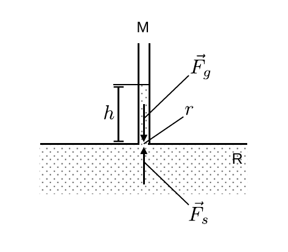
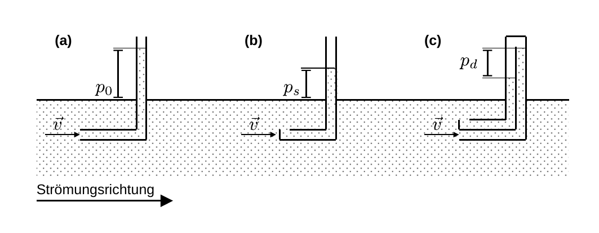
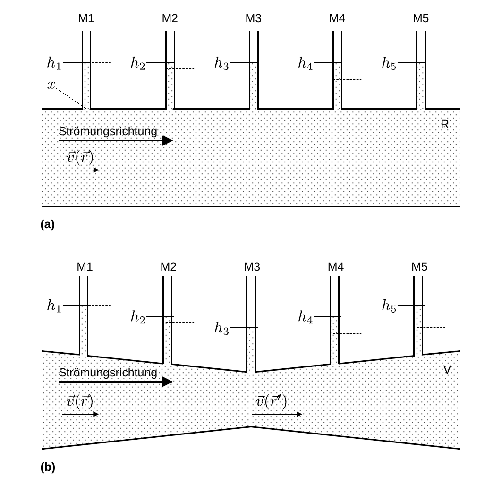

# Hinweise für den Versuch Aeromechnik

## Druckmessung

Der hydrostatische Druck $p_{s}$ lässt sich am anschaulichsten im Gleichgewichtszustand mit dem Schweredruck $p_{g}$ in einem Messrohr M messen, wie in **Abbildung 1** gezeigt:

---

**Abbildung 1**: (Schematische Darstellung eines Messrohrs zur Messung des hydrostatischen Drucks)

---

Er führt aufgrund seiner Allseitigkeit zu einer senkrecht nach oben wirkenden Kraft $\vec{F}_{s}$, die die Flüssigkeit im Punkt $r$ nach oben drückt. Mit zunehmender Höhe $h$ der Flüssigkeitssäule wirkt $\vec{F}_{s}$ die Gewichtskraft $\vec{F}_{g}$ entgegen. Im Gleichgewichtszustand gilt:
$$
\begin{equation*}
\begin{split}
&\vec{F}_{g} + \vec{F}_{s}= 0;
\qquad p_{s} = \rho\,g\,h,\\
\end{split}
\end{equation*}
$$
wobei jeweils $g$ die Gravitationskonstante und $\rho$ die Dichte der Flüssigkeit ist. Die Höhe $h$ der Flüssigkeitssäule ist also ein direktes Maß für $p_{s}(r)$. In einer strömenden Flüssigkeit tritt neben dem hydrostatischen auch der dynamische Druck auf und es gilt (unter Vernachlässigung von $p_{g}$): 
$$
\begin{equation}
\begin{split}
p_{0} = &\underbrace{\frac{1}{2}\,\rho\,v^{2}} + p_{s} = const.;\\
&\hphantom{,}=p_{d}\\
\end{split}
\end{equation}
$$
Es gibt mehrere Anordnungen zur Messung verschiedener Drücke, wie in **Abbildung 2** gezeigt:

---

**Abbildung 2**: (Anordnungen zur Messung des (a) gesamten, (b) hydrostatischen und (c) dynamischen Drucks)

---

- In **Abbildung 2a** ist das [**Pitotrohr**](https://de.wikipedia.org/wiki/Pitotrohr) zur Messung des Gesamtdrucks $p_{0}$ gezeigt. Die offene Spitze des Rohr, die der Strömungsrichtung der Flüssigkeit entgegen gerichtet ist bezeichnet man als [Staupunkt](https://de.wikipedia.org/wiki/Staupunktstr%C3%B6mung#Staupunkt).
- In **Abbildung 2b** ist die [**statische Sonde**](https://de.wikipedia.org/wiki/Statische_Sonde) zur Messung von $p_{s}$ gezeigt.
- In **Abbildung 2c** ist das [**Prantlrohr**](https://de.wikipedia.org/wiki/Prandtlsonde) zur Messung von $p_{d}$ gezeigt. Hier strömt die Flüssigkeit in die Öffnung am Staupunkt ein, wie beim Pitotrohr. Senkrecht dazu in der Nähe des Staupunkts befindet sich eine zweite Öffnung die $p_{s}$ aufnimmt. Aufgrund der Anordnung ist die angezeigte Höhe $\propto p_{0}-p_{s}$.  

## Das Ventirusche Rohr 

Der Verlauf von $p_{s}$ lässt sich am anschaulichsten durch die Höhe von Flüssigkeitssäulen in einer Reihe von Messrohren M veranschaulichen, wie in **Abbildung 3** gezeigt:

---

**Abbildung 3**: (Verlauf des hydrostatischen Drucks $p_{s}$ (a) in einem Rohr R und (b) in einem Venturischen Rohr V. Die Strömungsrichtung der Flüssigkeit verläuft von links nach rechts. Der Druck wird durch die Höhen $h_{i}$ der Flüssigkeitssäulen in den Messrohren M1 bis M5 veranschaulicht. Die gestrichelten Linien entsprechen der Erwartung unter Berücksichtigung innerer Reigungseffekte)

---

Die Höhen $h_{i}$ der Flüssigkeitssäulen sind durch horizontale Linien markiert. Die gestrichelten Linien entsprechen der Erwartung unter Berücksichtigung innerer Reibungseffekte in der Flüssigkeit. Da wir von einer inkompressiblen Flüssigkeit ausgehen ist $p_{s}$ überall in R gleich. Aus Gleichung **(1)** folgt, dass $\vec{v}(\vec{r})=\vec{v}$ ebenfalls überall in R gleich ist. 

In **Abbildung 3b** ist das Ventirusche Rohr V gezeigt, dessen Querschnitt sich entlang der Strömung verjüngt und wieder weitet. Nach Gleichung **(1)** [hier](https://gitlab.kit.edu/kit/etp-lehre/p1-praktikum/students/-/blob/main/Aeromechanik/doc/Hinweise-Druck.md), führt die Verjüngung des Querschnitts $A_{r^{\prime}}$ im Ort $r^{\prime}$, für eine inkompressible Flüssigkeit, zur Erhöhung der Geschwindigkeit $v(r^{\prime})$ gemäß
$$
\begin{equation}
v(r') = v(r)\,\frac{A_{r}}{A_{r'}};
\end{equation}
$$
Nach Gleichung **(1)** folgt, dass $p_{s}(r)$ entsprechend ab- und wieder zunehmen muss. 

Die durch den Druck ausgeübte Kraft $\vec{F}_{s}$ leistet zunächst die Arbeit, um die Massenelemente $\mathrm{d}m$ der Flüssigkeit auf die Geschwindigkeit $v(r')$ zu beschleunigen. Weitet sich das Rohr wieder geben die $\mathrm{d}m$ einen Teil ihrer kinetischen Energie wieder an die übrigen Massenelemente in V ab, wodurch sich $p_{s}$ wieder erhöht. 

Im Resultat beobachtet man in einer Anordnung, wie in **Abbildung 3b** einen Abfall von $p_{s}$ zur Verjüngung von $A$ hin und einen erneuten Anstieg, sobald $A$ wieder zunimmt. 

## Essentials

Was Sie ab jetzt wissen sollten:

- In einer in einem Rohr strömenden inkompressiblen Flüssigkeit nimmt $p_{s}$ ab, wenn wenn die Fläche des durchströmten Querschnitts des Rohrs abnimmt und zu, wenn sie zunimmt. 
- Sie sollten mit den **unterschiedlichen Drücken $p_{0}$, $p_{s}$ und $p_{d}$ in einer strömenden Flüssigkeit** vertraut sein.  
- Sie sollten sich über die unterschiedlichen **Funktionsweisen der Sonden zur Messung der verschiedenen Drücke** im Klaren sein.

## Testfragen

1. Welche Höhen $h_{i}$ erwarten Sie für eine ruhende Flüssigkeit in **Abbildung 2a**? 
2. Entsteht in **Abbildung 2a** ein von der Höhe der Flüssigkeit abhängiges Druckprofil in R (begründen Sie Ihre Antwort)?
3. Warum darf man den Schweredruck in Gleichung **(1)** ignorieren?

# Navigation

[Main](https://gitlab.kit.edu/kit/etp-lehre/p1-praktikum/students/-/tree/main/Aeromechanik)
