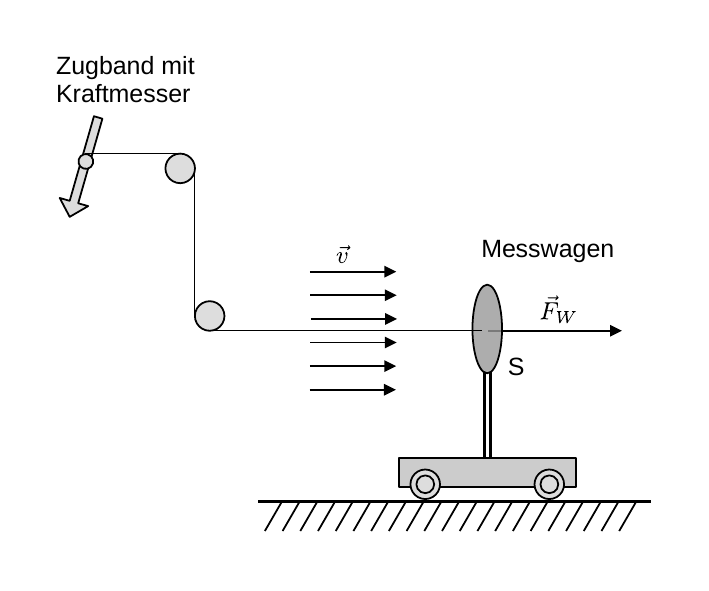

# Hinweise für den Versuch Aeromechnik

## Strömungswiderstand

Als  Strömungswiderstand bezeichnet man die Kraft $\vec{F}_{W}$, die ein Fluid einem umströmten Gegenstand entgegensetzt. Eine grob skizzierte Messanordnung ist in **Abbildung 1** gezeigt:

---

**Abbildung 1**: (Skizze zur Veranschaulichung des Strömungswiderstands einer kreisförmigen Scheibe auf einem Messwagen)

---

Da die Strömung einen dynamischen Druck
$$
\begin{equation*}
p_{d} = \frac{1}{2}\,\rho\,v^{2};
\end{equation*}
$$
(in Strömungsrichtung) bewirkt, liegt es nahe, dass 
$$
\begin{equation*}
\begin{split}
&F_{W} \propto p_{d}\,A\propto \rho\,v^{2}A; \\
&\\
&F_{W} = c_{W}\,\frac{1}{2}\,\rho\,v^{2}\,A,
\end{split}
\end{equation*}
$$
wobei $A$ der Stirnfläche des umströmten Gegenstands senkrecht zu $\vec{v}$ entspricht. **In der Luftfahrt wird abweichend die Tragfläche selbst als Referenzfläche $A$ verwendet.**

Die Proportionalitätskonstante 
$$
\begin{equation}
c_{W}\equiv\frac{F_{W}}{p_{d}\,A}
\end{equation}
$$
wird als [**Widerstandskoeffizient**](https://de.wikipedia.org/wiki/Str%C3%B6mungswiderstandskoeffizient) oder **Widerstandsbeiwert** bezeichnet. Dieser bringt zum Ausdruck, wie groß der effektive, kraftausübende Impulsübertrag der Fluidpartikel am umströmten Gegenstand ist und hängt von der Form des umströmten Körpers ab. Einige Beispiele für $c_{W}$-Werte sind in der folgenen Tabelle zusammengestellt (Quelle [Wikipedia](https://de.wikipedia.org/wiki/Str%C3%B6mungswiderstandskoeffizient#cw-Werte_von_typischen_K%C3%B6rperformen))

| $c_{W}$    | Form                                    |
| ---------- | --------------------------------------- |
| 1.11       | Runde Scheibe                           |
| 0.45       | Kugel                                   |
| 0.34       | Konvexe Halbkugel                       |
| 1.33       | Konkave Halbkugel                       |
| 0.04       | Strominienförmiger Körper (Tropfenform) |
| 0.53… 0.69 | Mountenbike (auftrecht von vorn)        |
| 0.78       | Mensch                                  |

Bekannte $c_{W}$-Werte für einige Auto- und Motorradtypen können Sie [hier](https://de.wikipedia.org/wiki/Portal:Auto_und_Motorrad/Luftwiderstandsbeiwert#Luftwiderstandsbeiwerte_von_Kraftfahrzeugen) finden. Das Produkt 
$$
\begin{equation*}
f_{W}=c_{W}\,A
\end{equation*}
$$
bezeichnet man als **Widerstandsfläche**.

# Navigation

[Main](https://gitlab.kit.edu/kit/etp-lehre/p1-praktikum/students/-/tree/main/Aeromechanik)

