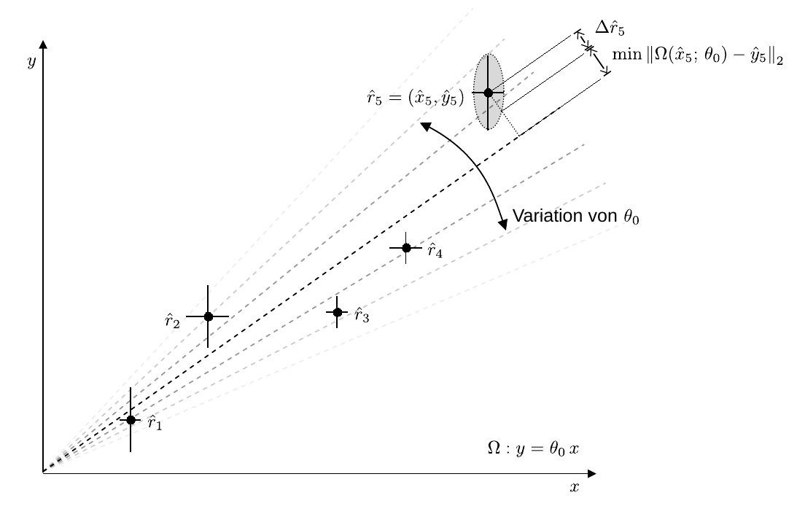
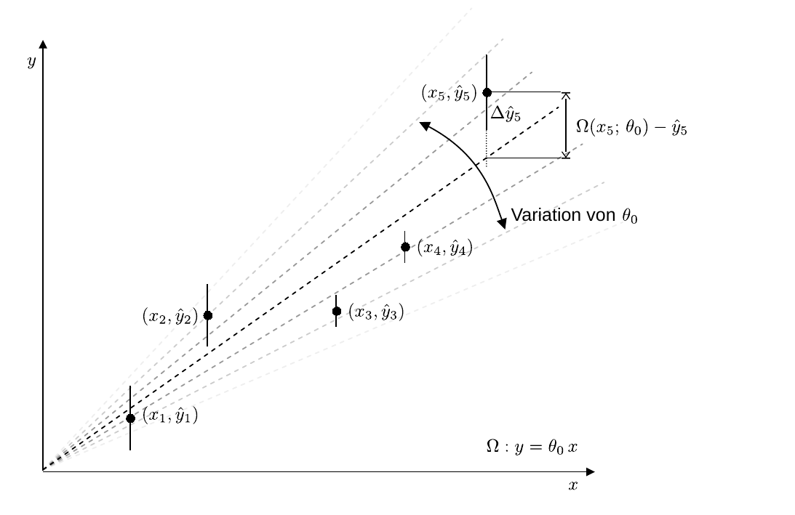
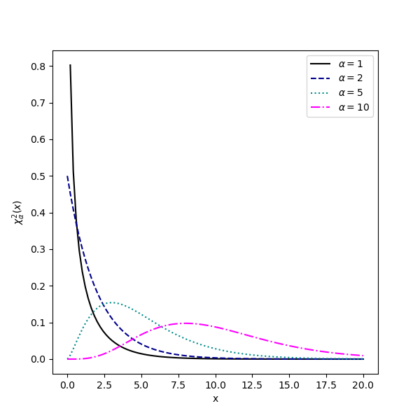

# Hinweise für den Versuch Datenverarbeitung

## Anpassung mit der $\chi^{2}$-Methode

Bei der [Parameterschätzung](https://de.wikipedia.org/wiki/Sch%C3%A4tzfunktion) vergleichen wir eine Menge von $n$ Datenpunkten
$$
\begin{equation*}
\{\hat{r}_{i}=(\hat{x}_{i}, \hat{y}_{i}):\quad i=1\ldots n\}
\end{equation*}
$$
mit einem Modell $\Omega(r;\,\{\theta_{j}\})$, das von $k$ Parametern
$$
\begin{equation*}
\{\theta_{j}:\quad j=1\ldots k\}
\end{equation*}
$$
abhängen kann. **Im Rahmen einer [Optimierungsaufgabe](https://de.wikipedia.org/wiki/Optimierungsproblem) sind diejenigen Werte $\{\hat{\theta}_{j}\}$ zu finden, mit denen $\Omega(r;\,\{\theta_{j}\})$ die $\{\hat{r}_{i}\}$ "am besten" beschreibt**. 

Um diese Aufgabe lösen zu können brauchen wir eine Funktion, mit deren Hilfe wir quantifizieren können, inwiefern eine Beschreibung "besser" ist als eine andere. Eine solche Funktion bezeichnet man als **Kostenfunktion**. Wir wählen die Funktion
$$
\newcommand\normx[1]{\left\Vert#1\right\Vert}
\begin{equation}
\begin{split}
&z\left(\{\theta_{j}\};\,r,\{\hat{r}_{i}\}\right) = \sum\limits_{i=1}^{n}\left(\underbrace{
\frac{\min_\limits{r}\normx{\vphantom{\frac{1}{2}}\Omega(r;\,\{\theta_{j}\})-\hat{r}_{i}}_{2}}{\Delta \hat{r}_{i}}
}
\right)^{2}. \\
&\hphantom{cccccccccccccccccccccccccccccc}\equiv \delta(\Omega,\hat{r}_{i})\\
\end{split}
\end{equation}
$$
Es ist die Zustandssumme der Quadrate der auf die Unsicherheiten $\{\Delta \hat{r}_{i}\}$ normierten minimalen Abstände von $\Omega$ zu den $\{\hat{r}_{i}\}$. Ein Vergleich mit Gleichung **(4)** [hier](https://gitlab.kit.edu/kit/etp-lehre/p1-praktikum/students/-/blob/main/Datenverarbeitung/doc/Hinweise-Kompatibilitaet.md) zeigt, dass es sich beim Ausdruck in der Klammer um den **Pull zwischen $\Omega$ (ohne Unsicherheit) und $\hat{r}_{i}$ handelt**.  

Die Optimierungsaufgabe besteht darin, den kleinsten Wert von $z$ im Raum der $\{\theta_{j}\}$ zu finden. Diese Methode wird als **Methode der kleinsten Quadrate** oder **$\chi^{2}$-Methode** bezeichnet. Eine anschauliche Darstellung am Beispiel der Anpassung einer linearen Funktion $\Omega$ an fünf Datenpunkte $\{\hat{r}_{i}\}$ in zwei Dimensionen ist in **Abbildung 1** gezeigt:

---

**Abbildung 1**: (Veranschaulichung der Methode der kleinsten Quadrate am Beispiel der Anpassung einer linearen Funktion $\Omega$ an fünf Datenpunkte $\{\hat{r_{i}}\}$ in zwei Dimensionen)

---

- Die gepunktete Linie zwischen $\hat{r}_{5}$ und $\Omega$ veranschaulicht dem kleinsten Abstand. 
- $\Delta \hat{r}_{5}$ wird durch die graue Ellipse abgeschätzt.
- $z$ ist die Summe der Abstände über alle Datenpunkte.

Diese Aufgabe ist nicht analytisch geschlossen lösbar. Sie muss **von Computern mit Hilfe numerischer Methoden gelöst** werden. 

Zur Vereinfachung macht man in Textbüchern oft die folgenden Annahmen, **die i.a. jedoch eher selten erfüllt sind**:  

- Die Werte $\{x_{i}\}$ sind [Ausprägungen](https://de.wikipedia.org/wiki/Statistische_Variable) einer [Zufallsgröße](https://de.wikipedia.org/wiki/Zufallsvariable) $x$, die *keine Unsicherheiten* haben;
- Das Modell $\Omega(x;\{\theta_{j}\})$ ist dann eine Funktion von $x$ und der Parameter $\{\theta_{j}\}$.

In diesem Fall nimmt Gleichung **(1)** die geläufigere Form 
$$
\begin{equation}
z\left(\{\theta_{j}\},\{x_{i}\};\,\{\hat{y}_{i}\}\right) = \sum\limits_{i=1}^{n}\left(\frac{\Omega(x_{i};\{\theta_{j}\})-\hat{y}_{i}}{\Delta \hat{y}_{i}}\right)^{2}
\end{equation}
$$
an. Diese Vereinfachung ist in **Abbildung 2** veranschaulicht:

---

**Abbildung 2**: (Veranschaulichung einer Vereinfachung der Methode der kleinsten Quadrate, aus **Abbildung 1**)

---

- Die $\{x_{i}\}$ haben **keine Unsicherheiten**.
- Die gepunktete Linie zwischen $\hat{r}_{5}$ und $\Omega$ veranschaulicht den Abstand in $y$. 
- $\Delta \hat{y}_{i}$ ist durch die Messung gegeben und muss nicht abgeschätzt werden.

Für Gleichung **(2)** kann die Optimierungsaufgabe analytisch geschlossen gelöst werden, solange $\Omega$ *nur linear* von den Parametern $\{\theta_{j}\}$ abhängt.

## $\chi^{2}$-Verteilung

Der Name **$\chi^{2}$-Methode** leitet sich aus der folgenden Tatsache ab: 

Wir Interpretieren die $\{r_{i}\}$ als [Zufallsvariablen](https://de.wikipedia.org/wiki/Zufallsvariable), die nach einer allgemeinen [Wahrscheinlichkeitsdichte](https://de.wikipedia.org/wiki/Wahrscheinlichkeitsdichtefunktion) verteilt sind. $z$ ist eine Funktion von Zufallsvariablen und damit ebenfalls eine Zufallsvariable. Man bezeichnet $z$ allgemein als [Schätzfunktion](https://de.wikipedia.org/wiki/Sch%C3%A4tzfunktion). Diese ist wiederum selbst nach einer zunächst unbekannten Wahrscheinlichkeitsdichte verteilt, die man [Stichprobenverteilung](https://de.wikipedia.org/wiki/Sch%C3%A4tzfunktion#Stichprobenverteilung) nennt. Im allgemeinen ist es nicht möglich für die Stichprobenverteilung eine mathematisch geschlossene Form anzugeben. **Sind die $\{r_{i}\}$ aber normalverteilt mit dem Erwartungswert**
$$
\begin{equation*}
E[\,r_{i}\,] = \Omega(r_{i};\{\theta_{j}\})=\hat{r}_{i};\quad \forall i,
\end{equation*}
$$
**dann folgt $z$  der [$\chi_{\alpha}^{2}(z)$-Verteilung](https://de.wikipedia.org/wiki/Chi-Quadrat-Verteilung)**: 
$$
\begin{equation*}
\begin{split}
&\chi^{2}_{\alpha}(x) = 
\frac{1}{2^{\alpha/2}\Gamma(\alpha/2)} x^{\alpha/2-1}e^{-x/2}; \\
&\\
&\text{mit:} \\
&\\
&\Gamma(x) = \int e^{-t}t^{x-1}\,\mathrm{d}t; \qquad \alpha = n-k; \\
&\\
&E[x] = \alpha; \\
&\\
&\mathrm{var}[x] = 2\alpha; \\
\end{split}
\end{equation*}
$$
$\chi_{\alpha}^{2}$ ist auf 1 normiert und damit selbst eine Wahrscheinlichkeitsdichteverteilung, $E[x]$ ist der Erwartungswert und $\mathrm{var}[x]$ die Varianz der Verteilung. Der Verlauf der Verteilung, für einige Werte von $\alpha$, ist in **Abbildung 3** gezeigt: 

---

**Abbildung 3**: (Verlauf der $\chi_{\alpha}^{2}$-Verteilung für einige Werte von $\alpha$)

---

$\alpha$ bezeichnet man als **[Freiheitsgrad](https://de.wikipedia.org/wiki/Anzahl_der_Freiheitsgrade_(Statistik))**. Dieser Begriff leitet sich aus der folgenden, beispielhaft für eine Gerade diskutierten, Beobachtung ab: 

In der $xy$-Ebene wird eine Gerade durch zwei Datenpunkte $(x_{1}, y_{1})$ und $(x_{2}, y_{2})$ bestimmt. Das mathematische Modell zur Beschreibung einer Geraden,  
$$
\begin{equation*}
\Omega(x;\,\theta_{0},\theta_{1}):\quad y(x; \theta_{0}, \theta_{1}) = \theta_{0}\,x+\theta_{1}
\end{equation*}
$$
besitzt zwei Parameter, die Steigung $\theta_{0}$ und den Achsenabschnitt $\theta_{1}$. Durch die Punkte $(x_{1}, y_{1})$ und $(x_{2}, y_{2})$ sind beide Parameter eindeutig bestimmt und es besteht keine Freiheit diese zu variieren. Ein Modell, das genauso viele Parameter besitzt, wie Datenpunkte zur Anpassung zur Verfügung stehen, bezeichnet man als **saturiert**. $\Omega$ verläuft durch jeden Datenpunkt *exakt*. Sobald ein weiterer Punkt $(x_{3}, y_{3})$ hinzukommt ist nicht mehr garantiert, dass $\Omega$ durch geeignete Wahl von $\theta_{0}$ und $\theta_{1}$ jeden Punkt exakt berührt und das Minimum von $z$ wird nicht mehr trivial gefunden. Das Modell hat einen Freiheitsgrad, aus dem ein nicht-triviales Minimum abgeleitet werden kann.  

## $\chi^{2}$-Test

### $\chi^{2}$-Wert

Ungeachtet des Umstandes, dass i.a. ein Satz von Parametern $\{\hat{\theta}_{j}\}$ existiert, für den $z$ minimal wird, kann die Beschreibung der Daten durch $\Omega(r,\{\hat{\theta}_{j}\})$ immer noch unzureichend sein. 

Ein Maß dafür, wie gut $\Omega$ die $\{\hat{r}_{i}\}$, bei optimaler Wahl der $\{\theta_{j}\}$, beschreibt ist der **Wert von $z$ im Minimum**
$$
\begin{equation*}
\hat{z}=\min_{\{\theta_{j}\}}\left(z(\{\theta_{j}\},\{\hat{r}_{i}\})\right).
\end{equation*}
$$
Dabei gilt: 

- $\hat{z}/\alpha\lesssim 1$: Das Modell ist mit den Daten verträglich.
- $\hat{z}/\alpha\gg 1$: Das Modell ist nicht mit den Daten verträglich. 

Den Wert $\hat{z}$ bezeichnet man als **$\chi^{2}$-Wert**. Führt eine Anpassung auf einen Wert von $\hat{z}/\alpha\gg 1$, dann ist das zugrundeliegende Modell **im Rahmen der $\{\Delta \hat{r}_{i}\}$ nicht mit den $\{\hat{r}_{i}\}$ kompatibel**. 

Der $\chi^{2}$-Wert pro Freiheitsgrad $\hat{z}/\alpha$ hat eine anschauliche Bedeutung: Er ist ein **Maß für den mittleren Pull pro Datenpunkt**. Sind die $\{r_{i}\}$ normalverteilt und werden sie tatsächlich durch $\Omega$ beschrieben gilt
$$
\begin{equation*}
E[\,\hat{z}/\alpha\,]=1.
\end{equation*}
$$

### $p$-Wert

Der *p*-Wert ist das Integral 
$$
\begin{equation*}
p_{\hat{z}} = \int\limits_{\hat{z}}^{\infty}\chi_{\alpha}^{2}(z)\,\mathrm{d}z.
\end{equation*}
$$
Da $\chi_{\alpha}^{2}$ auf eins normiert ist, entspricht $p_{\hat{z}}$ der Wahrscheinlichkeit dafür, einen Wert von $z\geq \hat{z}$ anzutreffen, entsprechend einer schlechteren Übereinstimmung zwischen $\Omega$ mit den $\{r_{i}\}$ als beobachtet, wenn die $\{r_{i}\}$ normalverteilt sind und tatsächlich durch $\Omega$ beschrieben werden. 

Der *p*-Wert ist selbst wieder eine Zufallsvariable, die, wenn die zu ihrer Berechnung gemachten Annahmen erfüllt sind, in ihrem **Wertebereich (zwischen 0 und 1) gleichverteilt** ist. 

### Beispiel

Sie nehmen die Anpassung eines Modells $\Omega$ mit $k=5$ Parametern an $n=15$ Datenpunkte $\{r_{i}\}$ vor, d.h. $\alpha=10$. Nach Anpassung erhalten Sie einen $\chi^{2}$-Wert von
$$
\begin{equation*}
\hat{z}=20;\quad \hat{z}/\alpha=2.
\end{equation*}
$$
Unter der Annahme, das die $\{r_{i}\}$ normalverteilt sind und ihre Erwartungswerte wirklich durch $\Omega$ beschrieben werden ist ein Ausgang des Experiments mit 
$$
\begin{equation*}
\hat{z}\geq 20
\end{equation*}
$$
mit einer Wahrscheinlichkeit von 3% zu erwarten. Man erhält diese Wahrscheinlichkeit aus dem Integral 
$$
\begin{equation*}
p_{20} = \int\limits_{\hat{z}=20}^{\infty}\chi_{10}^{2}(z)\,\mathrm{d}z=0.03.
\end{equation*}
$$

Es bleibt Ihnen überlassen, basierend auf dieser Abschätzung die Hypothese, dass die $\{\hat{r}_{i}\}$ tatsächlich durch $\Omega$ beschrieben werden zu verwerfen oder nicht. 

Um für die Beziehung zwischen $\chi^{2}$-Wert und *p*-Wert ein Gefühl zu bekommen können Sie dieses und ein paar weitere Beispiele mit dieser [Web-Anwendung der University of Illinois](http://courses.atlas.illinois.edu/spring2016/STAT/STAT200/pchisq.html) überprüfen. 

Falls ein Modell wirklich Probleme bei der Beschreibung von Datenpunkten hat kann der *p*-Wert rasch Werte $\mathcal{O}(10^{-3}-10^{-10})$ und kleiner annehmen. Obwohl man sich manchmal aus pragmatischen Gründen dazu entscheidet, ist es grundsätzlich zweifelhaft die Ergebnisse einer Anpassung mit sehr niedrigen *p*-Werten (unkommentiert) anzugeben oder weiter zu verarbeiten. 

### Die Programmpakete *kafe2* und *PhyPraKit*

Bei der Verwendung der Programmpakte *kafe2* und *PhyPraKit* wird zu jeder Parameteranpassung der $\chi^{2}$-Wert mit ausgegeben, was Ihnen eine Aussage über die Güte der Anpassung ([*goodness-of-fit*](https://en.wikipedia.org/wiki/Goodness_of_fit)) erlaubt. Sie sollten diesen Wert bei jeder Parameteranpassung mit beachten und diskutieren. 

## Essentials

Was Sie ab jetzt wissen sollten:

- Bei der $\chi^{2}$-Methode versucht man ein Modell $\Omega$ durch Variation der Parameter so an die Datenpunkte $\{r_{i}\}$ anzupassen, dass die **Summe der Quadrate der auf die Unsicherheiten der Datenpunkte $\{\Delta r_{i}\}$ normierte Abstand $z$ zu den Datenpunkten** minimal wird. 
- Wenn die Datenpunkte **normalverteilt** sind folgt $z$ einer analytisch darstellbaren Verteilung: der $\chi_{\alpha}^{2}$-Verteilung. Dabei bezeichnet $\alpha$ die auf die Anzahl der variierbaren Parameter des Modells bereinigte Anzahl der Summanden in $z$.  

## Testfragen

1. Bei der Berechnung des $p$-Werts legen wir die Hypothese zugrunde, dass das Modell wirklich die Datenpunkte beschreibt. An welcher Stelle kommt diese Annahme in den Gleichungen im Abschnitt $\chi^{2}$-Test zum Ausdruck?

## Navigation

[Main](https://gitlab.kit.edu/kit/etp-lehre/p1-praktikum/students/-/tree/main/Datenverarbeitung)

