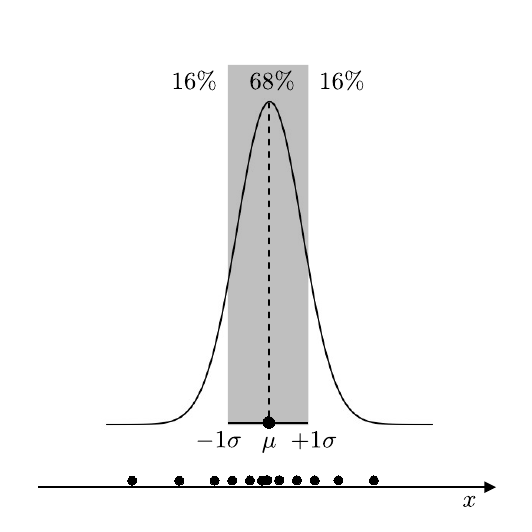
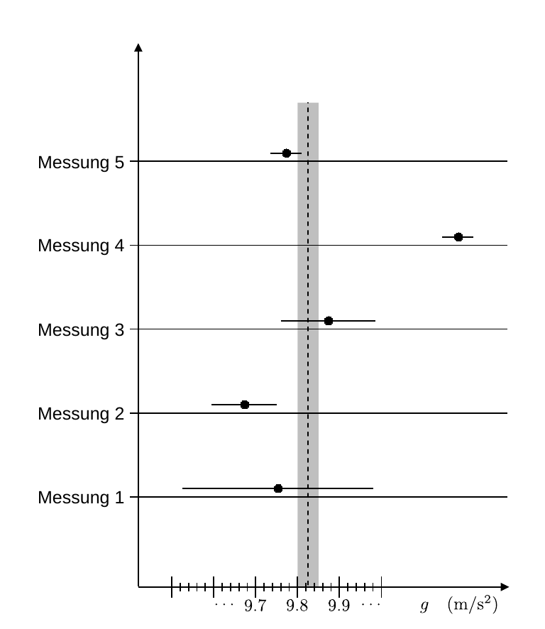

# Hinweise für den Versuch Datenverarbeitung

## Unsicherheiten und Konfidenzintervalle

Jede Messung ist mit Unsicherheiten behaftet. Selbst wenn man Sie unter möglichst kontrollierten Bedingungen wiederholt streuen ihre Ausgänge. 

Wir unterlegen einer Messung i.a. das folgende **statistische Modell**: 

- Die Ausgänge wiederholter Messungen folgen einer **Normalverteilung**
  ```math
  \begin{equation*}
  \varphi\left(x; \mu, \sigma\right) = \frac{1}{\sqrt{2\pi\sigma^{2}}}e^{-\left(x-\mu\right)^{2}/2\sigma^{2}},
  \end{equation*}
  ```

  mit dem Erwartungswert $\mu$ und der Standardabweichung $\sigma$. 

- Wir schätzen $\mu$ durch den Messwert $\hat{x}$ und $\sigma$ durch die Unsicherheit auf den Messwert $\Delta \hat{x}$ ab. 

- Bei der graphischen Darstellung wird $\hat{x}$ durch einen Punkt und $\pm\Delta\hat{x}$ durch einen Balken verbildlicht. 

Der Zusammenhang zwischen der Normalverteilung, $\hat{x}$ und $\Delta\hat{x}$ ist in **Abbildung 1** gezeigt: 

---



**Abbildung 1**: (Zusammenhang zwischen der Normalverteilung, $\hat{x}$ und $\Delta \hat{x}$. Wenn wir die Messung unter kontrollierten Bedingungen sehr oft wiederholen befinden sich 68% aller Ergebnisse im Intervall $x\in[-\sigma,\sigma]$. Im unteren Teil der Abbildung sind die Ausgänge einzelner Messungen skizziert)

---

Die Normalverteilung hat die folgenden Eigenschaften:

- 68% aller Messungen liegen im Intervall $x\in[\mu-\sigma,\mu+\sigma]$.
- 95% aller Messungen liegen in Intervall $x\in[\mu-2\sigma,\mu+2\sigma]$.
- 99% aller Messungen liegen in Intervall $x\in[\mu-3\sigma,\mu+3\sigma]$.

Man bezeichnet solche Intervalle allgemein als **Konfidenzintervalle**. 

Wiederholen Sie eine Messung, können Sie mit einer Wahrscheinlichkeit von 68% davon ausgehen, dass deren Ausgang ins $\pm\sigma$-Intervall der vorherigen Messung fällt, in 32% der Fälle liegt der Ausgang der zweiten Messung außerhalb.   

In **Abbildung 2** sind fünf Messungen der Erdbeschleunigung $g$ gezeigt:

---



**Abbildung 2**: (Fünf Messungen der Erdbeschleunigung $g$. Die vertikale gestrichelte Linie entspricht einer Referenzmessung aus einer anderen Quelle. Der graue Balken entspricht dem zugehörigen 68%-Konfidenzintervall)

---

Die vertikale gestrichelte Linie entspricht einer Referenzmessung aus einer anderen Quelle. Der graue Balken entspricht dem zugehörigen 68%-Konfidenzintervall. Die Messwerte sind als Punkte und die zugehörigen 68%-Konfidenzintervalle als Balken dargestellt. Bei den Messungen 4 und 5 handelt es sich um sehr präzise Messungen. Messung 1 hingegen hat eine große Unsicherheit.

## Lineare Fehlerfortpflanzung nach Gauß

Als lineare [Fehlerfortpflanzung](https://de.wikipedia.org/wiki/Fehlerfortpflanzung) bezeichnet man den Vorgang, bei dem $\Delta \hat{x}$ im Rahmen einer Abbildung
$$
\begin{equation*}
f:\, X\to Y; \quad x\to f(x)
\end{equation*}
$$
als Unsicherheit $\Delta\hat{f}$ auf den Funktionswert $f(\hat{x})\equiv\hat{f}$ übertragen wird. Handelt es sich bei $f(x)$ um eine in $x$ stetig differenzierbare Funktion, innerhalb der reellen Zahlen, erhält man $\Delta\hat{f}$ durch Entwicklung der [Taylorreihe](https://de.wikipedia.org/wiki/Taylorreihe):
$$
\begin{equation*}
\begin{split}
&f(\hat{x}\pm\Delta\hat{x}) = \underbrace{f(\hat{x})\vphantom{\frac{\partial f}{\partial x}}} \pm \underbrace{\frac{\partial f}{\partial x}(\hat{x})\,\Delta\hat{x}}+\ldots\\
&\hphantom{f(x\pm\Delta\hat{x}) = }\equiv\hat{f}\hphantom{ccccc}\equiv\Delta\hat{f}
\end{split}
\end{equation*}
$$
Man spricht von *linearer* Fehlerfortpflanzung, weil die Taylorreihe nach dem linearen ersten Term abgebrochen wird. 

Liegen Unsicherheiten auf mehrere Parameter $\{\hat{x}_{j}:\hspace{0.05cm}j=1\ldots n\}$ vor, muss in $n$ Dimensionen gerechnet werden: 
$$
\begin{equation}
\begin{split}
&\Delta \hat{f} = 
\left(\begin{array}{cccc} \partial_{x_{0}}f & \partial_{x_{1}}f & \ldots & \partial_{x_{n}}f
\end{array}\right)\cdot
\underbrace{
\left(\begin{array}{cccc} 
\Delta \hat{x}_{1}^{2} & \Delta \hat{x}_{12} & \ldots & \Delta \hat{x}_{1n} \\
\Delta \hat{x}_{21} & \Delta \hat{x}_{2}^{2} & \ldots & \Delta \hat{x}_{2n} \\
\vdots &  & \ddots & \vdots \\
\Delta \hat{x}_{n1} & \Delta \hat{x}_{n2} & \ldots & \Delta \hat{x}_{n}^{2} \\
\end{array}\right)}
\cdot
\left(\begin{array}{c} \partial_{x_{0}}f \\\partial_{x_{1}}f \\ \vdots \\ \partial_{x_{n}}f
\end{array}\right).\\
&\hphantom{\Delta f =\left(\begin{array}{cccc} \Delta x_{0} & \Delta x_{1} & \Delta x_{1} & \Delta x_{1} & \ldots & \Delta x
\end{array}\right)cc}\equiv \Sigma\\
\end{split}
\end{equation}
$$
Dabei ist $\Sigma$ ist die **[Kovarianzmatrix](https://de.wikipedia.org/wiki/Kovarianzmatrix)** des Problems, die die Unsicherheiten $\{\Delta\hat{x}_{j}\}$ und die paarweisen [linearen Kovarianzen](https://de.wikipedia.org/wiki/Korrelation) der $\{\Delta\hat{x}_{ij}\}$ untereinander abbildet.  

Bekannter ist Gleichung **(1)** in der Gestalt
$$
\begin{equation}
\begin{split}
&\Delta \hat{f} = \sqrt{\sum\limits_{j=1}^{n}\underbrace{\left(\frac{\partial f}{\partial x_{j}}\,\Delta\hat{x}_{j}\right)^{2}}}, \\
&\hphantom{\Delta f(\bold{x}) =ccccc\,}\equiv \Delta \hat{f}_{j}^{2}\\
\end{split}
\end{equation}
$$
die dem Spezialfall entspricht, dass die $\{x_{j}\}$ alle paarweise unabhängig sind, wofür $\Sigma$ die Form einer [Diagonalmatrix](https://de.wikipedia.org/wiki/Diagonalmatrix) annimmt. 

**Schwierigkeiten bei der linearen Fehlerfortpflanzung** bestehen darin, dass die $\{x_{j}\}$ i.a. nicht unabhängig und die Kovarianzen zwischen den $\{x_{j}\}$ nicht bekannt sind. Auch kann es nicht-triviale Korrelationen zwischen den $\{x_{j}\}$ geben für die $\Delta x_{ij}=0$ gilt. 

Bei der Anwendung von Gleichung **(2)** sollten Sie sicherstellen und entsprechend argumentieren können, warum Sie annehmen können, dass die $\{x_{j}\}$ paarweise unabhängig sind. **Wenn Sie die Möglichkeit haben, einen Parameter $\hat{x}_{j}\pm\Delta \hat{x}_{j}$ direkt und ohne weitere Fehlerfortpflanzung aus einer Parameteranpassung zu bestimmen sollten Sie dieses Vorgehen der linearen Fehlerfortpflanzung vorziehen.** 

Wir diskutieren im Folgenden zwei bekannte Spezialfälle der linearen Fehlerfortpflanzung.

### Summe zweier unabhängiger Messungen

Für die Summe zweier unabhängiger Messungen vereinfacht sich Gleichung **(2)** zu
$$
\begin{equation}
\begin{split}
&f(x_{0}, x_{1}) = x_{0} + x_{1}; \\
&\\
&\Delta \hat{f} = \sqrt{
\left(\frac{\partial f}{\partial x_{0}}\,\Delta\hat{x}_{0}\right)^{2} + 
\left(\frac{\partial f}{\partial x_{1}}\,\Delta\hat{x}_{1}\right)^{2}} 
= \sqrt{\Delta\hat{x}_{0}^{2}+\Delta\hat{x}_{1}^{2}
\vphantom{\left(\frac{\partial f}{\partial x_{0}}\,\Delta\hat{x}_{0}\right)^{2}}}, \\
\end{split}
\end{equation}
$$
d.h. **die quadratische Summe der Unsicherheiten der Einzelmessungen entspricht dem Quadrat der Summe der Einzelmessungen**.

### Produkt zweier unabhängiger Messungen

Für das Produkt zweier unabhängiger Messungen vereinfacht sich Gleichung **(2)** zu
$$
\begin{equation*}
\begin{split}
&f(x_{0}, x_{1}) = x_{0}\,x_{1}; \\
&\\
&\Delta \hat{f} = \sqrt{
\left(\frac{\partial f}{\partial x_{0}}\,\Delta\hat{x}_{0}\right)^{2} + 
\left(\frac{\partial f}{\partial x_{1}}\,\Delta\hat{x}_{1}\right)^{2}} 
= \sqrt{\hat{x}_{1}\,\Delta\hat{x}_{0}^{2}+\hat{x}_{0}\,\Delta\hat{x}_{1}^{2}
\vphantom{\left(\frac{\partial f}{\partial x_{0}}\,\Delta\hat{x}_{0}\right)^{2}}};\\
&\\
&\frac{\Delta \hat{f}}{\hat{f}} = 
\sqrt{\left(\frac{\Delta\hat{x}_{0}}{\hat{x}_{0}}\right)^{2}+
\left(\frac{\Delta\hat{x}_{1}}{\hat{x}_{1}}\right)^{2}
\vphantom{\left(\frac{\partial f}{\partial x_{0}}\,\Delta\hat{x}_{0}\right)^{2}}},\\
\end{split}
\end{equation*}
$$
d.h. **die quadratische Summe der relativen Unsicherheiten der Einzelmessungen entspricht dem Quadrat der relativen Unsicherheiten des Produkts der Einzelmessungen**.

## Kompatibilität zweier unabhängiger Messungen

Wir betrachten zwei unabhängige Messungen der gleichen Größe als **verträglich oder kompatibel**, wenn ihre Differenz mit 0 kompatibel ist. Dies ist ein Spezialfall von Gleichung **(3)**:
$$
\begin{equation*}
\begin{split}
&f(x_{0}, x_{1}) = x_{0} - x_{1}; \\
&\\
&\Delta \hat{f} = \sqrt{\Delta\hat{x}_{0}^{2}+\Delta\hat{x}_{1}^{2}}, \\
\end{split}
\end{equation*}
$$
Wir bestimmen die Kompatibilität zweier Messungen **immer relativ zu den angegebenen Unsicherheiten**. Die Größe
$$
\begin{equation}
\begin{split}
&\delta(\hat{x}_{0}, \hat{x}_{1}) \equiv \frac{\hat{x}_{0} - \hat{x}_{1}}{\sqrt{\Delta\hat{x}_{0}^{2}+\Delta\hat{x}_{1}^{2}}} \\
\end{split}
\end{equation}
$$
bezeichnen wir als Zug (**Pull**) zwischen $\hat{x_{0}}$ und $\hat{x}_{1}$. Sind $x_{0}$ und $x_{1}$ normalverteilt mit
$$
\begin{equation*}
\mu_{0}=\hat{x}_{0};\quad\mu_{1}=\hat{x}_{1};\quad\sigma_{0}=\Delta\hat{x}_{0};\quad\sigma_{1}=\Delta\hat{x}_{1},
\end{equation*}
$$
dann folgt $\delta(\hat{x}_{0}, \hat{x}_{1})$ selbst einer [Standardnormalverteilung](https://de.wikipedia.org/wiki/Normalverteilung#Standardisierung) (mit $\mu=0,\ \sigma=1$), d.h. falls wirklich $x_{0}$ und $x_{1}$ normalverteilt und $\hat{x}_{0}$ und $\hat{x}_{1}$ miteinander kompatibel sein sollten gelten die folgenden Aussagen:

- In <32% aller Fälle ist $|\delta(\hat{x}_{0},\hat{x}_{1})|>1$.
- In <5% aller Fälle ist $|\delta(\hat{x}_{0},\hat{x}_{1})|>2$.
- In <1% aller Fälle ist $|\delta(\hat{x}_{0},\hat{x}_{1})|>3$.

In **Abbildung 2** sind die Messungen 1, 3 und 5 sicher kompatibel mit der Referenzmessung. Für Messung 2 ist Kompatibilität innerhalb von $2\sigma$ nicht auszuschließen. Messung 4 ist mit einem Pull $\gtrsim4$ nicht sehr kompatibel mit der Referenzmessung.

# Navigation

[Main](https://gitlab.kit.edu/kit/etp-lehre/p1-praktikum/students/-/tree/main/Datenverarbeitung)

