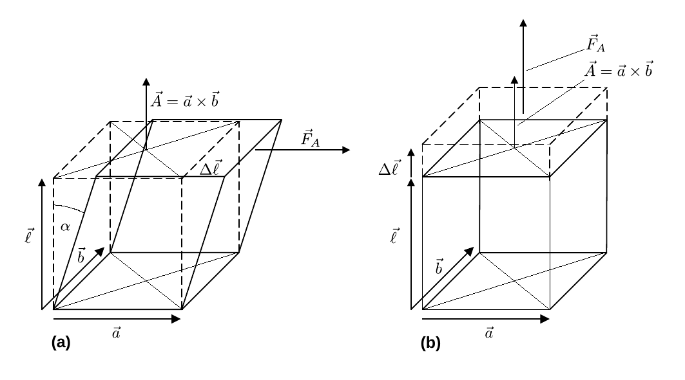

# Fakultät für Physik

## Physikalisches Praktikum P1 für Studierende der Physik

Versuch P1-11, 12, 13 (Stand: September 2024)

[Raum F1-19](https://labs.physik.kit.edu/img/Praktikum/Lageplan_P1.png)

# Elastizität

## Motivation

Übt man auf einen ausgedehnten Körper eine äußere Kraft $\vec{F}_{A}$ aus, verformt sich dieser. Kehrt er nach Ausübung der Kraft wieder in seine ursprüngliche Form zurück spricht man von einer **elastischen Verformung**. Unserer Modellvorstellung nach gehen alle elastischen Verformungen daraus hervor, dass die atomaren Einheiten aus denen der Körper besteht sich in den lokalen Minima eines elektrischen Potentials befinden, aus denen sie durch $\vec{F}_{A}$ ausgelenkt werden. Ist die Auslenkung klein, lassen sich diese Potentiale lokal durch harmonische Potentiale annähern und die Auslenkung führt auf atomarer Ebene jeweils zu einer rückstellenden Kraft $-\vec{F}_{R}=\vec{F}_{A}$, die proportional zur Auslenkung ist. Die Anzahl der ausgelenkten atomaren Einheiten und damit die Kraft $\vec{F}_{A}$, die man aufwenden muss, um die Verformung $\Delta\vec{\ell}$ zu erreichen ist proportional zur Fläche $\vec{A}=\vec{a}\times\vec{b}$, an die $\vec{F}_{A}$ angreift. Im Gegenzug ist $\Delta\vec{\ell}$ bei gleicher Kraft proportional zur Anzahl der atomaren Einheiten des Körpers entlang der Richtung von $\vec{F}_{A}$ und damit proportional zur ursprünglichen Ausdehnung des Körpers $\vec{\ell}$ in dieser Richtung. Daraus leitet sich die allgemeine Gesetzmäßigkeit
$$
\begin{equation*}
\vec{F}_{A}\propto A\,\frac{\Delta \vec{\ell}}{\ell}.
\end{equation*}
$$
für die Verformung elastischer Körper unter äußerer Krafteinwirkung $\vec{F}_{A}$ ab. Die Proportionalität zu $A$ motiviert die Einführung der **[mechanischen Spannung](https://de.wikipedia.org/wiki/Mechanische_Spannung)**, als eine auf die Fläche $A$ normierte Krafteinwirkung. Erfolgt die Verformung (anti-)parallel zu $\vec{F}_{A}$ kommt es zur Stauchung (Dehnung) des Körpers. In diesen Fällen spricht man von der **Druck- oder Zugspannung** 
$$
\begin{equation*}
\sigma = E\,\frac{\Delta\ell}{\ell}.
\end{equation*}
$$
Die Proportionalitätskonstante $E$ nennt man den **Elastizitätsmodul**. Erfolgt die Verformung senkrecht zu $\vec{F}_{A}$ kommt es zur Scherung oder Torsion und man spricht von der **Schub- oder Scherspannung** 
$$
\begin{equation*}
\tau = G\,\frac{\Delta\ell}{\ell}=G\,\alpha.
\end{equation*}
$$
Die Proportionalitätskonstante $G$ nennt man den **Schub- oder Torsionsmodul**. In **Abbildung 1** sind die Geometrien beider Fälle schematisch dargestellt:

---

**Abbildung 1**: (Geometrien der (a) Scherung und (b) Dehnung unter Einwirkung einer äußeren Kraft $\vec{F}_{A}$)

---

Elastische Verformungen umgeben uns überall. Sie sind Ursache verschiedener Gegenkräfte und Schwingungsvorgänge und letztlich der Grund warum wir uns laufend Fortbewegen können. Mit diesem Versuch haben Sie Gelegenheit sich diesem wichtigen Phänomen quantitativ und systematisch zu nähern.  

## Lehrziele

Wir listen im Folgenden die wichtigsten **Lehrziele** auf, die wir Ihnen mit dem Versuch **Elastizität** vermitteln möchten: 

- Sie beschäftigen sich quantitativ mit dem Phänomen **elastischer Verformungen**. 
- Sie machen sich mit den Begriffen des **Elastizitätsmoduls $E$** und des **Torsionsmoduls $G$** vertraut. 
- Sie bestimmen $E$ auf verschiedene Art und Weise und überprüfen die Konsistenz Ihrer Ergebnisse. 
- Dabei lernen Sie mehrere **komplexe Modelle** zur Beschreibung verschiedener elastischer Verformungen einfacher Körper kennen, in denen $E$ an verschiedenen Stellen auftaucht. Aus der Konsistenz Ihrer Ergebnisse können Sie auf die Konsistenz der zugrundeliegenden Modellvorstellungen zurück schließen.
- Bei der Arbeit mit Drehmomenten $\vec{M}$ und Trägheitsmomenten $\Theta$ vertiefen Sie Ihre Kenntnisse und Ihr Verständnis im **Umgang mit ausgedehnten Körpern**.

## Versuchsaufbau

Typische Aufbauten für den Versuch **Elastizität** sind in **Abbildung 2** gezeigt:

---

**Abbildung 2**: (Typische Aufbauten für den Versuch **Elastizität**)

---

Dieser Versuch findet an drei Aufbauten statt: Im Rahmen von **Aufgabe 1** bestimmen Sie $E$ durch die Biegung eines rechteckigen Balkens. Diese können Sie mit Hilfe einer empfindlichen Messuhr, oder mit Hilfe des Strahlengangs eines Positionslasers bestimmen. Sie führen diese Messungen für verschiedene Metalle durch. Im Rahmen von **Aufgabe 2** bestimmen Sie $E$ aus einer Messung der Schallgeschwindigkeit in Probestäben der gleichen Materialien. Im Rahmen von **Aufgabe 3** bestimmen den Torsionsmodul für ein ausgewähltes Material, indem Sie die Perioden einer Torsionsschwingung für Probestäbe verschiedener Durchmesser bestimmen.

## Wichtige Hinweise

- **Achtung**: Die bei **Aufgabe 2** verwendeten Detektoren für die Auslese der Schallsignale mit dem Oszilloskop sind sehr empfindlich gegen Bruch! Lassen Sie die Metallkugel für die Erzeugung des einmaligen Stoßes aus **nicht mehr als $8\ \mathrm{cm}$ Entfernung** vom Ende des Stabs fallen. 
- Achten Sie darauf, welche Daten Sie zur vollständigen Auswertung Ihrer Versuche benötigen. 

# Navigation

- [Elastizitaet.iypnb](https://gitlab.kit.edu/kit/etp-lehre/p1-praktikum/students/-/blob/main/Elastizitaet/Elastizitaet.ipynb): Aufgabenstellung und Vorlage für Ihr Protokoll.
- [Elastizitaet_Hinweise.ipynb](https://gitlab.kit.edu/kit/etp-lehre/p1-praktikum/students/-/blob/main/Elastizitaet/Elastizitaet_Hinweise.ipynb): Hinweise zu den Aufgaben.
- [Datenblatt.md](https://gitlab.kit.edu/kit/etp-lehre/p1-praktikum/students/-/blob/main/Elastizitaet/Datenblatt.md): Technische Details zu den Versuchsaufbauten.
- [doc](https://gitlab.kit.edu/kit/etp-lehre/p1-praktikum/students/-/tree/main/Elastizitaet/doc): Dokumente zur Vorbereitung auf den Versuch.
- [figures](https://gitlab.kit.edu/kit/etp-lehre/p1-praktikum/students/-/tree/main/Elastizitaet/figures): Bilder, die für die Dokumentation des Versuchs verwendet wurden.
