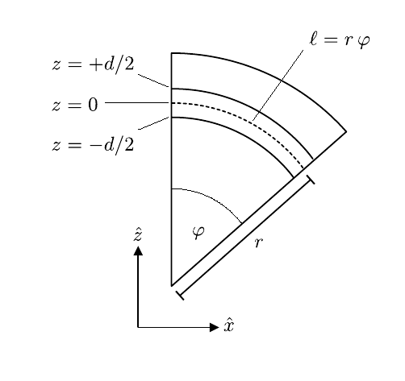
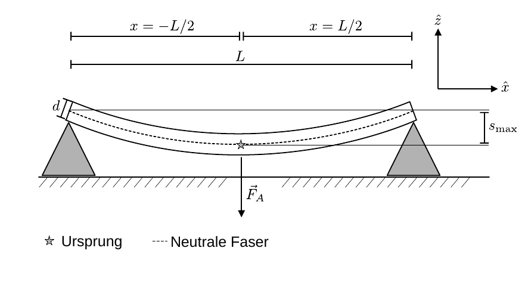

# Hinweise für den Versuch Elastizität

## Elastizitätsmodul

Die Atome eines ausgedehnten Körpers sind periodisch auf einem Gitter angeordnet. In erster Näherung befinden sich die zugehörigen Gitterpunkte in den Minima eines periodisch wiederkehrenden [harmonischen Potentials](https://de.wikipedia.org/wiki/Harmonischer_Oszillator#Potential_des_harmonischen_Oszillators). Drückt man den Körper mit der äußeren Kraft $\vec{F}_{A}$ zusammen oder zieht man ihn auseinander wird dieser um die Länge $\Delta\vec{\ell}$ entlang $\vec{F}_{A}$ **gestaucht oder gedehnt**. Wir gehen im Folgenden ohne Beschränkung der Allgemeinheit von einer Dehnung entlang $\hat{x}$ aus, der im Gleichgewichtszustand auf mikroskopischer Skala pro Gitterpunkt eine rückstellende Kraft 
$$
\begin{equation*}
\begin{split}
&\vec{F}_{R} = -D\,\Delta \vec{x}; \\
&\\
&\text{mit: }\\
&\\
&\Delta\vec{\ell}= N\,\Delta \vec{x};\qquad N=\frac{\ell}{a}, 
\end{split}
\end{equation*}
$$
entgegenwirkt, wobei $a$ dem Abstand der Gitterpunkte entlang $\hat{x}$ und $N$ der Anzahl atomarer Einheiten im Körper entsprechen. $\vec{F}_{R}$ ist proportional zur Anzahl der Gitterpunkte in der Ebene senkrecht zur $\vec{F}_{A}$ und damit proportional zur Querfläche $A$ des Körpers. Daraus ergibt sich 
$$
\begin{equation*}
\begin{split}
&\vec{F}_{A} \propto A\,\frac{\Delta\vec{\ell}}{\ell}; \\
&\\
&\vec{F}_{A} = E\,A\,\frac{\Delta\vec{\ell}}{\ell}.\\
\end{split}
\end{equation*}
$$
Die Proportionalitätskonstante $E$ bezeichnet man als den **[Elastizitätsmodul](https://de.wikipedia.org/wiki/Elastizit%C3%A4tsmodul)**. Den Quotienten 
$$
\begin{equation*}
\sigma \equiv\frac{F_{A}}{A}
\end{equation*}
$$
bezeichnet man allgemein als **Normalspannung**. Ist $\vec{F}_{A}$ vom Körper weg gerichtet spricht man von **Zugspannung**, ist $\vec{F}_{A}$ zum Körper hin gerichtet von **Druckspannung**. Die Normalspannung in jeder Richtung des kartesischen Koordinatensystems $\hat{x}$, $\hat{y}$ und $\hat{z}$ stellen die Diagonalkomponenten des [mechanischen Spannungstensors](https://de.wikipedia.org/wiki/Spannungstensor) dar. 

## Biegung eines einseitig belasteten Balkens

Wirkt auf einen Balken mit rechteckigem Querschnitt $A$, der auf einer Seite fest verankert ist, einseitig eine Kraft $\vec{F}_{A}$ senkrecht zur Balkenachse $\hat{x}$, so wird dieser, wie in **Abbildung 1** gezeigt, (im Bild nach unten) gebogen:

---

**Abbildung 1**: (Elastische Biegung eines auf einer Seite fest verankerten Stabs beim Wirken einer einseitigen Kraft $\vec{F}_{A}$ senkrecht zur Balkenachse $\hat{x}$. Abbildung (a) zeigt die Seitenansicht, in Abbildung (b) ist der Querschnitt gezeigt)

---

Für diese Diskussion vernachlässigen wir jegliche Biegung des Stabs durch sein Eigengewicht. Wir benutzen ein Koordinatensystem mit Ursprung im Berührpunkt der Mitte des Stabquerschnitts mit der Verankerung (links oben im Bild mit einem Stern gekennzeichnet), dessen $\hat{x}$-Achse nach rechts und $\hat{z}$-Achse nach oben weisen. 

Die gestrichelte Kurve durch die Mitte des Balkens entlang der Balkenachse bezeichnet man als **neutrale Faser**. Diese verändert ihre Länge $\ell$ bei der Biegung des Balkens nicht. Darüber liegende Fasern (mit $z>0$) werden bei der Biegung gedehnt, darunter liegende Fasern (mit $z<0$) gestaucht. Eine überzeichnete Darstellung der Geometrie (am Ursprung) ist in **Abbildung 2** gezeigt:

---

**Abbildung 2**: (Geometrie des gebogenen Balkens aus **Abbildung 1**, am Ursprung. Entlang der $\hat{z}$-Achse verläuft der Balken von $-d/2$ bis $+d/2$. Der Biegewinkel $\varphi$ ist überzeichnet dargestellt)

---

An jedem Punkt $x$ des Stabs lässt sich dem Kurvenverlauf $\mathcal{C}=\{(x,z(x))\}$ der neutralen Faser eine Krümmung um den Winkel $\varphi$ mit Radius $r$ einbeschreiben. Die Länge dieser Kurve ist 
$$
\begin{equation*}
\ell=r\,\varphi.
\end{equation*}
$$
Für gedehnte/gestauchte Fasern ober/unterhalb der neutralen Faser gilt aufgrund der Wahl des Koordinatensystems in jedem Punkt $z(x)$
$$
\begin{equation*}
\Delta\ell=(r + z)\,\varphi - r\,\varphi  = z\,\varphi = z\frac{\ell}{r}.
\end{equation*}
$$
Aufgrund der Stauchung und Dehnung entsteht jeweils eine $\vec{F}_{A}$ entgegen gerichtete, von $z$ abhängige, Zug-/Druckspannung
$$
\begin{equation}
\sigma(z) =-E\,\frac{\Delta\ell}{\ell} = -E\,\frac{z}{r}.
\end{equation}
$$
Für feste Werte von $x$ wirkt in jedem Punkt $z$ des Stabs eine entsprechende rückstellende Zug-/Druckkraft
$$
\begin{equation*}
\mathrm{d}F_{R} =\sigma\,\mathrm{d}A = -\frac{E\,b}{r}\,z\,\mathrm{d}z,
\end{equation*}
$$
wobei $b$ der Breite des Balkens entspricht. Aus $\mathrm{d}F_{R}$ leitet sich wiederum das rückstellende Drehmoment
$$
\begin{equation*}
\mathrm{d}M_{R} =-z\,\mathrm{d}F_{R} = \frac{E\,b}{r}\,z^{2}\,\mathrm{d}z,
\end{equation*}
$$
ab. (Das Vorzeichen ergibt sich aus dem äußeren Produkt zur Berechnung von $\mathrm{d}\vec{M}_{R}$.) Durch Integration über alle Punkte $z\in[-d/2;+d/2]$ ergibt sich das gesamte rückstellende Drehmoment
$$
\begin{equation*}
M_{R}(x) =\frac{E\,b}{r}\int\limits_{-d/2}^{+d/2}z^{2}\,\mathrm{d}z = \frac{E\,b\,d^{3}}{12\,r}
\end{equation*}
$$
im Punkt $x$. Diesem wirkt in jedem Punkt $x$ das biegende Drehmoment 
$$
\begin{equation*}
M_{A}(x) = F_{A}\left(L-x\right)
\end{equation*}
$$
entgegen. Im Gleichgewichtszustand gilt
$$
\begin{equation}
\begin{split}
&M_{A}(x) + M_{R}(x)=0\quad \forall x; \\
&\\
&F_{A}\left(L-x\right) = -\frac{E\,b\,d^{3}}{12\,r};\\
&\\
&\frac{1}{r} = -\frac{12\,F_{A}\left(L-x\right)}{E\,b\,d^{3}}.\\
\end{split}
\end{equation}
$$
Der Kehrwert des Krümmungsradius $r$ lässt sich für kleine Winkel $\varphi$ durch die zweite Ableitung nach dem Ort $z^{\prime\prime}(x)$ annähern:
$$
\begin{equation*}
\begin{split}
&z^{\prime\prime}(x) = -\frac{12\,F_{A}\left(L-x\right)}{E\,b\,d^{3}};\\
&\\
&\text{mit: }\\
&\\
&\frac{1}{r}\approx z^{\prime\prime}(x). \\
\end{split}
\end{equation*}
$$
Den Verlauf $z(x)$ der Fasern im Balken erhält man durch zweifache Integration über die Länge des Balkens $x\in[0,L]$ mit geeigneten Randbedingungen:
$$
\begin{equation}
\begin{split}
&z^{\prime}(0)=0;\quad z(0)=0; \quad a\equiv-\frac{12\,F_{A}}{E\,b\,d^{3}};\\
&\\
&z^{\prime\prime}(x) = a\left(L-x\right);\\
&\\
&z^{\prime}\hphantom{^{\prime}}(x) = \left[a\,L\,\hat{x} - a\,\frac{\hat{x}^{2}}{2}\right]_{\hat{x}=0}^{\hat{x}=L}=a\,L\,x - a\,\frac{x^{2}}{2}\\
&\\
&z\hphantom{^{\prime\prime}}(x) = \left[a\,L\,\frac{\hat{x}^{2}}{2} - a\,\frac{\hat{x}^{3}}{6}\right]_{\hat{x}=0}^{\hat{x}=x} = a\,L\,\frac{x^{2}}{2} - a\,\frac{x^{3}}{6}\\
\end{split}
\end{equation}
$$
Der Abstand $s_{\mathrm{max}}$ in **Abbildung 1** entspricht dem Kurvenpunkt der neutralen Faser in $x=L$
$$
\begin{equation}
\begin{split}
&s_{\mathrm{max}} = z(L) = a\left(\frac{L^{3}}{2} - \frac{L^{3}}{6}\right) = a\frac{L^{3}}{3}\\
&\\
&s_{\mathrm{max}}=-\frac{4\,F_{A}}{E\,b\,d^{3}}\,L^{3}.
\end{split}
\end{equation}
$$
Das Vorzeichen folgt aus der Wahl des Koordinatensystems, derzufolge der Balken nach unten (in $-\hat{z}$-Richtung) gebogen wird. Es ist für die Messung unerheblich. 

Am Punkt $(0,d/2)$ ist die Zugspannung und damit die Gefahr, dass der Balken bricht am größten. Nach den Gleichungen **(1)** und **(2)** beträgt sie
$$
\begin{equation*}
\sigma_{\mathrm{max}} = \left[-E\,\frac{z}{r}\right]_{
\begin{array}{l}x=0\\z=d/2
\end{array}
} = \frac{6\,F_{A}\,L}{E\,b\,d^{2}}.
\end{equation*}
$$

## Biegung eines zweiseitig belasteten Balkens

Die Geometrie eines zweiseitig belasteten Balkens, wie er im Praktikum verwendet wird, ist in **Abbildung 3** gezeigt:

---

**Abbildung 3**: (Elastische Biegung eines beidseitig belasteten Balkens)

---

Der Balken liegt an beiden Enden auf jeweils einem Keil auf. In der Mitte des Balkens wirkt die Kraft $\vec{F}_{A}$ (nach unten). Das Koordinatensystem ist so gewählt, dass $\hat{x}$ nach rechts und $\hat{z}$ nach oben weist und der Ursprung auf der neutralen Faser in der Mitte des Balkens liegt. Diese Konfiguration ist äquivalent zu jeweils einem einseitig belasteten Balken, der in $x=0$ verankert ist und auf dem bei $\pm L/2$, jeweils die Kraft $-\vec{F}_{A}/2$ (im Bild nach oben) wirkt.  

Wir wählen zur Bestimmung von $s_{\mathrm{max}}$ ohne Beschränkung der Allgemeinheit den Zweig mit $x>0$. In den Gleichung **(3)** ändern sich die Integrationsgrenzen und Vorfaktoren entsprechend:
$$
\begin{equation*}
\begin{split}
&z^{\prime}(0)=0;\quad z(0)=0; \quad a\equiv\frac{6\,F_{A}}{E\,b\,d^{3}};\\
&\\
&z^{\prime\prime}(x) = a\left(\frac{L}{2}-x\right);\\
&\\
&z^{\prime}\hphantom{^{\prime}}(x) = \left[a\,\frac{L}{2}\,\hat{x} - a\,\frac{\hat{x}^{2}}{2}\right]_{\hat{x}=0}^{\hat{x}=x} = a\,\frac{L}{2}\,x - a\,\frac{x^{2}}{2}\\
&\\
&z\hphantom{^{\prime\prime}}(x) = \left[a\,\frac{L}{4}\,\hat{x}^{2} - a\,\frac{\hat{x}^{3}}{6}\right]_{\hat{x}=0}^{\hat{x}=x} = a\,\frac{L}{4}\,x^{2} - a\,\frac{x^{3}}{6}.
\end{split}
\end{equation*}
$$
Der Abstand $s_{\mathrm{max}}$ in **Abbildung 3** entspricht dem Kurvenpunkt der neutralen Faser in $x=L/2$
$$
\begin{equation}
\begin{split}
&s_{\mathrm{max}} = z(L/2) = a\left(\frac{L^{3}}{16} - \frac{L^{3}}{48}\right) = a\frac{L^{3}}{24}\\
&\\
&s_{\mathrm{max}} = \,\frac{F_{A}}{4\,E\,b\,d^{3}}\,L^{3}.
\end{split}
\end{equation}
$$
Das Vorzeichen ergibt sich aus der Wahl des Koordinatensystems, derzufolge der Balken nach oben (in $\hat{z}$-Richtung) gebogen wird. Der Vergleich zeigt, dass $s_{\mathrm{max}}$ **16-mal kleiner** ist, als im Fall des einseitig belasteten Balkens.

## Essentials

Was Sie ab jetzt wissen sollten:

- Die Begriffe **Normal-, Zug- und Druckspannung** sollten Ihnen geläufig sein. 
- Sie sollten verstanden haben, wie man zum Ergebnis für $s_{\mathrm{max}}$ in Gleichung **(5)** gelangt. 
- Die wichtigsten Abhängigkeiten in Gleichung **(5)** sollten Ihnen bekannt sein.

## Testfragen

1. Ein Balken aus Gummi lässt sich leicht elastisch verbiegen, ein Balken aus Kupfer nicht. Welches Material hat den größeren Elastizitätsmodul? 
2. Können Sie erklären, wie der Faktor 16 zwischen den Gleichungen **(4)** und **(5)** zustande kommt?

# Navigation

[Main](https://gitlab.kit.edu/kit/etp-lehre/p1-praktikum/students/-/tree/main/Elastizitaet)
