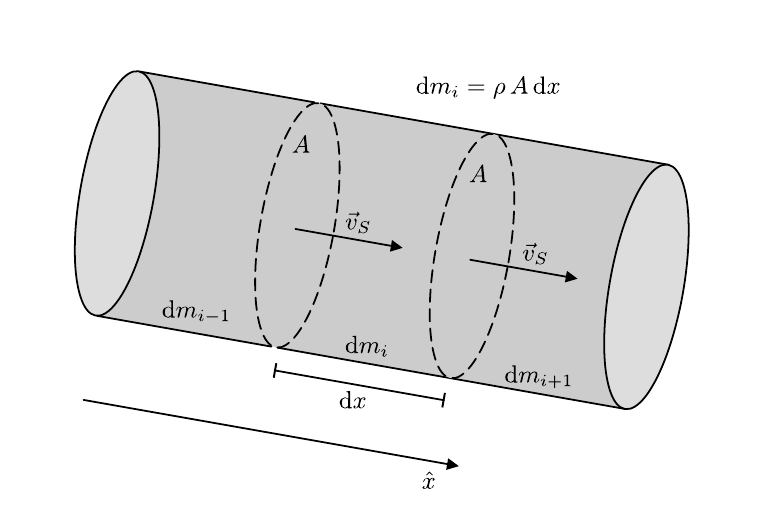
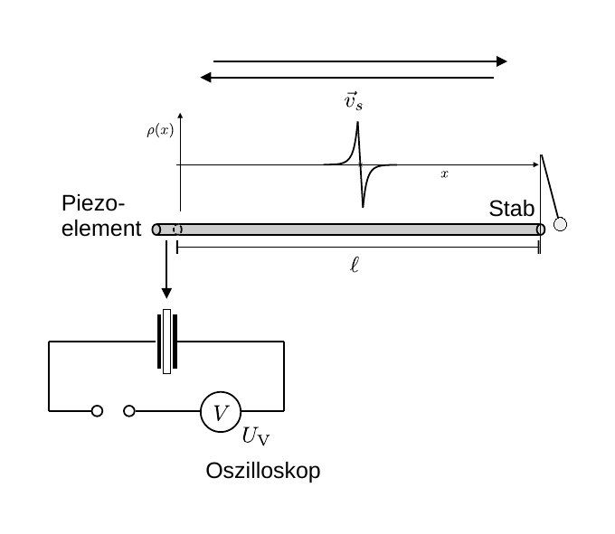

# Hinweise für den Versuch Elastizität

## Schallgeschwindigkeit

Zur Bestimmung von $E$ aus der Schallgeschwindigkeit $\vec{v}_{S}$ in elastischen Medien betrachten wir ein Massenelement 
$$
\begin{equation*}
\mathrm{d}m_{i} = \rho\,A\,\mathrm{d}x
\end{equation*}
$$
mit der Dichte $\rho$ und den parallelen Stirnflächen $A$ entlang $\vec{v}_{S}$, wie in **Abbildung 1** gezeigt:

---

**Abbildung 1**: (Geometrie zur Bestimmung von $E$ aus der Schallgeschwindigkeit $\vec{v}_{S}$ in elastischen Medien)

---

Bei Schall handelt es sich um longitudinale Wellen mit lokalen Stauchungen und Dehnungen entlang $\hat{x}$. 

Einer (äußeren) Kraft
$$
\begin{equation*}
\begin{split}
F_{A}&=\mathrm{d}m_{i}\,\frac{\mathrm{d}^{2}s}{\mathrm{d}t^{2}} \\
&=\rho\,\frac{\mathrm{d}^{2}s}{\mathrm{d}t^{2}}\,\mathrm{d}V, \\
\end{split}
\end{equation*}
$$
die das Massenelement $\mathrm{d}m_{i}$ (ohne Beschränkung der Allgemeinheit) in Richtung $\hat{x}$ beschleunigt, wirkt aufgrund der Elastizität des Mediums die elastische Kraft 
$$
\begin{equation*}
\begin{split}
F_{R}&=-E\,\frac{\mathrm{d}s}{\mathrm{d}x}\,A \\
&= -E\,\frac{\mathrm{d}^{2}s}{\mathrm{d}x^{2}}\,A\,\mathrm{d}x \\
&= -E\,\frac{\mathrm{d}^{2}s}{\mathrm{d}x^{2}}\,\mathrm{d}V \\
\end{split}
\end{equation*}
$$
entgegen. Aus der Kräftebilanz lässt sich eine **Wellengleichung**
$$
\begin{equation}
\rho\,\frac{\mathrm{d}^{2}s}{\mathrm{d}t^{2}} - E\,\frac{\mathrm{d}^{2}s}{\mathrm{d}x^{2}} = 0
\end{equation}
$$
für die Ausbreitung des Schalls im Medium ableiten. Gleichung **(1)** kann mit Hilfe eines **Wellenansatzes**
$$
\begin{equation*}
\begin{split}
s(x, t) = s(&\underbrace{x\pm v_{s}\,t})\\
&\hphantom{c}\equiv\phi \\
\end{split}
\end{equation*}
$$
allgemein gelöst werden, wobei $s(\ \cdot\ )$ eine **beliebige Funktion von $\phi$** sein kann. In diesem Fall beschreibt $s(\ \cdot\ )$ eine Stauchung oder Dehnung des Mediums, die sich mit der (Schall-)Geschwindigkeit $v_{S}$ entlang $\mp\hat{x}$ ausbreitet. Aus Gleichung **(1)** folgt der Zusammenhang zwischen $v_{s}$ und $E$:
$$
\begin{equation*}
v_{s} = \sqrt{\frac{E}{\rho}}.
\end{equation*}
$$

## Versuchsaufbau

Im vorliegenden Versuchsaufbau stehen Ihnen eine Reihe von Stäben unterschiedlicher Materialien und wohldefinierter Länge $\ell$, wie in **Abbildung 2** gezeigt, zur Verfügung:

---

**Abbildung 2**: (Anordnung zur Messung von $v_{s}$)

---

Der Stab wird an einem Ende (im Bild rechts gezeigt) einmalig durch eine Stahlkugel angestoßen. Der Stoß erzeugt ein lokalisiertes Signal, das sich mit $v_{s}$ im Stab ausbreitet. Am linken Ende des Stabs passieren zwei Dinge, die für die Messung von Relevanz sind: 

- Das Signal wird durch ein [Piezoelement](https://de.wikipedia.org/wiki/Piezoelement) in ein Spannungssignal umgewandelt, das mit dem Oszilloskop ausgelesen werden kann. 
- Gleichzeitig wird ein Teil des Signals nach rechts reflektiert. Am freien Ende des Stabs (rechts im Bild) erfolgt erneute Reflexion, wodurch das Signal mehrmals auf dem Oszilloskop zu sehen ist. 

Aus den zeitlichen Abständen $\Delta t$ der aufgezeichneten Signale und der Kenntnis von $\ell$ kann $v_{s}$ bestimmt werden.   

## Testfragen

1. Messen Sie mit $v_{s}$ eine Phasen- oder Gruppengeschwindigkeit? 
2. Wie funktioniert der piezoelektrische Effekt?
3. Muss bei der Messung ein resultierender Phasensprung am linken Ende des Stabs berücksichtigt werden oder nicht?

# Navigation

[Main](https://gitlab.kit.edu/kit/etp-lehre/p1-praktikum/students/-/tree/main/Elastizitaet)
