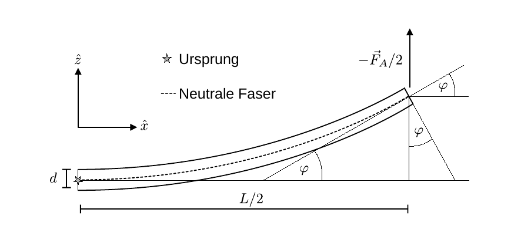
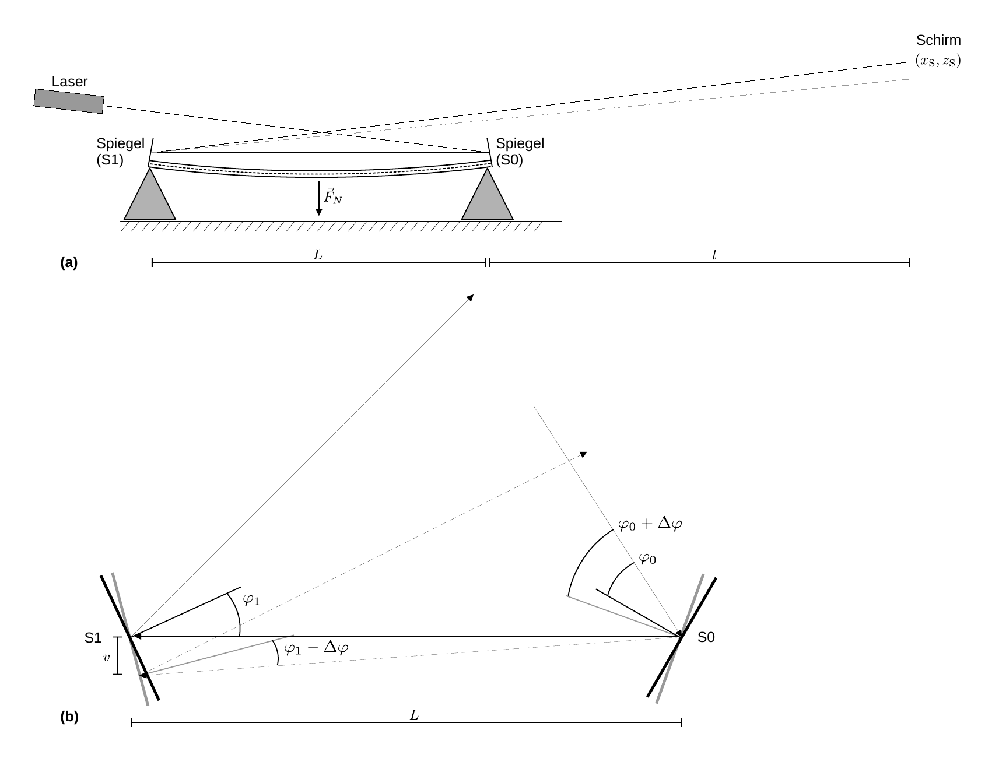

# Hinweise für den Versuch Elastizität

## Neigungswinkel $\Delta\varphi$ eines zweiseitig belasteten Balkens

Zur Bestimmung des Neigungswinkels $\Delta\varphi$ gehen wir analog zum Fall des [hier](https://gitlab.kit.edu/kit/etp-lehre/p1-praktikum/students/-/blob/main/Elastizitaet/doc/Hinweise-Balken.md) diskutierten beidseitig belasteten Balkens vor. Eine Skizze der vorherrschenden Geometrie für die Hälfte des Balkens mit $x>0$ ist in **Abbildung 1** gezeigt:

---

**Abbildung 1**: (Geometrie der Hälfte des Balkens mit $x>0$ für den Fall des beidseitig belasteten Balkens)

---

Wir betrachten den Balken auf dem infinitesimal kleinen Längenabschnitt $\ell=\mathrm{d}x$. Über diesen ändert sich der Neigungswinkel um den Betrag $\mathrm{d}\varphi$. Aufgrund der Biegung wirkt im Punkt $(x,z)$ die rückstellende Kraft:
$$
\begin{equation*}
\begin{split}
&\mathrm{d}F_{R} =-E\,\mathrm{d}A\,\frac{\Delta \ell}{\mathrm{d}x} = -E\,b\,\mathrm{d}z\left(z\,\frac{\mathrm{d}\varphi}{\mathrm{d}x}\right);\\
&\\
&\text{mit:}\\
&\\
&\Delta \ell = z\,\mathrm{d\varphi};\quad\mathrm{d}A=b\,\mathrm{d}z.\\
\end{split}
\end{equation*}
$$
Aus $\mathrm{d}F_{R}$ leitet sich wieder ein rückstellendes Drehmoment
$$
\begin{equation*}
\begin{split}
M_{R}(x)&=\int\limits_{-d/2}^{+d/2}\mathrm{d}M_{R} = \int\limits_{-d/2}^{+d/2}z\,\mathrm{d}F_{R} \\
&=-E\,b\,\frac{\mathrm{d}\varphi}{\mathrm{d}x}\int\limits_{-d/2}^{+d/2} z^{2}\,\mathrm{d}z = -\frac{E\,b\,d^{3}}{12}\,\frac{\mathrm{d}\varphi}{\mathrm{d}x}\\
\end{split}
\end{equation*}
$$
ab. 

Das biegende Drehmoment im Punkt $x$ ist
$$
\begin{equation*}
M_{A}(x) = -\left(\frac{L}{2}-x\right)\,\frac{F_{A}}{2}.
\end{equation*}
$$
Im Gleichgewichtszustand gilt
$$
\begin{equation*}
\begin{split}
&M_{A}(x) + M_{R}(x)=0\quad \forall x; \\
&\\
&\left(\frac{L}{2}-x\right)\,\frac{F_{A}}{2} = -\frac{E\,b\,d^{3}}{12}\,\frac{\mathrm{d}\varphi}{\mathrm{d}x}.\\
\end{split}
\end{equation*}
$$
Durch Separation der Variablen und Integration lässt sich aus diesem Zusammenhang $\Delta\varphi$ berechnen: 
$$
\begin{equation*}
\begin{split}
\Delta\varphi = \int\limits_{0}^{\Delta\varphi}\mathrm{d}\varphi = -\frac{6\,F_{A}}{E\,b\,d^{3}}\,\int\limits_{0}^{L/2}\left(\frac{L}{2}-x\right)\,\mathrm{d}x = -\frac{6\,F_{A}}{E\,b\,d^{3}}\,\left[\frac{L}{2}\,x-\frac{x^{2}}{2}\right]_{0}^{L/2} = \frac{3\,F_{A}\,L^{2}}{4\,E\,b\,d^{3}}.
\end{split}
\end{equation*}
$$
## Spiegelsystem

Im Experiment wird $\Delta\varphi$, mit Hilfe eines Spiegelsystems, aus dem Versatz $v$ eines Laserstrahls auf einem Schirm bestimmt. Die Geometrie hierzu ist in **Abbildung 2** gezeigt: 

---

**Abbildung 2**: (Geometrie zur Bestimmung von $\Delta\varphi$)

---

An den Balkenenden sind die Spiegel S0 und S1 montiert. Der Laser wird so justiert, dass sein Strahl unter dem Winkeln $\varphi_{0}$ an S0 und $\varphi_{1}$ an S1 reflektiert wird, woraufhin er im Abstand $l$ von S0, im Punkt $(x_{\mathrm{S}},z_{\mathrm{S}})$ auf einen Schirm trifft.  

Durch die Biegung des Balkens wird S0 um $\Delta\varphi$ und S1 um $-\Delta\varphi$ geneigt. Auf dem Weg von S0 zu S1 wird der Strahl daraufhin um die Strecke 
$$
\begin{equation*}
v = 2\,\Delta\varphi\,L
\end{equation*}
$$
versetzt. Auf dem Weg von S1 zum Schirm erfährt der Strahl einen weiteren Versatz um 
$$
\begin{equation*}
v^{\prime} = 4\,\Delta\varphi\,\left(L+l\right)
\end{equation*}
$$
Insgesamt ergibt sich daraus ein Versatz von 
$$
\begin{equation*}
\delta\equiv v+v^{\prime}=\Delta\varphi\left(6\,L+4\,l\right);
\end{equation*}
$$

## Testfragen

1. Erwarten Sie, dass der Punkt des Laserstrahls auf dem Bildschirm bei Belastung des Balkens nach oben oder nach unten wandert? 
2. Welchen Wert würde $\Delta\varphi$ für einen einseitig belasteten Balken der Länge $L$ annehmen?
3. Warum muss man $\Delta\varphi$ durch Integration infinitesimaler Winkelabschnitte $\mathrm{d}\varphi$ bestimmen? Was ist der Unterschied zu einer Berechnung aus $s_{\mathrm{max}}$ und $L/2$, wie [hier](https://gitlab.kit.edu/kit/etp-lehre/p1-praktikum/students/-/blob/main/Elastizitaet/doc/Hinweise-Balken.md) bestimmt, nach

$$
\begin{equation*}
\varphi'=\arcsin\left(\frac{2\,s_{\mathrm{max}}}{L}\right)
\end{equation*}
$$

# Navigation

[Main](https://gitlab.kit.edu/kit/etp-lehre/p1-praktikum/students/-/tree/main/Elastizitaet)
