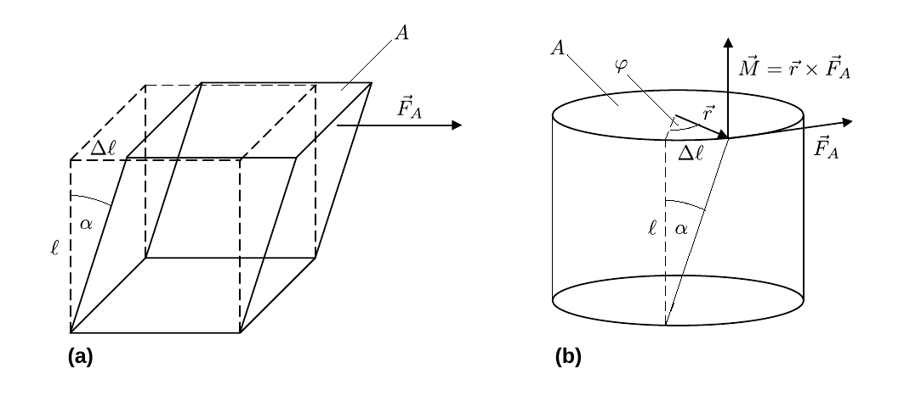
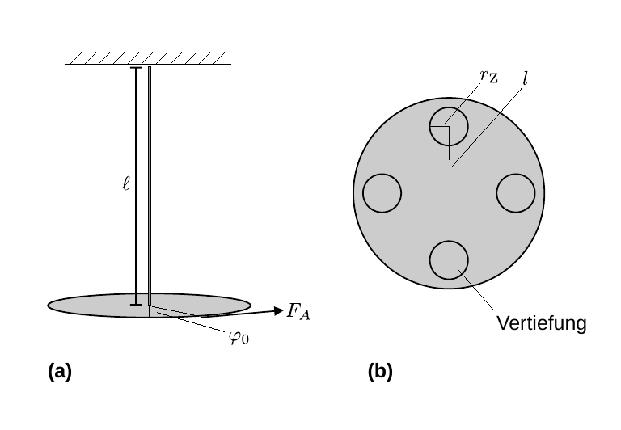

# Hinweise für den Versuch Elastizität

## Torionsmodul

Neben der [hier](https://gitlab.kit.edu/kit/etp-lehre/p1-praktikum/students/-/blob/main/Elastizitaet/doc/Hinweise-Balken.md) diskutierten **Normalspannung**, die mit Volumenänderungen verbunden ist, weisen elastische Körper auch **Gestaltelastizität** auf. Einfache Beispiele hierfür sind die Scherung eines Quaders und die Torsion eines Zylinders, wie in **Abbildung 1** gezeigt:

**Abbildung 1**: ((a) Scherung eines Quaders und (b) Torsion eines Zylinders. In beiden Fällen sind die relevanten Flächen mit $A$ und die angreifende Kraft mit $\vec{F}_{A}$ bezeichnet. Die Scherung/Torsion erfolgt jeweils um den Winkel $\alpha$)

---

In **Abbildung 1a** wird die obere Fläche $A$ durch die angreifende Schubkraft $\vec{F}_{A}$, relativ zur unteren Fläche verschoben. Dadurch werden beide Flächen um den Winkel $\alpha$ gegeneinander versetzt. Man spricht von einer **Scherung** um den Winkel $\alpha$. In **Abbildung 1b** greift $\vec{F}_{A}$ an der oberen Fläche $A$ an und verdreht diese relativ zur Bodenfläche um den Winkel $\varphi$. In diesem Fall spricht man von **latenter Gestaltänderung**, da der Körper seine Gestalt zunächst nicht sichtbar ändert. Auf dem Zylindermantel befindliche vertikale Linien werden durch die Torsion jedoch um den Winkel $\alpha$ geschert. Torsion und Scherung folgen dabei den gleichen mikroskopischen Gesetzmäßigkeiten.

Analog zum Fall des Elastizitätsmoduls [hier](https://gitlab.kit.edu/kit/etp-lehre/p1-praktikum/students/-/tree/main/Elastizitaet) gilt:  
$$
\begin{equation*}
\begin{split}
&F_{A}\propto A\,\frac{\Delta\ell}{\ell} = A\,\alpha; \\
&\\
&F_{A} = G\,A\,\alpha.\\
\end{split}
\end{equation*}
$$
Die Proportionalitätskonstante bezeichnet man in diesem Fall, je nach Zusammenhang, als den **[Schub- oder Torsionsmodul](https://de.wikipedia.org/wiki/Schubmodul)**. Der Quotient 
$$
\begin{equation*}
\tau \equiv\frac{F_{A}}{A}
\end{equation*}
$$
wird als **Schub- oder Scherspannung** bezeichnet. Sie stellen die außerdiagonalen Komponenten des [mechanischen Spannungstensors](https://de.wikipedia.org/wiki/Spannungstensor) dar. 

## Torsion eines zylinderförmigen Stabs

Zur Berechnung der Torsion eines zylinderförmigen Stabs betrachten wir zunächst einen Hohlzylinder mit Länge $\ell$, Radius $r$ und Wanddicke $\mathrm{d}r$, an den tangential im Abstand $r$ eine äußere Kraft $\vec{F}_{A}$ mit dem Drehmoment
$$
\begin{equation*}
\vec{M}_{A} = \vec{r}\times\vec{F}_{A};\quad |\vec{M_{A}}| = M_{A} = r\,F_{A}
\end{equation*}
$$
angreift. 

Aufgrund von $\vec{M}_{A}$ verdreht sich eine Stirnfläche des Hohlzylinders relativ zur anderen um den Winkel $\varphi$, woraus sich für kleine Werte von $\varphi$ der Winkel $\alpha$ wie folgt ermittelt:
$$
\begin{equation*}
\alpha = \frac{\varphi\,r}{\ell}.
\end{equation*}
$$
Für die rückstellende Schubspannung $\tau$ gilt
$$
\begin{equation*}
\begin{split}
&\tau = \frac{\mathrm{d}F_{R}}{\mathrm{d}A} = \frac{\mathrm{d}F_{R}}{2\pi\,r\,\mathrm{d}r};\\
&\\
&\text{mit:}\\
&\\
&\tau\equiv G\,\alpha=G\,\frac{\varphi\,r}{\ell};\\
&\\
& \mathrm{d}F_{R} = G\,\frac{\varphi\,r}{\ell}\,2\pi\,r\,\mathrm{d}r; \\
&\\
& \mathrm{d}M_{R} = r\,\mathrm{d}F_{R} \\
&\hphantom{\mathrm{d}M_{R}}= r\,G\,\frac{\varphi\,r}{\ell}\,2\pi\,r\,\mathrm{d}r; \\
\end{split}
\end{equation*}
$$
Integration über $r'\in[0,r]$ führt auf das resultierende rückstellende Drehmoment 
$$
\begin{equation}
M_{R} = \int\limits_{0}^{r}\mathrm{d}M_{R} = 2\pi\,G\,\frac{\varphi}{\ell}\int\limits_{0}^{r}r^{\prime\,3}\,\mathrm{d}r^{\prime} = \frac{\pi}{2}\,G\,\frac{\varphi}{\ell}\,r^{4} 
\end{equation}
$$
eines massiven Zylinderstabs. Die Bedingung der Momentenfreiheit im Gleichgewichtszustand führt bei bekanntem Drehmoment $M_{A}$ auf
$$
\begin{equation*}
\begin{split}
&M_{R} + M_{A}=0; \\
&\\
&G = \frac{2\,\ell}{\pi\,\varphi\,r^{4}}\,M_{A},\\
\end{split}
\end{equation*}
$$

woraus sich $G$ bestimmen lässt. 

## Dynamische Bestimmung von $G$

Im Experiment wird $G$ dynamisch aus der Periode einer Torionsschwingung nach Auslenkung um einen kleinen Winkel $\varphi_{0}$ bestimmt (siehe Versuch [Pendel](https://gitlab.kit.edu/kit/etp-lehre/p1-praktikum/students/-/tree/main/Pendel)). Die Schwingungsgleichung ergibt sich aus der Bilanz der Drehmomente:
$$
\begin{equation}
\begin{split}
&\Theta\,\ddot{\varphi} + M_{R} = 0; \\
&\\
&\Theta\,\ddot{\varphi} + \underbrace{\frac{\pi\,r^{4}}{2\,\ell}\,G}\,\varphi = 0; \\
&\hphantom{ccccccc}\equiv D\\
\end{split}
\end{equation}
$$
wobei $\Theta$ dem [Trägheitsmoment](https://de.wikipedia.org/wiki/Tr%C3%A4gheitsmoment) des schwingenden Körpers und $D$ dem [Direktionsmoment](https://de.wikipedia.org/wiki/Direktionsmoment) der Schwingung entsprechen. Der Betrag von $M_{R}$ ist durch Gleichung **(1)** gegeben. Gleichung **(2)** wird durch harmonische Schwingungen
$$
\begin{equation*}
\varphi(t) = \varphi_{0}\cos(\omega\,t+\phi_{0})
\end{equation*}
$$
gelöst. Einsetzen dieses Ansatzes führt auf die Sekundärgleichung zu Gleichung **(2)** und den entsprechenden Zusammenhang zwischen der Periode der Schwingung und $G$
$$
\begin{equation*}
\begin{split}
&\omega = \frac{2\pi}{T} = \sqrt{\frac{D}{\Theta}}; \\
&\\
&\frac{4\pi^{2}}{T^{2}} = \frac{D}{\Theta} = \frac{\pi\,r^{4}}{2\,\ell}\,\frac{G}{\Theta};\\
&\\
&G = \frac{8\pi\,\ell}{r^{4}}\frac{\Theta}{T^{2}}. \\
\end{split}
\end{equation*}
$$
Die Herausforderung bei dieser Bestimmung von $G$ ist die genaue Kenntnis von $\Theta$.

## Bestimmung von $G$ ohne genaue Kenntnis von $\Theta$

Im Versuch wird der zu testende Stab aufgehängt und am unteren Ende mit einer Platte verbunden, wie in **Abbildung 2** gezeigt:

**Abbildung 2**: (Messanordnung zur Bestimmung von $G$. In Abbildung 2a ist die Seitenansicht gezeigt, Abbildung 2b zeigt die Aufsicht auf die montierte Platte)

---

Auf der Platte finden sich Vertiefungen in den Abständen $l$ auf die bis zu vier gleichartige Aluminiumzylinder Z mit wohldefiniertem Trägheitsmoment
$$
\begin{equation*}
\Theta_{\mathrm{Z}} = \frac{1}{2}\,m_{\mathrm{Z}}\,r_{\mathrm{Z}}^{2}
\end{equation*}
$$
eingesetzt werden können, wobei $m_{\mathrm{Z}}$ der Masse und $r_{\mathrm{Z}}$ dem Radius der Z entsprechen. Nach dem [Steinerschen Satz](https://de.wikipedia.org/wiki/Steinerscher_Satz) (siehe Versuch [Kreisel](https://gitlab.kit.edu/kit/etp-lehre/p1-praktikum/students/-/tree/main/Kreisel)) beträgt das Trägheitsmoment eines solchen Zylinders im Abstand $l$ der Rotationsachse
$$
\begin{equation*}
\Theta_{\mathrm{Z}}^{\prime} = m_{\mathrm{Z}}\left(\frac{r_{\mathrm{Z}}^{2}}{2} + l^{2}\right).
\end{equation*}
$$
Da $\Theta$ der gesamten Konstruktion aus dem (sich nur teilweise drehenden) Stab, der Platte und der Spange, mit dem die Platte am Stab befestigt ist schwer zu berechnen ist erfolgt die Messung als Differenzmessung, wie folgt: 

- Auf die Platte werden zunächst vier Z aufgesetzt und die Periode $T_{\mathrm{4Z}}$ bestimmt. 
- Anschließend werden zwei gegenüberliegende Z entfernt und $T_{\mathrm{2Z}}$ erneut bestimmt.

Für die Trägheitsmomente $\Theta_{i}$ gilt:
$$
\begin{equation*}
\begin{split}
&\Theta_{\mathrm{4Z}} = \Theta+4\Theta_{Z}^{\prime}; \\
&\\
&\Theta_{\mathrm{2Z}} = \Theta+2\Theta_{Z}^{\prime}. \\
\end{split}
\end{equation*}
$$
$G$ berechnet sich jetzt aus
$$
\begin{equation*}
\begin{split}
&T_{i}^{2} = \frac{4\pi^{2}}{D}\,\Theta_{i}; \\
&\\
&T_{\mathrm{4Z}}^{2} - T_{\mathrm{2Z}}^{2} = \frac{4\pi^{2}}{D}\underbrace{\left(\Theta_{\mathrm{4Z}}-\Theta_{\mathrm{2Z}}\right)}\\
&\hphantom{ccccccccccccccccccccc}=2\Theta_{\mathrm{Z}}^{\prime}\\
&\\
&G = \frac{8\pi\,\ell}{r^{4}}\,\frac{2\,\Theta_{\mathrm{Z}}^{\prime}}{T_{\mathrm{4Z}}^{2} - T_{\mathrm{2Z}}^{2}},\\
\end{split}
\end{equation*}
$$
wofür die genaue Kenntnis von $\Theta$ nicht mehr erforderlich ist.

## Essentials

Was Sie ab jetzt wissen sollten:

- Die Begriffe **Scher- und Schubpannung** sollten Ihnen geläufig sein. 
- Sie sollten den Zusammenhang zwischen **Scher- und Normalspannung** verstanden haben.
- Sie sollten verstanden haben, wie man aus der **Torsion eines zylinderförmigen Stabs** $G$ bestimmt.  
- Sie sollten verstanden haben wie man $G$ aus Torsionsschwingungen bestimmt, selbst wenn man das **Trägheitsmoment $\Theta$ der Anordnung** nicht genau bestimmen kann.

##  Testfragen

1. Welche Werte von $r$ erscheinen Ihnen für einen Messingstab der Länge $\ell\approx1\ \mathrm{m}$ und den im Praktikum befindlichen Aufbau vernünftig?

# Navigation

[Main](https://gitlab.kit.edu/kit/etp-lehre/p1-praktikum/students/-/tree/main/Elastizitaet)
