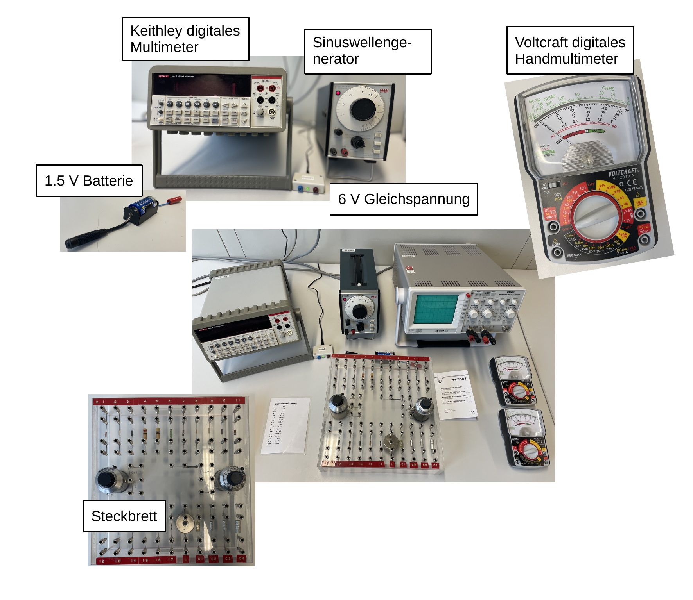

# Fakultät für Physik

## Physikalisches Praktikum P1 für Studierende der Physik

Versuch P1-21, 22, 23 (Stand: **Oktober 2024**)

[Raum F2-17](https://labs.physik.kit.edu/img/Klassische-Praktika/Lageplan_P1P2.png)

# Elektrische Messverfahren

## Motivation

Nahezu jede physikalische Messung hat heutzutage mit der elektrischen Aufnahme und ggf. analogen oder digitalen Weiterverarbeitung serieller Messdaten zu tun. Ein exzellentes Verständnis der Grundlagen elektrischer Messverfahren gehört daher unabdingbar zum Rüstzeug jedes Naturwissenschaftlers. Dieser Versuch steht im Zeichen von **Widerstand und Impedanz**. Sie machen sich mit dem Begriff des [(Innen-)Widerstands](https://de.wikipedia.org/wiki/Ausgangswiderstand) [elektrischer Bauelemente](https://de.wikipedia.org/wiki/Elektrisches_Bauelement) experimentell vertraut und üben sich darin einzelne [elektrische Netzwerke](https://de.wikipedia.org/wiki/Netzwerk_(Elektrotechnik)) zu berechnen, zu schalten und in Betrieb zu nehmen. Die Berechnung erfolgt nahezu ausschließlich mit Hilfe der [Kirchhoffschen Regeln](https://de.wikipedia.org/wiki/Kirchhoffsche_Regeln). Für zeitlich veränderliche Signale bedeutungsvoller als der ohmsche Widerstand ist dessen Verallgemeinerung, die [elektrische Impedanz](https://de.wikipedia.org/wiki/Elektrische_Impedanz), die nicht nur eine Abschwächung, sondern auch eine Verzögerung und ggf. Verzerrung elektrischer Signale durch reale elektrische Bauelemente beschreibt. Sie lernen den Begriff der Impedanz experimentell am Beispiel der realen Spule kennen.  

## Lehrziele

Wir listen im Folgenden die wichtigsten **Lehrziele** auf, die wir Ihnen mit dem Versuch **Elektrische Messverfahren** vermitteln möchten: 

- Sie üben sich im praktischen Umgang mit **einfachen elektrischen Schaltungen** und Schaltelementen, wie dem ohmschem Widerstand und der Spule.
- Sie verstehen den Unterschied zwischen einer **idealen und realen Strom- und Spannungsquelle**.
- Sie verstehen den Unterschied zwischen einem **idealen und realen Strom-/Spannungsmessgerät**.
- Sie verstehen den Unterschied zwischen **Widerstand und Impedanz**.

## Versuchsaufbau

Ein typischer Aufbau für den Versuch **Elektrische Messverfahren** ist in **Abbildung 1** gezeigt:

---

**Abbildung 1**: (Ein typischer Aufbau für den Versuch **Elektrische Messverfahren**)

---

Zum Aufbau verschiedener einfacher Schaltungen steht Ihnen ein Steckbrett mit verschiedenen bereits fest verlöteten Bauelementen zur Verfügung. Darin sind zwei Drehpotentiometer mit einem maximalen Widerstand von $R_{P}=10\ \mathrm{k\Omega}$ integriert. Aus einer Box können Sie eine Gleichspannung von $U_{0}=6\ \mathrm{V}$ entnehmen. Zusätzlich stehen Ihnen verschiedene Spannungs- und Strommessgeräte, ein Frequenzgenerator und ein Oszilloskop zur Verfügung.  

## Wichtige Hinweise

- Gemeinsam mit den Versuchen [Transistor_und_Operationsverstaerker](https://gitlab.kit.edu/kit/etp-lehre/p1-praktikum/students/-/tree/main/Transistor_und_Operationsverstaerker) und [Netzwerke und Leitungen](https://gitlab.kit.edu/kit/etp-lehre/p1-praktikum/students/-/tree/main/Netzwerke_und_Leitungen) gehört dieser Versuch zur Versuchsgruppe **Messverfahren**. Diese Versuche bauen aufeinander auf und sollten am besten nacheinander durchgeführt werden.  

# Navigation

- [Elektrische_Messverfahren.iypnb](https://gitlab.kit.edu/kit/etp-lehre/p1-praktikum/students/-/blob/main/Elektrische_Messverfahren/Elektrische_Messverfahren.ipynb): Aufgabenstellung und Vorlage fürs Protokoll.
- [Elektrische_Messverfahren_Hinweise.ipynb](https://gitlab.kit.edu/kit/etp-lehre/p1-praktikum/students/-/blob/main/Elektrische_Messverfahren/ElektrischeMessverfahren_Hinweise.ipynb): Hinweise zu den Aufgaben.
- [Datenblatt.md](https://gitlab.kit.edu/kit/etp-lehre/p1-praktikum/students/-/blob/main/Elektrische_Messverfahren/Datenblatt.md): Technische Details zu den Versuchsaufbauten.
- [doc](https://gitlab.kit.edu/kit/etp-lehre/p1-praktikum/students/-/tree/main/Elektrische_Messverfahren/doc): Dokumente zur Vorbereitung auf den Versuch.
- [figures](https://gitlab.kit.edu/kit/etp-lehre/p1-praktikum/students/-/tree/main/Elektrische_Messverfahren/figures): Bilder, die für die Dokumentation des Versuche verwendet wurden.

