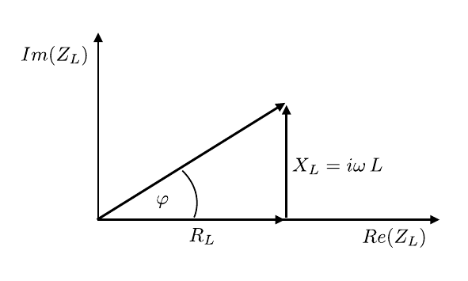

# Hinweise für den Versuch Elektrische Messverfahren

## Impedanz

Bei zeitlich veränderlichen Strömen spricht man oft von einem Signal. Signale liegen i.a. als Wellen vor. Ein aufgrund seiner Einfachheit in der Elektrotechnik vorherrschend diskutiertes (zeitlich veränderliches) Signal ist das einer sinusförmigen Wechselspannung 
$$
\begin{equation*}
U(t) = U_{0}\sin(\omega\,t),
\end{equation*}
$$
mit der Kreisfrequenz $\omega$. Im Fall zeitlich veränderlicher Signale ordnet man dem (ohmschen) Widerstand $R$ den Begriff der [(elektrischen) Impedanz](https://de.wikipedia.org/wiki/Elektrische_Impedanz) 
$$
\begin{equation*}
Z = R + iX
\end{equation*}
$$
über. Als **komplexer Widerstand** drückt $Z$ zusätzlich zu $R$ eine potentielle, ggf. frequenzabhängige **Phasenverschiebung** $\varphi$ des Ausgangs- gegenüber dem Eingangssignal aus. 

- Den Realteil $Re(Z)=R$ bezeichnet man als **Wirkwiderstand**; dieser ist zum ohmschen Widerstand $R$ im Fall des Gleichstroms äquivalent.
- Den Imaginärteil $Im(Z)=X$ bezeichnet man als **Blindwiderstand**.
-  Der Betrag der Impedanz $|Z|\geq R$ wird als **Scheinwiderstand** bezeichnet. 

Die Berechnung von Impedanzen in elektrischen Netzwerken erfolgt nach den [Kirchhoffschen Regeln](https://de.wikipedia.org/wiki/Kirchhoffsche_Regeln), wobei Blindwiderstände analog zu Wirkwiderständen behandelt werden. Die für die Impedanzberechnung relevanten passiven, linearen, [elektrische Bauelemente](https://de.wikipedia.org/wiki/Elektrisches_Bauelement) sind

- der ohmsche Widerstand $R$;  

- der (ideale) Kondensator, mit der Kapazität $C$ und der Impedanz 
  ```math
  \begin{equation*}
  X_{C}=\frac{1}{i\omega\,C};
  \end{equation*}
  ```

- die (ideale) Spule, mit der Induktivität $L$ und der Impedanz
  ```math
  \begin{equation*}
  X_{L}=i\omega\,L.
  \end{equation*}
  ```

Als **ideale Spule/idealen Kondensator** bezeichnet man das entsprechende Bauteil, wenn es keinen Wirkwiderstand besitzt.

Wie man der jeweiligen Definition entnimmt handelt es sich bei $X_{C}$ und $X_{L}$ um reine Blindwiderstände, d.h. sowohl der ideale Kondensator, als auch die ideale Spule entziehen einem sich aufbauenden Signal zwar Energie. Diese wird aber im Fall des Kondensators als elektrische und im Fall der Spule als magnetische Feldenergie gespeichert und dem abklingenden Signal wieder zurückgegeben. Dies kann zu Zeitverzögerungen und Verzerrungen des Signals führen.

Die Berechnung elektrischer Netzwerke erfolgt am einfachsten in der komplexen Ebene für $Z$. Ein Beispiel für die Berechnung der Impedanz einer realen Spule mit Induktivität $L$ und Wirkwiderstand $R_{L}$ mit Hilfe eines Zeigerdiagramms in der komplexen Ebene für $Z_{L}$ ist in **Abbildung 1** gezeigt: 

---



**Abbildung 1**: (Zeigerdiagramm zur Berechnung der Impedanz $Z_{L}$ einer realen Spule mit Induktivität $L$ und Wirkwiderstand $R_{L}$ in der komplexen Ebene)

---

Ohne Beschränkung der Allgemeinheit empfiehlt es sich die Phase des Signals relativ zum Spannungsabfall am ohmschen Widerstand, in diesem Beispiel $R_{L}$, zu wählen. Damit gilt:
$$
\begin{equation*}
\begin{split}
&U(t) = Z_{L}\,I(t); \\
&\\
&Z_{L} = R_{L} + iX_{L};\\
&\\
&|Z_{L}| = \sqrt{R_{L}^{2}+X_{L}^{2}};\qquad \varphi=\arctan\left(\frac{X_{L}}{R_{L}}\right).
\end{split}
\end{equation*}
$$
$|Z_{L}|$ bestimmt die Größe des Stroms, $\varphi$ die Phasenlage relativ zu $U(t)$.

**Ein realer Schaltkreis enthält immer effektive Widerstände, Induktivitäten und Kapazitäten.** Für andere, als sinusförmige Signale kommt es zu einer frequenzabhängigen Verzerrung des Eingangssignals. Um die Form des Ausgangssignals aus dem Eingangssignal und dem Schaltkreis ableiten zu können bedarf es in solchen fällen einer Fourier-Entwicklung des Eingangssignals, woraus sich $Z_{\omega}$ und $\varphi_{\omega}$ bestimmen lassen. 

## Essentials

Was Sie ab jetzt wissen sollten:

- Bei zeitlich veränderlichen Signalen betrachtet man nicht den Widerstand $R$, sondern die Impedanz $Z$ eines Schaltkreises. **$Z$ ist eine Verallgemeinerung von $R$ für zeitlich veränderliche Signale.**
- Die wichtigsten passiven, linearen, elektrischen Bauelemente in einem elektrischen Schaltkreis sind der (ohmsche) **Widerstand** ($R$), die ideale **Spule** (mit $X_{L}$) und der ideale **Kondensator** (mit $X_{C}$). Die Definitionen von $X_{L}$ und $X_{C}$ für ein sinusförmiges Signal sollten Ihnen geläufig sein.
- Die Impedanz aus diesen Bauelementen berechnet man nach den Kirchhoffschen Regeln in der **komplexen Ebene von $Z$**. Auf diese Weise lassen sich $|Z|$ und $\varphi$ berechnen.

## Testfragen

1. Wie sieht das Zeigerdiagramm in der komplexen Ebene von $Z$ für einen elektrischen Schaltkreis aus ohmschem Widerstand $R$, Kondensator (mit Kapazität $C$) und Spule (mit Induktivität $L$) aus?
1. Kommt es in einem elektrischen Schaltkreis aus idealer Spule und idealem Kondensator, aber **ohne** ohmschen Widerstand zur Signaldämpfung oder nicht?  

# Navigation

[Main](https://gitlab.kit.edu/kit/etp-lehre/p1-praktikum/students/-/tree/main/Elektrische_Messverfahren)
