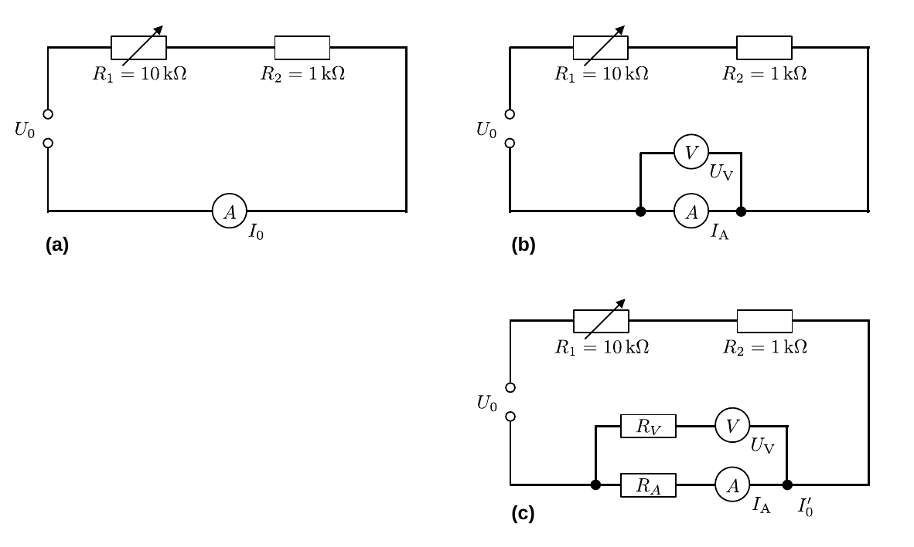

# Hinweise für den Versuch Elektrische Messverfahren

## Innenwiderstände elektrischer Messgeräte

Ein ideales Messgerät übt keinen Einfluss auf seine Umgebung aus. 

- Für ein Strommessgerät bedeutet dies, dass sein Innenwiderstand $R_{A}=0\ \Omega$ beträgt. 
- Für ein Spannungsmessgerät bedeutet dies, dass sein Innenwiderstand $R_{V}$ unendlich groß ist.

In der Realität besitzen alle elektrischen Messgeräte endliche Innenwiderstände. Bei der Berechnung von Netzwerken wird diesem Umstand in Ersatzschaltbildern, wie in **Abbildung 1c** gezeigt, Rechnung getragen:  

---

**Abbildung 1**: (Strom- und Spannungsmessung mit realen Messgeräten. In Abbildung (c) ist ein Ersatzschaltbild der Schaltung aus Abbildung (b), mit endlichen Innenwiderständen der Messgeräte gezeigt. Die eingezeichneten Symbole stehen für ideale Messgeräte)

---

### Strommessgerät

Eine unverfälschte Strommessung erfolgt mit Hilfe eines in Reihe geschalteten Strommessgeräts (A), wie in **Abbildung 1a** gezeigt. Nach den [Kirchhoffschen Regeln](https://de.wikipedia.org/wiki/Kirchhoffsche_Regeln) fließt durch den gesamten Schaltkreis der Strom 

$$
\begin{equation*}
I_{0} = \frac{U_{0}}{R_{1}+R_{2}+R_{A}},
\end{equation*}
$$
wobei $R_{A}$ der endliche Innenwiderstand von A ist. Dieser lässt sich bestimmen, indem man ein Spannungsmessgerät (V) zu A parallel schaltet, wie in **Abbildung 1b** gezeigt. Durch V wird der Spannungsabfall $U_{V}$ über A abgegriffen. Der Innenwiderstand $R_{A}$ berechnet sich danach aus dem Quotienten 
$$
\begin{equation}
R_{A} = \frac{U_{V}}{I_{A}}.
\end{equation}
$$

### Spannungsmessgerät

Auch V besitzt einen endlichen Innenwiderstand $R_{V}$. In **Aufgabe 1.1** wird dies durch den deutlich beobachtbaren Stromabfall in A, nach Parallelschaltung von V, besonders eindrücklich. 

Das entsprechende Ersatzschaltbild zur Berechnung der Innenwiderstände ist in **Abbildung 1c** gezeigt. Aus der Kirchhoffschen **Maschenregel** erhält man das Verhältnis der Innenwiderstände zueinander und daraus eine Beziehung zur Berechnung von $R_{V}$:
$$
\begin{equation}
\begin{split}
&R_{V}\,\left(I^{\prime}_{0}-I_{A}\right) = R_{A}\,I_{A};\\
&\\
&\frac{R_{V}}{R_{A}} = \frac{I_{A}}{I^{\prime}_{0}-I_{A}}\\
&\\
&R_{V} = R_{A}\,\frac{I_{A}}{I^{\prime}_{0}-I_{A}}
= \frac{U_{V}}{I^{\prime}_{0}-I_{A}}.
\end{split}
\end{equation}
$$
In einem ersten Ansatz könnte man $I_{0}^{\prime}\approx I_{0}$ annehmen. Dieser Ansatz lässt jedoch außer Acht, dass sich $I_{0}$ durch die Parallelschaltung von V verändert hat: Der Strom der zuvor allein über A abgeflossen ist fließt jetzt über das Netzwerk aus
$$
\begin{equation*}
R_{A}\parallel R_{V} \equiv \left(\frac{1}{R_{A}}+\frac{1}{R_{V}}\right)^{-1} = \frac{R_{A}\,R_{V}}{R_{A}+R_{V}}
\end{equation*}
$$
ab. Die Berechnung von $I_{0}^{\prime}$ führt auf:
$$
\begin{equation}
\begin{split}
&I_{0}^{\prime} = \frac{U_{0}}{R_{\mathrm{ges}}};\\
&\\
&\text{mit:} \\
&\\
&R_{\mathrm{ges}} = R_{1} + R_{2} + \left(R_{A}\parallel R_{V}\right)\\
&\\
&\text{ergibt:}\\
&\\
&I_{0}^{\prime} = \frac{U_{0}\left(R_{A}+R_{V}\right)}{\left(R_{A}+R_{V}\right)\left(R_{1} + R_{2}\right) + R_{A}\,R_{V}}\\
\end{split}
\end{equation}
$$
Einsetzen in Gleichung **(2)** führt zum richtigen Ausdruck für die Berechnung von $R_{V}$.

Eine für Berechnungen dieser Art oft angewandte Alternative zum "Einsetzen und Auflösen" besteht im folgenden iterativen Algorithmus: 

- **Schritt 1:** $I_{0}^{(0)} = I_{0}$. Berechne einen Wert für $R_{V}^{(j+1)}$ aus Gleichung **(2)** unter Verwendung von $I_{0}^{(j)}$. Das Ergebnis basiert auf dem falschen Wert $I_{0}^{(j)}$ und ist daher nicht exakt. 
- **Schritt 2:** Berechne $I_{0}^{(j+1)}$ basierend auf $R_{V}^{(j+1)}$ neu. Dieser Schritt führt auf einen genaueren Wert für $I_{0}^{(j+1)}$. Kehre zurück zu Schritt 1. 

## Essentials

Was Sie ab jetzt wissen sollten:

- Ein **Strommessgerät sollte einen möglichst geringen Innenwiderstand** $R_{A}\to 0$ haben.
- Ein **Spannungsmessgerät sollte einen möglichst hohen Innenwiderstand** $R_{V}\to \infty$ haben.
  - Ein günstiges analoges Spannungsmessgerät hat heutzutage einen typischen Innenwiderstand von $R_{V}=\mathcal{O}(1\ \mathrm{k\Omega})$; 
  - ein gutes Spannungsmessgerät hat einen typischen Innenwiderstand von $R_{V}=\mathcal{O}(1-100\ \mathrm{M\Omega})$; 
  - ab einem Innenwiderstand von $R_{V}\gtrsim\mathcal{O}(1\ \mathrm{G\Omega})$ spricht man von einem Elektrometer. 

## Testfragen

1. Müssen Sie dem Umstand, dass Strom über $R_{V}$ abfließt nicht auch bei der Berechnung von $R_{A}$ in Gleichung **(1)** berücksichtigen? Begründen Sie Ihre Antwort, ggf. rechnerisch. 

# Navigation

[Main](https://gitlab.kit.edu/kit/etp-lehre/p1-praktikum/students/-/tree/main/Elektrische_Messverfahren)
