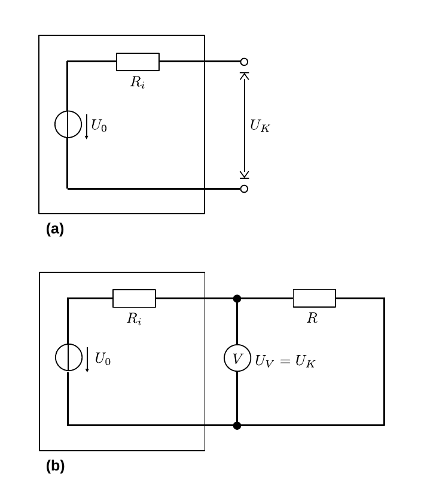
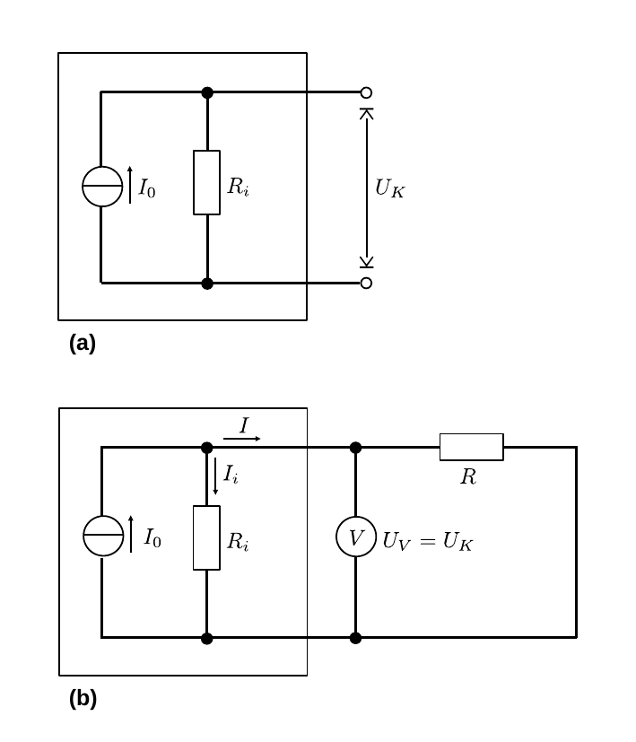

# Hinweise für den Versuch Elektrische Messverfahren

## Ideale und reale Spannungsquelle

Würde man eine ideale Quelle für die Spannung $U_{0}$ ohne Widerstand kurzschließen würde nach dem [Ohmschen Gesetz](https://de.wikipedia.org/wiki/Ohmsches_Gesetz) 
$$
\begin{equation*}
U=R\,I;\quad I=\frac{U}{R}
\end{equation*}
$$
ein unendlich hoher Strom fließen. In der Realität ist dies nicht der Fall, da jede **reale Spannungsquelle** einen Innenwiderstand $R_{i}$ besitzt. Diesem Umstand wird in entsprechenden Ersatzschaltbildern, wie in **Abbildung 1** gezeigt, Rechnung getragen:

---

**Abbildung 1**: (Ersatzschaltbilder für eine reale Spannungsquelle. Abbildung (a) zeigt das Ersatzschaltbild einer unbelasteten, realen Spannungsquelle mit dem Innenwiderstand $R_{i}$, im Leerlauf. Abbildung (b) zeigt eine Schaltung mit einem zusätzlichen Lastwiderstand $R$. Die Spannung $U_{K}$ an den Kontakten der Spannungsquelle wird als Spannung $U_{V}$ mit V gemessen)

---

Das Schaltsymbol für eine ideale Spannungsquelle ist ein Kreis mit einem Mittelstrich, der entlang der Leitung verläuft. 

Man bezeichnet $U_{0}$ als **Leerlaufspannung**. Die in **Abbildung 1a** zwischen den Kontakten abgreifbare Spannung $U_{K}$ bezeichnet man als **Klemmspannung**. Fließt zwischen den Kontakten kein Strom ($I=0$) gilt:
$$
\begin{equation*}
U_{K} = U_{0}.
\end{equation*}
$$
$U_{K}$ lässt sich also in sehr guter Näherung mit einem [hochohmigen Spannungsmessgerät](https://gitlab.kit.edu/kit/etp-lehre/p1-praktikum/students/-/blob/main/Elektrische_Messverfahren/doc/Hinweise-Messgeraete.md) bestimmen. 

Den sich einstellenden maximalen Strom, bei Betrieb der Spannungsquelle ohne äußeren Widerstand (d.h. für $R=0$), bezeichnet man als **Kurzschlussstrom** $I_{K}$. Aus dem Quotienten 
$$
\begin{equation*}
R_{i} = \frac{U_{0}}{I_{K}}
\end{equation*}
$$
ist im Prinzip $R_{i}$ (unter Gleichstrombelastung) bereits zu berechnen. Allerdings kann $I_{K}$ je nach Güte der Stromquelle sehr groß werden. 

### Bestimmung von $U_{K}$ unter fester Last

In **Abbildung 1b** ist eine einfache Schaltung unter Verwendung des Lastwiderstands $R$ gezeigt. In diesem Schaltkreis sind $R_{i}$ und $R$ in Reihe geschaltet. Sobald ein Strom fließt gilt
$$
\begin{equation}
U_{K} = U_{0}-I\,R_{i}.
\end{equation}
$$
Misst man $U_{K}$ als $U_{V}$ berechnet sich der Innenwiderstand (unter Gleichstrombelastung) aus
$$
\begin{equation*}
R_{i} = \frac{U_{0}-U_{V}}{I}. \\
\end{equation*}
$$

### Bestimmung von $U_{K}$ unter regelbarer Last

Eine Variation der oben beschriebenen Vorgehensweise beruht auf der Verwendung eines regelbaren Widerstands $R=R_{P}$. Bei dieser Methode gehen wir zunächst von der Konstellation $R_{P}\gg R_{V}$ aus. Im Folgenden wird $R_{P}$ immer weiter nach unten geregelt, bis der Wert mit $R_{i}$ vergleichbar wird. Regelt man $R_{P}$ kontinuierlich soweit nach unten, bis $U_{K}$ auf $U_{0}/2$ abgefallen ist, gilt nach Gleichung **(1)**:
$$
\begin{equation*}
U_{K} = U_{0}-I\,R_{i} = \frac{U_{0}}{2}; \qquad R_{i}=\frac{U_{0}}{2\,I}.
\end{equation*}
$$
Gleichzeitig gilt
$$
\begin{equation*}
U_{K} = I\,R_{P} = \frac{U_{0}}{2}; \qquad R_{P}=\frac{U_{0}}{2\,I}
\end{equation*}
$$
und damit
$$
\begin{equation*}
R_{P}=R_{V}
\end{equation*}
$$

## Ideale und reale Stromquelle

Manchmal findet man in Schaltbildern statt einer Spannungs- eine Stromquelle vor, wie in **Abbildung 2** gezeigt. 

---

**Abbildung 2**: (Ersatzschaltbilder für eine reale Stromquelle. Abbildung (a) zeigt das Ersatzschaltbild einer unbelasteten, realen Stromquelle mit dem Innenwiderstand $R_{i}$, im Leerlauf. Abbildung (b) zeigt eine Schaltung mit einem zusätzlichen Lastwiderstand $R$. Die Spannung $U_{K}$ an den Kontakten der Spannungsquelle wird als Spannung $U_{V}$ mit V gemessen)

---

Das Schaltsymbol für eine ideale Stromquelle ist ein Kreis mit einem Mittelstrich, der senkrecht der Leitung verläuft. 

Eine ideale Stromquelle liefert, unabhängig von der anliegenden Last, immer den Strom $I_{0}$. Unter anlegen eines beliebig hohen Lastwiderstand könnte man der idealen Stromquelle eine beliebig hohe Leistung entnehmen. 

Im Ersatzschaltbild für eine reale Stromquelle wird $R_{i}$ in diesem Fall zur idealen Stromquelle parallel geschaltet. Damit liegt im Leerlauf, wie in **Abbildung 2a** gezeigt die Klemmspannung 
$$
\begin{equation*}
U_{K}=I_{0}\,R_{i}
\end{equation*}
$$
an. $I_{0}$ fließt über $R_{i}$ und die gesamte Spannung fällt über $R_{i}$ ab. 

Liegt am Stromkreis ein zusätzlicher Lastwiderstand $R$ an teilt sich $I_{0} = I_{i}+I$ entsprechend auf. Ist schließt an die Klemmen kurz fließt $I_{0}$ komplett über den kurzgeschlossenen Zweig ab, d.h. $U_{K}=0$.

## Essentials

Was Sie ab jetzt wissen sollten:

- Jede reale Spannungsquelle besitzt einen endlichen Innenwiderstand $R_{i}$. Die nominelle Spannung ohne Last bezeichnet man als **Leerlaufspannung** $U_{0}$.  
- Die an den Kontakten der Quelle abgreifbare Spannung nennt man **Klemmspannung** $U_{K}$. Ohne Strom gilt $U_{K}=U_{0}$. Unter Stromfluss $I$ gilt $U_{K}\leq U_{0}$ und $U_{K}$ fällt proportional zu $I$ ab.
- Für reale Spannungsquellen zeichnet man den **Innenwiderstand** $R_{i}$ in Reihe mit der idealen Spannungsquelle. Für reale Stromquellen schaltet man $R_{i}$ parallel zur idealen Stromquelle. 

## Testfragen

1. Wie ist der Verlauf von $U_{K}$ als Funktion von $I$ für eine reale Stromquelle unter Last, wie in **Abbildung 2b** gezeigt? 
2. Wie verhält sich $U_{K}$, wenn man eine reale Spannungsquelle nacheinander mit drei Widerständen $R_{1}\lt R_{2}\lt R_{3}$ belastet? Wie verhält sich $I$?
3. Welchen Wert hat $U_{K}$, wenn die Klemmen kurzgeschlossen sind? Welcher Strom fließt?
4. Wann kann man eine Spannungsquelle in einem Schaltkreis mit Lastwiderstand $R$ als ideal annehmen?
5. Kann man den Innenwiderstand einer Spannungsquelle mit einem [Widerstandsmessgerät](https://de.wikipedia.org/wiki/Widerstandsmessger%C3%A4t) messen?

# Navigation

[Main](https://gitlab.kit.edu/kit/etp-lehre/p1-praktikum/students/-/tree/main/Elektrische_Messverfahren)
