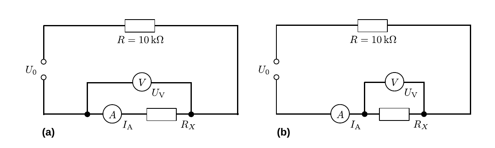

# Hinweise für den Versuch Elektrische Messverfahren

## Ohmscher Widerstand

Der ohmsche Widerstand ist eines der wichtigsten passiven, linearen Bauelemente in elektrischen Schaltungen. Oft werden Widerstände in Schaltungen auch zur Modellierung von als ideal angenommenen 

- Messgeräten, 
- anderen Bauteilen oder 
- Strom- und Spannungquellen 

in [Ersatzschaltbildern](https://de.wikipedia.org/wiki/Ersatzschaltbild) verwendet. Das Spannungsverhalten des Widerstands als Funktion des Stroms $U(I)$ bezeichnet man als Strom-Spannungs-[Kennlinie](https://de.wikipedia.org/wiki/Kennlinie). Die Kennlinie eines ohmschen Widerstands ist eine Gerade 
$$
\begin{equation*}
U(I) = R\,I.
\end{equation*}
$$
Dieser Umstand ist auch als [Ohmsches Gesetz](https://de.wikipedia.org/wiki/Ohmsches_Gesetz) bekannt. Es ist eines der wichtigsten Gesetze in der Elektrizitätslehre.  

Die Werte für in der Elektronik verwendete Widerstände sind genormt. Sie liegen [abgestuft](https://de.wikipedia.org/wiki/Widerstand_(Bauelement)#Abstufung_der_Widerstandswerte) in den sogenannten [E-Reihen](https://de.wikipedia.org/wiki/E-Reihe) vor. Je nach Baureihe haben sie unterschiedliche Toleranzen. Einige Beispiele sind: 

- E3: >20%
- E6: <20%
- E12: <10%
- E24: <5%
- E48: <2%
- E96: <1%
- E192: <0.5%

Dabei bezeichnet die Begleitziffer der entsprechenden Reihe wie viele verschiedene Widerstände es in der entsprechenden Baureihe es gibt, die dann geometrisch nahezu gleichverteilt zur Verfügung stehen. Die Baureihe E12 weist z.B. die folgenden 12 Widerstandsgrößen auf: 
$$
\begin{equation*}
R_{\mathrm{E12}}^{(i)}= 10,\ 12,\ 15,\ 18,\ 22,\ 27,\ 33,\ 39,\ 47,\ 56,\ 68,\ 82\ \Omega
\end{equation*}
$$
Innerhalb der Toleranz von 10% überlappen die Widerstandgrößen. Die Größe von [Festwiderständen](https://de.wikipedia.org/wiki/Widerstand_(Bauelement)#Festwiderst%C3%A4nde) wird durch eine [Farbkodierung](https://de.wikipedia.org/wiki/Widerstand_(Bauelement)#Farbkodierung_auf_Widerst%C3%A4nden) angegeben. 

## Widerstandsmessung

Bei der Bestimmung eines unbekannten Widerstands $R_{X}$ über eine gleichzeitige (A) Strom- und (V) Spannungsmessung, wie in **Abbildung 1** gezeigt, kann es aufgrund der endlichen Innenwiderstände $R_{A}$ und $R_{V}$ der Messgeräte zu merklichen **[Rückwirkungsabweichungen](https://de.wikipedia.org/wiki/R%C3%BCckwirkungsabweichung)** kommen.

---

**Abbildung 1**: (Widerstandsmessung mit Hilfe von Strom- und Spannungsmessgeräten mit endlichen Innenwiderständen. In Abbildung (a) ist die stromrichtige Messung gezeigt. In Abbildung (b) ist die spannungsrichtige Messung gezeigt. $R$ ist ein weiterer Lastwiderstand in der Schaltung)

---

In der in **Abbildung 1a** gezeigten Schaltung, wird der durch $R_{X}$ fließende Strom durch die Messung mit A getreu wiedergegeben. Diese Schaltung bezeichnet man als **[stromrichtig](https://de.wikipedia.org/wiki/Stromrichtige_Schaltung)**. Dafür ist für die Spannungsmessung mit V der zusätzliche Spannungsabfall über A zu berücksichtigen:

$$
\begin{equation}
R_{X} = \frac{U_{V}-I_{A}\,R_{A}}{I_{A}}.
\end{equation}
$$
Alternativ kann man, wie in **Abbildung 1b** gezeigt, mit V die über $R_{X}$ abfallende Spannung getreu messen. Diese Schaltung bezeichnet man als **spannungsrichtig**. In diesem Fall ist bei der Messung mit A der zusätzliche Stromfluss über V
$$
\begin{equation}
R_{X} = \frac{U_{V}}{I_{A}-U_{V}/R_{V}}
\end{equation}
$$
zu berücksichtigen. 

Die Bestimmung von $R_{X}$ mit Hilfe einer **[Wheatstoneschen Messbrücke](https://de.wikipedia.org/wiki/Wheatstonesche_Messbr%C3%BCcke)**, wie in **Abbildung 2** gezeigt, erfolgt stromlos und ist daher von solchen Fehlern frei:

---

**Abbildung 2**: (Schaltung einer Wheatstoneschen Messbrücke. Das Widerstandssymbol mit dem darauf weisenden Pfeil in Abbildung (a) steht für den regelbaren Widerstand $R_{P}$. In Abbildung (b) ist ein entsprechendes Ersatzschaltbild gezeigt, in dem $R_{P}$ durch die zwei Widerstände $R_{2}$ und $R_{3}$ ersetzt wurde. $R$ ist ein weiterer Lastwiderstand in der Schaltung)

---

Die praktische Realisation erfolgt i.a. mit Hilfe eines [Potentiometers](https://de.wikipedia.org/wiki/Potentiometer) mit dem maximalen regelbaren Widerstand $R_{P}$, wie in **Abbildung 2a** gezeigt. **Abbildung 2b** zeigt ein Ersatzschaltbild mit der Eigenschaft
$$
\begin{equation*}
R_{2} = R_{3}-R_{P}
\end{equation*}
$$
Eine Wheatstonesche Messbrücke gilt als *abgeglichen*, wenn im Ersatzschaltbild über $R_{3}$ und $R_{X}$ die gleiche Spannung abfällt. In diesem Fall gilt:
$$
\begin{equation*}
\begin{split}
&U_{3} = U_{0}\,\frac{R_{3}}{R_{2}+R_{3}};\qquad
U_{X} = U_{0}\,\frac{R_{X}}{R_{X}+R_{1}};\qquad \\
&\\
&U_{V} = U_{3}-U_{X}\\
&\\
&\vphantom{\frac{R_{x}}{R_{X}+R_{1}}}
\hphantom{U_{V}}= U_{0}\left(\frac{R_{3}}{R_{2}+R_{3}}-\frac{R_{X}}{R_{X}+R_{1}}\right) 
= U_{0}\frac{R_{3}\,R_{1}-R_{2}\,R_{X}}{(R_{2}+R_{3})(R_{X}+R_{1})}.
\end{split}
\end{equation*}
$$
Die Wheatstonesche Messbrücke ist also genau dann abgeglichen, wenn 
$$
\begin{equation}
R_{X} = R_{1}\frac{R_{3}}{R_{2}}.
\end{equation}
$$
Sind $R_{1}$, $R_{2}$ $R_{3}$ bekannt lässt sich $R_{X}$ entsprechend bestimmen. 

## Essentials

Was Sie ab jetzt wissen sollten:

- Die Bestimmung von Widerständen erfordert sowohl eine Strom- als auch eine Spannungsmessung. Aufgrund endlicher Innenwiderstände beeinflussen sich die Geräte bei einer solchen Messungen gegenseitig, wodurch es zu merklichen **Rückwirkungsabweichungen** kommen kann. 
- Mit einer abgeglichen **Wheatstoneschen Messbrücke** ist eine Widerstandsmessung stromlos möglich, wodurch sich Rückwirkungsabweichungen vermeiden lassen.

## Testfragen

1. Wenn Sie in Gleichung **(1)** $R_{A}$ oder in Gleichung **(2)** $R_{V}$ bei der Berechnung von $R_{X}$ nicht berücksichtigen, wird dann der Wert von $R_{X}$ nach oben oder nach unten verfälscht? 
2. Welche Ordnung der gemessenen Werte erwarten Sie also, wenn Sie die Messmethoden, mit und ohne Korrekturen und unter Verwendung der Spannungsmessgeräte V1 oder V2 mit der Messung mit Hilfe der Wheatstoneschen Messbrücke vergleichen? 

# Navigation

[Main](https://gitlab.kit.edu/kit/etp-lehre/p1-praktikum/students/-/tree/main/Elektrische_Messverfahren)
