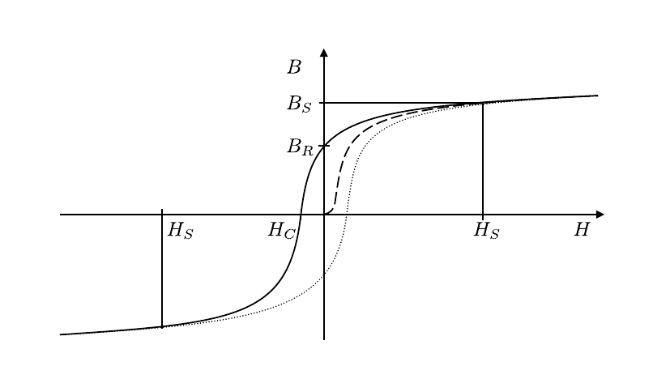
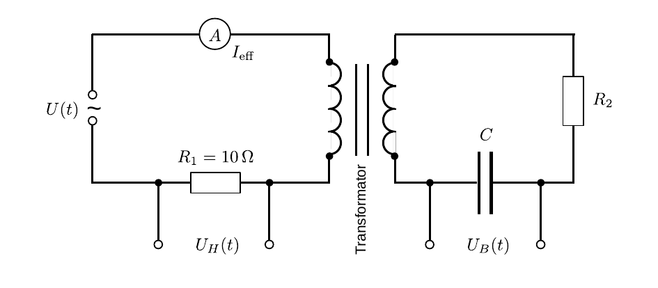

# Hinweise für den Versuch Ferromagnetische Hysterese

## Magnetisierung und Polarisation

In einem [Ferromagneten](https://de.wikipedia.org/wiki/Ferromagnetismus) liegen mikroskopische magnetische Dipole ([Elementarmagnete](https://de.wikipedia.org/wiki/Elementarmagnet)) vor. Richten sich diese über größere makroskopische Bereiche (die sog. [Weiss-Bezirke](https://de.wikipedia.org/wiki/Weiss-Bezirk)) hinweg gleich aus, bildet der Ferromagnet ein makroskopisches [magnetisches Dipolmoment](https://de.wikipedia.org/wiki/Magnetisches_Dipolmoment) $\vec{m}$ aus und wird (permanent) magnetisch. 

Die Größe
$$
\begin{equation*}
\vec{M}=\frac{\mathrm{d}\vec{m}}{\mathrm{d}V}
\end{equation*}
$$
bezeichnet man als [Magnetisierung](https://de.wikipedia.org/wiki/Magnetisches_Dipolmoment). 

Die Größe 
$$
\begin{equation*}
\vec{J}=\mu_{0}\vec{M}
\end{equation*}
$$
bezeichnet man als [magnetische Polarisation](https://de.wikipedia.org/wiki/Magnetische_Polarisation). 

Legt man an einen Ferromagneten ein äußeres magnetisches Feld an richten sich proportional zur Stärke des Feldes immer mehr Elementarmagnete aus wodurch $\vec{M}$ steigt. Dieser Vorgang trägt selbst wieder zur Erhöhung des Magnetfelds bei. 

Erwärmung des Ferromagneten erhöht dessen Entropie. Dies wirkt der Ausrichtung der Elementarmagnete entgegen und senkt $\vec{M}$. Oberhalb der [Curie-Temperatur](https://de.wikipedia.org/wiki/Curie-Temperatur) $T_{C}$ geht $\vec{M}$ spontan ganz verloren. Für Eisen ist $T_{C}=1033\ \mathrm{K}$.

## Flussdichte und Feldstärke

Die Größe und Richtung eines magnetischen Feldes wird durch die [magnetische Flussdichte](https://de.wikipedia.org/wiki/Magnetische_Flussdichte) $\vec{B}$ (mit dem Betrag $B=|\vec{B}|$) quantifiziert.

Legt man an einen Ferromagneten ein äußeres magnetisches Feld der Flussdichte $\vec{B}_{0}$ an wird diese durch $\vec{J}$ erhöht: 
$$
\begin{equation*}
\begin{split}
\vec{B} &= \vec{B}_{0} + \vec{J}.\\
\end{split}
\end{equation*}
$$
Neben $\vec{B}$ definiert man die [magnetische Feldstärke](https://de.wikipedia.org/wiki/Magnetische_Feldst%C3%A4rke) 
$$
\begin{equation*}
\vec{H}\equiv\frac{1}{\mu_{0}}\left(\vec{B} - \vec{J}\right),
\end{equation*}
$$
(mit dem Betrag $H=|\vec{H}|$), die die Größe des magnetischen Feldes quantifiziert, das sich allein aus elektrischen [Leitungs-](https://de.wikipedia.org/wiki/Elektrischer_Strom) und [Verschiebungsströmen](https://de.wikipedia.org/wiki/Verschiebungsstrom), jedoch **nicht** aus der zusätzlichen Polarisation magnetischer Materie ergibt. Den Quotienten 
$$
\begin{equation*}
\mu\equiv\frac{B}{H}
\end{equation*}
$$
bezeichnet man als [magnetische Permeabilität](https://de.wikipedia.org/wiki/Magnetische_Permeabilit%C3%A4t). Zwischen $\vec{H}$ und $\vec{M}$ besteht der Zusammenhang: 
$$
\begin{equation*}
\begin{split}
&\vec{B} = \mu_{0}\left(\vec{H}+\vec{M}\right) = \mu\,\vec{H};\\
&\\
&\vec{M} = \frac{\mu-\mu_{0}}{\mu_{0}}\vec{H} = \underbrace{\left(\frac{\mu}{\mu_{0}}-1\right)}\vec{H},\\
&\hphantom{ccccccccccccccccccccc}\equiv\chi\\
\end{split}
\end{equation*}
$$
d.h. $\vec{M}\propto\vec{H}$. Die Proportionalitätskonstante $\chi$ ist eine physikalische Größe der Dimension Zahl und wird als [magnetische Suszeptibilität](https://de.wikipedia.org/wiki/Magnetische_Suszeptibilit%C3%A4t) bezeichnet. Die Größe
$$
\begin{equation*}
\mu_{r}\equiv\frac{\mu}{\mu_{0}} = \chi+1
\end{equation*}
$$
heisst [relative Permeabilität](https://de.wikipedia.org/wiki/Magnetische_Permeabilit%C3%A4t). Für Ferro- und [Ferritmagnete](https://de.wikipedia.org/wiki/Ferrimagnetismus) ist $\mu_{r}$ nicht konstant, sondern von $H$ abhängig. 

## Hysterese

Trägt man eine der Größen $B,\ J=|\vec{J}|,\ \mu,\ \chi$ als Funktion von $B_{0}$ oder $H$ auf bezeichnet man dies als Magnetisierungs- oder [Hysteresekurve](https://de.wikipedia.org/wiki/Ferromagnetismus#Hysterese). Ihr Verlauf hängt nicht nur vom Material und der Temperatur, sondern auch von der Verlaufsgeschichte der Messung ab. Diesen Umstand bezeichnet man als [Hysterese](https://de.wikipedia.org/wiki/Ferromagnetismus#Hysterese). Eine typische Magnetisierungskurve eines Ferromagneten ist in **Abbildung 1** gezeigt:

---

**Abbildung 1**: (Typischer Verlauf einer Magnetisierungskurve $B(H)$ für einen Ferromagneten)

---

- Die gestrichelte Linie stellt die **Neukurve** dar, bei der der nicht magnetische Ferromagnet zum ersten Mal durch ein äußeres Feld $H$ magnetisiert wird. 
- Oberhalb einer maximalen Feldstärke $H_{S}$ geht das Material in **Sättigung**, d.h. es richten sich keine weiteren Elementarmagnete mehr aus und $B$ nimmt proportional zu $H$ zu ($\Delta B = \mu_{0}\Delta H$). Der dazugehörige Wert für $B$ ist in **Abbildung 1** mit $B_{S}$ gekennzeichnet.
- Regelt man $H$ wieder bis auf 0 zurück bleibt $\vec{J}$ teilweise erhalten. Die Größe $B_{R}=J_{R}$ bezeichnet man als **Remanenz**.
- Um die Polarisation des Ferromagneten aufzuheben bedarf es eines nicht verschwindenden Gegenfelds mit der Stärke $H_{C}$. Man bezeichnet $H_{C}$ als **Koerzitivfeldstärke**. 
- Alternativ kann die Magnetisierung durch Erhitzen auf Temperaturen oberhalb $T_{C}$, oder durch Wechselfeldbetrieb mit langsam bis auf 0 abnehmender Feldstärke $H\to 0$ aufgehoben werden. 

Variiert man nach Durchlaufen der Neukurve $H$ zwischen den Werten $\pm H_{0}$ und misst jeweils die Werte für $B$ durchläuft man eine Hysterese- oder **Magnetisierungsschleife**, die das Wertepaar $(H,B)=(0,0)$ nicht
mehr enthält. Schleifen zu kleineren Werten $H<H_{0}$ liegen ganz innerhalb dieser Schleife.

Das Integral 
$$
\begin{equation*}
w\equiv\oint B\,\mathrm{d}H = \frac{W}{V}
\end{equation*}
$$
hat die Dimension $[\text{Arbeit/Volumen}]$ und beschreibt die Arbeit pro Volumeneinheit, die während eines Magnetisierungszyklus aufgewendet werden muss, um den Spulenkern mit dem Volumen $V$ um zu magnetisieren. Bei Anliegen einer sinusförmigen Wechselspannung der Frequenz $\nu$ entspricht das Produkt 
$$
\begin{equation}
P_{\mathrm{hyst}}\equiv w\,\nu\,V
\end{equation}
$$
 der **Verlustleistung durch Ummagnetisierung**, die auch als [Hystereseverlust](https://de.wikipedia.org/wiki/Elementarmagnet) bezeichnet wird.

## Methode zur Messung des Hystereseverlusts

Zur Messung des Hystereseverlusts verfolgen wir die folgende Strategie: 

- Oszilloskopische Darstellung der Magnetisierungsschleife $B(H)$. 
- Elektronische Auslese, Kalibration der Achsen, Glätten der Kurve und numerische Integration der eingeschlossenen Fläche. 
- Bestimmung von $P_{\mathrm{hsyt}}$ nach Gleichung **(1)**.

Ein entsprechendes Schaltbild zur Darstellung der Hysteresschleife auf dem Oszilloskop ist in **Abbildung 2** gezeigt: 

---

**Abbildung 2**: (Schaltbild zur oszilloskopischen Aufzeichnung einer Magnetisierungskurve $B(H)$)

---

Die Primärspule mit $N_{1}$ Windungen mit Eisenkern wird durch anbringen einer Sekundärspule mit $N_{2}$ Windungen zum Transformator ergänzt. Im Primärkreis (links im Bild) wird 
$$
\begin{equation*}
U_{H}=I\,R_{1}
\end{equation*}
$$
als Maß für den Strom auf CH1 des Oszilloskops eingelesen und im XY-Modus des Oszilloskops auf der $x$-Achse dargestellt. Durch den Eisenkern gilt selbst für die vorliegenden relativ kurzen Spulen
$$
\begin{equation*}
H = N_{1}\,\frac{I}{\ell} = N_{1}\,\frac{U_{H}}{R_{1}\,\ell}.
\end{equation*}
$$
$B$ wird durch Integration der in der Sekundärspule induzierten Spannung 
$$
\begin{equation*}
U_{i} = N_{2}\,A\,\dot{B}
\end{equation*}
$$
gewonnen, wobei $A$ der Fläche der Sekundärspule entspricht. Als physikalischer Integrator dient ein $RC$-Integrierglied bestehend aus einem in Reihe geschalteten Widerstand $R_{2}$ und einem Kondensator $C$. Über den Kondensator wird $U_{B}$ auf CH2 des Oszilloskops abgegriffen wird. (Zur Funktionsweise eines $RC$-Integrierglieds siehe **Aufgabe 1** des Versuchs [Netzwerke und Leitungen](https://gitlab.kit.edu/kit/etp-lehre/p1-praktikum/students/-/tree/main/Netzwerke_und_Leitungen).) Sind $R_{2}$ und $C$ so gewählt, dass die Bedingung 
$$
\begin{equation*}
R_{2}\gg\frac{1}{\omega\,C};\qquad \text{mit: }\omega=2\pi\,\nu
\end{equation*}
$$
 erfüllt ist gilt:
$$
\begin{equation*}
U_{B} = \frac{1}{C\,R_{2}}\int U_{i}\,\mathrm{d}t = \frac{N_{2}\,A}{C\,R_{2}}\int \dot{B}\,\mathrm{d}t = \frac{N_{2}\,A}{C\,R_{2}}\,B.
\end{equation*}
$$
$U_{B}$ stellt die $y$-Achse im XY-Modus des Oszilloskops dar. $B$ ermittelt sich darus durch Umstellen:
$$
\begin{equation*}
B = \frac{C\,R_{2}}{N_{2}\,A}\,U_{B}
\end{equation*}
$$

## Eisenverluste

Der Hystrereseverlust ist bei einem Material mit schmaler Magnetisierungsschlafe gering. Solche Materialen bezeichnet man als **weichmagnetisch**. Sie weisen i.a. 

- eine geringe Koerzitivfeldstärke; 
- hohe Remanenz und 
- große Leitfähigkeit auf. 

Demgegenüberstehen **hartmagnetische** Werkstoffe, die i.a. eine hohe Koerzitivfeldstärke und hohe Remanenz aufweisen. Die Magnetisierungskurve solcher Werkstoffe ist im Idealfall rechteckig.

Für die den Hystereseverlust gilt näherungsweise die Formel
$$
\begin{equation*}
P_{\mathrm{hyst}} \approx k_{H}\frac{4\,H_{C}}{\rho}\,B_{\mathrm{max}}\,\nu,
\end{equation*}
$$
wobei $k_{H}\approx1$ ein Formfaktor, $\rho$ die Dichte des Kernmaterials, $\nu$ die Frequenz der Ummagnetisierung und $B_{\mathrm{max}}$ die maximal induzierte Flussdichte sind. 

Ummagnetisierung ist nicht der einzige Mechanismus, durch den Energie bei der Magnetisierung von Ferromagneten verloren geht (siehe [Eisenverluste](https://de.wikipedia.org/wiki/Elementarmagnet)). Gerade die hohe Leitfähigkeit weichmagnetischer Werkstoffe führt zum Energieverlust durch **Wirbelströme**. Diese unterbindet man, indem man den Eisenkern durch dünne Bleche ersetzt die wechselweise mit isolierendem Material lamelliert werden, wodurch der Widerstand entlang der Strecke 
$$
\begin{equation*}
\oint \vec{E}\cdot\mathrm{d}\vec{s}
\end{equation*}
$$
im Eisenkern so weit wie möglich erhöht wird. Der Energieverlust durch Wirbelströme kann durch die folgende Formel beschrieben werden:
$$
\begin{equation*}
P_{w} = \frac{\pi^{2}\sigma\,d^{2}}{6\rho}\,B_{\mathrm{max}}\,\nu,
\end{equation*}
$$
wobei $\sigma$ der Leitfähigkeit und $d$ die Dicke des Blechs sind. 

Alternativ wird Eisen pulverisiert und in isolierendem Material in seine endgültige Form gepresst. Die verlorene Energie wird in Wärme umgewandelt. Im Versuch können Sie diese Erfahrung leicht machen, indem Sie einen lamellierten durch einen Volleisenkern ersetzen. 

## Essentials

Was Sie ab jetzt wissen sollten:

- Den Zusammenhang zwischen $\vec{B},\ \vec{J},\,\vec{M}$ und $\vec{H}$. 
- Die Bedeutung von $\vec{H}$.
- Das Aussehen und Zustandekommen einer Magnetisierungsschleife, sowie die Bedeutung von Koerzitivfeldsträrke und Remanenz.

## Testfragen

1. Wie würde sich **Abbildung 1** ändern, wenn man statt $B$ die Polarisation $J$ auf der $y$-Achse auftragen würde.
2. Wie kann man aus **Abbildung 1** ganz offensichtlich sehen, dass für Ferromagnete $\mu$ von $H$ abhängt?
3. Wie kann man aus **Abbildung 1** ganz offensichtlich sehen, dass $B$ von der Verlaufsgeschichte der Messung abhängt?

# Navigation

[Main](https://gitlab.kit.edu/kit/etp-lehre/p1-praktikum/students/-/tree/main/Ferromagnetische_Hysterese)
