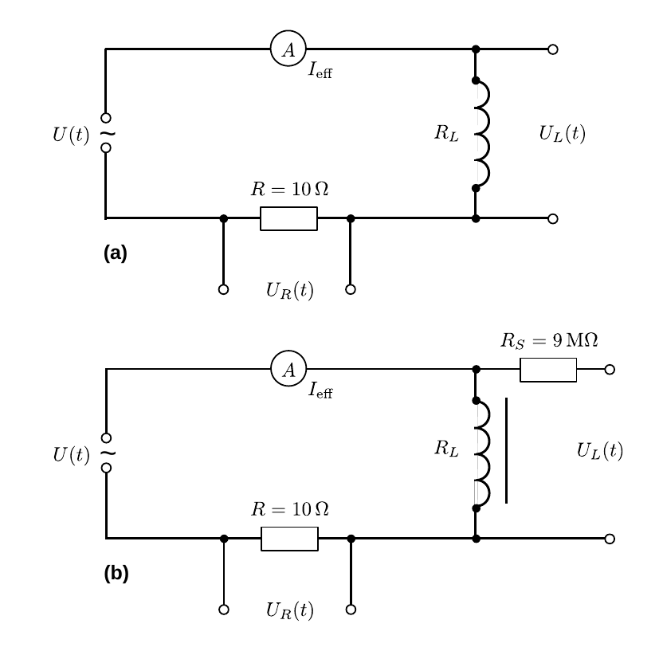

# Hinweise für den Versuch Ferromagnetische Hysterese

## Impedanz der Spule

Die Induktivität $L$ und der ohmsche Widerstand $R_{L}$ einer realen Spule lassen sich aus deren Impedanz bestimmen. (Zur Bestimmung der Umpedanz einer Spule siehe **Aufgabe 2** des Versuchs [Elektrische Messverfahren](https://gitlab.kit.edu/kit/etp-lehre/p1-praktikum/students/-/tree/main/Elektrische_Messverfahren)). 

Schaltbilder für die Messung der Impedanz der Spule mit und ohne Eisenkern sind in **Abbildung 1** gezeigt:

---

**Abbildung 1**: (Schaltbilder für die Bestimmung der Impedanz einer Spule (a) ohne und (b) mit Eisenkern. $R_{S}$ in Abbildung (b) dient zur Messbereichserweiterung)

---

Für die Impedanz des Schaltkreises aus **Abbildung 1a** gilt
$$
\begin{equation*}
\begin{split}
&Z = R_{\mathrm{ges}}+iX_{L} = R_{\mathrm{ges}}+i\omega\,L;\\
&\\
&\text{mit:}\\
&\\
&R_{\mathrm{ges}}=R+R_{L},
\end{split}
\end{equation*}
$$
wobei $\omega$ der Kreisfrequenz der Wechselspannung entspricht. Für $|Z|$ gilt: 
$$
\begin{equation*}
|Z| = \frac{U_{L,0}}{I_{0}}=\frac{U_{L,0}}{U_{R,0}}\,R;\qquad \text{mit: }U_{R,0} = R\,I_{0},
\end{equation*}
$$
wobei $U_{L,0}$ und $U_{R,0}$ den Scheitelspannungen jeweils über Spule und Widerstand ($R$) und $I_{0}$ dem Scheitelstrom entsprechen. Aufgrund von $L$ sind die Spannungen $U_{L}(t)$ und $U_{R}(t)$ um die Phase
$$
\begin{equation*}
\Delta\varphi = \omega\,\Delta t
\end{equation*}
$$
verschoben, wobei $\Delta t$ der Zeitdifferenz der jeweiligen Nulldurchgänge der beiden Spannungen entspricht. 

Aus der Messung von $U_{L,0}$, $U_{R,0}$ und $\Delta t$ lassen sich bei gegebenem $\omega$ die Größen $L$ und $R_{L}$, wie folgt berechnen: 
$$
\begin{equation*}
\begin{split}
&L = \frac{U_{L,0}}{U_{R,0}}\,\frac{R}{\omega}\,\sin(\omega\Delta t);\\
&\\
&R_{L} = \frac{U_{L,0}}{U_{R,0}}\,R\,\cos(\omega\Delta t)-R.
\end{split}
\end{equation*}
$$
Der zusätzliche Widerstand in **Abbildung 1b** dient zur Messbereichserweiterung des Oszilloskops, das einen Innenwiderstand von $r_{i}=1\ \mathrm{M\Omega}$ besitzt. Die am Oszilloskop für $U_{L}(t)$ abgelesene Spannung ist also $\times10$ zu nehmen.

## Induktivität der Spule

Die [Induktivität](https://de.wikipedia.org/wiki/Induktivit%C3%A4t#Induktivit%C3%A4t_einer_Zylinderspule) ist definiert als 
$$
\begin{equation*}
U_{L} = -L\frac{\mathrm{d}I}{\mathrm{d}t}.
\end{equation*}
$$
Gleichzeitig gilt für die induzierte Spannung $U_{i}$ an einer Spule bestehend aus $N$ Windungen das Farradaysche [Induktionsgesetz](https://de.wikipedia.org/wiki/Elektromagnetische_Induktion):
$$
\begin{equation}
\begin{split}
&U_{i} = N\,\frac{\mathrm{d}\Phi}{\mathrm{d}t};\\
&\\
&\text{mit:}\\
&\\
&\Phi = \int\limits_{\mathcal{C}_{A}}\vec{B}\cdot\mathrm{d}\vec{A}
\end{split}
\end{equation}
$$
wobei $\Phi$ dem magnetischen Fluss durch eine Leiterschleife mit der Querfläche $A$ und Umrandung $\mathcal{C}_{A}$ entspricht. Aus dem [Ampèreschen Gesetz](https://de.wikipedia.org/wiki/Amp%C3%A8resches_Gesetz) folgt für den Betrag der magnetischen Flussdichte $B=|\vec{B}|$ einer Spule der Länge $\ell$ mit $N$ Windungen, unter Vernachlässigung des $\vec{B}$-Feldes außerhalb der Spule
$$
\begin{equation}
B = \mu_{r}\mu_{0}\frac{N\,I}{\ell}.
\end{equation}
$$
Das $\vec{B}$-Feld außerhalb der Spule kann i.a. nur für $\ell\gg\sqrt{A}$ vernachlässigt werden. 

Für eine Spule im Wechselstromkreis ändert sich nur $I$ während alle anderen Größen in den Gleichung **(1)** und **(2)** konstant bleiben. Daher ergibt sich für Gleichung **(1)**
$$
\begin{equation*}
U_{i} = N^{2}\mu_{0}\,\frac{A}{\ell}\,\dot{I}.
\end{equation*}
$$
 $U_{i}$ ist der an der Spule anliegenden Spannung $U_{L}$ entgegen gerichtet. Daher ergibt sich für die Induktivität
$$
\begin{equation*}
L = N^{2}\,\frac{\mu_{0}\,\mu_{r}\,A}{\ell}.
\end{equation*}
$$
Für eine mit Luft gefüllte Spule gilt $\mu_{r}\approx 1$, andernfalls ist $\mu_{r}$ des Materials im Kern der Spule zu berücksichtigen. 

Für $\mu_{r}\gg1$ kann das Magnetfeld im äußeren der Spule auch für kürzere Spulen vernachlässigt werden, da die Feldlinien vom Kern eingeschlossen werden und die Flussdichte im Kern um ein Vielfaches größer ist, als außerhalb der Spule. Für Spulen mit 
$$
\begin{equation*}
\ell\gtrsim0.6\,r,
\end{equation*}
$$
wobei $r$ dem (mittleren) Windungsradius entspricht gilt für eine luftgefüllte Spule die Näherungsformel 
$$
\begin{equation*}
L \approx N^{2}\,\frac{\mu_{0}\,\,A}{\ell+0.91r}.
\end{equation*}
$$

## Ohmscher Widerstand der Spule

Der ohmsche Widerstand der Spule berechnet sich aus dem spezifischen Widerstand für Kupfer $\rho_{\mathrm{Cu}}=1.78\times10^{-8}\ \mathrm{\Omega\ m}$ nach der Gleichung:
$$
\begin{equation*}
R_{L} =\rho \frac{A}{l},
\end{equation*}
$$
wobei $A$ der Querfläche und $l$ der Länge des Drahts entsprechen.

# Navigation

[Main](https://gitlab.kit.edu/kit/etp-lehre/p1-praktikum/students/-/tree/main/Ferromagnetische_Hysterese)
