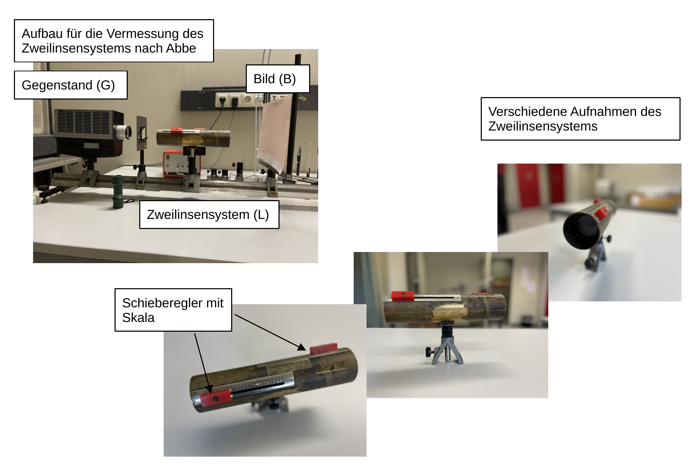

# Fakultät für Physik

## Physikalisches Praktikum P1 für Studierende der Physik

Versuch P1-141, 142, 143 (Stand: **Oktober 2024**)

[Raum F1-13](https://labs.physik.kit.edu/img/Klassische-Praktika/Lageplan_P1P2.png)

# Geometrische Optik

## Motivation

Mit diesem Versuch machen Sie sich mit den Grundlagen der [geometrischen Optik](https://de.wikipedia.org/wiki/Geometrische_Optik) für solche Fälle, in denen alle geometrischen Abmessungen groß gegen die Wellenlänge des Lichts sind, vertraut. Die Wellennatur des Lichts tritt daher nicht offen zu Tage und seine Ausbreitung kann mit Hilfe geradliniger Strahlen beschrieben werden. Die Erkenntnis, dass sich Licht geradlinig ausbreitet ist bereits durch [Euklid](https://de.wikipedia.org/wiki/Euklid) überliefert. Von [Claudius Ptolemäus](https://de.wikipedia.org/wiki/Claudius_Ptolem%C3%A4us) sind erste Formulierungen des Zusammenhangs zwischen Einfalls- und Brechungswinkel und eine Beschreibung der Lichtbrechung in der Atmosphäre bekannt. Beschränkt man sich in der geometrischen Optik auf rotationssymmetrische Systeme und Strahlen, die nahe und parallel oder unter nur kleinen Winkeln zur [optischen Achse](https://de.wikipedia.org/wiki/Optische_Achse_(Optik)) verlaufen, lassen sich geschlossene mathematische Abbildungsgleichungen angeben. Man bezeichnet diesen Bereich der Optik als [paraxiale Optik](https://de.wikipedia.org/wiki/Paraxiale_Optik).

Seit Jahrhunderten wenden Menschen die Gesetze der paraxialen Optik zum Bau technischer Hilfsmittel und Geräte, wie Brillen, Teleskope und Mikroskope an. Bis in die heutige Zeit spielen Linsen, Blenden, Spiegel und Filter, eine zentrale Rolle an vielen Stellen in Wissenschaft und Technik. Offensichtlich ist dies z.B. in der Laserphysik, Quantenoptik, oder Astronomie. Analoge Gesetzmäßigkeiten kommen aber auch bei der Untersuchung von Graviatationswellen oder in der Beschleunigerphysik zur Anwendung. Im [P1](https://labs.physik.kit.edu/64.php) können Sie die [Linsengleichung](https://de.wikipedia.org/wiki/Linsengleichung), als zentrales Element zur Messung der Lichtgeschwindigkeit nach der Drehspiegelmethode, beim Versuch "[Lichtgeschwindigkeit](https://gitlab.kit.edu/kit/etp-lehre/p1-praktikum/students/-/tree/main/Lichtgeschwindigkeit)" wiederfinden. 

## Lehrziele

Wir listen im Folgenden die wichtigsten **Lehrziele** auf, die wir Ihnen mit dem Versuch **Geometrische Optik** vermitteln möchten: 

- Sie lernen **Begriffe**, wie optische Achse, [Bild-](https://de.wikipedia.org/wiki/Bildweite), [Gegenstands-](https://de.wikipedia.org/wiki/Bildweite) und [Brennweite](https://de.wikipedia.org/wiki/Brennweite) und das Konzept der [Hauptebene](https://de.wikipedia.org/wiki/Hauptebene_(Optik)) im Experiment kennen. 
- Sie machen sich mit wichtigen **Gesetzen der paraxialen Optik**, wie der [Linsengleichung](https://de.wikipedia.org/wiki/Linsengleichung) oder der Gullstrand-Formel vertraut. 
- Sie wenden das [Bessel-](https://de.wikipedia.org/wiki/Bessel-Verfahren) und [Abbe-Verfahren](https://de.wikipedia.org/wiki/Abbe-Verfahren) an und üben sich in der sorgfältigen **Vermessung optischer Systeme**. 
- Sie untersuchen mit Hilfe des Bessel-Verfahrens [**Abbildungsfehler**](https://de.wikipedia.org/wiki/Abbildungsfehler), wie die sphärische und chromatische Abberation.
- Beim Bessel- und Abbe-Verfahren **übersetzen Sie mathematische Modelle in Messvorschriften**, aus denen Sie durch Messung wiederum Modellparameter bestimmen.
- Für die Datenanalyse bietet dieser Versuch eine gute Möglichkeit die erlernten Methoden zur Parameterschätzung und Fehlerabschätzung weiter einzuüben.  
- Sie haben die Möglichkeit selbst ein Mikroskop, Projektor oder Teleskop aufzubauen.

## Versuchsaufbau

Der Versuch umfasst zwei optische Bänke und eine Reihe optischer Bauelemente. Im Folgenden sind die verwendeten Aufbauten kurz beschrieben. Eine Auflistung der für Ihre Auswertung wichtigen Bauelemente und deren Eigenschaften finden Sie im [Datenblatt](https://gitlab.kit.edu/kit/etp-lehre/p1-praktikum/students/-/tree/main/Geometrische_Optik/Datenblatt.md) zum Versuch.

### Bestimmung der Brennweite $f$ einer einzelnen Linse

Die Gerätschaften, die Ihnen zur Bestimmung der Brennweite $f$ einer einzelnen Linse zur Verfügung stehen sind in **Abbildung 1** gezeigt:

---

**Abbildung 1**: (Gerätschaften, die Ihnen zur Bestimmung von $f$ zur Verfügung stehen)

---

Auf einer großen Führungsschiene (von etwa $2\,\mathrm{m}$ Länge) lassen sich zwischen einer Lichtquelle und einem Schirm S optische Bauelemente in verschiedenen Abständen montieren. Beim **Bessel-Verfahren** bewegen Sie die zu untersuchende Linse zur Bestimmung von $f$ zwischen einem ausgeleuchteten Diapositiv (als Gegenstand G) und S auf der Schiene hin und her, bis in zwei ausgezeichneten Positionen der Linse auf S jeweils ein scharfes Bild B entsteht. Aus dem Abstand $e$ dieser beiden Positionen und dem Abstand zwischen G und B lässt sich $f$ bestimmen. 

### Vermessung eines Zweilinsensystems $L$

Die wichtigsten Apparaturen zur Vermessung des Zweilinsensystems sind in **Abbildung 2** gezeigt:

---

**Abbildung 2**: (Apparaturen zur Vermessung des Zweilinsensystems)

---

In diesem Versuchsteil vermessen Sie ein in ein Messingrohr integriertes Zweilinsensystem L. Jede der darin verbauten Linsen lässt sich mit Hilfe der in der obigen Abbildung gezeigten roten Schieberegler innerhalb des Messingrohrs bewegen, so dass Sie den Abstand $d$, den die Linsen zueinander einnehmen verändern können. L kann mit Hilfe der Hauptebenen $H_{1}$ und $H_{2}$, und der Brennweite $f$ beschrieben werden. 

Mit Hilfe des **Abbe-Verfahrens** sollen Sie die Lagen von $H_{1}$ und $H_{2}$ relativ zu einem Bezugspunkt X auf dem Messingrohr, $f$ und die Brennweiten $f_{1}$ und $f_{2}$ der im Messingrohr verbauten einzelnen Linsen bestimmen. Dazu montieren Sie ein Diapositiv (G), L und S (mit Milimeterpapier) auf der großen Führungsschiene, verändern schrittweise den Abstand von G zu X, justieren S jeweils nach, so dass ein scharfes Bild B entsteht und bestimmen den Abbildungsmaßstab $\beta$. Durch einen geschickten Messvorgang lässt sich L auf diese Weise vollständig vermessen.  

### Aufbau optischer Instrumente

Eine auf eine kleine Führungsschiene mit Stativ montierte Irisblende, wie man Sie für den Bau eines Teleskops verwenden würde, ist in **Abbildung 3** gezeigt:

---

**Abbildung 3**: (Eine auf eine kleine Führungsschiene mit Stativ montierte Irisblende, wie man Sie für den Bau eines Teleskops verwenden würde)

---

Für diesen Versuchsteil können Sie auf einer kleinen Führungsschiene ein [Mikroskop](https://de.wikipedia.org/wiki/Mikroskop), [Projektor](https://de.wikipedia.org/wiki/Projektor), [Kepler-](https://de.wikipedia.org/wiki/Fernrohr#Kepler-Fernrohr) oder [Gallilei-Fernrohr](https://de.wikipedia.org/wiki/Fernrohr#Galilei-Fernrohr) nachbauen und einfache, qualitative Untersuchungen damit durchführen.

## Wichtige Hinweise zu den verwendeten Versuchsaufbauten

- Vermeiden Sie direkt in den Strahl der Glühlampe hinein zu blicken, da Sie sonst **Gefahr laufen geblendet zu werden**. 
- Bei allen Versuchen, bei denen beleuchtete Objekte abgebildet werden, müssen Sie die Justierung, einschließlich des Beleuchtungssystems, **sehr sorgfältig** vornehmen.

# Navigation

- [Geometrische_Optik.iypnb](https://gitlab.kit.edu/kit/etp-lehre/p1-praktikum/students/-/blob/main/Geometrische_Optik/Geometrische_Optik.ipynb): Aufgabenstellung und Vorlage fürs Protokoll.
- [Geometrische_Optik_Hinweise.ipynb](https://gitlab.kit.edu/kit/etp-lehre/p1-praktikum/students/-/blob/main/Geometrische_Optik/Geometrische_Optik_Hinweise.ipynb): Hinweise zu den Aufgaben.
- [Datenblatt.md](https://gitlab.kit.edu/kit/etp-lehre/p1-praktikum/students/-/blob/main/Geometrische_Optik/Datenblatt.md): Technische Details zu den Versuchsaufbauten.
- [doc](https://gitlab.kit.edu/kit/etp-lehre/p1-praktikum/students/-/tree/main/Geometrische_Optik/doc): Dokumente zur Vorbereitung auf den Versuch.
- [figures](https://gitlab.kit.edu/kit/etp-lehre/p1-praktikum/students/-/tree/main/Geometrische_Optik/figures): Bilder, die für die Dokumentation des Versuche verwendet wurden.
