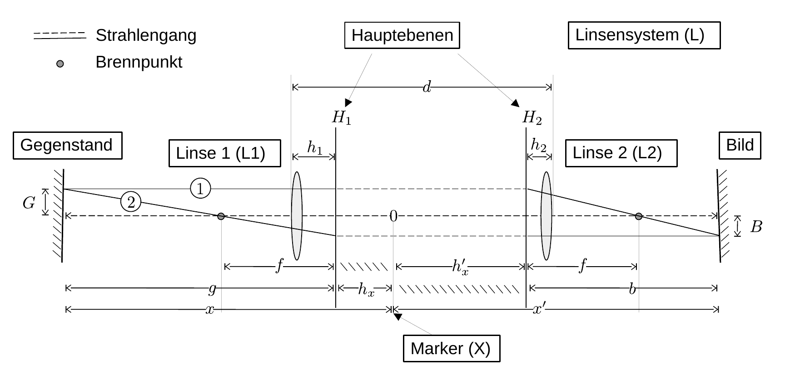

# Hinweise für den Versuch Geometrische Optik

## Strahlengang eines Zweilinsensystems

Der Strahlengang eines Systems L aus zwei Linsen L1 und L2 (mit den Brennweiten $f_{1}$ und $f_{2}$) ist in **Abbildung 1** gezeigt:

---

**Abbildung 1** (Strahlengang eines Systems L aus zwei Linsen L1 und L2)

---

Ein solches System kann wie eine einzige **dicke Linse L** mit den Hauptebenen $H_{1}$ und $H_{2}$ und der Brennweite $f$ behandelt werden. Alle für die weitere Diskussion relevanten Variablenbezeichnungen können **Abbildung 1** entnommen werden.

Für $f$ gilt die Formel von **[Allvar Gullstrand](https://de.wikipedia.org/wiki/Allvar_Gullstrand) (Gullstrand-Formel)**: 
$$
\begin{equation}
\frac{1}{f} = \frac{1}{f_{1}} + \frac{1}{f_{2}} - \frac{d}{f_{1}f_{2}},
\end{equation}
$$
wobei $d$ der Abstand zwischen L1 und L2 (gemessen von den jeweiligen Scheiteln von L1 und L2) ist. 

Die Konstruktion erfolgt dabei (unter Verwendung der Angaben aus **Abbildung 1**) wie folgt: 

- Strahl 1 verläuft, parallel zur optischen Achse, von G bis $H_{1}$ (obere durchgezogene Linie, links).

- Strahl 2 verläuft von G, durch den linken Brennpunkt von L, bis $H_{1}$ (untere durchgezogene Linie, links). 

- Von $H_{1}$ nach $H_{2}$ werden beide Strahlen parallel verschoben (gestrichelte Linien zwischen $H_{1}$ und $H_{2}$).

- Von $H_{2}$ aus wird Strahl 1 durch den rechten Brennpunkt von L und Strahl 2 parallel zur optischen Achse verlängert. Dort, wo die Strahlen 1 und 2 sich kreuzen entsteht B.  

- Für den Abbildungsmaßstab gilt die Beziehung: 
  

$$
\begin{equation}
\beta = \frac{B}{G} = \frac{b}{g}
\end{equation}
$$

Dies entspricht der **Konstruktion eines Bildes B für eine einzelne, dicke Linse** mit der Brennweite $f$.  

Sind $f_{1}$ und $f_{2}$ bekannt lassen sich die Lagen von $H_{1}$ und $H_{2}$ aus 

$$
\begin{equation}
h_{1} = -\frac{f\,d}{f_{1}}; \quad h_{2}=\frac{f\,d}{f_{2}}
\end{equation}
$$
berechnen, wobei $h_{1}$ und $h_{2}$ von den Scheiteln der Linsen aus zu messen sind. 

Für diesen Versuch sind $f_{1}$ und $f_{2}$ und damit auch die Lagen von $H_{1}$ und $H_{2}$ zunächst unbekannt. Die Größen $f,\ f_{1},\ f_{2}$, sowie die Lagen von $H_{1}$ und $H_{2}$ lassen sich jedoch mit Hilfe des [Abbe-Verfahrens](https://de.wikipedia.org/wiki/Abbe-Verfahren) ermitteln.

## Bestimmung von $H_{1},\ H_{2},\ f$

Wir beschreiben zunächst die Bestimmung von $f$, sowie der Lagen von $H_{1}\  (h_{x})$ und $H_{2}\ (h_{x}')$. 

Da die Lage von $H_{1}$ nicht als bekannt vorausgesetzt werden kann bestimmen wir den Abstand von G relativ zu einem **frei gewählten Bezugspunkt X** (Marker X in **Abbildung 1**), dessen Position auf der optischen Achse wir gleichzeitig als Nullpunkt unseres Koordinatensystems festlegen. In **Abbildung 1** haben wir X beliebig zwischen L1 und L2 gewählt. Für den Versuch empfiehlt es sich X zur Vereinfachung der Auswertung in der Mitte des Messingzylinders, exakt zwischen L1 und L2 zu wählen. Die Abstände von G und B zu X bezeichnen wir als

$$
\begin{equation}
\begin{split}
&\overline{\mathrm{GX}}:\quad x\hphantom{^{\prime}} = g+h_{x}, \\
&\overline{\mathrm{XB}}:\quad x' = b+h'_{x},
\end{split}
\end{equation}
$$
wobei $h_{x}$ und $h'_{x}$ die unbekannten Abstände von X zu $H_{1}$ bzw. $H_{2}$ bezeichnen (siehe **Abbildung 1**). Nach der Linsengleichung besteht zwischen $g,\ b,\ f$ die Beziehung: 

$$
\begin{equation}
\frac{1}{f} = \frac{1}{g} + \frac{1}{b}.
\end{equation}
$$
Mit dem Abbildungsmaßstab $\beta$ (siehe Gleichung **(2)**) lässt sich Gleichung **(5)** wie folgt umformen: 

$$
\begin{equation}
\begin{split}
&\frac{1}{f} = \frac{1}{g}\left(1+\frac{1}{\beta}\right); \qquad
\frac{1}{f} = \frac{1}{b}\left(\beta+1\vphantom{\frac{1}{\beta}}\right). \\
\end{split}
\end{equation}
$$
Unter Verwendung der Gleichungen **(4)** und **(6)** lässt sich somit der folgende funktionale Zusammenhang zwischen $x\ (x')$, $f$ und $h_{x}\ (h'_{x})$ herstellen: 

$$
\begin{equation}
\begin{split}
&x(\beta; f, h_{x}) = f\left(1+\frac{1}{\beta}\right)+h_{x}; \\
&\\
&x'(\beta; f, h_{x}') = f\left(\beta+1\vphantom{\frac{1}{\beta}}\right)+h'_{x}; \\
\end{split}
\end{equation}
$$

**Die Bestimmung von $f,\ h_{x},\ h_{x}'$ läuft nun wie folgt ab:** 

- **Variieren Sie den Abstand $x$.** Dabei variieren Sie effektiv $g$, während $h_{x}$ durch die feste Wahl von X immer gleich bleibt. Beachten Sie die Lage des Nullpunkts in X, demnach ist $x$ mit negativem und $x'$ mit positivem Vorzeichen zu messen.
- **Justieren Sie zu jedem gewählten Wert von $x$ den Abstand des Schirms $x'$, so dass B wieder scharf darauf abgebildet wird.** Beachten Sie die Unsicherheiten auf $x$ und $x'$.  
- **Bestimmen Sie den Abbildungsmaßstab $\beta$ zu jedem Wertepaar, bestehend aus $x$ und $x'$.** Berechnen Sie die Unsicherheiten auf $\beta$ in jedem Punkt aus den Unsicherheiten auf $G$ und $B$, mittels linearer Fehlerfortpflanzung. 

Zwar sind $g$ und $b$ nicht bekannt, $\beta$ kann aber aus $G$ und $B$ bestimmt werden. Dazu können Sie zwei mögliche Wege der Auswertung beschreiten: 

### Methode 1:

- Trägt man $x(\beta; f, h_{x})$ als Funktion von $(1+1/\beta)$ und/oder $x^\prime(\beta; f, h^\prime_{x})$ als Funktion von $(\beta+1)$ auf sollte sich jeweils ein **linearer Zusammenhang** ergeben, aus dem sich $f$ als Steigung und $h_{x}\ (h'_{x})$ als Achsenabschnitt ablesen lassen. 
- Durch **Anpassung zweier entsprechender Modelle nach Gleichung (7)** erhalten Sie jeweils einen Wert für $h_x$ und $h^\prime_x$ und zwei unabhängige Werte für $f$. 
- Die Werte für $f$ sollten innerhalb ihrer Unsicherheiten **übereinstimmen**.  

### Methode 2:

- Mit Hilfe der **`MultiFit`-Funktion aus dem Programm-Paket *kafe2* können Sie $f,\ h_{x},\ h_{x}^\prime$ gleichzeitig anpassen**. Sie nutzen dabei den Vorteil, dass beide Messreihen zur Bestimmung des gemeinsamen Parameters $f$ beitragen können. 
- Ein Beispiel für die Nutzung finden Sie in der offiziellen Dokumentation des Programmpakets *kafe2* [hier](https://kafe2.readthedocs.io/en/latest/parts/beginners_guide.html#multifit). Eine lauffähige Adaption mit weiteren Erklärungen finden im **`tools`-Verzeichnis des *students*-Repositories [hier](https://gitlab.kit.edu/kit/etp-lehre/p1-praktikum/students/-/blob/main/tools/kafe2_example_MultiFit.ipynb)**.
- Zur Implementierung eines geeigneten Objekts der `MultiFit`-Klasse sollten Sie, wie im oben verlinkten Beispiel beschrieben, zwei `XYFit`-Objekte zu den Modellen aus Gleichung **(7)** definieren. 

Sowohl $h_{x}$ als auch $h_x^{\prime}$ können sowohl positive als auch negative Werte annehmen, je nachdem ob sich die entsprechende Hauptebene links oder rechts von X befindet. Aus $h_{x}$ und $h_{x}^{\prime}$ lässt sich der Abstand der Hauptebenen 
$$
\begin{equation*}
a=h_x^\prime-h_x
\end{equation*}
$$
bestimmen, der von der Wahl von X unabhängig ist. **Die Angabe von $a$ ist Bestandteil der Aufgabenstellung!** Sie können $a$ auch direkt in Ihrem Modell implementieren, indem Sie z.B.  $h_x^\prime$ als $h_x^\prime=a+h_x$ ausdrücken. 

## Bestimmung von $f_{1},\ f_{2}$

Für diese Aufgabe nutzen Sie Gleichung **(1)**. Gehen Sie dabei wie folgt vor: 

- Tragen Sie die Kehrwerte der ermittelten Werte von $f$ als Funktion von $d$ auf. **Achten darauf die Unsicherheiten $\Delta f$ auf $\Delta(1/f)$ zu propagieren.** Diese sind dadurch nicht mehr normal verteilt!
- Passen Sie das **Modell einer Geraden** an, aus dem Sie $f_{1}$ und $f_{2}$ aus der Steigung und dem Achsenabschnitt bestimmen können. Bestimmen Sie die Unsicherheiten auf $f_{1}$ und $f_{2}$ mit Hilfe **linearer Fehlerfortpflanzung**. 
- Alternativ können Sie Gleichung **(1)** als Modell für die Anpassung verwenden und $f_{1}$ und $f_{2}$ mit entsprechenden Unsicherheiten direkt aus der Anpassung bestimmen. Eine Schwierigkeit dabei besteht darin, dass die Parameter, an denen Sie interessiert sind (die *parameters of interest*, POIs) als Kehrwerte und Kehrwert des Produkts in Gleichung **(1)** auftreten und die Gleichung zur Parameterabschätzung damit  **hochgradig nicht-linear in den POIs** ist.

## Essentials

Was Sie ab jetzt wissen sollten:

- **Abbildung 1** ist sicher eine Skizze, die Sie zum Verständnis in Reichweite Ihres Protokolls vorhalten sollten.
- Sie sollten **das "geniale Moment"** die Unkenntnis von $b,\ g$ durch die Kenntnis von $B/G$ zu ersetzen gut verstanden haben.
- Gleichung **(1)** sollte Ihnen geläufig sein. 
- Sie sollten die vielen **substantiellen Schwierigkeiten** bei der Bearbeitung dieser doch eher grundlegenden Fragestellungen erkannt haben.

## Testfragen

1. Auf welches sind Ihre **primären Messgrößen** für die Bestimmung von $H_{1},\ H_{2},\ f,\ f_{1},\ f_{2}$? Auf diese Größen müssen Sie selbst Unsicherheiten abschätzen. Für welche **abgeleiteten Größen** müssen Sie bei der gesamten Prozedur die abgeschätzten Unsicherheiten fortpflanzen?
1. Auf welche Unsicherheiten müssen Sie vermutlich am meisten achten, d.h. welche Messungen sollten **so akkurat wie nur irgend möglich durchführen**?
1. Wieviele Freiheitsgrade erwarten Sie für Ihre Anpassungen?
1. Beurteilen Sie die Anwendbarkeit einer $\chi^{2}$-Anpassung. Was wäre die Alternative? Können Sie ggf. experimentell etwas zu tun, um die Anwendbarkeit einer $\chi^{2}$-Anpassung besser rechtfertigen zu können.

# Navigation

 [Main](https://gitlab.kit.edu/kit/etp-lehre/p1-praktikum/students/-/tree/main/Geometrische_Optik)

