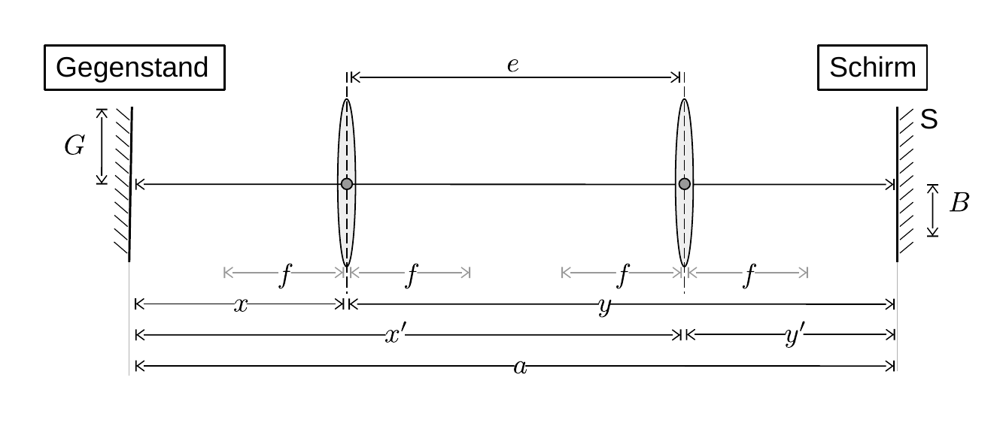

# Hinweise für den Versuch Geometrische Optik

## Grundbegriffe der paraxialen Optik

Die [paraxiale Optik](https://de.wikipedia.org/wiki/Paraxiale_Optik) beschäftigt sich mit rotationssymmetrischen optischen Systemen, v.a. Linsen und (Hohl-)Spiegeln, die von Lichtstrahlen, nahe der Symmetrieachse, durchlaufen werden. Für diesen Fall ist die Beschreibung der Abbildungseigenschaften mit Hilfe geschlossener analytischer Formeln möglich. Die Symmetrieachse heißt [**optische Achse**](https://de.wikipedia.org/wiki/Optische_Achse_(Optik)). 

Eines der wichtigsten optischen Systeme ist die **dünne [Sammellinse](https://de.wikipedia.org/wiki/Sammellinse)**. Zu ihrer Beschreibung dient die [**Hauptebene**](https://de.wikipedia.org/wiki/Hauptebene_(Optik)) $H$. Den Schnittpunkt der Hauptebene mit der optischen Achse bezeichnet man als **Hauptpunkt**. Wir verwenden im Folgenden $H$ synonym, sowohl für die Hauptebene als auch für den Hauptpunkt. 

Zueinander parallele und senkrecht zu $H$ einfallende Lichtstrahlen kreuzen sich im **Brennpunkt ([Fokus](https://de.wikipedia.org/wiki/Fokus))** der Linse. Die Ebene senkrecht zur optischen Achse im Brennpunkt heißt **Brennebene**. Als [**Brennweite**](https://de.wikipedia.org/wiki/Brennweite) $f$ bezeichnet man den Abstand zwischen Brennpunkt und $H$. Eine Linse bildet einen Gegenstand G (in der **Gegenstandsebene**) in ein Bild B (in der **Bildebene**) ab, wie in **Abbildung 1** dargestellt:

---

**Abbildung 1**: (Definition von ($f$) Brenn-, ($b$) Bild- und ($g$) Gegenstandsweite)

---

Wir verwenden G (B) sowohl für den Gegenstand (b.z.w. das Bild) selbst, als auch für dessen Größe. (Im letzteren Fall sind die Buchstaben kursiv gesetzt.) Der Abstand von G zu $H$ heißt [**Gegenstandsweite**](https://de.wikipedia.org/wiki/Gegenstandsweite) $g$, der Abstand von B zu $H$ heißt [**Bildweite**](https://de.wikipedia.org/wiki/Bildweite) $b$. Das Verhältnis 

$$
\begin{equation*}
\beta = \frac{B}{G}
\end{equation*}
$$
wird als [**Abbildungsmaßstab**](https://de.wikipedia.org/wiki/Abbildungsma%C3%9Fstab) bezeichnet. Die Beziehung zwischen $b$, $g$ und $f$ für ein scharfes Bild ist durch die **[Linsengleichung](https://de.wikipedia.org/wiki/Linsengleichung) (Abbildungsgleichung)**  

$$
\begin{equation}
\frac{1}{f} = \frac{1}{g} + \frac{1}{b}
\end{equation}
$$
gegeben.  In **Abbildung 1** wird der (reelle) Gegenstand G in ein umgekehrtes [reelles Bild](https://de.wikipedia.org/wiki/Reelles_Bild) B abgebildet. Da der Strahlengang umkehrbar ist, wird B, durch Reflexion, als reelles Bild auch in G zurück abgebildet!

## Bessel-Verfahren

Für die Bestimmung von $f$ nach dem [Bessel-Verfahren](https://de.wikipedia.org/wiki/Bessel-Verfahren) wird ein Schirm S in *hinreichend* großem Abstand $a$ von G entlang der optischen Achse der zu untersuchenden Linse so aufgestellt, dass ein reelles Bild auf S entstehen kann. Bewegt man die Linse entlang der optischen Achse zwischen G und S hin und her finden sich **zwei Positionen** von $H$, für die auf S ein scharfes (reelles) Bild B entsteht, wie in **Abbildung 2** dargestellt:

---

**Abbildung 2**: (Lage der Punkte in denen die Linse G scharf in B abbildet)

---

Dabei ist aufgrund der Umkehrbarkeit des Lichtstrahls $x'=y$ und $y'=x$. In einer Position von $H$ ist $B$ größer als $G$ in der anderen kleiner. Ein scharfes reelles Bild entsteht nur dann, wenn Gleichung **(1)** erfüllt ist (siehe **Abbildung 1**), was in beiden Positionen von $H$ erfüllt werden kann, wenn $x=g$, $y=b$ oder $x=b$, $y=g$. Wir drücken in Gleichung **(1)** $b$ und $g$ durch $x$ aus und lösen nach $x$ auf und erhalten:

$$
\begin{equation}
\begin{split}
&\frac{1}{f} = \frac{1}{x} + \frac{1}{a-x}; \qquad \frac{1}{f} = \frac{a}{x(a-x)}; \\
&\\
&\frac{a\,x-x^{2}}{a} = f; \qquad x^{2} - a\,x + a\,f = 0; \\
&x_{1/2} = \frac{a}{2}\pm\frac{\sqrt{a^{2}-4\,a\,f}}{2}
\end{split}
\end{equation}
$$
Wie aus Gleichung **(2)** ersichtlich, können sich zwei scharfe Bilder nur dann ergeben, wenn die Bedingung

$$
\begin{equation*}
a>4\,f
\end{equation*}
$$
erfüllt ist, womit die anfängliche Aussage *hinreichen* groß für die Wahl von $a$ konkretisiert wird. Aus **Abbildung 1** und Gleichung **(2)** wird deutlich, wie diese Bedingung zustande kommt und was eine geschickte Wahl für $a$ ist. Aus dem Abstand der beiden Punkte, in denen ein scharfes Bild auf S entsteht lässt sich $f$ wie folgt berechnen: 

$$
\begin{equation*}
\begin{split}
&e= \left|g - b\right| \\
&\hphantom{e}= \left|x_{1} - x_{2}\right| = \sqrt{a^{2}-4\,a\,f} \\
&\\
&f = \frac{a^{2}-e^{2}}{4\,a}
\end{split}
\end{equation*}
$$

## Essentials

Was Sie ab jetzt wissen sollten:

- Die **Begriffe der paraxialen Optik** sollten Ihnen geläufig sei.
- Sie sollten Gleichung **(1)** kennen und verstehen und **Abbildung 1** frei zeichnen können.
- Der **Ablauf des Bessel-Verfahrens** sollte Ihnen klar sein.

## Testfragen

1. Wie ist B relativ zu G orientiert?
1. Was passiert, wenn Sie $a$ zu groß wählen?
1. Was passiert für die Fälle $a=4\,f$ und $a<4\,f$?
1. Worin bestehen die größten Unsicherheiten in der Bestimmung von $f$ bei diesem Verfahren?

# Navigation

[Main](https://gitlab.kit.edu/kit/etp-lehre/p1-praktikum/students/-/tree/main/Geometrische_Optik)
