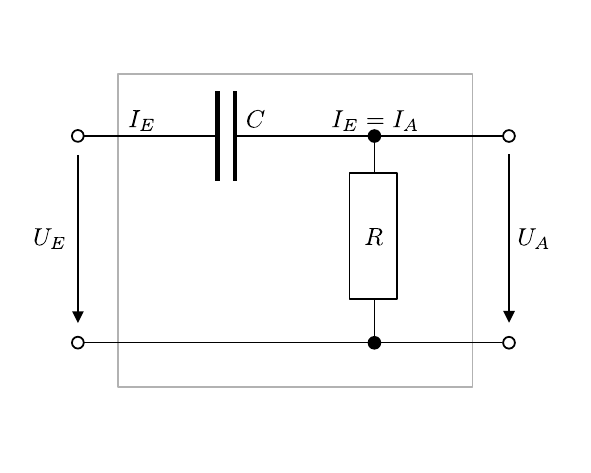

# Hinweise für den Versuch Netzwerke und Leitungen

## Hochpass und Differenzierglied

Der hier zu untersuchende **Hochpass** besteht aus einem Kondensator (mit der Kapazität $C$) mit einem in Reihe geschalteten (ohmschen) Widerstand $R$, wie in **Abbildung 1** gezeigt:

---



**Abbildung 1**: (Schaltplan eines Hochpass-Filters bestehend aus einem Kondensator mit der Kapazität $C$ und einem in Reihe geschalteten ohmschen Widerstand $R$)

---

$U_{A}$ wird nur über $R$ abgegriffen, formell handelt es sich bei dieser Schaltung um einen $RC$-Spannungsteiler. 

### Harmonisches Signal

Beim Anlegen einer harmonischen Wechselspannung  
$$
\begin{equation*}
U_{E}(t) = U_{E,0}\,e^{i\omega\,t}
\end{equation*}
$$
gilt nach den [Kirchhoffschen Regeln](https://de.wikipedia.org/wiki/Kirchhoffsche_Regeln):
$$
\begin{equation}
U_{E} = I_{E}\,R + \frac{I_{E}}{i\omega\,C};\qquad 
U_{A} = I_{A}\,R;\qquad I_{E}=I_{A}.
\end{equation}
$$
Für das Verhältnis von $U_{A}$ zu $U_{E}$ gilt:
$$
\begin{equation*}
\frac{U_{A}}{U_{E}} = \frac{R}{R+\frac{1}{i\omega\,C}}= \frac{1}{1+\frac{1}{i\omega\,C\,R}}.
\end{equation*}
$$
Von praktischer Relevanz sind:

Der **Spannungsübertrag**:
```math
\begin{equation*}
\mu \equiv \frac{\left|U_{A}\right|}{\left|U_{E}\right|} = \frac{1}{\sqrt{1+\frac{1}{\omega^{2}C^{2}R^{2}}}}.
\end{equation*}
```

Die **Phasendifferenz** zwischen Ein- und Ausgang:
```math
\begin{equation*}
\Delta\varphi \equiv \arctan\left(\frac{1}{\omega\,C\,R}\right).
\end{equation*}
```

Die Schaltung hat die folgenden Eigenschaften:

- Für hohe Frequenzen gilt $\mu\to 1$ (Signal geht **ungehindert** durch).

- Bei der [Grenzfrequenz](https://de.wikipedia.org/wiki/Grenzfrequenz)

  ```math
  \begin{equation*}
  \omega_{0}=\frac{1}{C\,R}
  \end{equation*}
  ```

  gilt $\mu=1/\sqrt{2}$ und $\Delta\varphi=\pi/4$. 

- Für $\omega\to0$ gilt $\mu\to 0$ und $\Delta\varphi\to\pi/2$ (Signal wird **unterdrückt**). 

### Nicht-harmonisches Signal

Für ein beliebiges, zeitlich veränderliches Signal und hinreichend kleine Werte von $R$ lassen sich die Gleichungen **(1)** wie folgt annähern:
$$
\begin{equation}
\frac{\mathrm{d}U_{E}}{\mathrm{d}t} \approx \frac{I_{E}}{C};\qquad U_{A} = I_{A}\,R;\qquad I_{E}=I_{A}=\frac{\mathrm{d}Q_{\mathrm{C}}}{\mathrm{d}t},
\end{equation}
$$
wobei $\mathrm{d}Q_{\mathrm{C}}$ der zeitlich veränderlichen Ladung am Kondensator entspricht. Diese Näherung entspricht dem **Lade- und Entladevorgang** des Kondensators unter Gleichstrom:
$$
\begin{equation*}
U_{A}(t)=C\,R\,\frac{\mathrm{d}U_{E}}{\mathrm{d}t}.
\end{equation*}
$$
Man bezeichnet den Hochpass in diesem Fall als **Differenzierglied**.

## Essentials

Was Sie ab jetzt wissen sollten:

- Schaltet man einen Kondensator und einen (ohmschen) Widerstand $R$ in Reihe und greift die über $R$ abfallende Spannung als $U_{A}$ ab, erhält man einen **Hochpass**.
- Für nicht harmonische Signals verhält sich diese Schaltung als **Differenzierglied**.

## Testfragen

1. Warum kommt im Vergleich zu den Gleichungen **(1)** in den Gleichungen **(2)** kein Faktor $i\omega$ vor?  

# Navigation

[Main](https://gitlab.kit.edu/kit/etp-lehre/p1-praktikum/students/-/tree/main/Vierpole_und_Leitungen)
