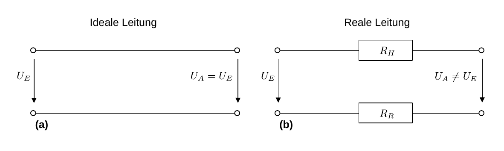
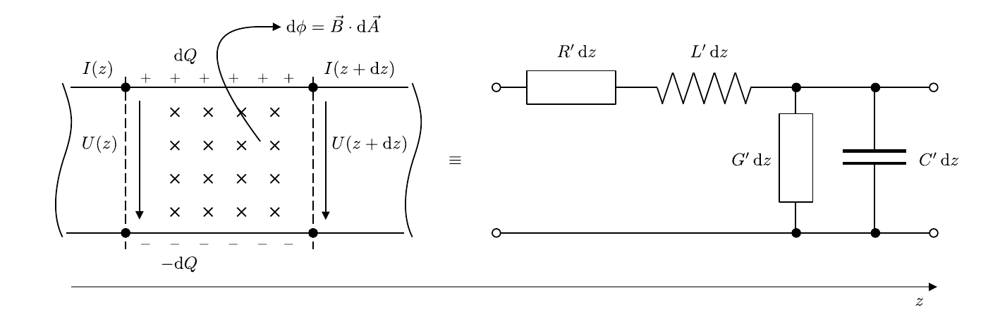
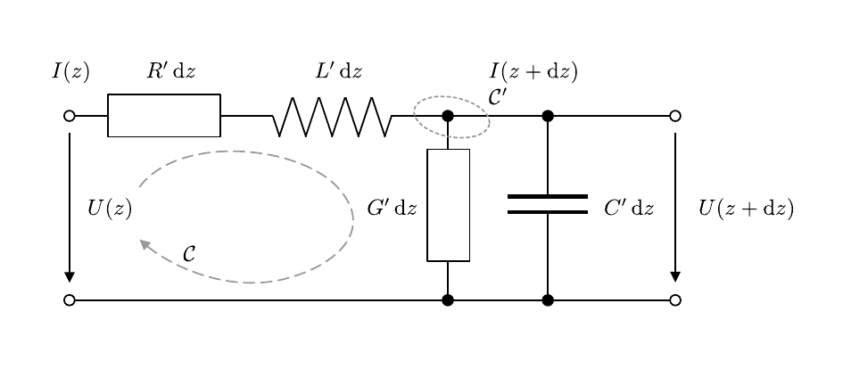

# Hinweise für den Versuch Netzwerke und Leitungen

## Signalübertragung in Leitungen

Signale können über Leitungen oder drahtlose Medien übertragen werden. Bei den Leitungen unterscheidet man zwischen **Wellen- und Stromleitern**. 

- **Wellenleiter** basieren (im Fall eines [Hohlleiters](https://de.wikipedia.org/wiki/Hohlleiter)) auf *einem* oder (im Fall eines [Lichtwellenleiters](https://de.wikipedia.org/wiki/Lichtwellenleiter)) auf *keinem* Leiter. Die Signalübertragung erfolgt über die Leitung elektromagnetischer Wellen. Die relevanten Messgrößen sind die elektrische und die magnetische Feldstärke. Die Beschreibung erfolgt mit Hilfe der [Maxwell-Gleichungen](https://de.wikipedia.org/wiki/Maxwell-Gleichungen). 
- **Stromleiter** basieren auf mindestens *zwei* getrennten Leitern, einem Hin- und einem Rückleiter, wie in **Abbildung 1** gezeigt. Die relevanten Messgrößen sind Ströme und Spannungen. Die Beschreibung erfolgt mit Hilfe der **[Leitungsgleichungen](https://de.wikipedia.org/wiki/Leitungsgleichung)**.  

---



**Abbildung 1**: (Ersatzschaltbild einer (a) idealen und (b) realen Leitung)

---

Die Leitung besteht i.a. aus einem gut leitenden Material, wie Kupfer oder Aluminium. Idealerweise fällt über die Leitung *keine* Spannung ab. In der Realität besitzen aber sowohl Hin-, als auch Rückleiter einem **(Innen-)Widerstand**. Zudem kann kapazitive Spannung über die endliche Isolation zwischen den Leitern abfallen. 

Beispiele für stromleitungsgebundene Signalübertragung sind:

- Alle Leitungen, mit denen Sie die Schaltungen im Praktikum stecken.
- Das Koaxialkabel, dessen Eigenschaften Sie in diesem Versuch u.a. untersuchen werden. 
- Telegraphen- und [transatlantische Telefonkabel](https://de.wikipedia.org/wiki/Transatlantisches_Telefonkabel).
- Die Kupfer [Doppelader](https://de.wikipedia.org/wiki/Doppelader) zur Übertragung von Telefon- und DSL-Signalen.
- [Streifenleitungen](https://de.wikipedia.org/wiki/Streifenleitung) auf Platinen, z.B. in Computern. 

Je nach Länge der Leitung und Periode oder Frequenz der übertragenen Signale unterscheidet man zwei Regime zur Beschreibung der Übertragung:

- Im Fall von **Gleichstrom** genügt die Beschreibung mit Hilfe des [spezifischen Widerstands](https://de.wikipedia.org/wiki/Spezifischer_Widerstand), Querschnitts und der Länge des Leiters, als **primäre Eigenschaften** der Leitung. 
- Im Fall von **Wechselspannung**, oder bei der Übertragung getakteter Signale erweist es sich als notwendig, die [Kapazität](https://de.wikipedia.org/wiki/Elektrische_Kapazit%C3%A4t) und [Induktivität](https://de.wikipedia.org/wiki/Induktivit%C3%A4t) der Leitung zusätzlich zu berücksichtigen. In diesem Fall erfolgt die Beschreibung der Signalübertragung durch die **Leitungsgleichungen**. Dies ist der Fall bei harmonischen Signalen deren Wellenlänge wesentlich kleiner als die Länge der Leitung ($\ell$) ist, und bei getakteten Signalen, deren Pulsdauer wesentlich kleiner, als die Signallaufzeit ist.  

**Beispiel**: Im Computer, den Sie gerade vor sich haben erfolgt die Signalübertragung mit einer Taktfrequenz im Bereich von $3\,\mathrm{GHz}$. Auf einer Kupferleitung breitet sich das elektrische Signal mit einer Geschwindigkeit von $\lesssim 0.9\hspace{0.05cm}c$ aus. Auf Längenskalen einer Leiterplatine ($\mathcal{O}(10\hspace{0.05cm}\mathrm{cm})$) ist die Anwendung der Leitungsgleichungen zur adäquaten Beschreibung der Signalübertragung daher bereits notwendig.   

## Ersatzschaltbild einer realen Leitung

Die Beschreibung einer **homogenen Leitung** erfolgt über ein infinitesimal kleines Leitungsstück, dessen Eigenschaften in ein Ersatzschaltbild, wie in **Abbildung 2** gezeigt, übertragen werden können: 

---



**Abbildung 2** (Ersatzschaltbild eines infinitesimalen, realen Leitungsstücks)

---

Eine reale Leitung besitzt einen endlichen Widerstand proportional zur Länge der Leitung, der daher zweckmäßigerweise differenziell als 
$$
\begin{equation*}
\mathrm{d}R=R'\hspace{0.05cm}\mathrm{d}z
\end{equation*}
$$
ausgedrückt wird. Durch den Stromfluss tritt zwischen Hin- und Rückleiter ein magnetischer Fluss 
$$
\begin{equation*}
\mathrm{d}\phi = \mathrm{d}\bigl(\vec{B}\cdot\vec{A}\bigr)
\end{equation*}
$$
auf, wobei $\vec{B}$ der Magnetfeldstärke und $\vec{A}$ der von $\vec{B}$ durchsetzten Fläche entsprechen. Die Leitung besitzt also auch eine (Längs-)Induktivität 
$$
\begin{equation*}
\mathrm{d}L=L'\,\mathrm{d}z,
\end{equation*}
$$
die ebenfalls proportional zur Länge der Leitung ist. Ähnliches gilt, aufgrund der getrennten Ladungen in Hin- und Rückleiter, für die (Quer-)Kapazität 
$$
\begin{equation*}
\mathrm{d}C=C'\,\mathrm{d}z.
\end{equation*}
$$
Schließlich ist die Isolation zwischen Hin- und Rückleiter nur endlich groß, was durch den (Isolations- oder Quer-)[Leitwert](https://de.wikipedia.org/wiki/Elektrischer_Leitwert) 
$$
\begin{equation*}
\mathrm{d}G=G'\,\mathrm{d}z
\end{equation*}
$$
ausgedrückt wird. Die gestrichenen Größen

- **[Widerstandsbelag](https://de.wikipedia.org/wiki/Leitungsbel%C3%A4ge#Widerstandsbelag_R')**

  ```math
  \begin{equation*}
  R' = \frac{\mathrm{d}R}{\mathrm{d}z}
  \end{equation*}
  ```

- **[Induktivitätsbelag](https://de.wikipedia.org/wiki/Leitungsbel%C3%A4ge#Induktivit%C3%A4tsbelag_L')**

  ```math
  \begin{equation*}
  L' = \frac{\mathrm{d}L}{\mathrm{d}z}
  \end{equation*}
  ```

- **[Kapazitätsbelag](https://de.wikipedia.org/wiki/Leitungsbel%C3%A4ge#Kapazit%C3%A4tsbelag_C')**

  ```math
  \begin{equation*}
  C' = \frac{\mathrm{d}C}{\mathrm{d}z}
  \end{equation*}
  ```

- **Leitwertbelag ([Ableitungsbelag](https://de.wikipedia.org/wiki/Leitungsbel%C3%A4ge#Ableitungsbelag_G'))**

  ```math
  \begin{equation*}
  G' = \frac{\mathrm{d}G}{\mathrm{d}z}
  \end{equation*}
  ```

fasst man als **[Leitungsbeläge](https://de.wikipedia.org/wiki/Leitungsbel%C3%A4ge)** zusammen und bezeichnet sie als **primäre Leitungsparameter**. Sind diese für eine endliche Leitung bekannt, kann das Verhalten eines über die Leitung übertragenen Signals bei allen Frequenzen exakt beschrieben werden. 

## Leitungsgleichungen

Um die Leitungsgleichungen abzuleiten wenden wir die [Kirchhoffschen Regeln](https://de.wikipedia.org/wiki/Kirchhoffsche_Regeln) auf das Ersatzschaltbild aus **Abbildung 2**, so wie in **Abbildung 3** gezeigt an:

---



**Abbildung 3**: (Skizze zur Herleitung der Leitungsgleichungen)

---

Zunächst folgen wir der durch $\mathcal{C}$ angedeuteten *Masche* und erhalten:
$$
\begin{equation*}
\begin{split}
&U(z) = R'\,\mathrm{d}z\,I(z) + L'\,\mathrm{d}z\frac{\mathrm{d}I}{\mathrm{d}t} + U(z+\mathrm{d}z); \\
&\\
&\frac{\mathrm{d}U}{\mathrm{d}z}(z) = -R'\,I(z) - L'\frac{\mathrm{d}I}{\mathrm{d}t}(z).
\end{split}
\end{equation*}
$$
Den Strom bestimmen wir aus dem durch $\mathcal{C}^{\prime}$ eingekreisten *Knoten* und erhalten:
$$
\begin{equation*}
\begin{split}
&I(z) = G'\,\mathrm{d}z\,U(z+\mathrm{d}z) + C'\,\mathrm{d}z\frac{\mathrm{d}U}{\mathrm{d}t}(z+\mathrm{d}z) + I(z+\mathrm{d}z); \\
&\\
&\frac{\mathrm{d}I}{\mathrm{d}z}(z) = -G'\,U(z) - C'\frac{\mathrm{d}U}{\mathrm{d}t}(z).
\end{split}
\end{equation*}
$$
Daraus ergeben sich zusammenfassend die **Leitungsgleichungen**:
$$
\begin{equation}
\begin{split}
&\frac{\partial U}{\partial z}(z, t) = -R'\,I(z, t) - L'\frac{\partial I}{\partial t}(z, t) \\
&\\
&\frac{\partial I}{\partial z}(z, t) = -G'\,U(z, t) - C'\frac{\partial U}{\partial t}(z, t).
\end{split}
\end{equation}
$$
Es handelt sich um zwei gekoppelte, partielle Differentialgleichungen erster Ordnung. Partiell wegen der Abhängigkeit von $z$ und $t$; gekoppelt, weil in der Differentialgleichung zur Bestimmung der Spannung $U$ die Stromstärke $I$ vorkommt und umgekehrt.  

### Harmonisches Signal

Wir lösen das Gleichungssystem **(1)** für ein stationäres harmonisches Signal:
$$
\begin{equation*}
U(z, t) = U(z)\,e^{-i\,\omega\,t}, \quad 
I(z, t) = I(z)\,e^{-i\,\omega\,t+\varphi}.
\end{equation*}
$$
Daraus ergeben sich die **komplexen Leitungsgleichungen**: 
$$
\begin{equation}
\begin{split}
&\frac{\mathrm{d} U}{\mathrm{d} z}(z) = -\left(R' + i\,\omega\,L'\right)\,I(z) \\
&\\
&\frac{\mathrm{d} I}{\mathrm{d} z}(z) = -\left(G' + i\,\omega\,C'\right)\,U(z).
\end{split}
\end{equation}
$$
Durch Differentiation der oberen und Einsetzen in die untere Gleichung lässt sich das Gleichungssystem entkoppeln und man erhält eine harmonische Schwingungsgleichung der Form: 
$$
\begin{equation}
\begin{split}
&\frac{\mathrm{d}^{2}U}{\mathrm{d}z^{2}} = -\left(R' + i\,\omega\,L'\right)\,\frac{\mathrm{d}I}{\mathrm{d}z} \\
&\hphantom{\frac{\mathrm{d}^{2}U}{\mathrm{d}z^{2}}} = \hphantom{-}\underbrace{\left(R' + i\,\omega\,L'\right)\,\left(G' + i\,\omega\,C'\right)}\,U(z). \\
&\hphantom{\frac{\mathrm{d}^{2}U}{\mathrm{d}z^{2}} = -\left(R' + i\,\omega\,\right)}\equiv\gamma^{2} \\
&\\
&\text{mit:}\\
&\\
&\gamma = \sqrt{\left(R' + i\,\omega\,L'\right)\,\left(G' + i\,\omega\,C'\right)}\equiv \alpha + i\beta.\\
\end{split}
\end{equation}
$$
Für die Ausbreitung eines harmonischen Signals in einer Leitung sind also die folgenden Größen (jeweils in der Einheit $\mathrm{m}^{-1}$) von Relevanz: 

- Die **Dämpfungskonstante** $\alpha$ beschreibt die Dämpfung des Signals entlang der Leitung in $z$. 
- Die **Phasenkonstante** $\beta$ beschreibt die Phasenverschiebung des Signals entlang der Leitung in $z$. 
- Die **[Ausbreitungskonstante](https://de.wikipedia.org/wiki/Fortpflanzungskonstante)** $\gamma$ fasst $\alpha$ und $\beta$ zu einer komplexwertigen Größe zusammen.

Die allgemeine Lösung von Gleichung **(3)** lautet: 
$$
\begin{equation*}
\begin{split}
&U(z) = \underbrace{U_{1}\,e^{-\gamma\,z}} + \underbrace{U_{2}\,e^{\gamma\,z}}.\\
&\hphantom{U(z) = U}\equiv U_{H} \hphantom{+ U}\equiv U_{R}\\
\end{split}
\end{equation*}
$$
Dabei identifizieren wir 

- $U_{H}$ mit einer **Spannungswelle** vom Sender zum Empfänger; und 
- $U_{R}$ mit einer Spannungswelle vom Empfänger zurück zum Sender. 

Im allgemeinen kann es also zu **Reflexionen** und Überlagerungen aus hin- und rücklaufenden Wellen kommen. In der Signalverarbeitung sind Überlagerungen mit $U_{R}$ i.a. unerwünscht.

Den Stromverlauf erhält man durch Einsetzen von 
$$
\begin{equation*}
\frac{\mathrm{d}U(z)}{\mathrm{d}z}
\end{equation*}
$$
in die obere Gleichung des Gleichungssystems **(2)**:
$$
\begin{equation*}
\begin{split}
&I(z) = \sqrt{\frac{G'+i\,\omega\,C'}{R'+i\,\omega\,L'}}\,\left(U_{1}\,e^{-\gamma\,z}-U_{2}\,e^{\gamma\,z}\right)\equiv\frac{U_{1}\,e^{-\gamma\,z}-U_{2}\,e^{\gamma\,z}}{Z_{0}}\\
&\\
&\text{mit:}\\
&\\
&Z_{0} \equiv \sqrt{\frac{R'+i\,\omega\,L'}{G'+i\,\omega\,C'}},
\end{split}
\end{equation*}
$$
wobei $Z_{0}$ (in der Einheit $\Omega$) als **[Leitungswellenwiderstand](https://de.wikipedia.org/wiki/Wellenwiderstand#Strom-_und_Spannungswellen_auf_Leitungen)**, oder auch als **charakteristische Impedanz** der Leitung bezeichnet wird. $Z_{0}$ hängt nicht von der Länge der Leitung, im allgemeinen aber von der Frequenz $\omega$ des übertragenen Signals ab. Bei den Frequenzen des verwendeten Trägersignals beträgt $Z_{0}$ 

- $50\hspace{0.05cm}\Omega$ in der Messtechnik; und 
- $75\hspace{0.05cm}\Omega$ in der Fernsehtechnik. 

Für den Spezialfall einer **idealen, verlustfreien Leitung** ist 
$$
\begin{equation}
Z_{0} = \sqrt{\frac{L'}{C'}}
\end{equation}
$$
**reellwertig und frequenzunabhängig**.

Die Ausbreitungskonstante und der Leitungswellenwiderstand werden auch als **sekundäre Leitungsparameter** bezeichnet.

## Reflexion in Leitungen

Das Amplitudenverhältnis aus hin- und rücklaufender Welle im Fall der Signalreflexion ist durch den **Reflexionsfaktor**
$$
\begin{equation*}
\rho=\frac{Z_{\mathrm{A}}-Z_{0}}{Z_{\mathrm{A}}+Z_{0}}
\end{equation*}
$$
gegeben, wobei $Z_{\mathrm{A}}$ die Impedanz des Abschlusswiderstands am Leitungsende bezeichnet. 

- Für die offene Leitung ($Z_{\mathrm{A}}\to\infty$ ) gilt $\rho=1$, das Signal wird also unverändert reflektiert. 
- Für die kurzgeschlossene Leitung ($Z_{\mathrm{A}}=0$ ) gilt $\rho=-1$, es erfolgt also ein Phasensprung des Signals um $\pi$ am Leitungsende. 

Je nach Dämpfungskonstante der Leitung kann es zu mehrfachen Reflexionen sowohl am Ende, als auch am Anfang der Leitung kommen, die ein Signal negativ beeinflussen. 

## Koaxialkabel

Das **[Koaxialkabel](https://de.wikipedia.org/wiki/Koaxialkabel)** ist ein typisches Beispiel für eine homogene Leitung zur stromleitungsgebundenen Signalübertragung. Es ist ein zweipoliges Kabel mit konzentrischem Aufbau, bestehend aus einem **Innenleiter** (meist aus Kupfer, auch *Seele* genannt), der in konstantem Abstand von einem hohlzylindrischen **Außenleiter** (ebenfalls aus Kupfer) umgeben ist. Üblicherweise wird das Signal über den Innenleiter übertragen, während der Außenleiter als geerdeter Rückleiter fungiert und den Innenleiter zusätzlich vor [Störstrahlung](https://de.wikipedia.org/wiki/Störausstrahlung_(EMV)) [abschirmt](https://de.wikipedia.org/wiki/Abschirmung_(Elektrotechnik)). Der Raum zwischen Innen- und Außenleiter wird durch ein [Dielektrikum](https://de.wikipedia.org/wiki/Dielektrikum) gefüllt, das anteilig oder vollständig aus Luft bestehen kann. Der Außenleiter ist nochmals durch einen robusten, isolierenden Mantel, z.B. aus PVC, vor der Umgebung geschützt.

Für die Bestimmung der Leitungseigenschaften werden $R'$ und $G'$ meist vernachlässigt. $L'$ und $C'$ hängen von der Geometrie des Kabels und der Wahl des Dielektrikums (meist Polyethylen, PE) ab. Es gilt: 
$$
\begin{equation}
L' = \frac{\mu\,\mu_{0}}{2\pi}\ln\left(\frac{d_{a}}{d_{i}}\right); \qquad
C' = \frac{2\pi\,\epsilon\,\epsilon_{0}}{\ln\left(\frac{d_{a}}{d_{i}}\right)}
\end{equation}
$$
wobei $\mu$ der [Permiabilität](https://de.wikipedia.org/wiki/Permeabilit%C3%A4t_(Magnetismus)) und $\epsilon$ der [Permittivität](https://de.wikipedia.org/wiki/Permittivit%C3%A4t) des Dielektrikums, $d_{i}$ dem Durchmesser des Innenleiters uns $d_{a}$ dem Innendurchmesser des Außenleiters entsprechen. Sowohl für Luft, als auch für viele Kunststoffe (wie PE) können Sie in sehr guter **Näherung $\mu=1$** annehmen.  

Für den **Wellenleitungswiderstand** gilt demnach: 
$$
\begin{equation}
Z_{0} = \sqrt{\frac{L'}{C'}}=\sqrt{\vphantom{\frac{L'}{C'}}\frac{\mu\,\mu_{0}}{4\pi^{2}\epsilon\,\epsilon_{0}}}\,\ln\left(\frac{d_{a}}{d_{i}}\right).
\end{equation}
$$
Er ist im Frequenzbereich von einigen $\mathrm{kHz}$ bis zu einigen $\mathrm{GHz}$ ($\omega\ll\omega_{0}$), in dem Koaxialkabel eingesetzt werden, weitestgehend frequenzunabhängig.  

## Essentials

Was Sie ab jetzt wissen sollten:

- Homogene Leitungen werden durch ihre **Leitungsbeläge**, als primäre Leitungsparameter, beschrieben. Die Anwendung der Kirchhoffschen Regeln führt auf die **Leitungsgleichungen**.
- Aus den primären Leitungsparametern lassen sich die **charakteristische Impedanz $Z_{0}$**, sowie die **Ausbreitungskonstante $\gamma$** als sekundäre Leitungsparameter ableiten.
- Die charakteristische Impedanz der idealen Leitung ist der charakteristischen Impedanz des $\pi$-Glieds sehr ähnlich, sie ist jedoch frequenzunabhängig.
- In Leitungen werden Signale als Wellen übertragen, die abhängig von den Randbedingungen der Übertragung reflektiert werden können. **Schließt man eine Leitung mit $Z_{A}=Z_{0}$ ab erfolgt die Übertragung reflexionsfrei**. 

## Testfragen

1. Was bedeutet die Unabhängigkeit von $Z_{0}$ von $\omega$ für ein Signal das durch eine ideale Leitung übertragen wird?
2. Was bedeuten $\alpha$ und $\beta$ anschaulich? Wie kann man sich also den Verlauf des Spannungssignals entlang einer idealen Leitung vorstellen?
3. Wie sieht der Übergang vom $\pi$-Glied, über die Drosselkette zur Leitung aus.

# Navigation

[Main](https://gitlab.kit.edu/kit/etp-lehre/p1-praktikum/students/-/tree/main/Vierpole_und_Leitungen)

