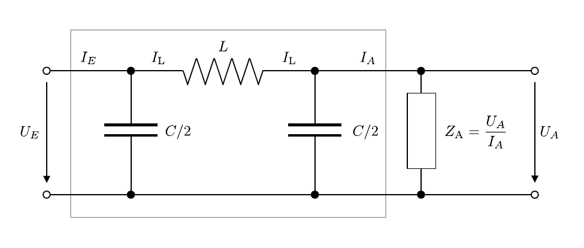

# Hinweise für den Versuch Netzwerke und Leitungen

## $\pi$-Glied

Beim $\pi$-Glied handelt es sich um einen Tiefpassfilter 2. Ordnung. Das $\pi$-Glied ist ein Grundbaustein der [Drosselkette](https://gitlab.kit.edu/kit/etp-lehre/p1-praktikum/students/-/blob/main/Netzwerke_und_Leitungen/doc/Hinweise-Drosselkette.md). Die Schaltung eines idealen (d.h. verlustfreien) $\pi$-Glieds ist in **Abbildung 1** gezeigt: 

---



**Abbildung 1**: (Schaltbild eines $\pi$-Glieds mit symmetrisch aufgeteilter Kapazität ($C$) links und rechts der Leitungsimpedanz ($L$). Auf der rechten Seite wird der Ausgang durch $Z_{A}$ abgeschlossen)

---

Das rechte Ende der Leitung wird durch
$$
\begin{equation*}
Z_{A}=\frac{U_{A}}{I_{A}}
\end{equation*}
$$
abgeschlossen. Für die Impedanzen der Leitungsbauteile gilt darüber hinaus: 
$$
\begin{equation}
\begin{split}
&Z_{L} = i\,\omega\,L; \\
&Z_{C} = \frac{2}{i\,\omega\,C}. \\
\end{split}
\end{equation}
$$
Beachten Sie den außergewöhnlichen Faktor 2 in der Definition von $Z_{C}$, der sich aus der Aufteilung von $C$ auf zwei symmetrische Kondensatoren ergibt. 

### Berechnung des Netzwerks mit Hilfe der Kirchhoffschen Regeln

Aus den [Kirchhoffschen Regeln](https://de.wikipedia.org/wiki/Kirchhoffsche_Regeln) folgt für diese Schaltung:

- Aus dem **Knoten links der Induktivität**: 
  ```math
  \begin{equation*}
  I_{E} = \frac{U_{E}}{Z_{C}}+I_{L}
  \end{equation*}
  ```

- Aus dem **Knoten rechts der Induktivität**:
  ```math
  \begin{equation*}
  I_{\mathrm{L}} = \frac{U_{A}}{Z_{C}}+I_{A}
  \end{equation*}
  ```

- Aus der **Schleife um $Z_{\mathrm{A}}$**:
  ```math
  \begin{equation*}
  U_{E} = Z_{L}\,I_{L}+U_{A} 
  \end{equation*}
  ```

Durch Einsetzen lässt sich hieraus der Zusammenhang zwischen Ein- $(U_{E},\ I_{E})$ und Ausgangssignal $(U_{A},\ I_{A})$ herstellen: 
$$
\begin{equation}
\begin{split}
U_{E} &= Z_{L}\left(\frac{U_{A}}{Z_{C}}+I_{A}\right)+U_{A} \\
&= \left(\frac{Z_{L}}{Z_{C}}+1\right) U_{A} +Z_{L}\,I_{A};\\
&\\
&\\
I_{E} &= \left(\frac{Z_{L}}{Z_{C}}+1\right)I_{L} + \frac{U_{A}}{Z_{C}} = \left(\frac{Z_{L}}{Z_{C}}+1\right)\left(\frac{U_{A}}{Z_{C}}+I_{A}\right) + \frac{U_{A}}{Z_{C}}\\
&=\frac{1}{Z_{C}}\left(\frac{Z_{L}}{Z_{C}}+2\right)U_{A} + \left(\frac{Z_{L}}{Z_{C}}+1\right)I_{A},\\
\end{split}
\end{equation}
$$
woraus sich
$$
\begin{equation*}
Z_{E} = \frac{U_{E}}{Z_{E}} = \frac{\left(\frac{Z_{L}}{Z_{C}}+1\right)Z_{A} + Z_{L}}{\frac{Z_{A}}{Z_{C}}\left(\frac{Z_{L}}{Z_{C}}+2\right)+\left(\frac{Z_{L}}{Z_{C}}+1\right)}
\end{equation*}
$$
bestimmen lässt. Wir interessieren uns für den Spezialfall $Z_{A}=Z_{E}$, wofür sich bei bekannter Eingangslast ($Z_{E}=Z_{A}$) beliebig viele $\pi$-Glieder hintereinander schalten lassen. Hierzu machen wir die Ersetzung 
$$
\begin{equation*}
Z_{E} =Z_{A}\equiv Z_{0}
\end{equation*}
$$
in Gleichung **(2)**, die auf den folgenden deutlich einfacheren Zusammenhang führt:
$$
\begin{equation*}
\begin{split}
&Z_{0} = \frac{\left(\frac{Z_{L}}{Z_{C}}+1\right)Z_{0} + Z_{L}}{\frac{Z_{0}}{Z_{C}}\left(\frac{Z_{L}}{Z_{C}}+2\right)+\left(\frac{Z_{L}}{Z_{C}}+1\right)};\\
&\\
&Z_{0}\left(\frac{Z_{0}}{Z_{C}}\left(\frac{Z_{L}}{Z_{C}}+2\right)+\left(\frac{Z_{L}}{Z_{C}}+1\right)\right) = 
\left(\frac{Z_{L}}{Z_{C}}+1\right)Z_{0} + Z_{L}; \\
&\\
&\\
&Z_{0}^{2} = \frac{Z_{L}\,Z_{C}}{\frac{Z_{L}}{Z_{C}}+2}. \\
\end{split}
\end{equation*}
$$
Unter Verwendung der Gleichungen **(1)** lässt sich dieser Ausdruck noch weiter vereinfachen:
$$
\begin{equation}
\begin{split}
&Z_{L} = i\,\omega\,L; \qquad Z_{C} = \frac{2}{i\,\omega\,C}; \\
&\\
&Z_{0}^{2} = \frac{L/C}{2-\omega^{2}\frac{L\,C}{2}} 
= \frac{L/C}{2+\omega^{2}/\omega_{0}^{2}}; \\
&\\
&\\
&Z_{0}=\frac{\sqrt{\frac{L}{C}}}{\sqrt{1-\left(\frac{\omega}{\omega_{0}}\right)^{2}}} \qquad \text{mit:}\quad\omega_{0}=\frac{2}{\sqrt{L\,C}}.\\
\end{split}
\end{equation}
$$

- Man bezeichnet $Z_{0}$ als **charakteristische Impedanz** der Schaltung. Der Zähler erinnert an die charakteristische Impedanz einer idealen Leitung (siehe Gleichung **(4)** [hier](https://gitlab.kit.edu/kit/etp-lehre/p1-praktikum/students/-/blob/main/Vierpole_und_Leitungen/doc/Hinweise-Leitungen.md)). 
- $\omega_{0}$ wird auch als **Grenzfrequenz** bezeichnet.

### Vierpol und Transfermatrix

Unter Verwendung von $Z_{0}$ lassen sich die Gleichungen **(2)** wie folgt umformen: 
$$
\begin{equation}
\begin{split}
U_{E} &= \left(\frac{Z_{\mathrm{L}}}{Z_{\mathrm{C}}}+1\right)U_{A}+Z_{\mathrm{L}}\,I_{A};\\
&\\
&\\
I_{E} &=\frac{Z_{\mathrm{L}}}{Z_{0}^{2}}\,U_{A} + \left(\frac{Z_{\mathrm{L}}}{Z_{\mathrm{C}}}+1\right)I_{A}.\\
\end{split}
\end{equation}
$$
Um diesen Schritt nachzuvollziehen bietet es sich an $Z_{0}$ wieder, unter Verwendung der Gleichungen **(1)**, nach $Z_{\mathrm{L}}$ und $Z_{\mathrm{C}}$ auszudrücken:
$$
\begin{equation*}
\begin{split}
&Z_{0}=\frac{\sqrt{\vphantom{\frac{Z_{\mathrm{L}}}{Z_{\mathrm{C}}}}Z_{\mathrm{L}}\,Z_{\mathrm{C}}}}{\sqrt{2+\frac{Z_{\mathrm{L}}}{Z_{\mathrm{C}}}}}\\
\end{split}
\end{equation*}
$$
In Matrixschreibweise gehen die Gleichungen **(4)** in die folgende Form über
$$
\begin{equation}
\begin{split}
&\left(\begin{array}{c}\vphantom{\frac{Z_{\mathrm{L}}}{Z_{\mathrm{C}}}}U_{E}\\\vphantom{\frac{Z_{\mathrm{L}}}{Z_{\mathrm{C}}}}Z_{0}\,I_{E}\end{array}\right) = 
\underbrace{\left(\begin{array}{cc}\frac{Z_{\mathrm{L}}}{Z_{\mathrm{C}}}+1 & \frac{Z_{\mathrm{L}}}{Z_{0}}\\ \frac{Z_{\mathrm{L}}}{Z_{0}} & \frac{Z_{\mathrm{L}}}{Z_{\mathrm{C}}}+1\end{array}\right)}\cdot 
\left(\begin{array}{c}\vphantom{\frac{Z_{\mathrm{L}}}{Z_{\mathrm{C}}}}U_{A}\\\vphantom{\frac{Z_{\mathrm{L}}}{Z_{\mathrm{C}}}}Z_{0}\,I_{A}\end{array}\right)\\
&\hphantom{Z_{L}+1+1+1+1}\equiv\mathcal{T}\\
&\\
&\left(\begin{array}{c}\vphantom{\frac{Z_{\mathrm{L}}}{Z_{\mathrm{C}}}}U_{A}\\\vphantom{\frac{Z_{\mathrm{L}}}{Z_{\mathrm{C}}}}Z_{0}\,I_{A}\end{array}\right) = 
\underbrace{\left(\begin{array}{cc}\frac{Z_{\mathrm{L}}}{Z_{\mathrm{C}}}+1 & -\frac{Z_{\mathrm{L}}}{Z_{0}}\\ -\frac{Z_{\mathrm{L}}}{Z_{0}} & \frac{Z_{\mathrm{L}}}{Z_{\mathrm{C}}}+1\end{array}\right)}\cdot 
\left(\begin{array}{c}\vphantom{\frac{Z_{\mathrm{L}}}{Z_{\mathrm{C}}}}U_{E}\\\vphantom{\frac{Z_{\mathrm{L}}}{Z_{\mathrm{C}}}}Z_{0}\,I_{E}\end{array}\right)\\
&\hphantom{Z_{L}+1+1+1+1}\equiv\mathcal{T}^{-1}\\
\end{split}
\end{equation}
$$
über, in der die Matrix 
$$
\begin{equation}
\begin{split}
&\mathcal{T} \equiv \left(\begin{array}{cc}
\hphantom{-}\cosh\gamma & 
-\sinh\gamma \\ 
-\sinh\gamma & \hphantom{-}\cosh\gamma
\end{array}\right)\\
&\\
&\text{mit:}\\
&\\
&\frac{Z_{\mathrm{L}}}{Z_{\mathrm{C}}}+1\equiv\cosh\gamma;\qquad
\frac{Z_{\mathrm{L}}}{Z_{0}}\equiv\sinh\gamma\\
\end{split}
\end{equation}
$$
den Übergang
$$
\begin{equation*}
\left(\begin{array}{c}\vphantom{\frac{Z_{\mathrm{L}}}{Z_{\mathrm{C}}}}U_{E}\\\vphantom{\frac{Z_{\mathrm{L}}}{Z_{\mathrm{C}}}}Z_{0}\,I_{E}\end{array}\right) \longrightarrow 
\left(\begin{array}{c}\vphantom{\frac{Z_{\mathrm{L}}}{Z_{\mathrm{C}}}}U_{A}\\\vphantom{\frac{Z_{\mathrm{L}}}{Z_{\mathrm{C}}}}Z_{0}\,I_{A}\end{array}\right).
\end{equation*}
$$
beschreibt. Die komplexwertige Größe $\gamma=\alpha+i\beta$ kann mit der **Ausbreitungskonstanten** identifiziert werden. 

Am Beispiel der Matrixmultiplikation mit $\mathcal{T}$ in den Gleichungen **(5)** werden die Grundlagen der linearen [Vierpol-Theorie](https://de.wikipedia.org/wiki/Zweitor) besonders anschaulich:

- Der Vierpol des $\pi$-Glieds besitzt zwei Ein- und zwei Ausgangspole. Dazwischen befindet sich die Schaltung, deren genaues Aussehen, bei Kenntnis von $\mathcal{T}$, als Blackbox angesehen werden kann. 
- $\mathcal{T}$ definiert den Transfer vom Ein- zum Ausgang der Schaltung. 
- Über ihre Ein- und Ausgänge können beliebig viele Vierpole miteinander verknüpft werden. 
- Mathematisch erfolgt diese Verknüpfung durch die Multiplikation entsprechender Transfermatrizen. 

Für $\omega\to\omega_{0}$ nimmt $\mathcal{T}$ die Form
$$
\begin{equation*}
\left(\begin{array}{cc}
\hphantom{-}\cosh\gamma & 
-\sinh\gamma\\ -\sinh\gamma & \hphantom{-}\cosh\gamma\end{array}\right)
\xrightarrow{\omega\to\omega_{0}}
\left(\begin{array}{cc}
-1 & \hphantom{-}0 \\ 
\hphantom{-}0 & -1\end{array}\right)
\end{equation*}
$$
an, das Ausgangssignal weist gegenüber dem Eingangssignal also eine Phasenverschiebung um $\pi$ auf.

## Essentials

Was Sie ab jetzt wissen sollten:

- Mit dem $\pi$-Glied haben Sie ein nicht-triviales aber immer noch relativ einfaches **Netzwerk** kennengelernt, das man mit Hilfe der **Kirchhoffschen Regeln** berechnen kann. Selbst bei solch einfachen Netzwerken können diese Berechnungen schnell relativ komplex werden.
- Schließt man das $\pi$-Glied mit der **charakteristischen Impedanz $Z_{0}$** ab, vereinfachen sich die resultierenden Gleichungen. Insbesondere weisst die Eigenschaft $Z_{E}=Z_{A}=Z_{0}$ darauf hin, dass man beliebig viele $\pi$-Glieder (als Vierpole) hintereinander schalten kann, ohne dass sich die charakteristischen Eigenschaften der entstehenden Schaltung wesentlich ändern. 
- Mit der Einführung der **Transformationsmatrix $\mathcal{T}$** haben Sie den Übergang von der "nackten" Netzwerkberechnung nach Kirchhoff zur linearen Vierpol-Theorie gesehen.

## Testfragen

1. Erkennen Sie in **Abbildung 1** die Knoten und Schleifen, auf denen die Kirchhoffschen Regeln basieren, die die Grundlage für die Gleichungen **(2)** darstellen?
2. Was sind die Unterschiede zwischen der charakteristischen Impedanz einer idealen Leitung (siehe Gleichung **(4)** [hier](https://gitlab.kit.edu/kit/etp-lehre/p1-praktikum/students/-/blob/main/Vierpole_und_Leitungen/doc/Hinweise-Leitungen.md)) und der charakteristischen Impedanz des $\pi$-Glieds aus Gleichung **(3)**. 

# Navigation

[Main](https://gitlab.kit.edu/kit/etp-lehre/p1-praktikum/students/-/tree/main/Vierpole_und_Leitungen)
