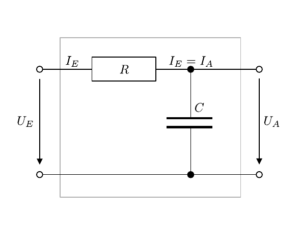

# Hinweise für den Versuch Netzwerke und Leitungen

## Tiefpass und Integrierglied

Im Vergleich zum [Hochpass](https://gitlab.kit.edu/kit/etp-lehre/p1-praktikum/students/-/blob/main/Vierpole_und_Leitungen/doc/Hinweise-Hochpass.md) sind für den hier zu untersuchenden **Tiefpass** die Rollen und Reihenfolge von Kondensator (mit der Kapazität $C$) und (ohmschem) Widerstand $R$ vertauscht, wie in **Abbildung 1** gezeigt:

---

**Abbildung 1**: (Schaltplan eines Tiefpass-Filters bestehend aus einem Kondensator mit der Kapazität $C$ und einem in Reihe geschalteten ohmschen Widerstand $R$)

---

### Harmonisches Signal

Aus den [Kirchhoffschen Regeln](https://de.wikipedia.org/wiki/Kirchhoffsche_Regeln) ergibt sich für diese Schaltung:
$$
\begin{equation}
U_{E} = I_{E}\,R + \frac{I_{E}}{i\omega\,C};\qquad U_{A} = \frac{I_{A}}{i\omega\,C};\qquad I_{E}=I_{A}.
\end{equation}
$$
Für das Verhältnis von $U_{A}$ zu $U_{E}$ gilt: 
$$
\begin{equation*}
\frac{U_{A}}{U_{E}} = \frac{\frac{1}{i\omega\,C}}{R+\frac{1}{i\omega\,C}} = \frac{1}{i\omega\,C\,R+1}.
\end{equation*}
$$
Für $\mu$ und $\Delta\varphi$ ergibt sich:
$$
\begin{equation*}
\begin{split}
&\mu=\frac{\left|U_{A}\right|}{\left|U_{E}\right|} = \frac{1}{\sqrt{\omega^{2}C^{2}R^{2}+1}};\\
&\\
&\Delta\varphi = -\arctan\left(\vphantom{\frac{1}{\omega\,C\,R}}\omega\,C\,R\right).
\end{split}
\end{equation*}
$$
In diesem Fall kehren sich die Verhältnisse relativ zum Hochpass um: 

- Für $\omega\to0$ gilt $\mu\to1$ (Signal wird **unterdrückt**). 
- Bei der Grenzfrequenz $\omega_{0}$ nehmen $\mu$ und $\Delta\varphi$ die gleichen Werte wie im Fall des Hochpass-Filters an. 
- Für hohe Frequenzen gilt $\mu\to0$ und $\Delta\varphi\to-\pi/2$ (Signal geht **ungehindert** durch).

### Nicht-harmonisches Signal

Für ein beliebiges, zeitlich veränderliches Signal und hinreichend große Werte von $C$ lassen sich die Gleichungen **(1)** wie folgt annähern:
$$
\begin{equation}
U_{E}\approx I_{E}\,R ;\qquad U_{A} = \frac{1}{C}\int I_{A}\,\mathrm{d}t;\qquad I_{E}=I_{A}.
\end{equation}
$$
Die Spannung $U_{A}$ ergibt sich aus der Ladungsänderung $I_{A}\ \mathrm{d}t$ am Kondensator. In diesem Fall ist
$$
\begin{equation*}
U_{A}(t)=\frac{1}{C\,R}\,\int U_{E}(t)\,\mathrm{d}t.
\end{equation*}
$$
Man bezeichnet den Tiefpass dann als **Integrierglied**. 

## Essentials

Was Sie ab jetzt wissen sollten:

- Schaltet man einen Kondensator und einen (ohmschen) Widerstand $R$ in Reihe und greift die über $C$ abfallende Spannung als $U_{A}$ ab, erhält man einen **Tiefpass**.
- Für nicht harmonische Signale verhält sich diese Schaltung als **Integrierglied**.

## Testfragen

1. Warum kommt im Vergleich zu den Gleichungen **(1)** in den Gleichungen **(2)** kein Faktor $i\omega$ vor?  

# Navigation

[Main](https://gitlab.kit.edu/kit/etp-lehre/p1-praktikum/students/-/tree/main/Vierpole_und_Leitungen)
