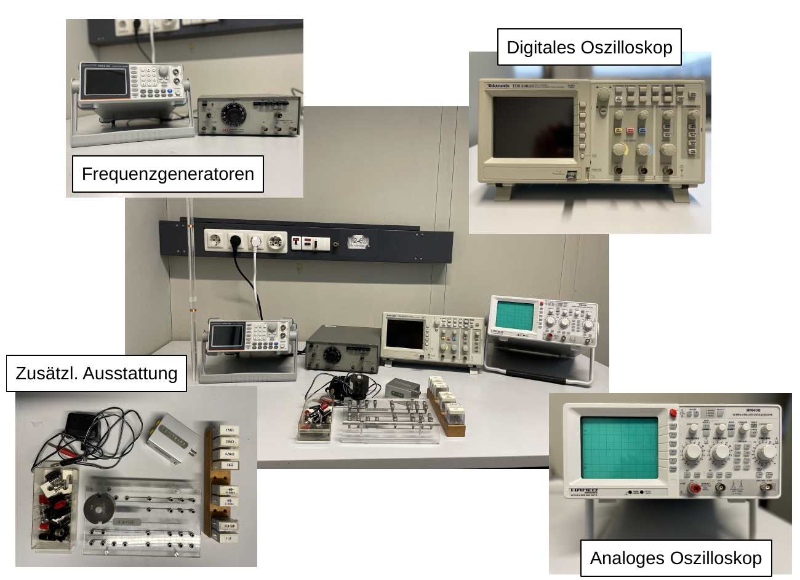

# Fakultät für Physik

## Physikalisches Praktikum P1 für Studierende der Physik

Versuch P1-31, 32, 33 (Stand: August 2024)

[Raum F1-29](https://labs.physik.kit.edu/img/Praktikum/Lageplan_P1.png)

# Oszilloskop

## Motivation

Das [Oszilloskop](https://de.wikipedia.org/wiki/Oszilloskop)zählt zu den wichtigsten Werkzeugen zur Visualisierung physikalischer Prozesse in Form von veränderlichen, elektrischen Signalen. Ein *analoges* Oszilloskop besteht aus einer [Kathodenstrahlröhre](https://de.wikipedia.org/wiki/Kathodenstrahlr%C3%B6hre) mit zwei senkrecht zueinander positionierten Paaren von Kondensatorplatten, zur elektrischen Ablenkung eines erzeugten Elektronenstrahls. Dieser wird schließlich auf einem phosphoreszierenden Bildschirm sichtbar gemacht. Heutzutage werden Oszilloskope bis auf wenige Nischenanwendungen digital betrieben, bis hin zu Oszilloskopen, die über eine USB-Schnittstelle angesteuert und ausgelesen werden und über keinen eigenen Bildschirm mehr verfügen. Sie sind daher auf den ersten Blick gar nicht mehr als Oszilloskope zu erkennen. In ihrer Funktionsweise unterscheiden sich digitale und analoge Oszilloskope erheblich, was zur Folge hat, dass eine Bauart gegenüber der anderen jeweils Stärken und Schwächen aufweist. **Die Grundeigenschaften eines Oszilloskops sind jedoch immer und über all gleich!** Als angehende Physiker:innen sollten Sie in der Lage sein ein Oszilloskop zu bedienen.  

## Lehrziele

Wir listen im Folgenden die wichtigsten **Lehrziele** auf, die wir Ihnen mit dem Versuch **Oszilloskop** vermitteln möchten: 

- Sie führen eine Reihe einfacher Messungen mit Oszilloskopen durch, im Rahmen derer Sie die **Bedienung** von Oszilloskopen einüben. 
- Sie verinnerlichen dabei die **Grundeigenschaften** eines Oszilloskops. 
- Sie machen sich im Rahmen der Vorbereitung auf den Versuch die, trotz identischer Grundeigenschaften, grundsätzlich verschiedenen Funktionsweisen analoger und digitaler Oszilloskope bewusst. 

## Versuchsaufbau

Ein typischer Aufbau für den Versuch **Oszilloskop** ist in **Abbildung 1** gezeigt:

---

**Abbldung 1**: (Ein typischer Aufbau für den Versuch **Oszilloskop**)

---

Die über weite Teile des Versuchs verwendeten Signale werden mit Hilfe von Frequenzgeneratoren erzeugt. Mit Hilfe eines Steckbretts, und verschiedener elektrischer Bauelemente bauen Sie einfache Schaltungen auf, die Sie mit einem digitalen oder analogen Oszilloskop untersuchen. Zu den Bauteilen zählen Widerstände, Kondensatoren, Spulen, eine Silizium [Diode](https://de.wikipedia.org/wiki/Diode) und eine [Z-Diode](https://de.wikipedia.org/wiki/Z-Diode).

Eine Auflistung der für Ihre Auswertung wichtigsten Apparaturen und deren Eigenschaften finden Sie im [Datenblatt.md](https://gitlab.kit.edu/kit/etp-lehre/p1-praktikum/students/-/tree/main/Oszilloskop/Datenblatt.md) zum Versuch.

## Wichtige Hinweise zum Versuch

- Oszilloskope kommen in verschiedener Gestalt, z.B. in den folgenden weiteren Versuchen des P1 vor: 
  - [Ferromagnetische Hysterese](https://gitlab.kit.edu/kit/etp-lehre/p1-praktikum/students/-/tree/main/Ferromagnetische_Hysterese): Hier sind Oszilloskope u.a. im XY-Betrieb in Verwendung. 
  - [Lichtgeschwindigkeit](https://gitlab.kit.edu/kit/etp-lehre/p1-praktikum/students/-/tree/main/Lichtgeschwindigkeit): Hier verwenden Sie Oszilloskope, sowohl im Zweikanal- als auch im XY-Betrieb. 
  - [Vierpole und Leitungen](https://gitlab.kit.edu/kit/etp-lehre/p1-praktikum/students/-/tree/main/Vierpole_und_Leitungen): Aus diesem Versuch sind einige einfache Schaltungen, wie das Differenzier- und Integrierglied, sowie der Phasenschieber aus **Aufgabe 2** entlehnt. 
  - [Spezifische Ladung des Elektrons](https://gitlab.kit.edu/kit/etp-lehre/p1-praktikum/students/-/tree/main/Spezifische_Ladung_des_Elektrons): In diesem beschäftigen Sie sich ausgiebig mit der Kathodenstrahlröhre, als einem Gegenstand wissenschaftlicher Forschung zu Beginn des vorigen Jahrhunderts. Dort können Sie sich eine ausgebaute und umfunktionierte [Kathodenstrahlröhre](https://de.wikipedia.org/wiki/Kathodenstrahlr%C3%B6hre) eines analogen Oszilloskops anschauen, die dort für die [Bestimmung der spezifischen Ladung des Elektrons nach dem Verfahren von Busch](https://gitlab.kit.edu/kit/etp-lehre/p1-praktikum/students/-/blob/main/Spezifische_Ladung_des_Elektrons/doc/Hinweise-Aufgabe-2.md) verwendet wird.

# Navigation

- [Oszilloskop.iypnb](https://gitlab.kit.edu/kit/etp-lehre/p1-praktikum/students/-/blob/main/Oszilloskop/Oszilloskop.ipynb): Aufgabenstellung und Vorlage fürs Protokoll.
- [Oszilloskop_Hinweise.ipynb](https://gitlab.kit.edu/kit/etp-lehre/p1-praktikum/students/-/blob/main/Oszilloskop/Oszilloskop_Hinweise.ipynb): Hinweise zu den Aufgaben.
- [Datenblatt.md](https://gitlab.kit.edu/kit/etp-lehre/p1-praktikum/students/-/blob/main/Oszilloskop/Datenblatt.md): Technische Details zu den Versuchsaufbauten.
- [doc](https://gitlab.kit.edu/kit/etp-lehre/p1-praktikum/students/-/tree/main/Oszilloskop/doc): Dokumente zur Vorbereitung auf den Versuch.
- [figures](https://gitlab.kit.edu/kit/etp-lehre/p1-praktikum/students/-/tree/main/Oszilloskop/figures): Bilder, die für die Dokumentation des Versuchs verwendet wurden.
