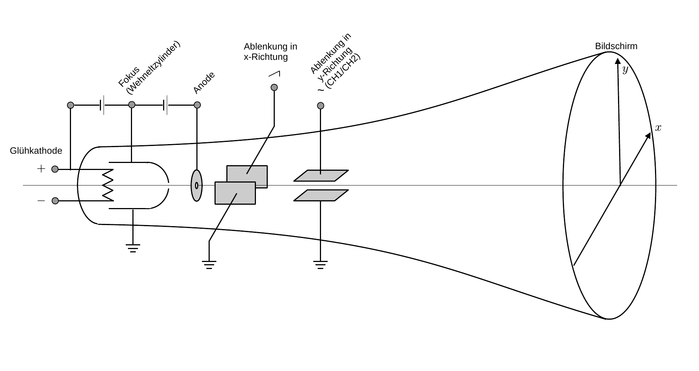
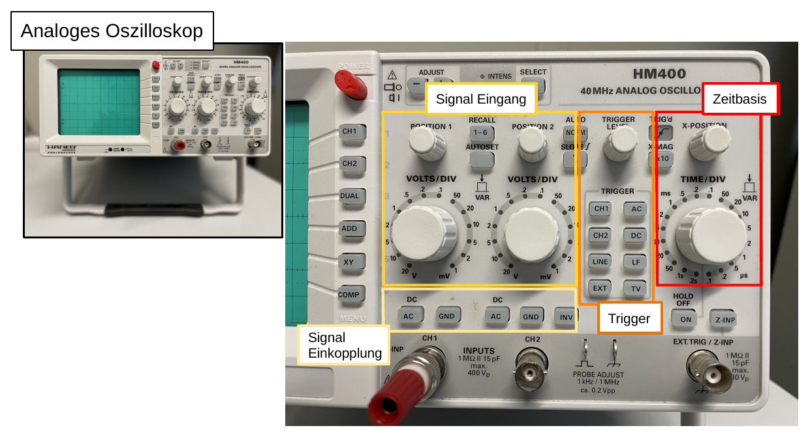
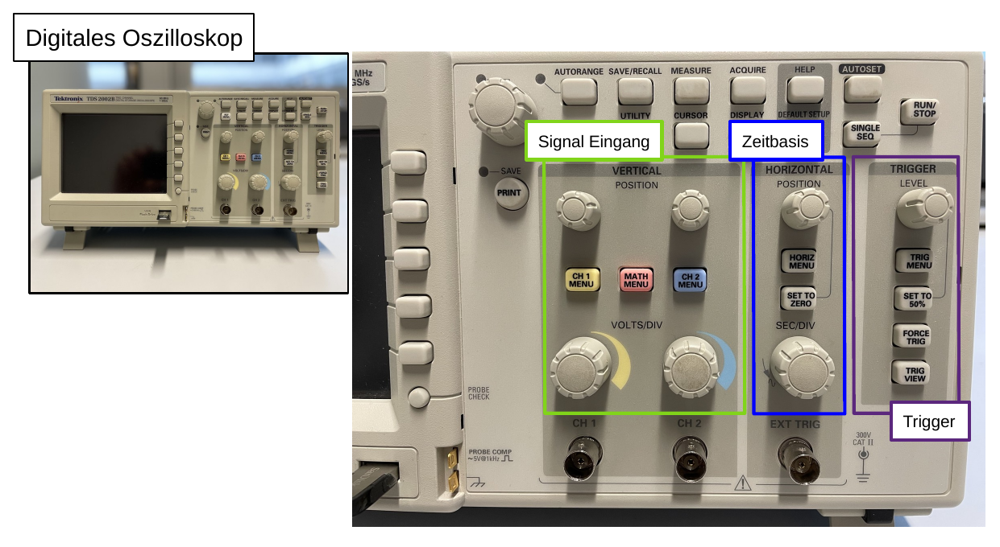

# Hinweise für den Versuch Oszilloskop

## Grundeigenschaften eines Oszilloskops

**Oszilloskope messen Spannungen.** In der einfachsten Form untersucht man mit dem Oszilloskop *ein zeitlich veränderliches Spannungssignal* auf der (vertikalen) $y$-Achse, als Funktion der Zeit auf der (horizontalen) $x$-Achse. 

Bei analogen Geräten wird die **Zeitbasis** durch eine ansteigende Sägezahnspannung realisiert, die die Anzeige mit konstanter Geschwindigkeit von links nach rechts ablenkt. Das zu untersuchende elektrische Signal durchläuft zunächst eine **Verstärkung** und wird dann als Ablenkung entlang der $y$-Achse dargestellt. Es ist notwendig dem Gerät anzuzeigen wann die Aufzeichnung des Signals beginnen soll. Dies erfolgt durch eine Auslösebedingung (den [**Trigger**](https://de.wikipedia.org/wiki/Trigger_(Physik))), die in den einfachsten Fällen darin besteht, dass das Signal eine zuvor festgelegte Schwelle überschreitet. 

Jedes Oszilloskop besitzt im allgemeinen die folgenden **Grundfunktionen**: 

- **Zwei Eingangssignale:** Ein Zweikanaloszilloskop besitzt einen jeweils auf der $x$- und $y$-Achse in Position und Amplitude unabhängig darstellbaren Eingang, für zwei Signale CH1 und CH2. Diese können, im **Einkanalbetrieb**, jeweils einzeln oder, im **Zweikanalbetrieb**, auf der gleichen Zeitbasis gemeinsam angezeigt werden. Neben Zwei- gibt es auch Vierkanaloszilloskope. 
- **Signaleinkopplung:** Jedes Signal kann als (DC-) Gleichsspannung oder (AC-) Wechselspannung eingekoppelt werden. Darüber hinaus gibt es eine (GRD-) Ground-Anzeige, die die Nulllage des Verstärkers am jeweiligen Signaleingang anzeigt. Die DC-Einkopplung zeigt das Signal an, wie es nach der Verstärkung auf dem jeweiligen Eingang anliegt. Die AC-Einkopplung zeigt das Signal **relativ** zu einem zeitlich unveränderlichen (DC-)Anteil an. Technisch werden dabei alle DC-Anteile durch einen in Serie geschalteten Kondensator (Hochpassfilter) [ausgefiltert](https://de.wikipedia.org/wiki/Tiefpass).
- **Trigger:** Für jeden Kanal besitzt das Oszilloskop einen eingebauten Trigger, der jeweils zusätzlich zu einer oder zwei regelbaren Schwellen berücksichtigen kann, ob das Signal für den Start der Aufzeichnung mit der Zeit größer (*steigende Flanke/rising edge*) oder kleiner (*fallende Flanke/falling edge*) werden soll. Ein dritter Eingang (EXT TRIG) erlaubt den Anschluss eines externen Triggersignals zum Auslösen der Messung. 
- **XY-Modus:** Im XY-Modus kann die konstante Ablenkung der Anzeige auf der $x$-Achse durch das Signal auf CH1 ersetzt werden, während das Signal auf CH2 auf der $y$-Achse dargestellt wird. Dieser Betriebsmodus kann z.B. zur Aufzeichnung von [Lissajous-Figuren](https://de.wikipedia.org/wiki/Lissajous-Figur) oder (wie für **Aufgabe 3**) für die Aufzeichnung von Kennlinien elektrischer Bauteile genutzt werden.  

Das Signal wird üblicherweise über [Koaxialkabel](https://de.wikipedia.org/wiki/Koaxialkabel) mit [BNC-Steckverbindungen](https://de.wikipedia.org/wiki/BNC-Steckverbinder) in das Oszilloskop eingespeist. Mehr über diese Art der Signalübertragung erfahren Sie im P1-Versuch [Netzwerke und Leitungen](https://gitlab.kit.edu/kit/etp-lehre/p1-praktikum/students/-/tree/main/Netzwerke_und_Leitungen).  

Eine wichtige Spezifikation eines Oszilloskops ist die **[Bandbreite](https://de.wikipedia.org/wiki/Bandbreite) des Eingangsverstärkers**. Dabei handelt es sich um den Bereich in dem ein sinusförmiges Eingangssignal auf weniger als den Anteil $1/\sqrt{2}$ gedämpft wird ([3 dB Bandbreite](https://de.wikipedia.org/wiki/Bandbreite#3-dB-Bandbreite) der Signalleistung). **In diesen Grundeigenschaften sind alle Oszilloskope gleich.**   

Ein Glossar gebräuchlicher Begriffe im Umgang mit Oszilloskopen (in englischer Sprache), können Sie z.B. [hier](https://wiki.analog.com/university/courses/alm1k/intro/oscilloscope-terminology) finden. 

## Funktionsweise Analogoszilloskop

Bis auf wenige Nischenanwendungen sind analoge Oszilloskope heute kaum noch in Verwendung. Viele der Grundeigenschaften leiten sich aber aus der Verwendung von Analogoszilloskopen ab und werden heute mit Digitaloszilloskopen nachempfunden. 

Der Aufbau eines Analogoszilloskops ist in **Abbildung 1** gezeigt: 

---

 

**Abbildung 1**: (Aufbau eines Analogoszilloskops)

---

An einer Glühkathode (links im Bild) in einer evakuierten Glasröhre werden Elektronen thermisch ausgelöst, die zu einer Ringanode hin beschleunigt werden. Durch geeignete Modellierung der elektrischen Feldlinien können die Elektronen zu einem Strahl fokussiert werden. Am Ende seines Wegs trifft dieser Elektronenstrahl auf einen chemisch beschichteten, phosphoreszierenden Schirm zur Bildgebung. Dieser Aufbau entspricht einer [Kathodenstrahlröhre](https://de.wikipedia.org/wiki/Kathodenstrahlr%C3%B6hre), wie sie auch im Versuch [Spezifische Ladung des Elektrons](https://gitlab.kit.edu/kit/etp-lehre/p1-praktikum/students/-/tree/main/Spezifische_Ladung_des_Elektrons) verwendet wird. In alten Bildschirmröhren und Röhrenfernsehern wird der Elektronenstrahl magnetisch abgelenkt. In analogen Oszilloskopen erfolgt die Ablenkung in $x$- und $y$-Richtung i.a. durch die elektrischen Felder von Kondensatorplatten, wie in **Abbildung 1** gezeigt. In $x$-Richtung liegt eine Sägezahnspannung an, die für eine zeitlich konstante periodische Ablenkung des Elektronenstrahl entlang der $x$-Achse sorgt. Typische Werte für die **Ablenkgeschwindigkeit** liegen bei ${\approx}10\ \mathrm{cm/\mu s}$. In $y$-Richtung liegen die verstärkten Signale von CH1 und/oder CH2 an. 

### Besonderheiten

Aufgrund seines Aufbaus besitzt das Analogoszilloskop einige spezielle Eigenschaften, die es vom digitalen Oszilloskop unterscheiden: 

- Die Darstellung auf dem Bildschirm erfolgt **kontinuierlich**. Sie erfordert keine weiteren Prozesse zur Darstellung der Daten und erfolgt daher mit geringer [Latenzzeit](https://de.wikipedia.org/wiki/Reaktionszeit_(Flachbildschirm)). 
- Zeitliche Differenzen, die sich mit analogen Oszilloskopen auflösen lassen sind durch die **Ablenkgeschwindigkeit** auf der $x$-Achse vorgegeben. 
- Der **XY-Modus** kann sehr einfach und intuitiv eingerichtet werden. 
- Die Werte, sind die, die man auf dem Bildschirm sieht. Sie können weder gespeichert noch, über das Ablesen vom Bildschirm hinausgehend, quantifiziert werden. 
- Achten Sie darauf **Beschädigungen des Bildschirms durch Einbrennen** bei hohen Helligkeiten des Elektronenstrahls zu vermeiden.  

### Frontplatte Hameg HM400

Die Frontplatte des für diesen Versuch verwendeten [Hameg HM400](https://gitlab.kit.edu/kit/etp-lehre/p1-praktikum/students/-/blob/main/Oszilloskop/doc/Oszi-Hameg-HM400.pdf) Oszilloskops mit den wichtigsten Bedienelementen ist in **Abbildung 2** gezeigt: 

---

 

**Abbildung 2**: (Frontplatte des Hameg HM400 Oszilloskops mit den wichtigsten Bedienelementen)

---

## Funktionsweise des Digitaloszilloskops

Das Digitaloszilloskop folgt in seinem Grundeigenschaften dem analogen Vorbild. **Hinter den Schaltflächen erfolgt die Aufnahme und weitere Verarbeitung der Daten jedoch auf ganz andere Art und Weise**:

Die Signale werden, nach der Verstärkung durch [Analog-Digital-Umsetzer (Analog-Digital-Wandler ADC)](https://de.wikipedia.org/wiki/Analog-Digital-Umsetzer) in digitale Signale übersetzt und in einem Arbeitsspeicher vorgehalten. Dies fügt den Spezifikationen des Digitaloszilloskops im Vergleich zum Analogoszilloskop einige weitere wichtige Spezifikationsparameter zu:

- Die **[Abstastrate](https://de.wikipedia.org/wiki/Abtastrate) (Samplingrate, $\nu_{s}$)** sagt aus, wie häufig das analoge Signal im ADC in ein digitales Signal umgesetzt wird. Der Kehrwert der Abtastrate wird als **Umsetzdauer** bezeichnet. Bei vielen Umsetzverfahren darf sich das Eingangssignal während der Umsetzung nicht ändern (*sample-and-hold*). Hohe Abtastraten werden durch die [flash-Methode](https://de.wikipedia.org/wiki/Analog-Digital-Umsetzer#Parallel-Umsetzer) erreicht. Einen Einblick in die Grundlagen der digitalen Datenverarbeitung erhalten Sie im P1-Versuch [Schaltlogik](https://gitlab.kit.edu/kit/etp-lehre/p1-praktikum/students/-/tree/main/Schaltlogik). Die Abtastrate wird in **(Mega-)Samples pro Sekunde $\mathrm{MS/s}$** angegeben. 
- Auch der Speicher des Oszilloskops kann nur mit endlicher Geschwindigkeit ausgelesen werden. Die damit verbundene Rate wird als [**Erfassungsrate**](https://de.wikipedia.org/wiki/Analog-Digital-Umsetzer#Zeit-Diskretisierung_(Abtastung)) bezeichnet. Der Kehrwert der Erfassungsrate kann deutlich oberhalb der Umsetzdauer des verwendeten ADCs liegen und bestimmt damit die eigentliche Latenzzeit des Oszilloskops.  
- Die **Bittiefe ([Samplingtiefe](https://de.wikipedia.org/wiki/Samplingtiefe))** gibt die Menge digitaler Auflösungsstufen des ADC pro Sample an. In Verwendung sind inzwischen Oszilloskope mit einer Samplingrate zwischen **10 und 14 Bit**.  

### Abtasttheorem

Beim Digitaloszilloskop wird der ADC zur [zeitdiskreten Signalverarbeitung](https://de.wikipedia.org/wiki/Analog-Digital-Umsetzer#Zeit-Diskretisierung_(Abtastung)) verwendet, das Digitaloszilloskop unterliegt also dem **[Nyquist-Shannon-Abtasttheorem](https://de.wikipedia.org/wiki/Nyquist-Shannon-Abtasttheorem)**, dass Sie ggf. aus der CgDA-Vorlesung kennen. 

Dieses Theorem besagt, dass ein Signal, das keine höheren Frequenzen als $\nu_{\mathrm{max}}$ enthält, durch Abtastraten von 
$$
\begin{equation*}
\nu_{s}\gt2\,\nu_{\mathrm{max}}
\end{equation*}
$$
grundsätzlich unverfälscht wiedergegeben werden kann, d.h. aus den abgetasteten Werten kann das zugrunde liegende Analogsignal **originalgetreu** zurückgerechnet werden. 

In der Praxis wird heutzutage trotzdem die einfachere und schnellere Näherung des Signals durch lineare oder [Spline](https://de.wikipedia.org/wiki/Spline)-Interpolation aus den abgetasteten Werten, der exakten Rekonstruktion vorgezogen. 

Um sicher zu sein, dass der Signalverlauf aus den Abtastpunkten klar erkannt werden kann, sollte ein gewisses Maß an Überabtastung (*oversampling*) von etwa $10\ \nu_{\mathrm{max}}$ nicht unterschritten werden. Beachten Sie hierzu auch die Diskussion zu **Aufgabe 1** des Versuchs [Datenverarbeitung](https://gitlab.kit.edu/kit/etp-lehre/p1-praktikum/students/-/tree/main/Datenverarbeitung). Bei Verletzung des Abtasttheorems, wenn es also Frequenzen im Signalspektrum gibt, für die Unterabtastung ($\nu_{s}\lt2\ \nu_{\mathrm{max}}$) besteht, erhält man durch Interpolation zwischen den abgetasteten Werten eine **falsche Frequenz**. Man spricht in diesem Fall vom [Alias-Effekt](https://de.wikipedia.org/wiki/Alias-Effekt). Tritt dieser Effekt unerkannt auf, kann dies zu **gravierenden Fehlinterpretationen der Daten** führen. 

Um Alias-Effekten vorzubeugen ist es ratsam ein Signal vor der Digitalisierung immer durch einen [Tiefpassfilter](https://de.wikipedia.org/wiki/Tiefpass) mit einer Grenzfrequenz 
$$
\begin{equation*}
\nu_{g}=\frac{1}{2}\ \nu_{s}
\end{equation*}
$$
zu begrenzen, damit es erst gar nicht zur Unterabtastung im ADC kommen kann. Beim im Versuch verwendeten [Tektronix TDS2002B](https://gitlab.kit.edu/kit/etp-lehre/p1-praktikum/students/-/blob/main/Oszilloskop/doc/Oszi-Tektronix-TDS2002B.pdf) Oszilloskop beträgt die maximale Abtastrate $1\ \mathrm{GS/s}$, die Bandbreite des Oszilloskops ist mit $60\ \mathrm{MHz}$ spezifiziert. Damit wird der Alias-Effekt von vornherein vermieden.

### Besonderheiten

Aufgrund seines Aufbaus besitzt auch das Digitaloszilloskop einige spezielle Eigenschaften, die es vom Analogoszilloskop unterscheiden: 

- Vor allem günstige Digitaloszilloskope können aufgrund der verbauten Analog-Digital-Wandlung **höhere Latenzzeiten** aufweisen, als dies bei Analogoszilloskopen der Fall ist. Dies kann insbesondere im XY-Betrieb sichtbar auftreten, für den die digitalisierten Werte, sowohl auf der $x$-, als auch auf der $y$-Achse im Speicher vorgehalten, ausgelesen und gegeneinander synchronisiert werden müssen. 
- Im Rahmen der Samplingtiefe des Oszilloskops können Zeiten und Spannungen i.a. mit einem ***cursor*** abgelesen und so quantifiziert werden. Die Unsicherheiten sind durch die Samplingtiefe des Oszilloskops vorgegeben.  
- Die Vorhaltung der aufgezeichneten Daten erlaubt die **Aufnahme von seltenen und Einmalvorgängen**.
- Die Vorhaltung der Daten erlaubt die digitale Weiterverarbeitung der Daten, im Oszilloskop.
- Die vorgehaltenen Daten können z.B. über eine USB- oder LAN-Schnittstelle, oder per WLAN zur Weiterverarbeitung aus dem Oszilloskop ausgelesen werden.

Der vermeintliche Nachteil höherer Latenzzeiten besteht technische nicht mehr.    

### Frontplatte des Tektronix TD2002B

Die Frontplatte des für diesen Versuch verwendeten [Tektronix TDS2002B](https://gitlab.kit.edu/kit/etp-lehre/p1-praktikum/students/-/blob/main/Oszilloskop/doc/Oszi-Tektronix-TDS2002B.pdf) Oszilloskops mit den wichtigsten Bedienelementen ist in **Abbildung 3** gezeigt: 

---

 

**Abbildung 3**: (Frontplatte des Tektronix TD2002B Oszilloskops mit den wichtigsten Bedienelementen)

---

## Essentials

Was Sie ab jetzt wissen sollten:

- Die **Grundeigenschaften** eines Oszilloskops:
  - Wie Sie ein Signal auf der $x$- und $y$-Achse darstellen. 
  - Wie ein Signal mit AC- und DC-Anteilen je nach Einkopplung auf dem Oszilloskop aussieht.
  - Wie Sie ein Signal Triggern. 

- Die verschiedenen Betriebsarten des Oszilloskops: **Einkanal, Zweikanal, XY-Modus**.
- Die Bedeutung der wichtigsten Spezifikationsparameter eines Digitaloszilloskops: **Samplingrate, Erfassungsrate, Samplingtiefe**.

## Testfragen

1. Sie stellen das Signal einer sinusförmigen Wechselspannung auf dem Oszilloskop dar und wechseln den Trigger vom steigender auf fallende Flanke. Was passiert mit dem dargestellten Signal? 
1. Sie stellen ein Rechtecksignal mit Spannungen zwischen 0 und $10\ \mathrm{V}$ auf dem Oszilloskop dar und wechseln von DC- auf AC-Kopplung.  Was passiert mit dem dargestellten Signal? 
1. Sie schalten eine Diode $D$ in Reihe mit einer Spannungsquelle für eine sinusförmige Wechselspannung $U_{0}\in[-10\ \mathrm{V};+10\ \mathrm{V}]$. Sie legen $U_{0}$ auf CH1 und die über $D$ abfallende Spannung auf CH2 und betreiben das Oszilloskop im XY-Modus. Was erwarten Sie zu sehen? 

# Navigation

[Main](https://gitlab.kit.edu/kit/etp-lehre/p1-praktikum/students/-/tree/main/Oszilloskop)

