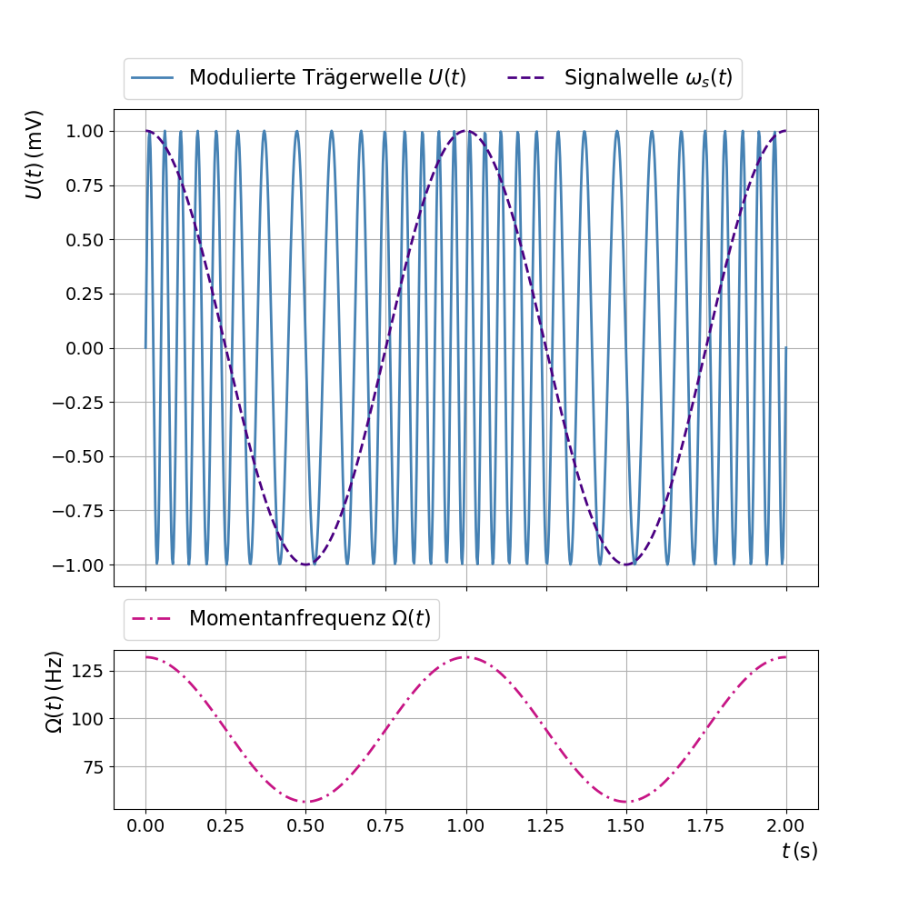
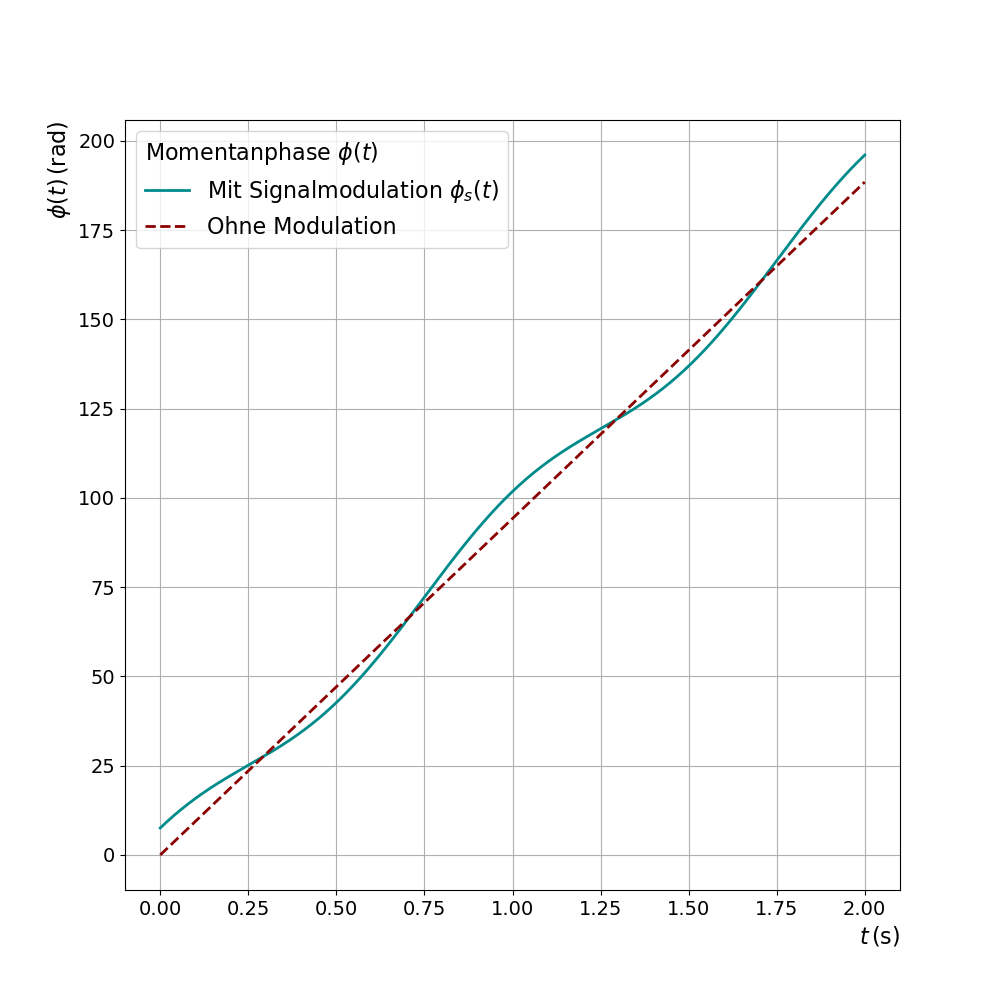
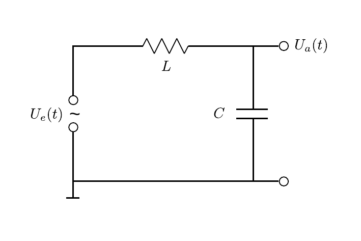
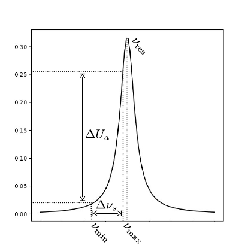

# Hinweise für den Versuch Oszilloskop

## Frequenzmodulation 

Sie kennen vielleicht die Einstellungen AM und FM am Radio. In diesem Versuch nehmen Sie einfache Untersuchungen an einem **[frequenzmodulierten (FM) Signal](https://de.wikipedia.org/wiki/Frequenzmodulation)** vor. Gegenüber der Amplitudenmodulation (AM) besitzt die FM einen, für die Signalübertragung, höheren dynamischen Umfang und eine geringere Anfälligkeit gegenüber Störungen. Statt der Amplitude, ändert sich die Frequenz als Funktion der Zeit $t$. Das Beispiel eines angenommenen FM-Spannungssignals $U(t)$ ist in **Abbildung 1** gezeigt:  

---

**Abbildung 1**: (Trägerwelle, Signalwelle und Momentanfrequenz $\Omega(t)$ bei der FM)

---

Dargestellt ist ein Spannungsverlauf, wie Sie ihn für **Aufgabe 2.3** erzeugen sollen: 
$$
\begin{equation}
\begin{split}
&U(t) = U_{0}\sin\left(\phi(t)\right);\\
&\\
&\text{mit:}\\
&\\
&\phi(t) = \omega_{0}\,t + \phi_{0}+\frac{\Delta\omega_{s}}{\omega_{s}}\sin\left(\omega_{s}\,t\right), \\
\end{split}
\end{equation}
$$
wobei $\omega_{0}$ der Kreisfrequenz der **Trägerwelle (hellblaue Linie in Abbildung 1)** und $\phi_{0}$ der Phase zum Zeitpunkt $t=0$ entsprechen. In **Abbildung 1** hat die Trägerwelle eine 15 mal höhere Frequenz, als die **Signalwelle (violette Linie in Abbildung 1)**, die die feste Kreisfrequenz $\omega_{s}$ hat. Der sogenannte **Phasenhub** 
$$
\begin{equation*}
\Delta\phi_{s}=\frac{\Delta\omega_{s}}{\omega_{s}}
\end{equation*}
$$
ist für diese Darstellung sehr groß gewählt, so dass die Änderung der Frequenz auf der Trägerwelle im Bild deutlich sichtbar ist. Für den Versuch von **Aufgabe 2.3** ist dies nicht der Fall!

Die mathematische Darstellung in Gleichung **(1)** entspricht genau genommen nicht der FM, sondern der äquivalenten **Phasenmodulation**: Dabei ändert sich die Phase $\phi(t)$ als Funktion von $t$. Man bezeichnet $\phi(t)$ als die **Momentanphase**. Ihr Verlauf, für die gleiche Parameterwahl, wie für **Abbildung 1** ist in **Abbildung 2** gezeigt:

---

**Abbildung 2**: (Verlauf von $\phi(t)$ nach Gleichung **(1)** mit den gleichen Parametern, wie für **Abbildung 1**, einmal mit Signalmodulation und einmal ohne Modulation)

---

Darin entspricht die dunkelrot gestrichelte Kurve dem Phasenverlauf, wie man ihn ohne Variation der Frequenz erwartet (d.h. Phasenhub $\Delta\omega_{s}/\omega_{s}=0$). Die dunkelgrüne Kurve zeigt die Variation der Momentanphase $\phi(t)$ mit der gleichen Signalmodulation, wie für **Abbildung 1**.

Die (mathematische) Darstellung des Vorgangs als FM erfordert die Definition der **Momentanfrequenz** als Ableitung von $\phi(t)$ nach der Zeit $t$: 
$$
\begin{equation}
\begin{split}
\Omega(t)\equiv\frac{\mathrm{d}}{\mathrm{d}t}\phi(t) = \omega_{0}+&\underbrace{\Delta\omega_{s}\cos(\omega_{s}\,t)}, \\
&\hphantom{\Delta}\equiv\omega_{s}(t)
\end{split}
\end{equation}
$$
wobei man 
$$
\begin{equation*}
\Delta\nu_{s}=\frac{\Delta\omega_{s}}{2\pi}
\end{equation*}
$$
als **Frequenzhub** bezeichnet. $\Delta \omega_{s}$ ist die Differenz aus maximaler und minimaler Frequenz des modulierten Signals $U(t)$. 

Man erhält die Momentanphase aus der Momentanfrequenz durch Integration von Gleichung **(2)**:  
$$
\begin{equation*}
\begin{split}
\phi(t) = \int\limits_{0}^{t}\Omega(t)\,\mathrm{d}t = \omega_{0}\,t + \phi_{0} + &\underbrace{\int\limits_{0}^{t}\omega_{s}(t)\,\mathrm{d}t}.\\
&\equiv\phi_{s}(t)
\end{split}
\end{equation*}
$$
Das Signal $\phi_{s}(t)$ der Phasenmodulation erhält man aus dem Integral des Signals $\omega_{s}(t)$ der FM, woraus deutlich wird, das die Phasenmodulation zur FM äquivalent ist. Wie in **Abbildung 2** zu sehen, ist $\Omega(t)$ am größten (kleinsten), wo $\omega_{s}(t)$ maximal (minimal) wird.

## Messung von $\Delta\nu_{s}$

Mit den für den Versuch vorgeschlagenen Einstellungen ist der Frequenzhub deutlich geringer, als wir ihn für die Darstellung für **Abbildung 1** gewählt haben. **Sie werden, wenn Sie $U(t)$ auf dem Oszilloskop darstellen, den Unterschied in $\omega_{s}(t)$ nicht mit bloßem Auge sehen können.** Benutzen Sie daher, zur Bestimmung von $\Delta\nu_{s}$, einen LC-Schwingkreis, wie in **Abbildung 3** gezeigt:

---

   

**Abbildung 3**: (Schaltbild eines LC-Schwingkreises)

---

$U_{e}(t)$ entspricht der FM-Trägerwelle. Sie können $U_{a}(t)$ sowohl über dem Kondensator als auch über der Spule abgreifen und auf dem Oszilloskop darstellen. 

Mit dieser Konfiguration erzeugen Sie eine **erzwungene Schwingung**
$$
\begin{equation*}
U_{e}(t) = \frac{Q}{C} + R\dot{Q} + L\,\ddot{Q}
\end{equation*}
$$
mit der Resonanzfrequenz
$$
\begin{equation*}
\nu_{\mathrm{res}}=\frac{\omega_{\mathrm{res}}}{2\pi} = \frac{1}{2\pi}\,\sqrt{\frac{1}{LC}-\left(\frac{R}{2L}\right)^{2}}\approx \frac{1}{2\pi}\,\sqrt{\frac{1}{LC}}
\end{equation*}
$$
auf dem $LC$-Schwingkreis (siehe **Aufgabe 2.2** zum Versuch [Resonanz](https://gitlab.kit.edu/kit/etp-lehre/p1-praktikum/students/-/blob/main/Resonanz/doc/Hinweise-Aufgabe-2.md)), wobei $R$ dem Widerstand der Leitung entspricht. Da $R$ gering ist, ist der [Einschwingvorgang](https://de.wikipedia.org/wiki/Erzwungene_Schwingung#Einschwingvorgang,_station%C3%A4re_Schwingung,_allgemeine_L%C3%B6sung) der Schaltung deutlich kürzer als die zeitliche Variation von $\Omega(t)$. Diese folgt somit der [Resonanzkurve](https://de.wikipedia.org/wiki/Resonanz) des Schwingkreises. **Durch diese Schaltung wird die Frequenzmodulation zusätzlich in eine Amplitudenmodulation übersetzt:** je nach Frequenz nimmt die Amplitude der Schwingung entlang der Resonanzkurve ab oder zu, wie in **Abbildung 4** gezeigt:

---

   

**Abbildung 4**: (Übertrag von einer FM in eine zusätzliche AM, für den Fall $\nu_{\mathrm{max}}\leq\nu_{\mathrm{res}}$)

---

Aus der, auf diese Weise, amplitudenmodulierten Trägerwelle können Sie den Zeitpunkt mit größter ($\nu_{\mathrm{max}}$) und kleinster ($\nu_{\mathrm{min}}$) Frequenz leichter ablesen.  

Beachten Sie, dass das genaue Aussehen der Amplitudenmodulation davon abhängt in welcher Flanke der Resonanzkurve Sie sich befinden. Achten Sie darauf, dass eine der beiden Konfigurationen besteht, um der Amplitude eindeutig eine Frequenz zuordnen zu können: 

- Sie liegen mit $\nu_{\mathrm{max}}$ links von $\nu_{\mathrm{res}}$ ($\nu_{\mathrm{max}}\leq\nu_{\mathrm{res}}$). 
- Sie liegen mit $\nu_{\mathrm{min}}$ rechts von $\nu_{\mathrm{res}}$ ($\nu_{\mathrm{min}}\geq\nu_{\mathrm{res}}$). 

Für $\nu_{\mathrm{max}}\leq\nu_{\mathrm{res}}$ können Sie $\nu_{\mathrm{min}}$ ($\nu_{\mathrm{max}}$) aus einer Abschätzung der Periode der Schwingung bei kleinster (größter) Amplitude erhalten.

## Essentials

Was Sie ab jetzt wissen sollten:

- **Wie FM funktioniert** und wie sie sich von AM unterscheidet.

- Was der **Frequenzhub** ist. 

- Wie wir den, im Vergleich zur Frequenz der Trägerwelle kleinen Frequenzhub für **Aufgabe 1.2** sichtbar machen. 

## Testfragen

1. Was ist der numerische Unterschied zwischen Frequenz- und Phasenhub?
2. Warum sind Frequenz und Phasenhub äquivalent?
3. In **Abbildung 4** sind $\nu_{\mathrm{min}}$ und  $\nu_{\mathrm{max}}$ für den Fall $\nu_{\mathrm{max}}\leq\nu_{\mathrm{res}}$ gezeigt. In diesem Fall befinden Sie sich auf der linken Flanke der Resonanzkurve. Wie erhalten Sie $\nu_{\mathrm{min}}$ und  $\nu_{\mathrm{max}}$, wenn Sie sich auf der rechten Flanke der Resonanzkurve ($\nu_{\mathrm{min}}\geq\nu_{\mathrm{res}}$) befinden?
4. Wie sieht die Situation für den Fall $\nu_{\mathrm{min}}\lt\nu_{\mathrm{res}}\lt\nu_{\mathrm{max}}$ aus?

#  Navigation

[Main](https://gitlab.kit.edu/kit/etp-lehre/p1-praktikum/students/-/tree/main/Oszilloskop)

