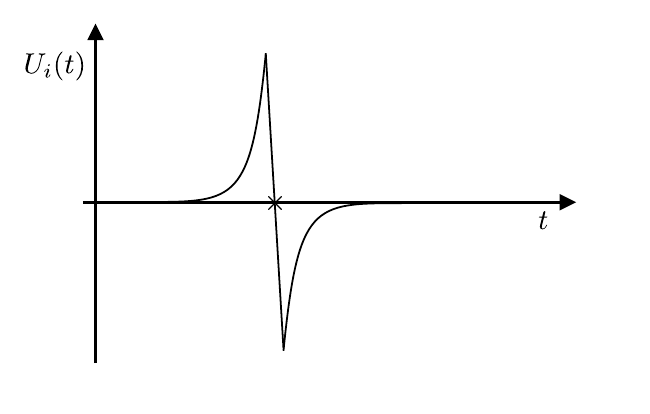

# Hinweise für den Versuch Oszilloskop

## Fallversuch

Auf dem Fallrohr sind in festen Abständen von jeweils $\Delta s_{k}=20.0\  \mathrm{cm}$ sechs Kupferspulen aufgebracht. Lässt man einen Permanentmagneten im Inneren des Rohrs fallen induziert dieser auf seinem Weg, nach dem [Induktionsgesetz](https://de.wikipedia.org/wiki/Elektromagnetische_Induktion), charakteristische Spannungen 

$$
\begin{equation*}
U_{i}(t) = \frac{\mathrm{d}}{\mathrm{d}t}\oint\limits_{\mathcal{C}}\vec{B}\cdot\mathrm{d}\vec{f}.
\end{equation*}
$$
Ein typischer Verlauf von $U_{i}(t)$, wenn der fallende Magnet eine Spule kreuzt ist in **Abbildung 1** gezeigt:

---

**Abbildung 1**: (Typischer Verlauf der durch einen fallenden Permanentmagneten induzierten Spannung $U_{i}(t)$ in einer Spule des Fallrohrs)

---

Wenn Sie die die Vielfachen der Differenzen 
$$
\begin{equation*}
\Delta t_{k} = t_{j+1}-t_{j}\,\quad \forall j
\end{equation*}
$$
der Nulldurchgänge $U_{i}(t_{j})=0\,\ \forall j$ zwischen den Spannungsspitzen (in **Abbildung 1** mit einem $\times$ gekennzeichnet) gegen die Vielfachen der $\Delta s_{k}$ auftragen können Sie an die so bestimmten Datenpunkte $(\Delta s_{k},\Delta t_{k})$ das Modell

$$
\begin{equation}
s(t; g, v_{0}, s_{0}) = -\frac{1}{2}g\,t^{2} - v_{0}\,t + s_{0},
\end{equation}
$$
mit den freien Parametern $g$, $v_{0}$, und $s_{0}$ anpassen und daraus $g\pm\Delta g$ abschätzen.

## Essentials

Was Sie ab jetzt wissen sollten:

- In diesem einfachen Aufbau verwenden Sie das Oszilloskop **ohne weitere Spannungsquelle**. Sie registrieren die durch den Magneten induzierte Spannung beim Durchqueren der ersten Spule.  

## Testfragen

1. Welche Kurve erwarten Sie auf dem Oszilloskop? 
2. Welches Zeitfenster sollten Sie einstellen?
3. Welche Kurve erwarten Sie, wenn Sie $s_{k}=k\ \Delta s_{k}$ auf der $x$- und $t_{k}=k\ \Delta t_{k}$ auf der $y$-Achse auftragen?

#  Navigation

[Main](https://gitlab.kit.edu/kit/etp-lehre/p1-praktikum/students/-/tree/main/Oszilloskop)

