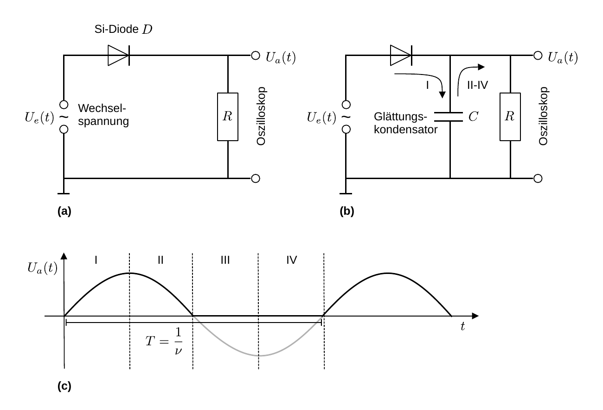

# Hinweise für den Versuch Oszilloskop

## Einweggleichrichter

Die Funktionsweise eines [Einweggleichrichters](https://de.wikipedia.org/wiki/Gleichrichter#), ist in **Abbildung 1** dargestellt:

---



**Abbildung 1**: (Schaltung eines Einweggleichrichters (a) ohne und (b) mit glättendem Kondensator. Das Signal nach Gleichrichtung ist in Abbildung (c) gezeigt)

---

Aufgabe des Gleichrichters ist es eine Wechselspannung in eine möglichst gleichförmige Spannung zu überführen. 

Wir stellen uns vor, dass an den dargestellten Schaltkreisen jeweils eine sinusförmige Wechselspannung $U_{e}(t)$ anliegt. Die [Diode](https://de.wikipedia.org/wiki/Diode) ist nur für (technische) Ströme in Richtung des Pfeils durchlässig (**Durchlassrichtung**), die Gegenrichtung bezeichnet man als **Sperrrichtung**. Über dem Widerstand $R$ wird mit dem Oszilloskop die Spannung $U_{a}(t)$ als Funktion der Zeit beobachtet. 

Durch Verwendung der Diode in **Abbildung 1a**, sind nur die positiven Spannungen $U_{a}(t)\gt 0\ \mathrm{V}$ auf dem Oszilloskop zu sehen (schwarze Kurve in Abbildung (c)). Da immer nur eine halbe Welle zu sehen ist bezeichnet man einen solchen einfachen Gleichrichter auch als **Halbwellengleichrichter**. 

Schaltet man, wie in **Abbildung 1b**, einen Kondensator parallel zu $R$ läd und entläd sich dieser in den folgenden Schritten: 

- **Quadrant I** der Periode: Die Diode wird in Durchlassrichtung durchströmt, der Kondensator wird geladen. 

- **Quadranten II–IV** der Periode: Die anliegende Spannung $U_{e}(t)$ hat ihren Scheitelpunkt überschritten und wechselt schließlich das Vorzeichen. Ein Ladungsrückfluss vom Kondensator zur Spannungsquelle wird durch die Sperrrichtung der Diode unterbunden, der Kondensator entläd sich also über $R$. 

- Für den Entladevorgang des Kondensators gilt nach dem 2. Kirchhoffschen Gesetz ([Maschenregel](https://de.wikipedia.org/wiki/Kirchhoffsche_Regeln#Der_Maschensatz_(Maschenregel)_%E2%80%93_2._Kirchhoffsches_Gesetz)): 

  ```math
  \begin{equation*}
  \begin{split}
  & U=\frac{Q}{C}; \quad U=R\,I = R\,\dot{Q}\\
  &\\
  &\frac{Q}{C}+R\,\dot{Q} = 0;\qquad \frac{\mathrm{d}Q}{Q} = -\frac{1}{RC}\mathrm{d}t \\
  &\\
  &Q(t) = Q_{0}e^{-\frac{1}{RC}t}; \qquad 
  U(t) = \frac{Q_{0}}{C}e^{-\frac{1}{RC}t},\\
  \end{split}
  \end{equation*}
  ```

  der Entladevorgang läuft also exponentiell ab. 

- **Quadranten I** der folgenden Periode: $U_{e}(t)$  übersteigt ab einem gewissen Zeitpunkt die Spannung am Kondensator wieder und der Kondensator wird erneut aufgeladen. Je nach Wahl der Frequenz $\nu$ der Wechselspannung, $C$ und $R$ hat der Kondensator eine mehr oder weniger glättende Wirkung auf die über $R$ abfallende Spannung.     

### Ripple voltage $U_{\mathrm{ripple}}$

Die verbleibende zeitliche Variation von $U_{a}(t)$ bezeichnet man als [ripple voltage](https://en.wikipedia.org/wiki/Ripple_(electrical)) $U_{\mathrm{ripple}}$. Diese lässt sich wie folgt abschätzen: 

Innerhalb einer Periode $T$ von $U_{e}(t)$ ist $U_{a}(t)$ um den Anteil 
$$
\begin{equation*}
\frac{U_{a}(T)}{U_{e}(0)} = e^{-\frac{T}{RC}}
\end{equation*}
$$
 abgefallen. Für $T\ll RC$ lässt sich der Exponentialfaktor entwickeln
$$
\begin{equation*}
e^{-\frac{T}{RC}}\approx 1-\frac{T}{RC}
\end{equation*}
$$
und man erhält als Abschätzung: 
$$
\begin{equation}
\begin{split}
U_{\mathrm{ripple}} &= U_{e}(0) - U_{a}(T) \\ 
&\approx U_{e}(0)\left(1-\left(1-\frac{T}{RC}\right)\right) \\
&= U_{e}(0)\frac{T}{RC} = U_{e}(0)\frac{1}{\nu RC}.
\end{split}
\end{equation}
$$
Je geringer $U_{\mathrm{ripple}}$ desto höher ist die **Spannungsstabilität des Gleichrichters**. Aus Gleichung **(1)** ist ersichtlich, dass große Werte für $R$, $C$ oder $\nu$ zu hoher Spannungsstabilität beitragen. 

Um eine möglichst gleichförmige Spannung zu erhalten wünscht man sich eine Entladezeit 
$$
\begin{equation*}
\tau=R\,C
\end{equation*}
$$
des Kondensators, die deutlich größer als die Periode $T=2\pi/\nu$ der anliegenden Wechselspannung ist. 

- Dies können Sie durch die Wahl eines Kondensators mit hoher Kapazität und eines hohen Widerstands erreichen. 
- Sie können zudem die Frequenz $\nu$ der Wechselspannung erhöhen um den Effekt der Gleichrichtung optimal darzustellen. 

## Essentials

Was Sie ab jetzt wissen sollten:

- Gleichrichtung einer Wechselspannung erreicht man durch die **Verwendung einer Diode $D$**, die nur die Halbwellen einer Polarität durchlässt. 

- Eine effektive Glättung des Signals erreicht man durch **Parallelschaltung eines Kondensators**.

## Testfragen

1. Wie würden Sie $C$ bei vorgegebenem $R$ und $\nu$ wählen, um eine hohe Spannungsstabilität des Gleichrichters zu erhalten?

#  Navigation

[Main](https://gitlab.kit.edu/kit/etp-lehre/p1-praktikum/students/-/tree/main/Oszilloskop)

