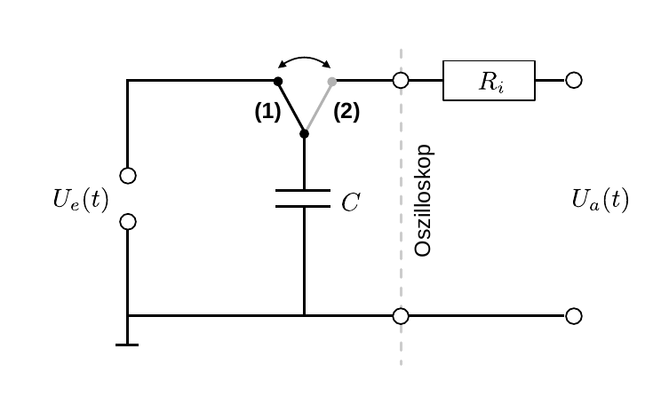

# Hinweise für den Versuch Oszilloskop

## Kondensatorentladung

Verwenden Sie zur Darstellung der Entladekurve des $0.47\ \mathrm{\mu F}$-Kondensators eine Schaltung, wie in **Abbildung 1** gezeigt:

---

**Abbildung 1**: (Schaltbild zur Aufzeichnung der Entladekurve des Kondensators)

---

In Schalterstellung (1) wird der Kondensator geladen. Schließen Sie den Kondensator nach dem Ladevorgang über das Ozilloskop kurz (Schalterstellung (2) in **Abbildung 1**). 

Die graue, gestrichelte Linie stellt den Übergang zum Oszilloskop dar. Im Fall des direkten Anschlusses symbolisiert $R_{i}$ den Innenwiderstand nur des Ozilloskops. Im Fall des Anschlusses über den Tastkopf repräsentiert $R_{i}$ den Gesamtwiderstand aus dem Innenwiderstand des Oszillsokops und dem Widerstand des Tastkopfs. Durch den Kurzschluss kommt es zur exponentiellen Entladung des Kondensators. 

Nach den [Kirchhoffschen Regeln](https://de.wikipedia.org/wiki/Kirchhoffsche_Regeln) gilt:
$$
\begin{equation*}
\frac{Q}{C}+R\,\dot{Q}=0;
\end{equation*}
$$
Diese einfache lineare Differenzialgleichung kann durch Separation der Variablen gelöst werden: 
$$
\begin{equation*}
\begin{split}
&\frac{Q}{C}=-R\,\frac{\mathrm{d}Q}{\mathrm{d}t};\\
&\\
&\int\limits_{Q_{0}}^{Q_{1}}\frac{\mathrm{d}Q}{Q}=-\int\limits_{t_{0}}^{t_{1}}\frac{1}{R\,C}\,\mathrm{d}t;\\
&\\
&\ln\left(\frac{Q_{1}}{Q_{0}}\right) = -\frac{1}{R\,C}\left(t_{1}-t_{0}\right);\qquad Q(t) = Q_{0}\,e^{-\frac{1}{R\,C}\left(t-t_{0}\right)}; \qquad U_{a}(t) = \underbrace{\frac{Q_{0}}{C}}\,e^{-\frac{1}{R\,C}\left(t-t_{0}\right)}.\\
&\hphantom{ccccccccccccccccccccccccccccccccccccccccccccccccccccccccccccccccccc}\equiv U_{0}\\
\end{split}
\end{equation*}
$$
Die Randbedingungen legen fest, ob es sich um einen Ladevorgang oder Entladevorgang handelt. Für den Entladevorgang gilt: 
$$
\begin{equation}
\begin{split}
&U_{a}(t_{0})=U_{0}; \qquad \lim\limits_{t\to\infty}U_{a}=0;\\
&\\
&U_{a}(t; U_{0}, R, C) = U_{0}\,e^{-\frac{1}{RC}t}.\\
\end{split}
\end{equation}
$$
## Essentials

Was Sie ab jetzt wissen sollten:

- Wie die **Entladekurve eines Kondensators** aussieht.

- Wie Sie diese kurve mit einem Oszilloskop messen würden.

- Den Unterschied zwischen dem direkten Anschluss des Oszilloskops und der Verwendung des **Tastkopfs**.

## Testfragen

1. Wie sieht die Ladekurve des Kondensators aus?
2. Wozu braucht man überhaupt einen Tastkopf für das Oszilloskop?

#  Navigation

[Main](https://gitlab.kit.edu/kit/etp-lehre/p1-praktikum/students/-/tree/main/Oszilloskop)

