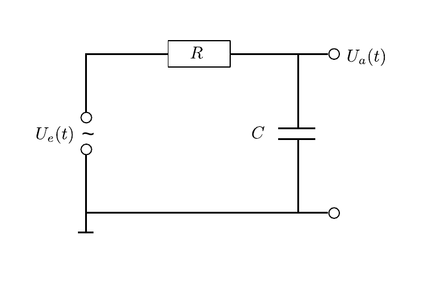
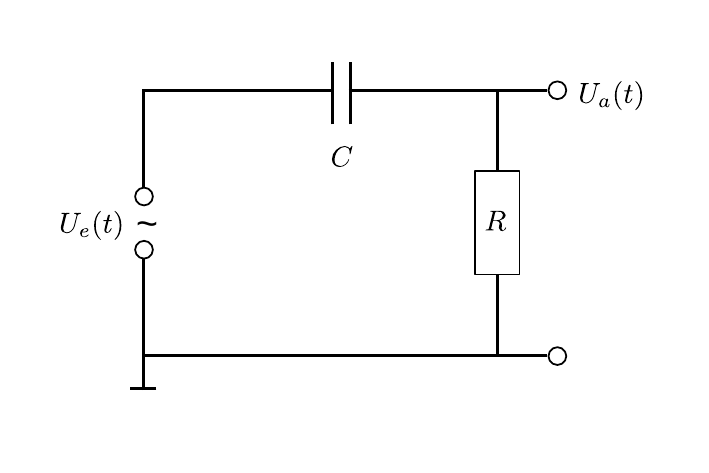

# Hinweise für den Versuch Oszilloskop

## Integrierglied

Der Schaltplan des Integrierglieds ist in **Abbildung 1** gezeigt:

---



**Abbildung 1**: (Schaltung eines Integrierglieds)

---

Diese Schaltung wird auch als [Tiefpass](https://de.wikipedia.org/wiki/Tiefpass) bezeichnet (siehe **Aufgabe 1** zum Versuch [Netzwerke und Leitungen](https://gitlab.kit.edu/kit/etp-lehre/p1-praktikum/students/-/blob/main/Netzwerke_und_Leitungen)). Beim Anlegen einer periodischen Spannung $U_{e}(t)$ der Kreisfrequenz $\omega$ an diese Schaltung ergibt sich aus den [Kirchhoffschen Regeln](https://de.wikipedia.org/wiki/Kirchhoffsche_Regeln):
$$
\begin{equation}
\begin{split}
&U_{e} = I\left(R + \frac{1}{i\omega\,C}\right)= I\,R\left(
\vphantom{\frac{1}{i\omega\,C}}
1 + \frac{\omega_{0}}{i\omega}\right);\qquad U_{a} = \frac{I}{i\omega\,C},\\
&\\
&\text{mit:} \\
&\\
&\omega_{0}=\frac{1}{R\,C}.
\end{split}
\end{equation}
$$

- Für $\omega\ll\omega_{0}$ gilt $U_{a}=U_{e}$ und $U_{a}$ befindet sich in Phase mit $U_{e}$.  

- Für $\omega\gg\omega_{0}$ gilt die Näherung

  ```math
  \begin{equation*}
  U_{a} \approx \frac{Q}{C} = \frac{1}{C}\int I\,\mathrm{d}t = \frac{1}{R\,C}\int U\,\mathrm{d};
  \end{equation*}
  ```

  $U_{a}$ ist um $\Delta\varphi=-\pi/2$ zu $U_{e}$ phasenverschoben.

## Differenzierglied

Greift man $U_{a}$ nicht über $C$ sondern über $R$ ab, wie in **Abbildung 2** gezeigt, erhält man ein Differenzierglied:

---



**Abbildung 2**: (Schaltung eines Differenzierglieds)

---

Diese Schaltung wird auch als [Hochpass](https://de.wikipedia.org/wiki/Hochpass) bezeichnet (siehe **Aufgabe 1** zum Versuch [Netzwerke und Leitungen](https://gitlab.kit.edu/kit/etp-lehre/p1-praktikum/students/-/blob/main/Netzwerke_und_Leitungen)). Beim Anlegen einer periodischen Spannung $U_{e}(t)$ der Kreisfrequenz $\omega$ an diese Schaltung ergibt sich aus den [Kirchhoffschen Regeln](https://de.wikipedia.org/wiki/Kirchhoffsche_Regeln):
$$
\begin{equation}
\begin{split}
&U_{e} = I\left(R + \frac{1}{i\omega\,C}\right) 
= I\,R\left(
\vphantom{\frac{1}{i\omega\,C}}
1 + \frac{\omega_{0}}{i\omega}\right);\qquad U_{a} = I\,R;\\
\end{split}
\end{equation}
$$

- Für $\omega\gg \omega_{0}$ gilt $U_{a}=U_{e}$ und $U_{a}$ befindet sich in Phase mit $U_{e}$.  

- Für $\omega\ll\omega_{0}$ gilt die Näherung

  ```math
  \begin{equation*}
  U_{a} \approx R\,\frac{\mathrm{d}Q}{\mathrm{d}t} = R\,C\frac{\mathrm{d}U_{e}}{\mathrm{d}t};
  \end{equation*}
  ```

  $U_{a}$ ist um $\Delta\varphi=\pi/2$ zu $U_{e}$ phasenverschoben. 

## Phasenschieber

Sowohl das Integrier- als auch das Differenzierglied können als Phasenschieber verwendet werden, da beide Einfluss auf die Phasenlage von $U_{a}(t)$ relativ zu $U_{e}(t)$ haben. Statt auf die Amplitude, richten wir unser Augenmerk in diesem Fall auf die Phasendifferenz $\Delta\varphi$ zwischen $U_{a}$ und $U_{e}$. 

Für das Differenzierglied ergibt sich z.B. aus Gleichung **(2)**:
$$
\begin{equation}
\begin{split}
&U_{a} = U_{e}\,\frac{R}{R + \frac{1}{i\omega\,C}} = U_{e}\,\frac{\left(\omega\,R\,C\right)^{2}+i\omega\,R\,C}{\sqrt{R^{2} + \left(\frac{1}{i\omega\,C}\right)^{2}}};\\
&\\
&\Delta\varphi = \arctan\left(\frac{1}{\omega\,R\,C}\right) = \arctan\left(\frac{\omega_{0}}{\omega}\right)\\
\end{split}
\end{equation}
$$

## Essentials

Was Sie ab jetzt wissen sollten:

- Einfache **Reihenschaltungen von Widerständen und Kondensatoren** können als Integrier- und Differenzierglieder verwendet werden. 

- Abreifen der Spannung über $C$ integriert $U_{e}(t)$, Abgreifen der Spannung über $R$ differenziert $U_{e}(t)$.


## Testfragen

1. In Gleichung **(3)** haben geben wir $\Delta\varphi$ für das Differenzierglied an. Was erwarten Sie für $\Delta\varphi$ für das Integrierglied?

#  Navigation

[Main](https://gitlab.kit.edu/kit/etp-lehre/p1-praktikum/students/-/tree/main/Oszilloskop)

