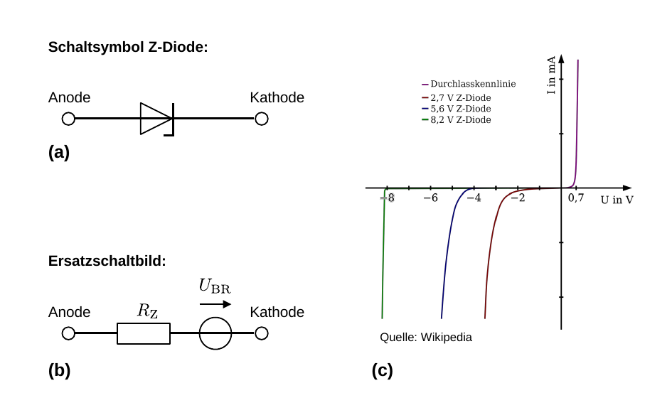
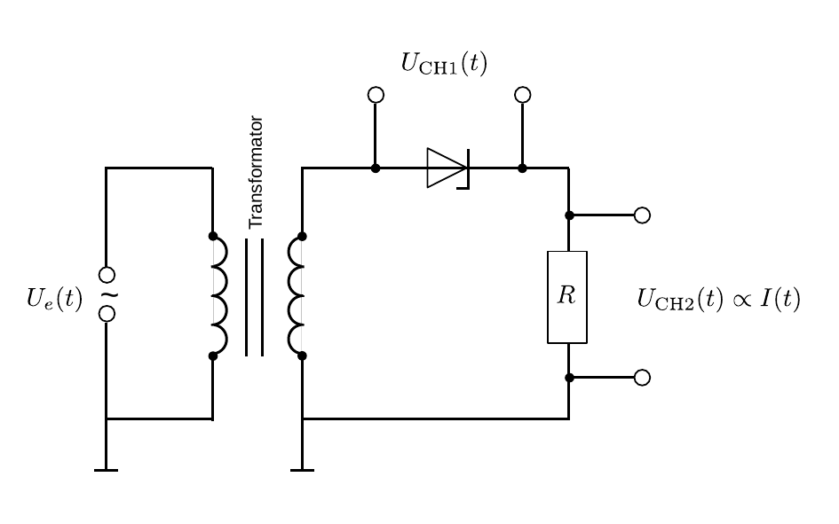

# Hinweise für den Versuch Oszilloskop

## Z-Diode

Bei der [Z-Diode](https://de.wikipedia.org/wiki/Z-Diode) (Zener-Diode) handelt es sich um eine Diode, die ab einer gewissen Spannung –der **Durchbruchspannung ($U_{\mathrm{BR}}$)**– auch in Sperrrichtung durchlässig wird. Das Schaltzeichen einer Z-Diode (a), das Ersatzschaltbild (b), sowie einige typische $I(U)$-Kennlinien (c) sind in **Abbildung 1** gezeigt:

---

**Abbildung 1**: (Schaltzeichen (a), Ersatzschaltbild (b) und einige typische $I(U)$-Kennlinien (c) einer Z-Diode)

---

Im Ersatzschaltbild bezeichnet $R_{\mathrm{Z}}$ den [differentiellen Widerstand](https://de.wikipedia.org/wiki/Differentieller_Widerstand) der Diode. Die Z-Diode wird i.a. in Sperrrichtung betrieben. Die zugrunde liegenden Mechanismen, die zum Spannungsdurchbruch führen unterscheiden sich im Übergang von niedrigen ($U_{\mathrm{BR}}\lesssim3\hspace{0.05cm}\mathrm{V}$) zu größeren Durchbruchspannungen. Anwendungen liegen im Bereich der Spannungsbegrenzung und der Spannungstabilisierung.  

## Darstellung der $I(U)$-Kennlinie

Verwenden Sie zur Darstellung der $I(U)$-Kennlinie der Z-Diode das Schaltbild aus **Abbildung 2**:

---

**Abbildung 2**: (Schaltbild zur Aufnahme der $I(U)$-Kennlinie der Z-Diode)

---

Die Eingangsspannung $U_{e}(t)$ wird durch einen [Trenntransformator](https://de.wikipedia.org/wiki/Trenntransformator) eingekoppelt. Die über der Z-Diode abfallende Spannung $U_{\mathrm{CH1}}(t)$ liegt auf CH1 und gibt im XY-Modus die Ablenkung entlang der $x$-Achse vor. Um den Strom auf dem Oszilloskop sichtbar zu machen wird die Spannung $U_{\mathrm{CH2}}(t)\propto I(t)$ über einem Lastwiderstand $R$ abgegriffen. Die Spannung $U_{\mathrm{CH2}}$ liegt auf CH2 und bestimmt im XY-Modus die Ablenkung entlang der $y$-Achse. Da der Vorgang periodisch ist stellt sich ein stehendes Bild auf dem Oszilloskop ein, das der $I(U)$-Kennlinie der Z-Diode entspricht.  

## Essentials

Was Sie ab jetzt wissen sollten:

- Wie man die **$I(U)$-Kennlinie einer Diode** mit einem Oszilloskop im XY-Modus anzeigen kann. 

- Welches Signal jeweils auf CH1 und CH2 darzustellen ist.

## Testfragen

1. Wie sieht der Proportionalitätsfaktor zu $U_{\mathrm{CH1}}(t)\propto I(t)$ aus? Sind $U_{\mathrm{CH1}}(t)$ und $I(t)$ in Phase?
2. Welches Bild erwarten Sie, wenn Sie die Z-Diode durch eine normale Diode austauschen? 
3. Welches Bild erwarten Sie, wenn Sie die Z-Diode durch einen Kondensator austauschen? Handelt es sich dabei um eine Kennlinie?
4. Was ist die Funktion eines Trenntransformators?

#  Navigation

[Main](https://gitlab.kit.edu/kit/etp-lehre/p1-praktikum/students/-/tree/main/Oszilloskop)

