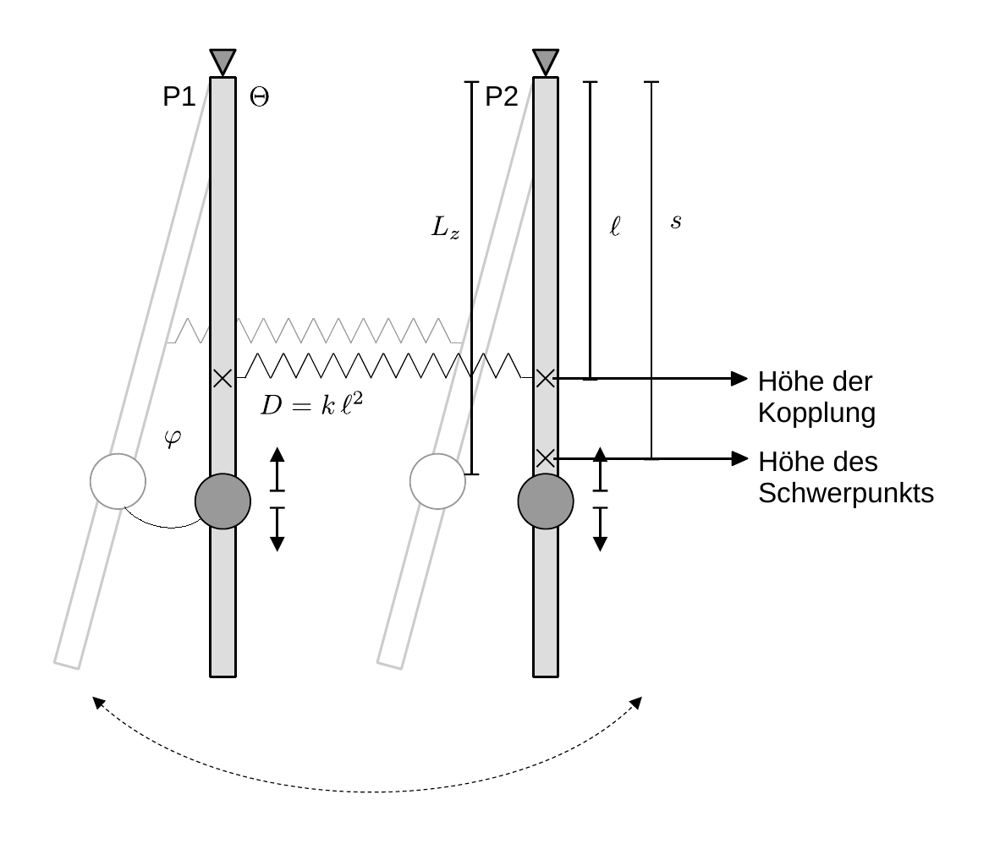

# Hinweise für den Versuch Pendel

## Gekoppelte Pendel

### Bewegungsgleichungen gekoppelter Pendel

Für diesen Versuch verwenden Sie zwei Pendel P1 und P2, die durch eine [Schraubenfeder](https://de.wikipedia.org/wiki/Feder_(Technik)) mit der Federkonstanten $k$ auf Höhe $\ell$ miteinander gekoppelt sind, wie in **Abbildung 2** gezeigt:

---

**Skizze 2** (Schematische Darstellung zweier gekoppelter Pendel P1 und P2)

---

Lenkt man P1 relativ zu P2 um den Winkel $\Delta\varphi$ aus ergeben sich in der Kleinwinkelnäherung aus $k$ und $\ell$ die folgenden Zusammenhänge für die rücktreibende Kraft $F_{r}$ und das rücktreibende Drehmoment $M_{r}$ der Feder:
$$
\begin{equation}
\begin{split}
F_{r}=-k\,\ell\,\Delta\varphi;\quad M_{r}=F_{r}\,\ell = &-\underbrace{k\,\ell^{2}}\,\Delta\varphi.\\
&\hphantom{cc}\equiv D
\end{split}
\end{equation}
$$ {=}
Die Richtungen von $F_{r}$ und $M_{r}$ hängen vom Vorzeichen von $\Delta\varphi$ ab. Man bezeichnet $D$ als das [Direktionsmoment](https://de.wikipedia.org/wiki/Direktionsmoment). 

Zur Vereinfachung der Diskussion gehen wir davon aus, dass beide Pendel das gleiche Trägheitsmoment $\Theta$ besitzen und vernachlässigen Dämpfungseffekte. Die Auslenkung jedes einzelnen Pendels sei $\varphi_{1/2}$. Für die Bewegung jeweils eines Pendels gilt die Bewegungsgleichung: 
$$
\begin{equation*}
\Theta\,\ddot{\varphi}_{i} + mgs\,\varphi_{i} =0\qquad i=1,2.
\end{equation*}
$$

Hinzu kommt das jeweilige Drehmoment $M_{1/2}$ aufgrund der Kopplung durch die Feder:
$$
\begin{equation*}
\begin{split}
&M_{1} = -D\left(\varphi_{1}-\varphi_{2}\right);\\
&\\
&M_{2} = -D\left(\varphi_{2}-\varphi_{1}\right).\\
\end{split}
\end{equation*}
$$
Hieraus folgen die Bewegungsgleichungen der beiden [gekoppelten Pendel](https://de.wikipedia.org/wiki/Gekoppelte_Pendel): 
$$
\begin{equation}
\begin{split}
&\Theta\,\ddot{\varphi}_{1} + mgs\,\varphi_{1} - D\left(\varphi_{2}-\varphi_{1}\right) = 0;\\
&\\
&\Theta\,\ddot{\varphi}_{2} + mgs\,\varphi_{2} + D\left(\varphi_{2}-\varphi_{1}\right) = 0\\
\end{split}
\end{equation}
$$
Das Gleichungssystem **(2)** ist gekoppelt, weil $\varphi_{1}$ in der Bewegungsgleichung zu $\varphi_{2}$ vorkommt und umgekehrt. Mit dem **Lösungsansatz harmonischer Schwingungen**:
$$
\begin{equation*}
\varphi_{i} = \Phi_{i}\sin(\omega t+\phi)\qquad i=1,2
\end{equation*}
$$
ergibt sich ein sekundäres Gleichungssystem für $\omega$, das in Matrixschreibweise die folgende Form annimmt: 
$$
\begin{equation}
\begin{split}
&\underbrace{
\left(
\begin{array}{cc}
\left(\frac{mgs}{\Theta} + \frac{D}{\Theta}\right) -\omega^{2} & -\frac{D}{\Theta} \\ 
-\frac{D}{\Theta} &\left(\frac{mgs}{\Theta} + \frac{D}{\Theta}\right) -\omega^{2} \\ 
\end{array}
\right)}
\left(\begin{array}{c}
\Phi_{1} \vphantom{\left(\frac{mgs}{\Theta} + \frac{k\ell^{2}}{\Theta}\right)} \\ 
\Phi_{2} \vphantom{\left(\frac{mgs}{\Theta} + \frac{k\ell^{2}}{\Theta}\right)}\\
\end{array}
\right) = 
\left(\begin{array}{c}
0 \vphantom{\left(\frac{mgs}{\Theta} + \frac{k\ell^{2}}{\Theta}\right)} \\ 
0 \vphantom{\left(\frac{mgs}{\Theta} + \frac{k\ell^{2}}{\Theta}\right)}\\
\end{array}
\right).\\
&\hphantom{ccccccccccccccccc}\equiv B\\
\end{split}
\end{equation}
$$
Gleichung **(3)** entspricht einem **Eigenwertproblem**, dessen Lösung sich auf die Lösung des [charakteristischen Polynoms](https://de.wikipedia.org/wiki/Charakteristisches_Polynom) zurückführen lässt, dass Sie aus der linearen Algebra kennen. Die Lösungen des charakteristischen Polynoms entsprechen den [Eigenmoden](https://de.wikipedia.org/wiki/Eigenmode) der Anordnung, die man in diesem Fall auch als **Fundamentalschwingungen** bezeichnet. 

Man erhält das charakteristische Polynom aus 
$$
\begin{equation*}
\det\left(B\right)=0,
\end{equation*}
$$
mit den Lösungen
$$
\begin{equation*}
\omega_{1}^{2} = \frac{mgs}{\Theta},\qquad
\omega_{2}^{2} = \frac{mgs}{\Theta}+2\frac{D}{\Theta}.
\end{equation*}
$$
Die Eigenvektoren zu diesen Eigenwerten sind:
$$
\begin{equation*}
\hat{v}_{1} = 
\left(\begin{array}{c}
\hphantom{-}1\hphantom{-} \\ 
\hphantom{-}1\hphantom{-} \\
\end{array}
\right);\qquad
\hat{v}_{2} = 
\left(\begin{array}{c}
\hphantom{-}1\hphantom{-} \\ 
-1\hphantom{-} \\
\end{array}
\right).
\end{equation*}
$$
### Lösungen

Die physikalische Interpretation der Lösung von Gleichung **(3)** ist intuitiv: 

- Im Fall der **Fundamentalschwingung mit $\boldsymbol{\omega_{1}}$** schwingen beide Pendel in Phase, die koppelnde Schraubenfeder bleibt entspannt und das Direktionsmoment für beide Pendel entspricht effektiv $D_{\omega_{1}}=mgs$, so als wären P1 und P2 nicht gekoppelt. 
- Im Fall der **Fundamentalschwingung mit $\boldsymbol{\omega_{2}}$** schwingen beide Pendel gegenphasig, die koppelnde Feder bewirkt *zusätzlich* zum Schwerefeld $g$ ein maximales Hook'sches Direktionsmoment, das nach dem dritten Newtonschen Axiom ("actio gleich reactio") die Form $D_{\omega_{2}}=2\,D$ hat. der Faktor 2 rührt daher, dass beide Pendel mit ihren Auslenkungen zu $D_{\omega_{2}}$ beitragen.

Die allgemeine Lösung ist eine Superposition aus beiden [Eigenmoden](https://de.wikipedia.org/wiki/Eigenmode):
$$
\begin{equation}
\vec{\varphi}(t) = A_{1} \left(\begin{array}{c}
\hphantom{-}1\hphantom{-} \\ 
\hphantom{-}1\hphantom{-} \\
\end{array}
\right)
\sin(\omega_{1}t+\phi_{1}) + 
A_{2} \left(\begin{array}{c}
\hphantom{-}1\hphantom{-} \\ 
-1\hphantom{-} \\
\end{array}
\right)
\sin(\omega_{2}t+\phi_{2}).
\end{equation}
$$
Anschaulich beschreibt diese allgemeine Lösung eine [Schwebung](https://de.wikipedia.org/wiki/Schwebung) mit der Frequenz 
$$
\begin{equation}
\overline{\omega} = \frac{1}{2}(\omega_{1}+\omega_{2})
\end{equation}
$$
und einer Amplitudenmodulation mit der Frequenz
$$
\begin{equation}
\widetilde{\omega} = \frac{1}{2}(\omega_{2}-\omega_{1}).
\end{equation}
$$
Dieser Verlauf ergibt sich aus einer geeigneten Anwendung der [trigonometrischen Additionstheoreme](https://de.wikipedia.org/wiki/Formelsammlung_Trigonometrie#Summen_zweier_trigonometrischer_Funktionen_(Identit%C3%A4ten)) auf Gleichung **(4)**. Die Konstanten der Integration $A_{1/2}$ und $\phi_{1/2}$ sind durch die Randwerte des Problems festgelegt.

Wenn Sie z.B. zum Zeitpunkt $t=0$ P1 in seiner Ruhelage festhalten und P2 auslenken, wird die Schwingung mit der Zeit von P2 nach P1 übergehen, bis P2 vollständig zum Stillstand kommt! Daraufhin wird die Schwingung mit $\overline{\omega}$ periodisch mit der Frequenz $\widetilde{\omega}$ zwischen P1 und P2 hin und her wandern.   

### Trägheitsmoment eines einzelnen Pendels

Das Trägheitsmoment $\Theta_{\mathrm{P}}$ eines einzelnen Pendels können Sie mit Hilfe des Satzes von Steiner, dem Trägheitsmoment $\Theta_{\mathrm{S}}$ einer (um ihren Schwerpunkt rotierenden) Scheibe und dem Trägheitsmoment $\Theta_{\mathrm{Stab}}$ eines (um ein Ende rotierenden) dünnen Stabs abschätzen:
$$
\begin{equation*}
\begin{split}
&\Theta_{\mathrm{S}} = \frac{1}{2}m_{\mathrm{S}}\,r^{2}; \qquad
\Theta_{\mathrm{Stab}}=\frac{1}{3}m_{\mathrm{Stab}}\,L_{\mathrm{Stab}}^{2};\\
&\\
&\Theta_{\mathrm{P}} = \Theta_{\mathrm{Stab}}+\Theta_{\mathrm{S}}+m_{\mathrm{S}}\,L^{2}+m_{\kappa}\ell^{2},
\end{split}
\end{equation*}
$$
wobei $m_{\mathrm{S}}$ der Masse der Scheibe, $L$ dem Abstand zwischen Aufhängung und Schwerpunkt der Scheibe, $r$ dem Radius der Scheide, $m_{\mathrm{Stab}}$ und $L_{\mathrm{Stab}}$ der Masse und Länge des Pendelstabs, $m_{\kappa}$ der Masse der Kopplung zur Befestigung der koppelnden Feder und $\ell$ dem Abstand zwischen den Kopplungen und den Aufhängung der Pendel entsprechen. Bei einer solchen Abschätzung vernachlässigen Sie die Ausdehnung der Kopplung. 

### Bestimmung der Federkonstanten $k$

Das Hooksche Gesetzt elastisch verformbarer Körper lautet:
$$
\begin{equation*}
\mathrm{d}F = k\,\mathrm{d}z.
\end{equation*}
$$
Danach lässt sich die Federkonstante $k$ aus der Auslenkung $\mathrm{d}z$ der Feder bestimmen, wenn man Sie mit verschiedenen bekannten Massen $m_{i}$ belastet:
$$
\begin{equation}
m_{i}\,g -k\,\mathrm{d}z_{i} = 0.
\end{equation}
$$
Alternativ lässt sich $k$ aus der Verwendung der Feder als Fedependel bestimmen. Hierzu hängt man die Feder senkrecht auf, belastet Sie mit einem einzelnen Gewicht $m$ und bestimmt die Periode
$$
\begin{equation}
T_{0}^{2} = 4\pi^{2}\frac{\,m}{k}.
\end{equation}
$$
Das Direktionsmoment $D$ ergibt sich aus dem in Gleichung **(1)** festgestellten Zusammenhang
$$
\begin{equation*}
D=k\,\ell^{2}.
\end{equation*}
$$

## Essentials

Was Sie ab jetzt wissen sollten:

- Sie sollten beschreiben können, wie Gleichung **(2)** zustande kommt und wie man sie löst.
- Die **Frequenzen der Fundamentalschwingungen** zweier gekoppelter Pendel sollten Ihnen bekannt sein.
- Die **Eigenmoden der Fundamentalschwingungen** sollten Ihnen anschaulich klar sein. 

## Testfragen

1. Durch welche Eigenschaft der Matrix in Gleichung **(3)** ist garantiert, dass dieses Problem immer zwei reelle Lösungen $\omega_{1}$ und $\omega_{2}$ besitzt? Um welche Klasse von Eigenwertproblemen handelt es sich also?
1. Wie kann man $\omega_{1}$ und $\omega_{2}$ aus $\overline{\omega}$ und $\widetilde{\omega}$ bestimmen?
1. Kann im Fall des gekoppelten Pendels Entartung der Eigenwerte vorliegen?
1. Ist bei der Bestimmung von $k$ aus den Gleichungen **(7)** oder **(8)** nicht das Eigengewicht der Feder zu berücksichtigen?

#  Navigation

[Main](https://gitlab.kit.edu/kit/etp-lehre/p1-praktikum/students/-/tree/main/Pendel)
