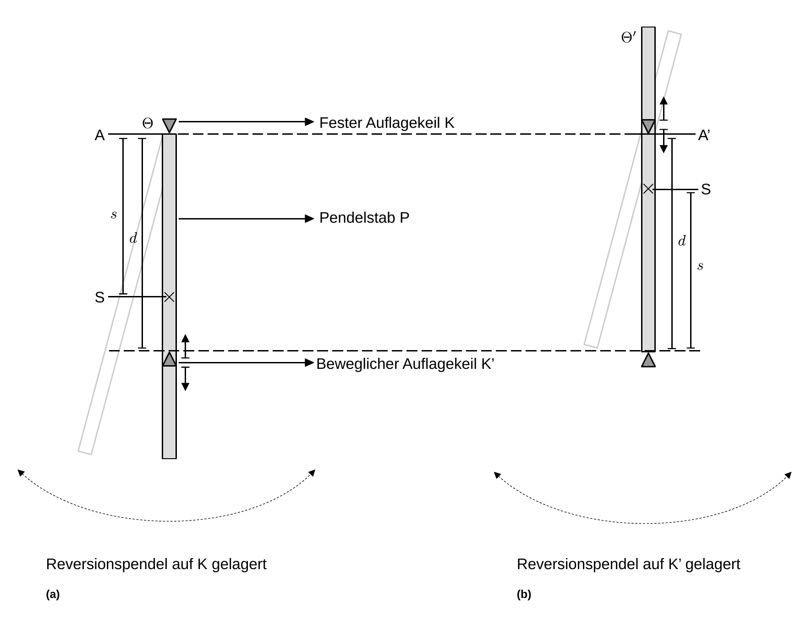

# Hinweise für den Versuch Pendel


## Reversionspendel

### Eigenschaften des Reversionspendels

Beim [Reversionspendel](https://de.wikipedia.org/wiki/Reversionspendel) handelt es sich um ein Pendel, das in der [Gravimetrie](https://de.wikipedia.org/wiki/Gravimetrie), d.h. zur (lokalen) Messung der Erdbeschleunigung $g$ verwendet wird. Grundsätzlich lässt sich $g$ aus der Periode $T_{0}$ des [physikalischen Pendels](https://de.wikipedia.org/wiki/Physikalisches_Pendel), wie folgt berechnen:
$$
\begin{equation}
T_{0} = 2\pi\sqrt{\frac{\Theta}{m\,g\,s}};\qquad g = \frac{4\pi^{2}}{T_{0}^{2}}\frac{\Theta}{m\,s}.
\end{equation}
$$
Dabei entspricht $s$ dem Abstand zwischen der Aufhängung A und dem Schwerpunkt S, $\Theta$ dem Trägheitsmoment und $m$ der Masse des Pendels. Die Schwierigkeit bei der Verwendung von Gleichung **(1)** besteht darin $\Theta$ und $s$ *exakt* zu bestimmen. 

Das Reversionspendel ist eine einfache Konstruktion, um diese Schwierigkeit experimentell und auf elegante Weise zu umgehen. Es besteht aus einem Pendelstab P, einem (K) festen und einem (K') verschiebbaren Auflagekeil, wie in **Abbildung 1** gezeigt:

---



**Abbildung 1**: (Schematischer Aufbau eines Reversionspendels. In Abbildung (a) ist die Auflage auf dem festen Keil K, in Abbildung (b) die Auflage auf dem beweglichen Keil K' gezeigt)

---

Für die weitere Diskussion gehen wir von der folgenden vereinfachten Konstruktion aus: 

- Das Pendel liegt grundsätzlich mit K im Punkt A auf (**Abbildung 1a**).
- K' kann entlang P verschoben werden. Beachten Sie, dass sich dabei sowohl $\Theta$, als auch der Abstand $d$ zwischen K und K' ändern; 
- Die Abmessungen von K und K' sind der Art, dass ihre jeweiligen Schwerpunkte in den Auflagepunkten angenommen und die Trägheitsmomente aufgrund ihrer endlichen Ausdehnung vernachlässigt werden können. 
- Dreht man P um $180^{\circ}$ liegt es mit K' im Punkt A' auf (**Abbildung 1b**).   

Die [reduzierte Länge](https://de.wikipedia.org/wiki/Physikalisches_Pendel) $\ell_{r}$ des physikalischen Pendels entspricht der Länge, die ein hypothetisches [mathematisches Pendel](https://de.wikipedia.org/wiki/Mathematisches_Pendel) mit der gleichen Periode $T_{0}$ hätte:
$$
\begin{equation*}
\begin{split}
&T_{0}=2\pi\sqrt{\frac{\ell_{r}}{g}};\qquad T_{0} = 2\pi\sqrt{\frac{\Theta}{m\,g\,s}}\\
&\\
&\ell_{r}\equiv\frac{\Theta}{m\,s}\qquad(\text{reduzierte L\"ange}).\\
\end{split}
\end{equation*}
$$
Die Schwingung des physikalischen Pendels ist also zur Schwingung eines mathematischen Pendels der Länge $\ell_{r}$ *äquivalent*. 

### Spezialfall: Langer dünner Stab

Für einen dünnen Stab der Länge $\ell$, der um einen seiner Endpunkte schwingt gilt für $\Theta$ und $s$:
$$
\begin{equation*}
\Theta = \frac{1}{3}m\,\ell^{2}; \qquad s = \frac{1}{2}\ell.
\end{equation*}
$$
 Daraus ergeben sich $\ell_{r}$ und $T_{0}$ zu 
$$
\begin{equation}
\begin{split}
&\ell_{r} = \frac{\frac{1}{3}m\,\ell^{2}}{\frac{1}{2}\ell\,m} = \frac{2}{3}\ell; \\
&\\
&T_{0} =2\pi\sqrt{\frac{\ell_{r}}{g}}=2\pi\sqrt{\frac{2\,\ell}{3\,g}}. 
\end{split}
\end{equation}
$$
Positioniert man K' im Abstand $d=\ell_{r}$ zu A besitzt das Reversionspendel zwei **bemerkenswerte, nicht-triviale Eigenschaften**: 

- **Eine zusätzliche Masse $\boldsymbol{m'}$ in der Position $\boldsymbol{d=\ell_{r}}$ ändert $\boldsymbol{T_{0}}$ nicht**. In diesem Fall ändern sich $\Theta$ und $s$ wie folgt:

  ```math
  \begin{equation*}
  \begin{split}
  &\Theta\to\Theta' = \frac{1}{3}m\,\ell^{2} + m'\left(\frac{2}{3}\ell\right)^{2};\\
  &\\
  &\\
  &s\,\,\to s'\, = \frac{\frac{1}{2}\ell\,m+\frac{2}{3}\ell\,m'}{m+m'}\\
  &\\
  &\\
  &T_{0} = 2\pi\sqrt{\frac{\Theta'}{(m+m')\,g\,s'}} = 2\pi\sqrt{\frac{(\frac{1}{2}m\ell+\frac{2}{3}m'\ell)\frac{2}{3}\ell}{(\frac{1}{2}\ell\,m+\frac{2}{3}\ell\,m')g}} = 2\pi\sqrt{\frac{2\,\ell}{3\,g}}.\\
  \end{split}
  \end{equation*}
  ```

  Der Vergleich mit Gleichung **(2)** zeigt, dass $T_{0}$ tatsächlich unverändert bleibt! 

- **Dreht man das Pendel um $\boldsymbol{180^{\circ}}$ um, schwingt es mit der gleichen Periode $\boldsymbol{T_{0}}$**. Beachten Sie hierzu **Abbildung 1b**. In gedrehtem Zustand befindet sich 1/3 des Stabs oberhalb der Aufhängung. Für das Direktionsmoment gilt daher:

  ```math
  \begin{equation*}
  D' = \frac{1}{6}\ell\,m\,g.
  \end{equation*}
  ```

  Für das Trägheitsmoment gilt nach dem [Satz von Steiner](https://de.wikipedia.org/wiki/Steinerscher_Satz):

  ```math
  \begin{equation*}
  \Theta' = \frac{1}{12}m\ell^{2}+m\left(\frac{1}{6}\ell\right)^{2} = \frac{1}{9}m\,\ell^{2}.
  \end{equation*}
  ```

  Daraus ergibt sich für $T_{0}$:

  ```math
  \begin{equation*}
  T_{0} = 2\pi\sqrt{\frac{\Theta'}{D'}}=2\pi\sqrt{\frac{\frac{1}{9}m\,\ell^{2}}{\frac{1}{6}\ell\,m\,g}} = 2\pi\sqrt{\frac{2\,\ell}{3\,g}}.
  \end{equation*}
  ```

  Der Vergleich mit Gleichung **(1)** zeigt, dass $T_{0}$ tatsächlich unverändert bleibt! 

**Beide Eigenschaften sind hier für einen Spezielfall gezeigt, der auf den Versuch anwendbar ist. Sie gelten aber (ohne Beweis) allgemein!** Ausführliche Betrachtungen zum Reversionspendel gehen auf [Friedrich Wilhelm Bessel](https://de.wikipedia.org/wiki/Friedrich_Wilhelm_Bessel) zurück. 

Unabhängig von der exakten Form des Pendels, lässt sich die Position $d=\ell_{r}$ zwischen K und K' also z.B. dadurch auffinden, dass $T_{0}$ für die Aufhängungen in den Punkten A und A' jeweils den gleichen Wert hat. Hat man $d=\ell_{r}$ sicher aufgefunden lässt sich $g$, ohne Kenntnis von $\Theta$ oder $s$,  aus der Gleichung
$$
\begin{equation*}
g = \frac{4\pi^{2}}{T_{0}^{2}}\ell_{r} = \frac{4\pi^{2}}{T_{0}^{2}}d
\end{equation*}
$$
bestimmen.

## Essentials

Was Sie ab jetzt wissen sollten:

- Sie sollten sich über das Prinzip des Reversionspendels im klaren sein.
- Sie sollten die für den Spezialfall des dünnen Stabs vorgestellten Eigenschaften des Reversionspendels diskutieren können.
- Sie sollten sich über den **Verlauf von $T_{0}(\varphi_{0})$** im klaren sein.   

## Testfragen

1. Was könnte an der Bestimmung von $\Theta$ und $s$ so unsicher sein?
1. Kann man mit dem Reversionspendel präziser messen als mit dem Fadenpendel?

# Navigation

[Main](https://gitlab.kit.edu/kit/etp-lehre/p1-praktikum/students/-/tree/main/Pendel)

