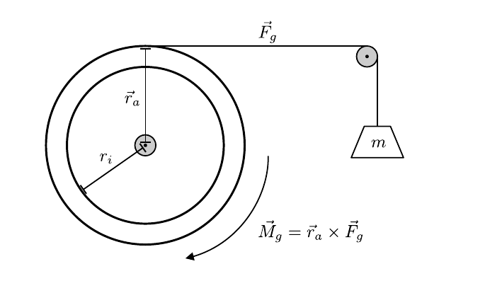

# Hinweise für den Versuch Resonanz

## Experimentelle Bestimmung des Trägheitsmoments $\Theta$

Die experimentelle Bestimmung von $\Theta$ erfolgt über eine statische Messung der Winkelrichtgröße $D$, wie in **Abbildung 1** gezeigt:  

---

**Abbildung 1**: (Skizze zur Messung von $D$)

---

Der Faden wirkt als [Kraftwandler](https://de.wikipedia.org/wiki/Kraftwandler) für die Kraft 
$$
\begin{equation*}
\vec{F}_{g}=m\,\vec{g}.
\end{equation*}
$$
Wenn Sie den Faden so anbringen, dass er über die Radnut bei $r=r_{a}$ führt gilt: 
$$
\begin{equation*}
\left|\vec{M}_{g}\right|=\left|\vec{r}_{a}\times\vec{F}_{g}\right| = r_{a}\,F_{g}; \qquad \vec{r}_{a}\perp\vec{F}_{g}.
\end{equation*}
$$
Aus der Momentenfreiheit im statischen Fall ergibt sich  
$$
\begin{equation*}
D\,\varphi=r_{a}\,F_{g}=r_{a}\,g\,m.
\end{equation*}
$$
Mit Hilfe der Messungen von $D$ und $\omega_{0}$ können Sie $\Theta$ aus Gleichung **(3)** [hier](https://gitlab.kit.edu/kit/etp-lehre/p1-praktikum/students/-/tree/main/Resonanz/doc/Hinweise-Schwingung.md) bestimmen.

## Abschätzung von $\theta$

Zum Vergleich können Sie $\Theta$ aus der zylindrischen Geometrie des [Pohlschen Rads](https://de.wikipedia.org/wiki/Pohlsches_Rad) wie folgt abschätzen:
$$
\begin{equation*}
\Theta = \int\limits_{r_{i}}^{r_{a}}r^{2}\mathrm{d}m = \int\limits_{r_{i}}^{r_{a}}r^{3}\,d\,\rho\,\mathrm{d}r\,\mathrm{d}\phi = \frac{\pi}{2}\rho\,d\left(r_{a}^{4}-r_{i}^{4}\right),
\end{equation*}
$$
wobei $r_{i}$ der innere Radius, $r_{a}$ der äußere Radius, $d$ die Dicke und $\rho$ die Dichte des Pohlschen Rads sind. Die entsprechenden Werte können Sie aus der Datei [Datenblatt.md](https://gitlab.kit.edu/kit/etp-lehre/p1-praktikum/students/-/tree/main/Resonanz/Datenblatt.md) entnehmen. In diesem Fall berücksichtigen Sie lediglich den Ring des Schwungrads und nehmen an, dass dieser eine homogene Massenverteilung besitzt. 

## Essentials

Was Sie ab jetzt wissen sollten:

- Sie sollten sich darüber im Klaren sein, wie die **Bestimmung von $D$** erfolgt. 

## Testfragen

1. In welche Richtung weist $\vec{M}_{g}$ in **Abbildung 1**?
2. Was ist so wichtig daran, dass der Faden über die Radnut im Abstand $r_{a}$ läuft? 

# Navigation

[Main](https://gitlab.kit.edu/kit/etp-lehre/p1-praktikum/students/-/blob/main/Resonanz)

