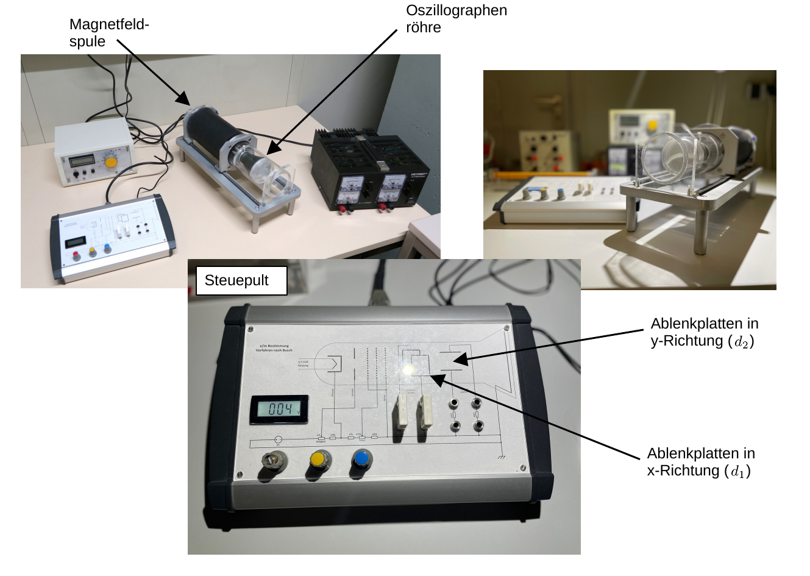

# Fakultät für Physik

## Physikalisches Praktikum P1 für Studierende der Physik

Versuch P1-71, 72, 73 (Stand: **Oktober 2024**)

[Raum F1-14](https://labs.physik.kit.edu/img/Klassische-Praktika/Lageplan_P1P2.png)

# Spezifische Ladung des Elektrons

## Motivation

Das [Elektron](https://de.wikipedia.org/wiki/Elektron) wurde 1897 von [Joseph John Thomson](https://de.wikipedia.org/wiki/Joseph_John_Thomson) bei der systematischen Untersuchung der [Kathodenstrahlen](https://de.wikipedia.org/wiki/Elektronenstrahl) entdeckt. Solche Untersuchungen wurden mit Apparaturen wie dem in diesem Versuch vorgestellten [Fadenstrahlrohr](https://de.wikipedia.org/wiki/Fadenstrahlrohr) durchgeführt. Damals wusste man nichts über die Existenz des Elektrons und hatte so gut wie keine Vorstellung über den elementaren Aufbau der Materie. Die Erkenntnis, dass es sich bei den Kathodenstrahlen um Teilchenstrahlen handelt und die Eigenschaften dieser Teilchen wurden der Natur in diesen Jahren Schritt für Schritt abgerungen. 

Heute kennen wir die Eigenschaften des Elektrons sehr genau. Wir wissen, dass die [Elementarladung](https://de.wikipedia.org/wiki/Elementarladung) $e=1.6\times10^{-19}\ \mathrm{C}$ in der Natur quantisiert auftritt. Die Masse des Elektrons von etwa $m_{\mathrm{e}}=511\ \mathrm{keV/c^{2}}$ ist uns bis auf die 11. Nachkommastelle bekannt! Eine kleinste Einheit der Masse, wie im Fall der Ladung, wurde bisher jedoch noch nicht beobachtet. Wir nehmen an, dass das Elektron ein punktförmiges Teilchen ohne weitere Struktur ist. Diese Annahme haben wir bisher bis auf Längenskalen von $10^{-19}\ \mathrm{m}$ getestet und bestätigt gefunden! 

Mit diesem Versuch lernen Sie die Methoden kennen, mit denen man vor über 100 Jahren das Tor in die Welt der kleinsten bekannten Bausteine der Materie aufgetan hat. Gleichzeitig lernen Sie eine Reihe wichtiger Anwendungen der Elektro- und Magnetostatik kennen bei denen $\vec{E}$ und $\vec{B}$-Felder oftmals gemeinsam auftreten. Schließlich bieten Ihnen die sichtbar gemachten Bahnen der Elektronenstrahlen die Möglichkeit die Bewegungen von Ladungen in elektrischen und magnetischen Feldern mit eigenen Augen im Experiment zu beobachten. Das Prinzip die Spuren geladener Teilchen (für unsere Augen) sichtbar zu machen liegt allen Experimenten der modernen Elementarteilchenphysik bis zum heutigen Tag zugrunde.

## Lehrziele

Wir listen im Folgenden die wichtigsten **Lehrziele** auf, die wir Ihnen mit dem Versuch **Spezifische Ladung des Elektrons** vermitteln möchten: 

- Sie üben sich im sicheren Umgang mit **hohen Spannungen und Strömen**. 
- Sie beobachten die sichtbaren Bahnen von Elektronenstrahlen in elektrischen und magnetischen Feldern als intuitive Anwendung der **Gesetzmäßigkeiten der Elektro- und Magnetostatik**.
- Sie lernen mehrere Anwendungen des Gesetzes von [**Biot-Savart**](https://de.wikipedia.org/wiki/Biot-Savart-Gesetz) im Experiment kennen.
- Sie vergegenwärtigen sich die Funktionsweise der [**Hall-Sonde**](https://de.wikipedia.org/wiki/Hall-Sensor) zur Vermessung magnetischer Felder, sowie der [**Braunschen Röhre**](https://de.wikipedia.org/wiki/Kathodenstrahlr%C3%B6hre). 
- Sie lernen das [Fadenstrahlrohr](https://de.wikipedia.org/wiki/Fadenstrahlrohr) als historisches Instrument zur Bestimmung der [spezifischen Ladung](https://de.wikipedia.org/wiki/Spezifische_Ladung) des Elektrons $e/m_{\mathrm{e}}$ und zur Untersuchung von Kathodenstrahlen kennen. 

## Versuchsaufbau

Der Versuchsaufbau besteht aus zwei Teilen: Dem Aufbau zum Betrieb des Fadenstrahlrohrs und dem Aufbau zur Bestimmung von $e/m_{\mathrm{e}}$ nach [Hans Busch](https://de.wikipedia.org/wiki/Hans_Busch_(Physiker)). Den Messungen mit dem Fadenstrahlrohr geht die Vermessung des Magnetfelds im Inneren eines Helmholtz-Spulenpaars voran. Eine Auflistung der einzelnen technischen Geräte zum Betrieb der jeweiligen Versuchsteile und deren Eigenschaften finden Sie im [Datenblatt](https://gitlab.kit.edu/kit/etp-lehre/p1-praktikum/students/-/tree/main/Spezifische_Ladung_des_Elektrons/Datenblatt.md) zum Versuch. 

### Fadenstrahlrohr

ein typischer Aufbau des Fadenstrahlrohr ist in **Abbildung 1** gezeig:

---

**Abbildung 1**: (Aufbau des Fadenstrahlrohrs)

----

Beim Fadenstrahlrohr handelt es sich um einen teil-evakuierten, mit Wasserstoff gefüllten Glaskolben (mit einem Innendruck von $\approx 0.013\ \mathrm{mbar}$) mit einer geeigneten Vorrichtung zur Erzeugung eines kontinuierlichen Elektronenstrahls. Die Elektronen werden aus einer Glühkathode mit indirekter Heizung abgedampft und durch eine Ringanode unter hoher Spannung beschleunigt. Ein [Wehneltzylinder](https://de.wikipedia.org/wiki/Wehneltzylinder) dient zur Fokussierung des resultierenden Elektronenstrahls. 

Die Elektronen des Strahls stoßen auf ihrer Bahn durch den Kolben zufällig mit Molekülen des Wasserstoffs, die so zu sichtbarem Leuchten angeregt werden. Auf diese Weise kann die Bahn des Elektronenstrahls sichtbar gemacht werden. Der Kolben befindet sich zentral zwischen zwei [Helmholtz-Spulen](https://de.wikipedia.org/wiki/Helmholtz-Spule), die im Folgenden auch mit $H_{1}$ (hintere Spule in Blickrichtung in der oberen Abbildung) und $H_{2}$ (vordere Spule in Blickrichtung in der oberen Abbildung) bezeichnet werden. 

### Magnetfeld im Inneren des Fadenstrahlrohrs

Ein typischer Aufbau zur Vermessung des Magnetfelds im Inneren des Fadenstrahlrohrs ist in **Abbildung 2** gezeigt:

---

**Abbildung 2**: (Aufbau zur Vermessung des Magnetfelds im Inneren des Fadenstrahlrohrs)

---

Hierzu dient Ihnen eine dritte Helmholtz-Spule $H_{3}$, die Sie symmetrisch zum im Fadenstrahlrohr verbauten Spulenpaar positionieren können. Mit Hilfe eines Holzbretts $M$ mit Milimeter-Skala und einer [Hall-Sonde](https://de.wikipedia.org/wiki/Hall-Effekt) können Sie das Magnetfeld zwischen $H_{3}$ und $H_{2}$ ausmessen. Zur Kalibration der Hall-Sonde dient das bekannte Mangetfeld einer langen Zylinderspule.  

### Oszillographenröhre für das Verfahren von Busch

Ein typishcer Aufbau zur Anwendung des Verfahrens von Busch ist in **Abbildung 3** gezeigt:

---

**Abbildung 3**: (Aufbau zur Anwendung des Verfahrens von Busch)

---

In einem Plexiglaszylinder befindet sich eine alte Oszillographenröhre, die zwei Paare von Kondensatorplatten (Deflektorplatten) zur Ablenkung des Elektronenstrahls in $x$- und $y$-Richtung besitzt. Der Plexiglaszylinder befindet sich im Magnetfeld $\vec{B}$ einer Spule. Zu Anschauungszwecken lässt sich diese Spule zurück schieben, so dass die darin befindliche Oszillographenröhre einsichtig ist. Die Anordnung wird so betrieben, dass **$\vec{B}$ parallel zum elektrischen Feld $\vec{E}_{z}$** der Beschleunigungsspannung $U_{z}$ ausgerichtet ist. Ohne zusätzliche Beschleunigung senkrecht zu $\vec{z}$ erfahren die Elektronen durch $\vec{B}$ keine Ablenkung und der Elektronenstrahl erscheint als Signal in einem Punkt auf dem Schirm S. Liegt an den Deflektorplatten eine Spannung $U_{x}$ oder $U_{y}$ zur Ablenkung des Elektronenstahls senkrecht zur $z$-Achse an, werden die Elektronen auf spiralförmige Trajektorien gelenkt, die bei festen Werten von $U_{z}$ und $B=|\vec{B}|$ abhängig von der Position des Schirms entweder wieder als Punkt, oder als Strich auf dem Schirm abgebildet werden. 

## Anmerkungen zum Versuch

- **Für diese Versuche werden gefährliche elektrische Spannungen verwendet!** Während des Aufbaus und während aller Veränderungen an den Schaltungen dürfen daher *keine* Geräte eingeschaltet sein. Bei jeder neuen Schaltung ist das erste Einschalten **nur nach Kontrolle durch den Betreuer** erlaubt. 
- **Sie haben nicht nur mit hohen elektrischen Spannungen sondern auch mit u.U. hohen magnetischen Feldern zu tun.** Stromdurchflossene Leiter haben induktive Impedanzen. Schalten Sie die Stromversorgung der Magnetspulen nicht plötzlich aus, sondern regeln Sie diese bei den Ein- ober Ausschaltvorgängen nach oben oder unten bevor Sie die Netzgeräte ein- oder ausschalten.  
- Vermeiden Sie, bei der Bestimmung von $e/m_{\mathrm{e}}$ nach dem Verfahren von Busch, hohe **Leuchtdichten an der Oszillographenröhre**, damit der Schirm nicht einbrennt. Der mechanische Aufbau im Innern einer Oszillographenröhre ist nicht so perfekt, dass der Strahl die Schirmmitte treffen muss.
- Einen gelungen *virtuellen* Aufbau zur Bestimmung der spezifischen Ladung des Elektrons mit Hilfe des Fadenstrahlrohrs können Sie unter der Webseite [virtuelle-experimente.de](https://virtuelle-experimente.de/b-feld/e-m-bestimmung/edurchm.php) im Internet finden.  

# Navigation

- [Spezifische_Ladung_des_Elektrons.iypnb](https://gitlab.kit.edu/kit/etp-lehre/p1-praktikum/students/-/blob/main/Spezifische_Ladung_des_Elektrons/Spezifische_Ladung_des_Elektrons.ipynb): Aufgabenstellung und Vorlage fürs Protokoll.
- [Spezifische_Ladung_des_Elektrons_Hinweise.ipynb](https://gitlab.kit.edu/kit/etp-lehre/p1-praktikum/students/-/blob/main/Spezifische_Ladung_des_Elektrons/Spezifische_Ladung_des_Elektrons_Hinweise.ipynb): Hinweise zu den Aufgaben.
- [Datenblatt.md](https://gitlab.kit.edu/kit/etp-lehre/p1-praktikum/students/-/blob/main/Spezifische_Ladung_des_Elektrons/Datenblatt.md): Technische Details zu den Versuchsaufbauten.
- [doc](https://gitlab.kit.edu/kit/etp-lehre/p1-praktikum/students/-/tree/main/Spezifische_Ladung_des_Elektrons/doc): Dokumente zur Vorbereitung auf den Versuch.
- [figures](https://gitlab.kit.edu/kit/etp-lehre/p1-praktikum/students/-/tree/main/Spezifische_Ladung_des_Elektrons/figures): Bilder, die für die Dokumentation des Versuchs verwendet wurden.
