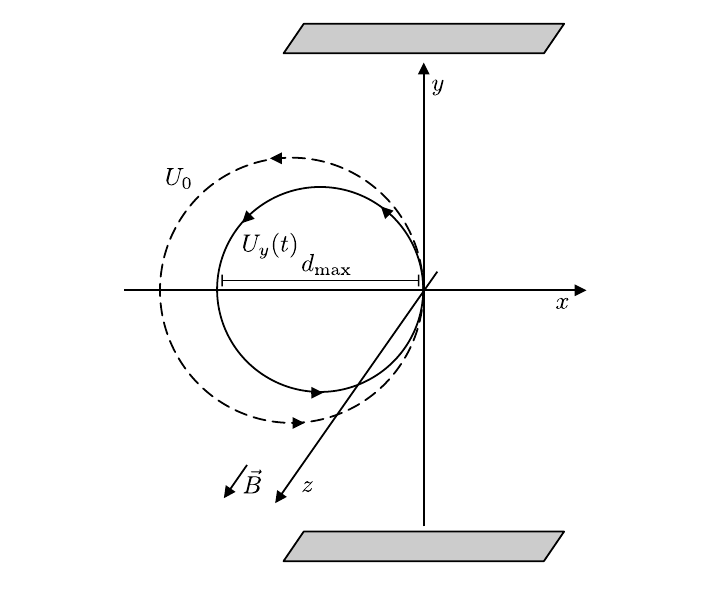
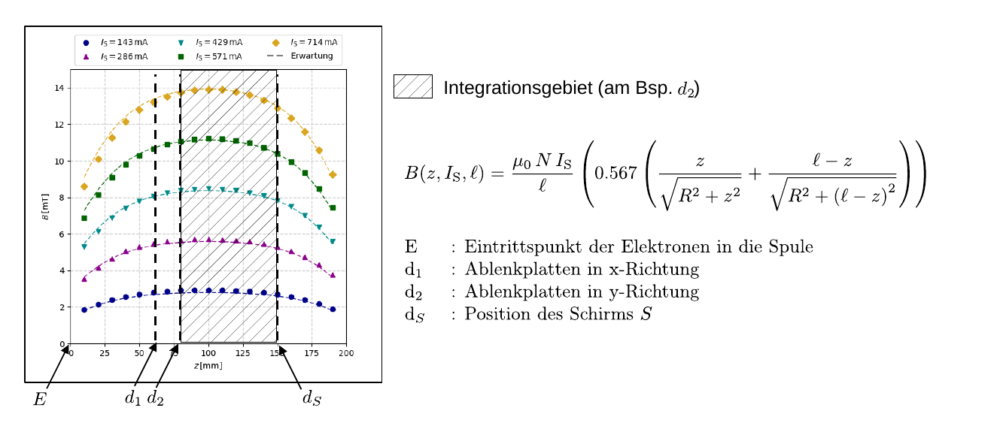

# Hinweise für den Versuch Spezifische Ladung des Elektrons

## Methode von Busch

Wir stellen uns zunächst vor, dass eine zeitlich veränderliche, positive Spannung 
$$
\begin{equation*}
U_{y}(t)\in [0;U_{0}]
\end{equation*}
$$
für die Ablenkung des Elektronenstrahls in (positiver) $y$-Richtung an die Deflektorplatten angelegt wird. Diese Spannung führt zu einer Kreisbahn der Elektronen in der $xy$-Ebene, wie in **Abbildung 1** gezeigt: 

---

**Abbildung 1**: (Kreisbahn der Elektronen in der $xy$-Ebene. Die grauen Flächen stellen die Deflektorplatten dar)

---

Die Trajektorien der Elektronen formen eine Schar von Spiralbahnen im Halbraum für $x\leq0$. Nachdem sie diese vollständig durchlaufen haben, treffen sie (**unabhängig von $U_{y}$**) in einem festen Punkt $z_{0}$ wieder mit der $z$-Achse zusammen. Der genaue Wert von $z_{0}$ hängt dabei von $U_{z}$ und $B$ ab. Fällt $z_{0}$ mit der Position von S zusammen erscheint der Elektronenstrahl auf S wieder als Punkt. Für jede andere Position 
$$
\begin{equation*}
z\neq n\,z_{0},\quad n\in\mathbb{N}
\end{equation*}
$$
verlaufen die Trajektorien im (aus Strahlrichtung) rechten Halbraum. Der Durchmesser der Kreisbahnen, denen Sie dabei folgen hängt von der Spannung $U_{y}$ ab, die selbst wiederum jeden Wert zwischen 0 und $U_{0}$ annehmen kann. Daher wird, wenn die Position von S nicht mit $z_{0}$ zusammenfällt, der Elektronenstrahl als Strich auf S sichtbar. 

Erweitern wir den Wertebereich auf 
$$
\begin{equation*}
U_{y}\in [-U_{0};U_{0}],
\end{equation*}
$$
entsteht eine analoge Schar von Spiralbahnen in der Halbebene zu $x\gt 0$, die die $z$-Achse ebenfalls unabhängig von $U_{y}$ in $z_{0}$ berühren. Der Strich, wenn die Position von S nicht mit $z_{0}$ zusammenfällt, erweitert sich entsprechend entlang der positiven $x$-Achse.

In der Versuchsanordnung entspricht $z=0$ der Eintrittsebene E des Elektronenstrahls in die Spule. Sowohl der Abstand $d_{S}$ zwischen E und S entlang der $z$-Achse, als auch $U_{z}$ sind fest vorgegeben. $B$ wird so justiert, dass der Elektronenstrahl auf dem Weg $d_{S}-d_{i}$, vom verwendeten Deflektorzentrum im Abstand $d_{i}$ von E bis S, in der $xy$-Ebene genau einen Vollkreis durchläuft. In diesem Fall fällt $d_{S}-d_{i}$ genau mit $n\,z_{0},\hspace{0.05cm}n\in\mathbb{N}$ zusammen.  

### Berechnung von $e/m_{e}$

Beim hier verwendeten Aufbau sind die Voraussetzungen für eine als *lang* angenommene Spule aus Gleichung **(3)** [hier](https://gitlab.kit.edu/kit/etp-lehre/p1-praktikum/students/-/blob/main/Spezifische_Ladung_des_Elektrons/doc/Hinweise-Fadenstrahlrohr.md) nicht mehr erfüllt. Die Gleichung muss daher auf die folgende Weise modifiziert werden:
$$
\begin{equation}
\begin{split}
&B(z, I_{\mathrm{S}}, \ell)=B_{0}
\left(0.567\left(
\frac{z}{\sqrt{R^{2}+z^{2}}}+
\frac{\ell-z}{\sqrt{R^{2}+(\ell-z)^{2}}}
\right)\right); \\
&\\
&\text{mit:}\\
&\\
&B_{0}(I_{\mathrm{S}}, N, \ell) = \mu_{0}\,\frac{N\,I_{\mathrm{S}}}{\ell},
\\
\end{split}
\end{equation}
$$
wobei $\ell$ die Länge und $R$ der mittlere Radius der Spule sind. Die Berechnung von $B_{0}$ folgt Gleichung **(3)** [hier](https://gitlab.kit.edu/kit/etp-lehre/p1-praktikum/students/-/blob/main/Spezifische_Ladung_des_Elektrons/doc/Hinweise-Fadenstrahlrohr.md). Einen Vergleich der mit Hilfe von Gleichung **(1)** bestimmten, erwarteten Werte von $B(z,I_{\mathrm{S}},\ell)$ mit einer Kalibrationsmessung, für fünf verschiedene Spulenströme $I_{\mathrm{S}}$ ist in **Abbildung 2** gezeigt:

---

**Abbildung 2**: (Vergleich von $B(z,I_{\mathrm{S}},\ell)$ aus Gleichung **(1)** mit entsprechenden Messwerten für fünf verschiedene Spulenströme)

---

Die Marker entsprechen den Messpunkten und die gestrichelten Linien der Erwartung nach Gleichung **(1)**. 

Der Zusammenhang zwischen der Geschwindigkeit der Elektronen in $z$-Richtung und $U_{z}$ an der Oszillographenröhre 
$$
\begin{equation*}
v_{z} = \sqrt{2\,U_{z}\,e/m_{\mathrm{e}}}
\end{equation*}
$$
folgt aus Gleichung **(2)** [hier](https://gitlab.kit.edu/kit/etp-lehre/p1-praktikum/students/-/blob/main/Spezifische_Ladung_des_Elektrons/doc/Hinweise-Fadenstrahlrohr.md). Für die Kreisbahn der Elektronen in der $xy$-Ebene gilt: 
$$
\begin{equation}
\begin{split}
&e\,v\hphantom{/}\,\langle B\rangle = m_{e}\frac{v^{2}}{r};\\
&\\
&e/m_{\mathrm{e}}\,\langle B\rangle = \frac{v}{r} = \omega = 2\,\pi\frac{v_{z}}{d_{S}-d_{i}},\\
\end{split}
\end{equation}
$$
wobei $\omega$ der Kreisfrequenz der Bewegung in der $xy$-Ebene entspricht. Beachten Sie, das $\langle B\rangle$ dem gemittelten Magnetfeld 
$$
\begin{equation*}
\langle B\rangle = \frac{1}{d_{S}-d_{i}} \int\limits_{d_{i}}^{d_{S}}B(z, I_{\mathrm{S}}, \ell)\,\mathrm{d}z = K \,I
\end{equation*}
$$
entspricht. Dabei wurden auf der rechten Seite der Gleichung alle Abhängigkeiten bis auf die Abhängigkeit von $I_{\mathrm{S}}$ zu einem Geometriefaktor zusammengefasst, der **vom gewählten Deflektorplattenpaar in $d_{1}$ oder $d_{2}$ abhängt**. Der Integrationsweg am Beispiel der Deflektorplatten in Position $d_{2}$ ist durch die schraffierte Fläche in **Abbildung 2** gezeigt. Daraus ergibt sich der finale Zusammenhang:

$$
\begin{equation*}
\begin{split}
&e/m_{\mathrm{e}}\,\langle B\rangle^{2} = \frac{8\pi}{\left(d_{S}-d_{i}\right)^{2}}\,U_{z};\\
&\\
&I_{\mathrm{S}}^{2} = \frac{8\pi}{e/m_{\mathrm{e}}\,K^{2}\,\left(d_{S}-d_{i}\right)^{2}}\,U_{z}.\\
\end{split}
\end{equation*}
$$

Trägt man $I_{\mathrm{S}}^{2}$ gegen $U_{z}$ aufkann man $e/m_{\mathrm{e}}$ aus der Steigung sich ergebenden Geraden ableiten.

## Essentials

Was Sie ab jetzt wissen sollten:

- Das Prinzip der Messung nach Busch und der **Verlauf der Trajektorien des Elektronenstrahls** sollten Ihnen klar sein. 
- Sie sollten den Faktor $K$ berechnen können.  

## Testfragen

1. Wieviele Deflektorplattenpaare sind für die Messung im Einsatz? 
1. Für welches Deflektorplattenpaar ist $\langle B\rangle$ größer? 
1. Welchen Effekt erwarten Sie durch die endliche Ausdehung der Deflektorplatten?
1. Warum hängt die Gleichung für die Bestimmung von $e/m_{\mathrm{e}}$ nicht von $U_{y}$ ab?

# Navigation

[Main](https://gitlab.kit.edu/kit/etp-lehre/p1-praktikum/students/-/tree/main/Spezifische_Ladung_des_Elektrons)
