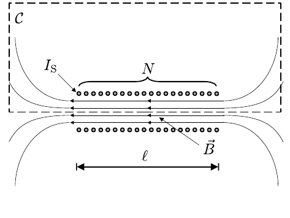
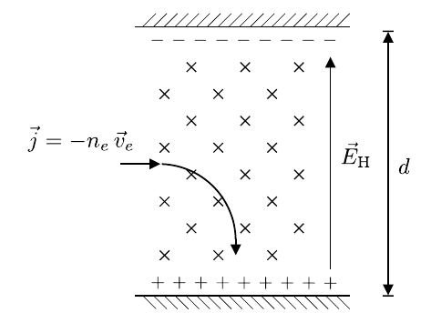

# Hinweise für den Versuch Spezifische Ladung des Elektrons

## Fadenstrahlrohr

### Elektronenstrahl im homogenen Magnetfeld

In einem homogenen Magnetfeld der Stärke $\vec{B}$ wird ein Elektron senkrecht zu seiner Bewegungsrichtung durch die [Lorentzkraft](https://de.wikipedia.org/wiki/Lorentzkraft) abgelenkt, wie in **Abbildung 1** dargestellt:

---

**Abbildung 1**: (Bahn eines Elektrons im Magnetfeld)

---

Für den Fall  $\vec{v}_{e}\perp\vec{B}$ gilt: 
$$
\begin{equation}
e\,B\,v_{\mathrm{e}} = m_{\mathrm{e}}\,\frac{v_{\mathrm{e}}^{2}}{r}, \qquad \frac{e}{m_{\mathrm{e}}}= \frac{v_{\mathrm{e}}}{B\,r},
\end{equation}
$$
wobei $v_{\mathrm{e}}$ der Geschwindigkeit des Elektrons und $r$ dem Radius seiner Bahn entsprechen. Aus der am Fadenstrahlrohr anliegenden Beschleunigungsspannung $U$ lässt sich $v_{\mathrm{e}}$ wie folgt bestimmen:
$$
\begin{equation}
e\,U = \frac{m\,v_{\mathrm{e}}^{2}}{2}, \qquad v_{\mathrm{e}} = \sqrt{2\,U\,\frac{e}{m_{\mathrm{e}}}}.
\end{equation}
$$
Aus den Gleichungen **(1)** und **(2)** ergibt sich der Zusammenhang
$$
\begin{equation*}
\frac{8\,U}{B^{2}} = \frac{e}{m_{\mathrm{e}}}\,d^{2},
\end{equation*}
$$
aus dem sich $e/m_{\mathrm{e}}$ als Steigung einer Ursprungsgeraden bestimmen lässt, wenn man auf der $x$-Achse $d^{2}$ und auf der $y$-Achse $8\hspace{0.05cm}U/B^{2}$ aufträgt. Dabei bezeichnet $d$ den Durchmesser der Kreisbahn.

### Magnetfeld einer langen Spule

Das Magnetfeld einer langen Spule lässt sich mit Hilfe des [Ampèreschen Gesetzes](https://de.wikipedia.org/wiki/Amp%C3%A8resches_Gesetz#Magnetfeld_der_Spule) leicht berechnen: 
$$
\begin{equation}
B(I_{\mathrm{S}}, N, \ell) = \mu_{0}\,\frac{N\,I_{\mathrm{S}}}{\ell},
\end{equation}
$$
wobei $\mu_{0}$ der [magnetischen Feldkonstanten](https://de.wikipedia.org/wiki/Magnetische_Feldkonstante), $I_{\mathrm{S}}$ dem Strom durch die Spule, $N$ der Anzahl der Windungen und $\ell$ der Länge der Spule entsprechen. Die Berechnung erfolgt über den [Satz von Stokes](https://de.wikipedia.org/wiki/Satz_von_Stokes), wie in **Abbildung 2** skizziert:

---

**Abbildung 2**: (Integrationspfad zur Anwendung des Satzes von Stokes)

---

Im Inneren der langen Spule verläuft $\vec{B}$ parallel zur Symmetrieachse der Spule. Außerhalb der Spule fällt $\vec{B}$ sehr schnell ab. Schließt man den Integrationpfad $\mathcal{C}$ in einem Bogen, der weit genug von der Spule entfernt liegt kann dort $\vec{B}=0$ angenommen werden. Daraus folgt: 
$$
\begin{equation*}
\oint\limits_{\mathcal{C}}\vec{B}\cdot\mathrm{d}\vec{s} = B\,\ell = \mu_{0}\,N\,I_{\mathrm{S}}.
\end{equation*}
$$

### Magnetfeld im Inneren zweier Helmholtz-Spulen

Unter der Bedingung, das der Abstand zwischen zwei [Helmholtz-Spulen](https://de.wikipedia.org/wiki/Helmholtz-Spule) $H_{1}$ und $H_{2}$ dem Radius $R$ der Spulen entspricht ist davon auszugehen, dass die **[Stärke des Magnetfelds $B(r)$ auf der radialen Symmetrieachse des Spulenpaares](https://de.wikipedia.org/wiki/Helmholtz-Spule#Berechnung_der_magnetischen_Flussdichte) besonders homogen** ist. Dabei bezeichnet $r$ den radialen Abstand von der Symmetrieachse der Spulen. In diesem Fall erwartet man in $r=0$, nach dem [Gesetz von Biot-Savart](https://de.wikipedia.org/wiki/Biot-Savart-Gesetz), die Feldstärke

$$
\begin{equation}
B(r=0) = \frac{8}{\sqrt{125}}\,\frac{\mu_{0}\,N\,I_{\mathrm{S}}}{R}.
\end{equation}
$$
Dieser Formel liegt die Annahme zugrunde, dass beide Spulen **in allen in Gleichung (3) auftretenden Parametern baugleich** sind.

### Hall-Effekt

Wird ein stromdurchflossenes ausgedehntes Leiterstück senkrecht zur Stromdichte $\vec{j}$ von einem Magnetfeld $\vec{B}$ durchsetzt kommt es, durch die Wirkung der Lorentzkraft im Leiter, zur Ladungstrennung, wie in **Abbildung 3** gezeigt:

---

**Abbildung 2**: (Mikroskopisches Modell des Hall-Effekts)

---

Durch die getrennten Ladungen baut sich eine endliche Spannung, die Hall-Spannung $U_{\mathrm{H}}$, senkrecht zu $\vec{j}$ auf für die im Gleichgewichtszustand gilt: 
$$
\begin{equation*}
\begin{split}
&e\,v_{e}\,B = e\,E_{\mathrm{H}};\vphantom{\frac{I\,B}{b\,n_{e}}}\\
&\\
&E_{\mathrm{H}}=\frac{U_{\mathrm{H}}}{d}; \qquad v_{e}=\frac{I}{A\,n_{e}};\qquad A=d\,b;\qquad I=\vec{j}\cdot\vec{A};\\
&\\
&U_{\mathrm{H}} = \frac{I\,B}{b\,n_{e}},\\
\end{split}
\end{equation*}
$$

wobei $n_{e}$ der Ladungsträgerdichte im Leiter und $b$ der Breite des Leiterstücks entsprechen, es gilt also $U_{\mathrm{H}}\propto B$. 

## Essentials

Was Sie ab jetzt wissen sollten:

- Die Gleichungen **(1)** und **(2)** bilden die Grundlage für 95% aller kinematischen Betrachtungen bei der **Bewegung von Ladungen in elektrischen und magnetischen Feldern**. Diese beiden Gleichgungen sollten Ihnen geläufig sein. 

- Sie sollten das **$B$-Feld einer langen Spule** mit Hilfe des Satzes von Stokes ableiten können. 
- Sie sollten den **Hall-Effekt** kennen und sich die Formel für die Berechnung von $U_{\mathrm{H}}$ als Anwendung der Gleichungen **(1)** und **(2)** ableiten können.

## Testfragen

1. Wie groß ist die typische **Driftgeschwindigkeit** von Elektronen in einem Leiter? 
1. Nach welcher Zeitspanne würde sich die Hall-Spannung in einem Metall wie Kupfer für einen Strom von $I=100\ \mathrm{mA}$ aufbauen?
1. Wie vergleicht sich die Driftgeschwindigkeit zur **thermischen Geschwindigkeit** der Elektronen in einem Metall? 

# Navigation

[Main](https://gitlab.kit.edu/kit/etp-lehre/p1-praktikum/students/-/tree/main/Spezifische_Ladung_des_Elektrons)
