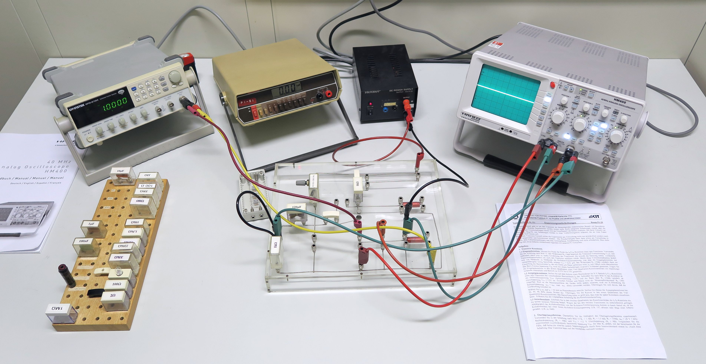

# Fakultät für Physik

## Physikalisches Praktikum P1 für Studierende der Physik

Versuch P1-50, 51, 52 (Stand: August 2024)

[Raum F1-09](https://labs.physik.kit.edu/img/Praktikum/Lageplan_P1.png)

# Transistor und Operationsverstärker

## Motivation

Die historisch ersten elektronischen Verstärker wurden als [Elektronenröhren](https://de.wikipedia.org/wiki/Elektronenr%C3%B6hre), zwischen 1906 und 1914 v.a. für den Einsatz in der Telefonie entwickelt. Ab den 1940er Jahren erhielt der Röhrenverstärker jedoch Konkurrenz durch den [Transistor](https://de.wikipedia.org/wiki/Transistor), als funktionsgleichem Bauelement aus der sich rasant entwickelnden Halbleitertechnologie. Gegenüber dem Röhrenverstärker besitzt der Transistor entscheidende Vorteile: er ist kleiner, leichter, mechanisch robuster und günstiger herzustellen, besitzt eine höhere Linearität bei der Verstärkung und benötigt für den Betrieb keine komplizierte Beschaltung unter Hochspannung. Beim Begriff **Transistor** handelt es sich um ein [Kunstwort](https://de.wikipedia.org/wiki/Kofferwort), das aus dem englischen Begriff *transfer resistor* entstanden ist, der die Eigenschaft des Transistors als von außen steuerbarem, elektrischem Widerstand charakterisiert. Das erste Patent, dass die Funktionsweise eines Transistors beschreibt wurde 1925 vom US-amerikanischen Physiker [Julius Lilienfeld](https://de.wikipedia.org/wiki/Julius_Edgar_Lilienfeld) angemeldet. Im Jahr 1947 meldeten die ebenfalls US-amerikanischen Physiker [John Bardeen](https://de.wikipedia.org/wiki/John_Bardeen), [William Shockley](https://de.wikipedia.org/wiki/William_Bradford_Shockley) und [Walter Brattain](https://de.wikipedia.org/wiki/Walter_Houser_Brattain) den [Bipolartransistor](https://de.wikipedia.org/wiki/Bipolartransistor) zum Patent an. Im Jahr 1956 erhielten sie für ihre Arbeiten auf diesem Gebiet den **Nobelpreis für Physik**. Den Weg vom Transistor zum Operationsverstärker (OPV) ebnete ein halbes Jahrhundert der Ingeneurskunst. OPVs sind Verstärker und damit aktive Schaltelemente. Heute sind sie unverzichtbare Bestandteile jeder Schaltung zur elektronischen Aufzeichnung und Weiterverarbeitung von Daten. 

## Lehrziele

Wir listen im Folgenden die wichtigsten **Lehrziele** auf, die wir Ihnen mit dem Versuch **Transistor und Operationsverstärker** vermitteln möchten: 

- Transistoren und Operationsverstärker sind aktive Bauelemente und kompletieren damit den Grundkurs zur **Berechnung elektrischer Bauelemente** in Netzwerken. 
- Einzelne bipolare Transistoren sind heute nicht mehr in oft in modernen Schaltungen anzutreffen. Er bietet jedoch eine wichtige **Grundlage zum Verständnis und Umgang mit Bauelementen dieser Art**.
- Sie nehmen die **Kennlinie eines Transistors** auf und lernen sie kennen und verstehen. 
- Sie lernen zwei wichtige **Grundschaltungen zum Betrieb des bipolaren Transistors** kennen.
- Sie lernen die **Grundschaltungen des OPV** kennen, mit denen Sie von nun an sicher umgehen können sollten.

## Versuchsaufbau

Ein typischer Aufbau für den Versuch **Transistor und Operationsverstärker** ist in **Abbildung 1** gezeigt:

---

**Abbildung 1**: (Ein typischer Aufbau für den Versuch **Transistor und Operationsverstärker**)

---

Zum Aufbau der Schaltungen stehen Ihnen zwei Steckbretter, ein Funktionsgenerator, ein Multimeter und ein Oszilloskop zu Verfügung. Der Transistor und der Operationsverstärker sind fest mit den Steckbrettern verbaut.  Die Versorgung erfolgt mit Hilfe geeigneter Netzgeräte. Zur weiteren Beschaltung stehen Ihnen verschiedene ohmsche Widerstände und Kondensatoren zur Verfügung.   

## Wichtige Hinweise

- Gemeinsam mit den Versuchen [Elektrische Messverfahren](https://gitlab.kit.edu/kit/etp-lehre/p1-praktikum/students/-/tree/main/Elektrische_Messverfahren) und [Netzwerke und Leitungen](https://gitlab.kit.edu/kit/etp-lehre/p1-praktikum/students/-/tree/main/Netzwerke_und_Leitungen) gehört dieser Versuch zur Versuchsgruppe **Messverfahren**. Diese Versuche bauen aufeinander auf und sollten am besten nacheinander durchgeführt werden. 
- Transistoren sind empfindliche Bauelemente, die nicht unter zu hohen Kollektorströmen betrieben werden dürfen. Stecken Sie die Schaltungen ohne Spannung und lassen Sie sie vor Inbetriebnahme von Ihrem:r Tutor:in abnehmen.  

# Navigation

- [Transistor_und_Operationsverstärker.iypnb](https://gitlab.kit.edu/kit/etp-lehre/p1-praktikum/students/-/blob/main/Transistor_und_Operationsverstaerker/Transistor_und_Operationsverstaerker.ipynb): Aufgabenstellung und Vorlage für Ihr Protokoll.
- [Transistor_und_Operationsverstärker_Hinweise.ipynb](https://gitlab.kit.edu/kit/etp-lehre/p1-praktikum/students/-/blob/main/Transistor_und_Operationsverstaerker/Transistor_und_Operationsverstaerker_Hinweise.ipynb): Hinweise zu den Aufgaben.
- [Datenblatt.md](https://gitlab.kit.edu/kit/etp-lehre/p1-praktikum/students/-/blob/main/Transistor_und_Operationsverstaerker/Datenblatt.md): Technische Details zu den Versuchsaufbauten.
- [doc](https://gitlab.kit.edu/kit/etp-lehre/p1-praktikum/students/-/tree/main/Transistor_und_Operationsverstaerker/doc): Dokumente zur Vorbereitung auf den Versuch.
- [figures](https://gitlab.kit.edu/kit/etp-lehre/p1-praktikum/students/-/tree/main/Transistor_und_Operationsverstaerker/figures): Bilder, die für die Dokumentation des Versuche verwendet wurden.
