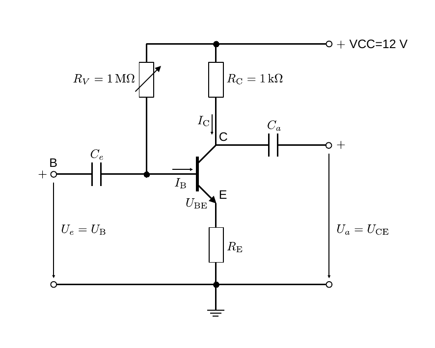
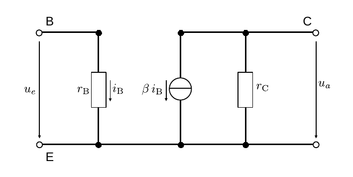
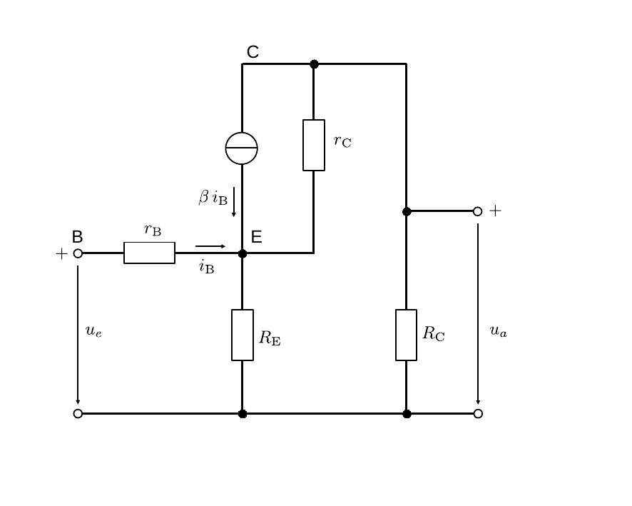
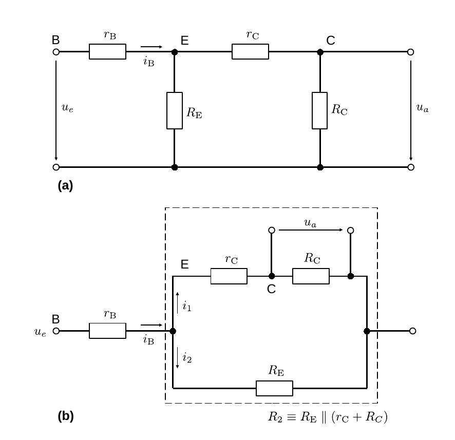
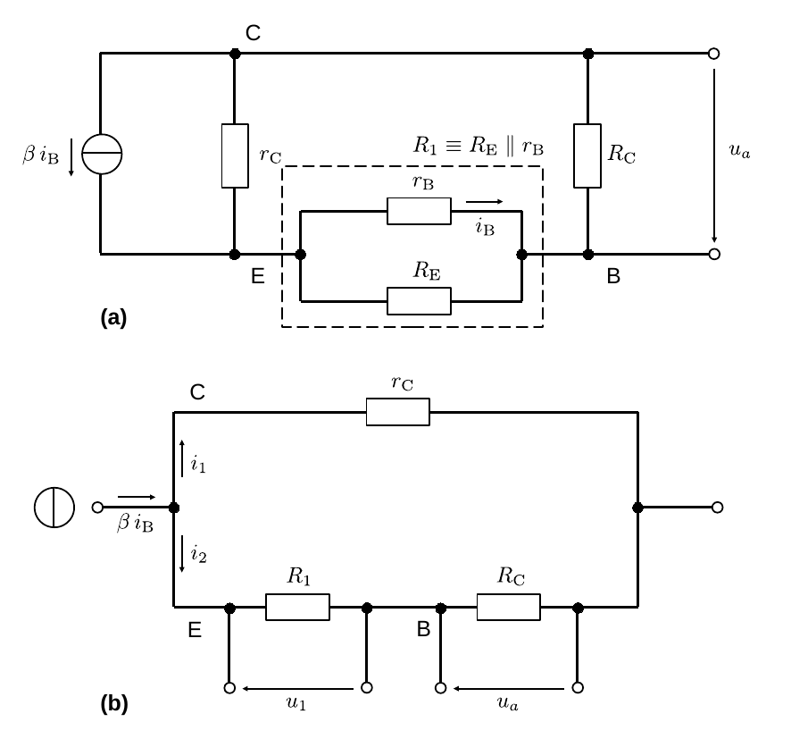
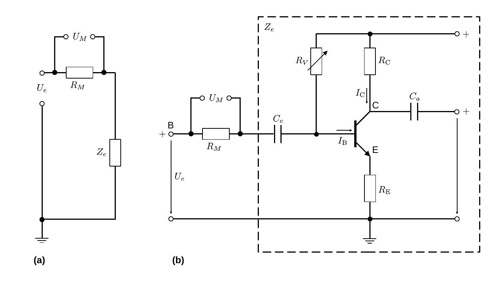

# Hinweise für den Versuch Transistor und Operationsverstärker

## Diskussion der Emitterschaltung

Der Name *Transistor* geht auf den englischen Begriff *transfer resistor* zurück, was auf die Eigenschaft verweist, dass $r_{\mathrm{C}}$ abhängig von $I_{\mathrm{B}}$ variiert: 

- Für $U_{\mathrm{BE}}=U_{\mathrm{B}}+ U_{D}\lesssim 0$ befindet sich der Transistor auf dem Ausgangstor im **Sperrbetrieb** ($r_{\mathrm{C}}\gg0$). 
- Für $U_{\mathrm{BE}}=U_{\mathrm{B}}+ U_{D}\gtrsim 0$ befindet sich der Transistor auf dem Ausgangstor im **Sättigungssbetrieb** ($r_{\mathrm{C}}\approx0$). 
- Für $U_{\mathrm{BE}}\approx 0$ fällt $r_{\mathrm{C}}$ von seinem Maximalwert auf Null ab und hängt dabei stark von $I_{\mathrm{B}}$ ab. In diesem Betrieb erfolgt die **Verwendung des Transistors als Verstärker**.

Der Betrieb eines Transistors als Verstärker erfolgt in der in **Abbildung 3** [hier](https://gitlab.kit.edu/kit/etp-lehre/p1-praktikum/students/-/blob/main/Transistor_und_Operationsverstaerker/doc/Hinweise-Transistor.md) gezeigten **Emitterschaltung**. Zwei Eigenschaften des Transistors machen i.a. eine weitere Beschaltung erforderlich:

- Der npn-Transistor verstärkt nur Spannungen von $U_{\mathrm{B}}\gtrsim -U_{D}$ und damit nur Signale fester (im Fall des npn-Transistors positiver) Polarität. Für bipolare Signale ist es daher notwendig dem Eingangssignal einen geeigneten *offset* zu geben. Der optimale **Arbeitspunkt für die Verstärkung eines symmetrisch-bipolaren Signals** ist für einen Steuerstrom $I_{\mathrm{B}}$ erreicht, für den $r_{\mathrm{C}}$ auf die Hälfte des Maximalwerts abgenommen hat. 

- Der Halbleitertransistor gehört zu den [Heißleitern](https://de.wikipedia.org/wiki/Hei%C3%9Fleiter), deren ohmscher Widerstand mit zunehmender Temperatur nicht *zu-*, sondern *abnimmt*. $I_{\mathrm{C}}$ führt zur Erwärmung des Transistors wodurch sich $r_{\mathrm{B}}$ und $r_{\mathrm{C}}$ verringern, woraufhin sich wiederum $I_{\mathrm{B}}$ und $I_{\mathrm{C}}$ erhöhen, was zu einem weiteren Anstieg der Temperatur führt. **Der Betrieb hängt stark von der Temperatur des Transistors ab** und zu starke Erwärmung kann den Transistor sogar zerstören. Es erweist sich daher als notwendig die maximal notwendige Stromverstärkung $\beta$ kontrolliert zu drosseln. Dies erreicht man z.B. mit Hilfe der **stromgegengekoppelten Emitterschaltung**.

## Stromgegengekoppelte Emitterschaltung

Die stromgegengekoppelte Emitterschaltung ist in **Abbildung 1** gezeigt:

---

  

**Abbildung 1**: (Stromgegengekoppelte Emitterschaltung)

---

- Die Kopplung von VCC an B über $R_{V}$ dient dazu, dem Eingangssignal für die Verstärkung einen geeigneten *offset* zu verleihen.
- $R_{\mathrm{C}}$ begrenzt den Stromfluss durch C.
- Die Koppelkondensatoren $C_{e}$ und $C_{a}$ dienen dazu das Signal von verbliebenen Gleichstromanteilen abzukoppeln.

Das entscheidende Bauteil zu Stromgegenkopplung ist $R_{\mathrm{E}}$. Über $R_{\mathrm{E}}$ fällt nun zusätzlich die Spannung

$$
\begin{equation*}
U_{R_{\mathrm{E}}} = I_{\mathrm{C}}\,R_{\mathrm{E}}
\end{equation*}
$$
ab. Nach den [Kirchhoffschen Regeln](https://de.wikipedia.org/wiki/Kirchhoffsche_Regeln) gilt: 
$$
\begin{equation*}
U_{\mathrm{B}} = U_{\mathrm{BE}} - U_{D}+U_{R_{\mathrm{E}}}.
\end{equation*}
$$
Da $U_{\mathrm{B}}=U_{e}$ fixiert und $U_{D}$ durch Gleichung **(1)** [hier](https://gitlab.kit.edu/kit/etp-lehre/p1-praktikum/students/-/blob/main/Transistor_und_Operationsverstaerker/doc/Hinweise-Transistor.md?ref_type=heads) fest vorgegeben ist, nimmt $U_{\mathrm{BE}}$ in dem Maße ab, in dem $U_{R_{\mathrm{E}}}$ zunimmt, was wiederum die Reduktion von $I_{\mathrm{C}}$ zur Folge hat. Die zusätzliche Beschaltung durch $R_{\mathrm{E}}$ wirkt also der Erhöhung von $I_{\mathrm{C}}$ entgegen.

### Dynamische Kenngrößen

Im diesem Abschnitt interessieren wir uns für die folgenden Kenngrößen der Schaltung: 

- Eingangsimpedanz $Z_{e}$; 
- Ausgangsimpedanz $Z_{a}$;
- Spannungsverstärkung $v_{U}$, 

die man auch als die **dynamischen Kenngrößen** der Schaltung bezeichnet. 

#### Berechnung

**Abbildung 2** [hier](https://gitlab.kit.edu/kit/etp-lehre/p1-praktikum/students/-/blob/main/Transistor_und_Operationsverstaerker/doc/Hinweise-Kennlinienfeld.md) zeigt, dass die Kennlinien der Transistorkenngrößen $r_{\mathrm{B}}$ und $r_{\mathrm{}C}$ nur über einen geringen Bereich des gewählten Arbeitspunkts als linear angenomen werden können. Zur Berechnung der dynamischen Kenngrößen verwenden wir daher das [statische Kleinsignalmodell](https://de.wikipedia.org/wiki/Ersatzschaltungen_des_Bipolartransistors#Statisches_Kleinsignalmodell): 

Wir ersetzen die BC-Diode durch eine [reale Stromquelle](https://gitlab.kit.edu/kit/etp-lehre/p1-praktikum/students/-/blob/main/Elektrische_Messverfahren/doc/Hinweise-Spannungsquellen.md) mit dem Innenwiderstand $r_{\mathrm{C}}$ und einen in Reihe geschalteten Innenwiderstand $r_{\mathrm{B}}$ für die BE-Diode, wie in **Abbildung 2** gezeigt. In beiden Fällen handelt es sich um lineare Bauelemente.

---

**Abbildung 2**: (Ersatzschaltbild eines Transistors in der Kleinsignalnäherung)

---

Zu sehen ist ein Netzwerk mit einer Spannungsquelle für $u_{e}$ und einer Stromquelle für $i_{\mathrm{B}}$. Solche Netzwerke berechnet man unter Verwendung des **Kirchhoffschen [Superpositionsprinzips](https://de.wikipedia.org/wiki/Superposition_(Physik)#Elektrotechnik)**: 

In einem Netzwerk mit mehreren Strom- oder Spannungsqellen berechnen sich alle gesamten Ströme und alle gesamten Spannungen aus der Summe der Ströme und Spannungen jeder einzelnen Quelle, wenn man die jeweils anderen Quellen (bis auf ihre Innenwiderstände) ignoriert.

In **Abbildung 2** setzt sich z.B. $u_{a}$ also aus zwei Anteilen zusammen, die zu addieren sind:

- Ein Anteil aus dem allein auf $u_{e}$ basierenden Schaltkreis, wofür die Quelle von $i_{\mathrm{B}}$ unterbrochen wird.
- Ein Anteil aus dem allein auf $i_{\mathrm{B}}$ basierenden Schaltkreis, wofür die Quelle von $u_{e}$ kurzgeschlossen wird.

Sie kennen das Superpositionsprinzip sicher für den Fall von mehreren Spannungsquellen in einem Schaltkreis. Für den hier auftretenden Fall einer zusätzlichen Stromquelle mag es Ihnen zunächst ungewohnt erscheinen.

Das Superpositionsprinzip erlaubt es uns für alle folgenden Berechnungen VCC, das nicht direkt zum Signal selbst beiträgt, kurzzuschließen. Damit wird gleichzeitig $R_{V}$ leitend überbrückt und kann aus allen weiteren Betrachtungen ausgeklammert werden.

Den Umstand, dass wir ab jetzt nur noch Signaländerungen relativ zum *offset* des Arbeitspunkts betrachten kennzeichnet man oft durch einem neuen Variabensatz in Kleinbuchstaben:
$$
\begin{equation}
\begin{split}
&U_{e}\to u_{e}; \\
&\\
&I_{\mathrm{B}}\to i_{\mathrm{B}}; \\
&\\
&U_{a}\to u_{a}; \\
&\\
&I_{\mathrm{C}}\to \beta\,i_{\mathrm{B}}
\end{split}
\end{equation}
$$

Das für die Berechnungen relevante Ersatzschaltbild der stromgegengekoppelten Emitterschaltung ist in **Abbildung 3** gezeigt:

---

**Abbildung 3**: (Ersatzschaltbild für die stromgegengekoppelte Emitterschaltung in der Kleinsignalnäherung)

---

Die Erstatzschaltung für $u_{e}$, bei unterbrochener Quelle für $i_{\mathrm{B}}$, ist in **Abbildung 4** gezeigt:

---

**Abbildung 4**: (Ersatzschaltbild für $u_{e}$ bei unterbrochener Quelle für $i_{\mathrm{B}}$. In Abbildung (b) ist das Schaltbild aus Abbildung (a) weiter standardisiert dargestellt. Der gestrichelte Kasten verbildlicht die Definition von $R_{2}$)

---

Aus diesem Netzwerk lassen sich die folgenden Zusammenhänge ableiten:
$$
\begin{equation}
\begin{split}
&R_{2}\equiv R_{\mathrm{E}}\parallel \left(r_{\mathrm{C}}+R_{\mathrm{C}}\right); \\
&\\
&i_{\mathrm{B}} = \frac{u_{e}}{r_{\mathrm{B}}+R_{2}}; \\
&\\
&i_{1}= \frac{i_{\mathrm{B}}\,R_{2}}{r_{\mathrm{C}}+R_{\mathrm{C}}};\\
&\\
&u_{a} = i_{1}\,R_{\mathrm{C}} = \frac{i_{\mathrm{B}}\,R_{2}\,R_{\mathrm{C}}}{r_{\mathrm{C}}+R_{\mathrm{C}}} = \frac{u_{e}\,R_{2}\,R_{\mathrm{C}}}{\left(r_{\mathrm{B}}+R_{2}\right)\left(r_{\mathrm{C}}+R_{\mathrm{C}}\right)}.\\
\end{split}
\end{equation}
$$
Die Erstatzschaltung für $i_{\mathrm{B}}$ nach Kurzschluss der Quelle für $u_{e}$ ist in **Abbildung 5** gezeigt:

---

**Abbildung 5**: (Ersatzschaltbild für $i_{\mathrm{B}}$ nach Kurzschluss der Quelle für $u_{e}$. In Abbildung (b) ist das Schaltbild aus Abbildung (a) weiter standardisiert dargestellt. Der gestrichelte Kasten verbildlicht die Definition von $R_{1}$)

----

Aus diesem Netzwerk lassen sich die folgenden Zusammenhänge ableiten:
$$
\begin{equation}
\begin{split}
&R_{1}\equiv r_{\mathrm{B}}\parallel R_{\mathrm{E}}; \\
&\\
&R_{\mathrm{ges}} = \left(\frac{1}{r_{\mathrm{C}}} + \frac{1}{R_{1}+R_{\mathrm{C}}}\right)^{-1} = \frac{r_{\mathrm{C}}\,\left(R_{1}+R_{\mathrm{C}}\right)}{R_{1}+R_{\mathrm{C}}+r_{\mathrm{C}}}; \\
&\\
&i_{2} = \frac{\beta\,i_{\mathrm{B}}\,R_{\mathrm{ges}}}{R_{1}+R_{\mathrm{C}}} = \frac{\beta\, i_{\mathrm{B}}\,r_{\mathrm{C}}}{R_{1}+R_{\mathrm{C}}+r_{\mathrm{C}}}; \\
&\\
&u = \beta\, i_{\mathrm{B}}\,R_{\mathrm{ges}}; 
\qquad u_{1} = -\frac{R_{1}}{R_{1}+R_{\mathrm{C}}}\,u \\
&\\
&\\
&i_{\mathrm{B}}^{\prime\prime}=  - \frac{u_{1}}{r_{\mathrm{B}}} = -\frac{\beta\, i_{\mathrm{B}}\,R_{\mathrm{ges}}}{r_{\mathrm{B}}}\,\frac{R_{1}}{R_{1}+R_{\mathrm{C}}} = -\frac{\beta\, i_{\mathrm{B}}\,r_{\mathrm{C}}\,R_{1}}{r_{\mathrm{B}}\,\left(R_{1}+R_{\mathrm{C}}+r_{\mathrm{C}}\right)};\\
&\\
&u_{a}^{\prime\prime} = -i_{2}\,R_{\mathrm{C}} = -\frac{\beta\, i_{\mathrm{B}}\,r_{\mathrm{C}}\,R_{\mathrm{C}}}{R_{1}+R_{\mathrm{C}}+r_{\mathrm{C}}}. \\
\end{split}
\end{equation}
$$
Wir fassen die Ausdrücke für $u_{a}$ und $i_{\mathrm{B}}$ aus den Gleichungen **(2)** und **(3)** nach de Superpositionsprinzip zusammen und erhalten:
$$
\begin{equation}
\begin{split}
&R_{1}\equiv r_{\mathrm{B}}\parallel R_{\mathrm{E}}; \qquad
R_{2}\equiv R_{\mathrm{E}}\parallel \left(r_{\mathrm{C}}+R_{\mathrm{C}}\right);\\
&\\
&\\
&i_{\mathrm{B}} = \frac{u_{e}}{r_{\mathrm{B}}+R_{2}}
-\frac{\beta\, i_{\mathrm{B}}\,r_{\mathrm{C}}\,R_{1}}{r_{\mathrm{B}}\,\left(R_{1}+R_{\mathrm{C}}+r_{\mathrm{C}}\right)}; \\
&\\
&u_{a} = \frac{u_{e}\,R_{2}\,R_{\mathrm{C}}}{\left(r_{\mathrm{B}}+R_{2}\right)\left(r_{\mathrm{C}}+R_{\mathrm{C}}\right)} 
-\frac{\beta\, i_{\mathrm{B}}\,r_{\mathrm{C}}\,R_{\mathrm{C}}}{R_{1}+R_{\mathrm{C}}+r_{\mathrm{C}}}. \\
\end{split}
\end{equation}
$$
Wir machen **für alle weiteren Berechnungen** die folgenden Annahmen:

- $\beta\gg0$;
- $r_{\mathrm{C}}\gg r_{\mathrm{B}},\ R_{\mathrm{C}},\ R_{\mathrm{E}}$, d.h. $r_{\mathrm{C}}$ ist viel größer, als alle anderen Widerstände im Netzwerk;
- $r_{\mathrm{B}}\ll r_{\mathrm{C}},\ R_{\mathrm{C}},\ R_{\mathrm{E}}$, d.h. $r_{\mathrm{B}}$ ist viel kleiner, als alle anderen Widerstände im Netzwerk.

Damit vereinfachen sich die Gleichungen **(4)** zu:
$$
\begin{equation*}
\begin{split}
&R_{1}\to r_{\mathrm{B}};\qquad R_{2}\to R_{\mathrm{E}};\\
&\\
&0 = \frac{u_{e}}{R_{\mathrm{E}}} - \beta\,i_{\mathrm{B}}; \\
&\\
&u_{a} = -\beta\, i_{\mathrm{B}}\,R_{\mathrm{C}} = - \frac{u_{e}}{R_{\mathrm{E}}}\,R_{\mathrm{C}}; \\
&\\
&v_{U} = \frac{u_{a}}{u_{e}} = -\frac{R_{\mathrm{C}}}{R_{\mathrm{E}}}.\\
\\
\end{split}
\end{equation*}
$$
**Für kleine Signale hängt $v_{U}$ nicht mehr von den Materialeigenschaften des Transistors** ab. Stattdessen hängt $v_{U}$ nur von der äußeren Beschaltung durch $R_{\mathrm{C}}$ und $R_{\mathrm{E}}$ ab. Das Vorzeichen weist darauf hin, dass $u_{a}$ in dieser Schaltung zu $u_{e}$ invertiert ist ($e^{i\pi}=-1$). 

Für $Z_{e}$ und $Z_{a}$ folgt aus den Gleichungen **(4)**
$$
\begin{equation*}
\begin{split}
&i_{\mathrm{B}} = \underbrace{\frac{u_{e}}{r_{\mathrm{B}}+R_{2}}}
-\underbrace{\frac{\beta\, i_{\mathrm{B}}\,r_{\mathrm{C}}\,R_{1}}{r_{\mathrm{B}}\,\left(R_{1}+R_{\mathrm{C}}+r_{\mathrm{C}}\right)}};\\
&\hphantom{ccc}=\frac{u_{e}}{r_{\mathrm{B}}+R_{\mathrm{E}}}
\hphantom{ccccccc}=\beta\,i_{\mathrm{B}} \\
&\\
&Z_{e} = \frac{u_{e}}{i_{\mathrm{B}}} = \left(1+\beta\right)\,\left(R_{\mathrm{E}}+r_{\mathrm{B}}\right);\\
&\\
&\\
&\\
&u_{a} = \underbrace{\frac{u_{e}\,R_{2}\,R_{\mathrm{C}}}{\left(r_{\mathrm{B}}+R_{2}\right)\left(r_{\mathrm{C}}+R_{\mathrm{C}}\right)}} 
-\underbrace{\frac{\beta\, i_{\mathrm{B}}\,r_{\mathrm{C}}\,R_{\mathrm{C}}}{R_{1}+R_{\mathrm{C}}+r_{\mathrm{C}}}}; \\
&\hphantom{ccccccccc}
=\frac{u_{e}\,R_{\mathrm{C}}}{r_{\mathrm{C}}+R_{\mathrm{C}}}
\hphantom{cccccc}=\beta\,i_{\mathrm{B}}\,\left(r_{\mathrm{C}}\parallel R_{\mathrm{C}}\right)\\
&\\
&Z_{a} = \frac{u_{a}}{\beta\,i_{\mathrm{B}}} = r_{\mathrm{C}}\parallel R_{\mathrm{C}} \\
\end{split}
\end{equation*}
$$

#### Messung von $Z_{e}$ und $Z_{a}$

Methoden zur Messung von $Z_{a}$ aktiver Schaltelemente (wie Spannungsquellen) haben wir im Versuch **Elektrische Messverfahren** [hier](https://gitlab.kit.edu/kit/etp-lehre/p1-praktikum/students/-/blob/main/Elektrische_Messverfahren/doc/Hinweise-Spannungsquellen.md) eingeführt. In diesem Fall bietet sich die Bestimmung unter fester Last an. 

Zur Messung von $Z_{e}$ können Sie, wie in **Abbildung 6** gezeigt, eine Variation des gleichen Verfahrens anwenden: 

---

**Abbildung 3**: (Ersatzschaltbild zur Bestimmung von $Z_{e}$ der stromgegengekoppelten Emitterschaltung aus **Abbildung 1**. In Abbildung (a) ist das Ersatzschaltbild gezeigt. Der gestrichelte Kasten in Abbildung (b) umschließt die Schaltung, die als Blackbox durch $Z_{e}$ ersetzt wird)

---

An der Basisklemme wird ein bekannter Messwiderstand $R_{M}$ zugeschaltet, über den die abfallende Spannung $U_{M}$ gemessen wird. Aus der Messung von $U_{e}$ und $U_{M}$, sowie aus der Kenntnis von $R_{M}$ lässt sich $Z_{e}$ wie folgt bestimmen:
$$
\begin{equation*}
\begin{split}
&U_{e} = I\, (R_{M}+Z_{e});\qquad U_{M}=I\, R_{M}\\
&\\
&U_{e} = U_{M}\left(1+\frac{Z_{e}}{R_{M}}\right);\\
&\\
&Z_{e} = R_{M}\left(\frac{U_{e}}{U_{M}}-1\right).
\end{split}
\end{equation*}
$$

## Essentials

Was Sie ab jetzt wissen sollten:

- In der stromgegengekoppelten Emitterschaltung **wirkt der Spannungsabfall über $R_{\mathrm{E}}$ der Verstärkung durch den Transistor entgegen**. 
- Durch diese Beschaltung **hängt die Verstärkung nicht mehr von den Eigenschaften des Transistors, sondern nur noch von $R_{\mathrm{C}}$ und $R_{\mathrm{E}}$ ab**.

## Testfragen

1. In der Anleitung wird erwähnt, dass zum optimalen Betrieb des bipolaren Transistors für ein symmetrisch bipolares Signal, $r_{\mathrm{C}}$ die Hälfte des maximalen Werts annehmen sollte. Warum würde man einen solchen Arbeitspunkt für ein solches Signal als optimal ansehen?
2. Welche maximale Spannung $u_{a}$ kann man mit Hilfe der Emitterschaltung für ein symmetrisch bipolares Signal erhalten?
3. Wo kommt die Energie zur Verstärkung von $U_{\mathrm{e}}$ her?
4. Worin bestehen Gleichheiten und Unterschiede bei der Beschaltung zur Messung von $Z_{e}$ und $Z_{a}$ bei fester Last?

# Navigation

[Main](https://gitlab.kit.edu/kit/etp-lehre/p21-praktikum/students/-/tree/main/Transistor_und_Operationsverstaerker)

