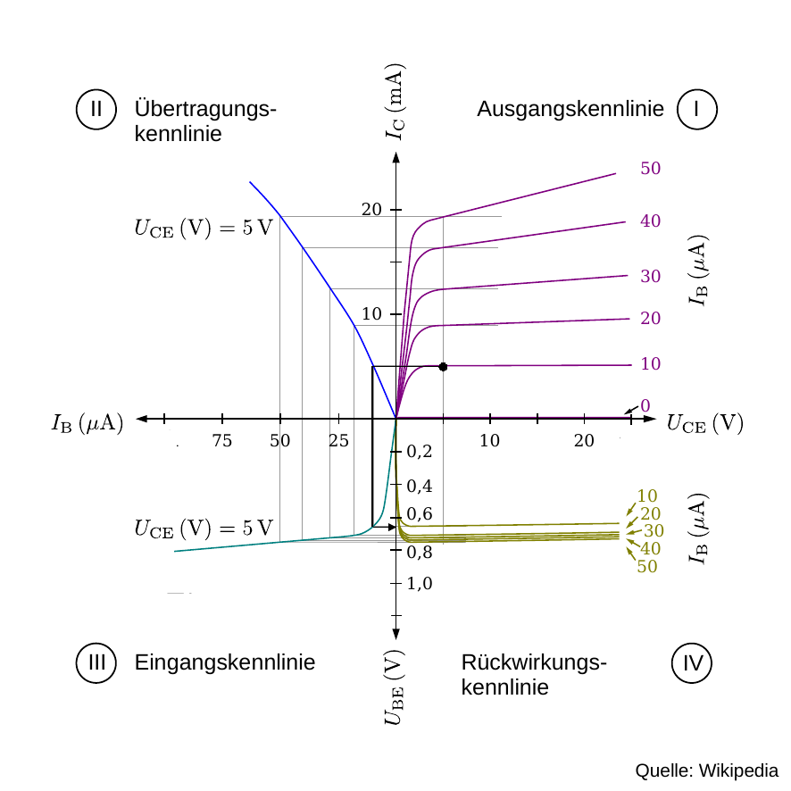
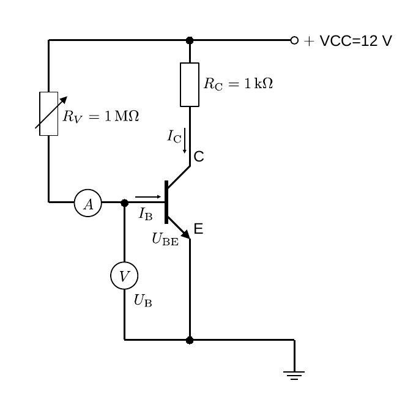
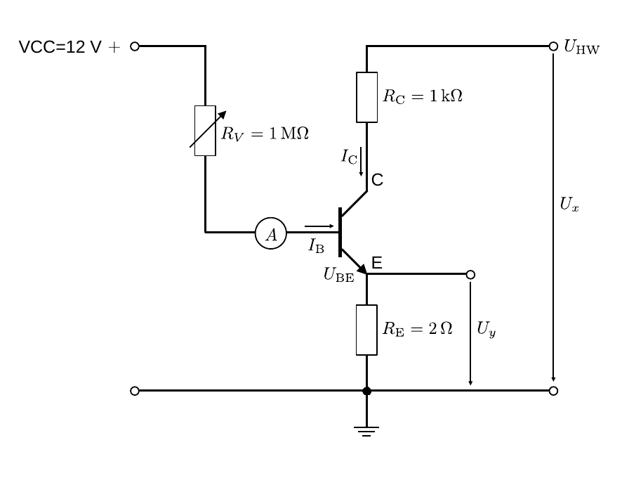

# Hinweise für den Versuch Transistor und Operationsverstärker

## Transistorkenngößen

- Das Verhältnis

  ```math
  \begin{equation}
  \beta=\frac{I_{\mathrm{C}}}{I_{\mathrm{B}}},
  \end{equation}
  ```

  bezeichnet man als den **statischen [Stromverstärkungsfaktor](https://de.wikipedia.org/wiki/Mathematische_Beschreibung_des_Bipolartransistors#Stromverst%C3%A4rkungsfaktor)**. Dieser hängt vom Typ und der Temperatur des Transistors ab und kann Werte zwischen 10 und 250 annehmen. 

- Das Verhältnis

  ```math
  \begin{equation*}
  r_{\mathrm{B}} = \frac{U_{\mathrm{BE}}}{I_{\mathrm{B}}}
  \end{equation*}
  ```

  wird als **dynamischer Basis-Emitter-Widerstand** bezeichnet. Seine Abhängigkeit von $I_{B}$ kann durch Gleichung **(2)** [hier](https://gitlab.kit.edu/kit/etp-lehre/p1-praktikum/students/-/blob/main/Transistor_und_Operationsverstaerker/doc/Hinweise-Transistor.md) abgeleitet werden:

  ```math
  \begin{equation*}
  \begin{equation*}
  \begin{split}
  &I_{\mathrm{B}} = I_{S}\left(e^{\frac{U_{BE}}{n\,U_{T}}}-1\right);\\
  &\\
  &U_{\mathrm{BE}} = n\,U_{T}\,\ln\left(\frac{I_{\mathrm{B}}}{I_{S}}+1\right);\\
  &\\
  &r_{\mathrm{B}} = \frac{\mathrm{d}U_{\mathrm{BE}}}{\mathrm{d}I_{\mathrm{B}}} = n\,\frac{U_{T}}{I_{\mathrm{B}}+1}.
  \end{split}
  \end{equation*}
  \end{equation*}
  ```

- Das Verhältnis

  ```math
  \begin{equation*}
  r_{\mathrm{C}} = \frac{U_{\mathrm{CE}}}{I_{\mathrm{C}}}
  \end{equation*}
  ```

  heißt **dynamischer Kollektor-Emitter-Widerstand**. Dieser ist (im Sättigungsbetrieb) eine vom Betriebszustand des Transistors (fast) unabhängige Größe. Bei genauerer Betrachtung besteht eine schwache Abhängigkeit von $U_{\mathrm{CE}}$, da sich mit zunehmenden Werten von $U_{\mathrm{CE}}$ die Verarmungszone der BC-Diode vergrößert, woraufhin auch $r_{\mathrm{C}}$ zunimmt. Man bezeichnet diesen Effekt als [Early-Effekt](https://de.wikipedia.org/wiki/Early-Effekt). 

Zusammengefasst bezeichnet man $\beta$, $r_{\mathrm{B}}$ und $r_{\mathrm{C}}$ als **Transistorkenngrößen**. 

## Kennlinienfeld

Die Charakterisierung eines Transistors erfolgt z.B. mit Hilfe des Kennlinienfelds, wie in **Abbildung 1** gezeigt: 

---



**Abbildung 1**: (Kennlinienfeld des Transistors (Quelle: [Wikipedia](https://de.wikipedia.org/wiki/Bipolartransistor#/media/Datei:Kombiniertes_Kennlinienfeld_Transistor_2.svg)))

---

Es dient zur übersichtlichen Darstellung der wechselseitigen Abhängigkeiten von $U_{\mathrm{BE}}$, $U_{\mathrm{CE}}$, $I_{\mathrm{B}}$ und $I_{\mathrm{C}}$: 

- Die **Eingangskennlinie $I_{\mathrm{B}}(U_{\mathrm{BE}})$** wird üblicherweise im dritten Quadranten dargestellt. Diese entspricht der Kennlinie einer normalen Diode in Durchlassrichtung. Ihre Abhängigkeit von $U_{\mathrm{CE}}$ ist so gering, dass eine **einzige Kennlinie** (im Bild für $U_{\mathrm{CE}}=5\ \mathrm{V}$) i.a. völlig ausreicht.
- Die **Ausgangskennlinien $I_{\mathrm{C}}(U_{\mathrm{CE}})$** für verschiedene Basisströme $I_{\mathrm{B}}$ werden im ersten Quadranten dargestellt. Diese weisen zwei deutlich unterscheidbare Bereiche auf. Bei kleinen Werten von $U_{\mathrm{CE}}$ verlaufen alle Kennlinien sehr steil und fallen für alle Werte von $I_{\mathrm{B}}$ fast zusammen. Dieser Bereich heißt **Sättigungsbereich**. Bei größeren Werten von $U_{\mathrm{CE}}$ verlaufen die Kennlinien deutlich flacher und für verschiedene Werte von $I_{\mathrm{B}}$ unterscheidbar. Dieser Bereich heißt **Arbeitsbereich**.
- Für die **Steuerkennlinien** $I_{\mathrm{C}}(I_{\mathrm{B}})$, die im zweiten Quadranten dargestellt werden, reicht wegen der geringen $I_{\mathrm{C}}(U_{\mathrm{CE}})$-Abhängigkeit in der Praxis wieder eine Kennlinie aus, z.B. die bei kleinen Werten von $U_{\mathrm{CE}}$ im Arbeitsbereich. Es zeigt sich, dass diese Steuerkennlinie bei den meisten Transistoren gut durch eine einfache Ursprungsgerade beschrieben werden kann. Das bedeutet, dass für Stromänderungen mit einem einheitlichen Stromverstärkungsfaktor $\beta$ gerechnet werden darf. 
- Im vierten Quadranten werden die **Rückwirkungskennlinien $U_{\mathrm{EB}}(U_{\mathrm{CE}})$** dargestellt. 

Die Rückwirkungs- und Steuerkennlinien lassen sich aus den Darstellungen der Ein- und Ausgangskennlinien ableiten.  

## Messung der Eingangskennlinie

Ein Schaltbild zur Messung der Eingangskennlinie ist in **Abbildung 2** gezeigt: 

---



**Abbildung 2**: (Schaltung zur Messung der Eingangskennlinie des Transistors)

---

Der Halbleitertransistor gehört zu den [Heißleitern](https://de.wikipedia.org/wiki/Hei%C3%9Fleiter), $r_{\mathrm{C}}$ nimmt mit zunehmender Temperatur also nicht *zu-*, sondern *ab*. Zu hohe Werte von $I_{\mathrm{C}}$ führen zur Erwärmung des Transistors und somit zur Verfälschung der Kennlinien und im schlimmsten Fall zur Zerstörung des Transistors. $R_{\mathrm{C}}=1\ \mathrm{k\Omega}$ dient dazu $I_{\mathrm{C}}$ zu begrenzen, so dass sich der Transistor nicht zu stark erwärmt.  

## Messung der Ausgangskennlinie

Ein Schaltbild zur Messung der Ausgangskennlinie ist in **Abbildung 3** gezeigt: 

---



**Abbildung 3**: (Schaltung zur Messung der Ausgangskennlinie des Transistors)

---

Mit dieser Schaltung wird $I_{\mathrm{B}}$ durch die Versorgungsspannung VCC gespeist und über $R_{V}$ gesteuert. $U_{\mathrm{HW}}$ ist eine mit einem  Frequenzgenerator erzeugte Halbwellenspannung mit einem Scheitelwert von $12\ \mathrm{V}$. Die Messung erfolgt mit dem Oszilloskop im XY-Betrieb. $I_{\mathrm{C}}$ wird als 
$$
\begin{equation*}
I_{\mathrm{C}}= \frac{U_{y}}{R_{\mathrm{E}}}
\end{equation*}
$$
auf dem Y-Kanal des Oszilloskops dargestellt. $U_{\mathrm{HW}}$ wird auf den X-Kanal des Oszilloskops gelegt. Für die Beziehung zu $U_{\mathrm{CE}}$ gilt:
$$
\begin{equation*}
U_{\mathrm{CE}}=U_{x}-U_{y}
\end{equation*}
$$

## Einstellen des Arbeitspunkts

Um Überhitzung zu vermeiden, ist es essentiell den Transistor nur mit zulässigen Werten für $U_{\mathrm{BE}}$ zu betreiben. Die Vorgehensweise zur Einstellung eines geeigneten Arbeitspunkts ist in **Abbildung 1** durch schwarze Linien, beispielhaft für die Werte $U_{\mathrm{CE}}=5\ \mathrm{V}$, $I_{\mathrm{C}}=10\ \mathrm{mA}$, hervorgehoben:

- Suchen Sie $(U_{\mathrm{CE}}, I_{\mathrm{C}})$ im dritten Quadranten des Kennlinienfelds auf.
- Finden Sie den Schnittpunkt mit der Übertragungskennlinie, indem Sie eine horizontale Linie in den zweiten Quadranten ziehen. Sie bestimmen so das Wertepaar $(I_{\mathrm{B}}, I_{\mathrm{C}})$.
- Finden Sie den Schnittpunkt mit der Basisspannung, indem Sie eine vertikale Linie in den ersten Quadranten ziehen. Sie bestimmen so das Wertepaar $(U_{\mathrm{BE}}, I_{\mathrm{C}})$.

Im Beispiel erhalten Sie $U_{\mathrm{BE}}\approx 600\ \mathrm{mV}$. 

## Essentials

Was Sie ab jetzt wissen sollten:

- Die entscheidenden Größen zum Betrieb eines Transistors sind $U_{\mathrm{BE}}$, $U_{\mathrm{CE}}$, $I_{\mathrm{B}}$ und $I_{\mathrm{C}}$. Eine übersichtliche Charakterisierung erfolgt mit Hilfe des **Kennlinienfelds**. Sie sollten in der Lage sein ein solches Diagramm zu interpretieren.
- Die wichtigsten **Transistorkenngrößen** sind $\beta$, $r_{\mathrm{B}}$ und $r_{\mathrm{C}}$. Diese lassen sich aus dem Kennlinienfeld ablesen. 

## Testfragen

1. Wo und auf welche Weise können Sie $\beta$, $r_{\mathrm{B}}$ und $r_{\mathrm{C}}$ aus dem Kennlinienfeld ablesen?  

# Navigation

[Main](https://gitlab.kit.edu/kit/etp-lehre/p1-praktikum/students/-/tree/main/Transistor_und_Operationsverstaerker)
