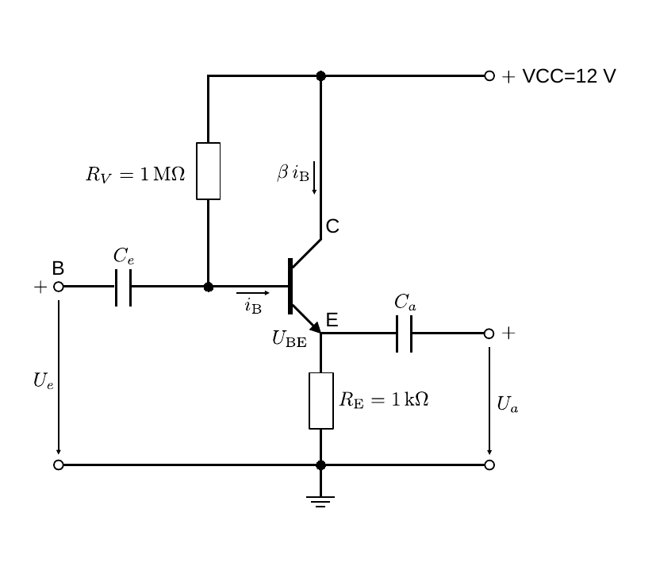
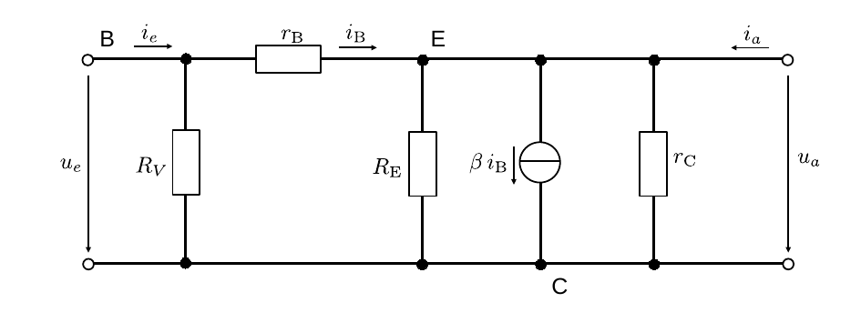
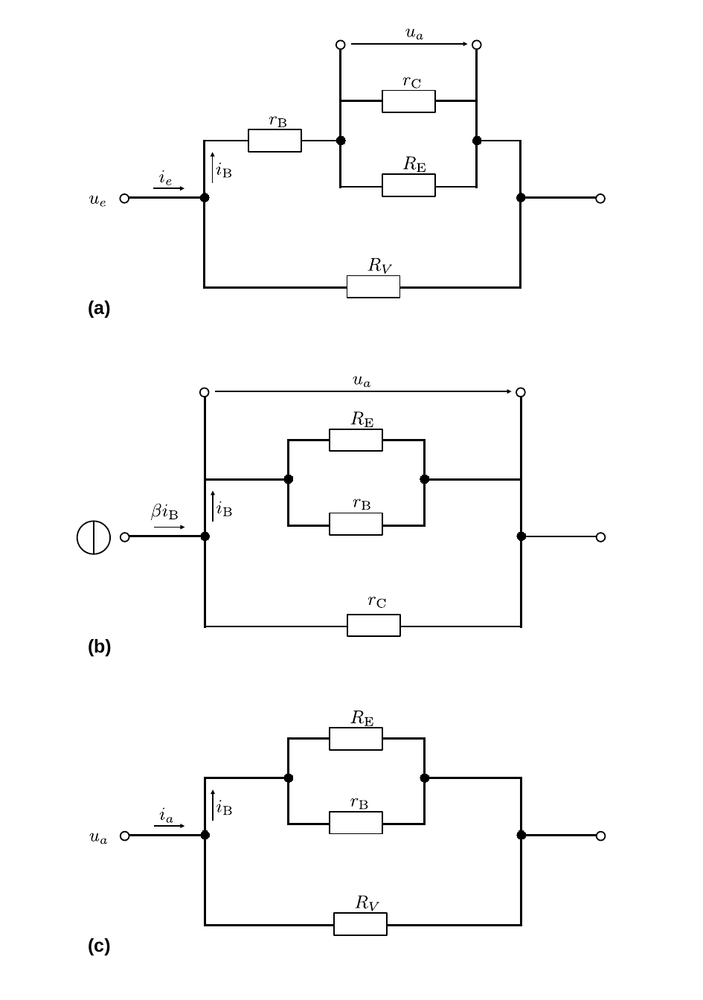
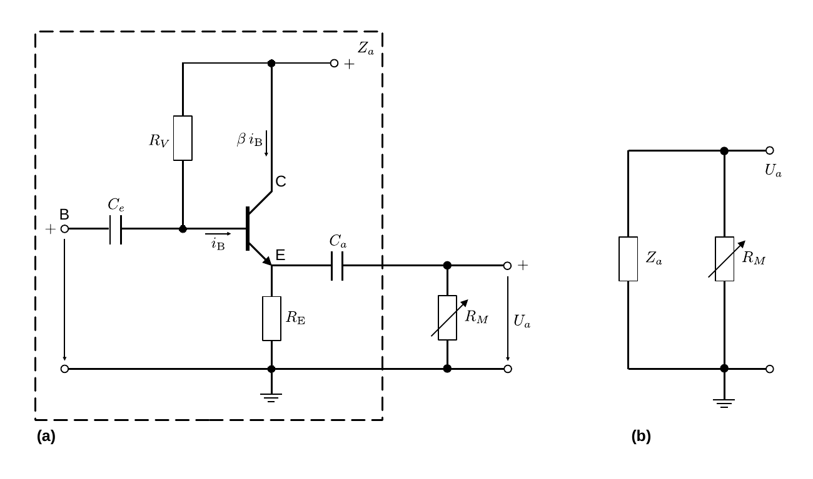

# Hinweise für den Versuch Transistor und Operationsverstärker

## Diskussion der Kollektorschaltung

Bei der Kollektorschaltung teilen sich das Ein- und Ausgangstor des Transistors C als gemeinsamen Bezugspunkt. Die entsprechende Beschaltung ist in **Abbildung 1** gezeigt:

---

**Abbildung 1**: (Kollektorschaltung)

---

Diese ist bis auf das Fehlen von $R_{\mathrm{C}}$ der [**stromgegengekoppelten Emitterschaltung**](https://gitlab.kit.edu/kit/etp-lehre/p1-praktikum/students/-/blob/main/Transistor_und_Operationsverstaerker/doc/Hinweise-Emitterschaltung.md) sehr ähnlich. Der entscheidende Unterschied besteht darin, das $u_{a}$ nicht an C sondern an E abgegriffen wird. Daher wird mit $U_{a}$ nicht $U_{\mathrm{CE}}$, sondern 
$$
\begin{equation*}
U_{a}= U_{e} + U_{D}\lesssim U_{e}
\end{equation*}
$$
abgegriffen, wobei $U_{D}$ der Knickspannung aus Gleichung **(1)** [hier](https://gitlab.kit.edu/kit/etp-lehre/p1-praktikum/students/-/blob/main/Transistor_und_Operationsverstaerker/doc/Hinweise-Transistor.md) entspricht. Daher gilt für die Kollektorschaltung immer 
$$
\begin{equation*}
v_{U}=\frac{U_{a}}{U_{e}}\lesssim 1.
\end{equation*}
$$

$R_{V}$ definiert den Arbeitspunkt für $U_{e}$. Durch $C_{e}$ und $C_{a}$ werden die Gleichstromanteile des Signals abgekoppelt. $R_{E}$ ist bei dieser Schaltung nicht optional, sondern ein **notwendiger und fester Bestandteil zur Stabilisierung der Schaltung**. Die durch $R_{E}$ vermittelte Stromgegenkopplung funktioniert auf die gleiche Weise, wie im Fall der Emitterschaltung. 

Die Kollektorschaltung wirkt **nicht spannungs- sondern stromverstärkend**. Die Stromverstärkung erfolgt mit $\beta$ und kann damit sehr groß werden. 

Da in diesem Fall das Ausgangssignal dem Eingangssignal in Phase folgt wird diese Schaltung auch als **Emitterfolger** bezeichnet. Der Begriff leitet sich vom analogen Begriff des Kathodenfolgers beim Röhrenverstärker ab. In dieser Analogie übernimmt E die Rolle der Kathode der Röhre. 

Neben der Stromverstärkung zeichnen den Emitterfolger zwei weitere wichtige Eigenschaften aus: Da der durch eine Last abgegriffene Strom, vom Eingangstor aus gesehen, um $\beta$ reduziert erscheint ist **$Z_{e}$ groß, $Z_{a}$ hingegen ist klein**. 

Die Kollektorschaltung wird daher nicht nur zur **Stromverstärkung**, sondern auch zur **[Impedanzwandlung](https://de.wikipedia.org/wiki/Impedanzwandler)** verwendet. Kombiniert man eine Emitter- mit einer Kollektorschaltung erhält man einen **Verstärker zur Leistungsverstärkung**. 

### Dynamische Kenngrößen

#### Berechnung

Das Ersatzschaltbild zur Berechnung der dynamischen Kenngrößen der Kollektorschaltung in der Kleinsignalnäherung ist in **Abbildung 2** gezeigt.

---

**Abbildung 2**: (Ersatzschaltbild für die Kollektorschaltung)

---

Auch hier handelt es sich um eine Schaltung mit einer Spannungs- und einer Stromquelle. Die für die Berechungen relevanten Erstatzschaltungen sind in **Abbildung 3** gezeigt:

---

**Abbildung 3**: (Ersatzschaltbilder für die Berechung der dynamischen Kenngrößen der Kollektorschaltung. In Abbildung (a) ist die Schaltung für $u_{e}$ bei unterbrochener Quelle für $i_{\mathrm{B}}$ gezeigt. In Abbildung (b) ist die Schaltung für $i_{\mathrm{B}}$ bei kuzgeschlossener Quelle für $u_{e}$ gezeigt. Abbildung (c) zeigt Schaltung (1) aus Sicht des Ausgangstors zur Berechnung von $Z_{a}$)

---

Aus **Abbildung 3a** lassen sich die folgenden Zusammenhänge ableiten: 
$$
\begin{equation}
\begin{split}
&u_{e} = \left(r_{\mathrm{B}}+\left(r_{\mathrm{C}}\parallel R_{\mathrm{E}}\right)\right)\,i_{\mathrm{B}}; \\
&\\
&i_{e} = \frac{u_{e}}{R_{V}\parallel\left(r_{\mathrm{B}}+\left(r_{\mathrm{C}}\parallel R_{\mathrm{E}}\right)\right)}; \\
&\\
&u_{a} = u_{e} - i_{\mathrm{B}}\,r_{\mathrm{B}}; \\
&\\
&\\
&Z_{e} = \frac{u_{e}}{i_{e}} = R_{V}\parallel R_{\mathrm{E}}; \\
&\\
&\text{mit:}\\
&\\
&\underbrace{R_{V}\parallel\left(r_{\mathrm{B}}+\left(r_{\mathrm{C}}\parallel R_{\mathrm{E}}\right)\right)}
\to R_{V}\parallel\left(r_{\mathrm{C}}\parallel R_{\mathrm{E}}\right)\to R_{V}\parallel R_{\mathrm{E}}.\\
&\hphantom{ccccccc}\equiv R_{\mathrm{ges}}
\end{split}
\end{equation}
$$
Dabei haben wir zur Vereinfachung von $R_{\mathrm{ges}}$ die gleichen Näherungen, wie für die analogen Rechnungen im Fall der [Emitterschaltung](https://gitlab.kit.edu/kit/etp-lehre/p1-praktikum/students/-/blob/main/Transistor_und_Operationsverstaerker/doc/Hinweise-Emitterschaltung.md) verwendet. 

**Abbildung 3b** trägt den folgenden Zusammenhange zwischen $u_{a}$ und $i_{\mathrm{B}}$ bei: 
$$
\begin{equation}
\begin{split}
&u_{a} = -\left(r_{\mathrm{C}}\parallel\left(R_{\mathrm{E}}\parallel r_{\mathrm{B}}\right)\right)\,\beta\,i_{\mathrm{B}}. \\
\end{split}
\end{equation}
$$
Aus den Gleichungen **(1)** und **(2)** lässt sich eine Beziehung zwischen $u_{a}$ und $i_{\mathrm{B}}$ ableiten:
$$
\begin{equation*}
\begin{split}
&u_{a} = -\left(r_{\mathrm{C}}\parallel\left(R_{\mathrm{E}}\parallel r_{\mathrm{B}}\right)\right)\,\beta\,i_{\mathrm{B}}+
u_{e}-r_{\mathrm{B}}\,i_{\mathrm{B}} \\
&\\
&\hphantom{u_{a}}= -\left(r_{\mathrm{C}}\parallel\left(R_{\mathrm{E}}\parallel r_{\mathrm{B}}\right)\right)\,\beta\,i_{\mathrm{B}}+ \left(r_{\mathrm{B}}+\left(r_{\mathrm{C}}\parallel R_{\mathrm{E}}\right)\right)\,i_{\mathrm{B}}-r_{\mathrm{B}}\,i_{\mathrm{B}}. \\
&\\
&\\
&v_{U} = \frac{u_{a}}{u_{e}} = \frac{-\left(r_{\mathrm{C}}\parallel\left(R_{\mathrm{E}}\parallel r_{\mathrm{B}}\right)\right)\,\beta+ \left(r_{\mathrm{B}}+\left(r_{\mathrm{C}}\parallel R_{\mathrm{E}}\right)\right)-r_{\mathrm{B}}}{r_{\mathrm{B}}+\left(r_{\mathrm{C}}\parallel R_{\mathrm{E}}\right)} \\
&\\
&\hphantom{v_{U}}
\approx\frac{R_{\mathrm{E}}-\beta\,r_{\mathrm{B}}}{R_{\mathrm{E}}+r_{\mathrm{B}}}\lesssim 1
\end{split}
\end{equation*}
$$
Aus **Abbildung 3c** ergibt sich schließlich der Zusammenhang zur Berechnung von $Z_{a}$: 
$$
\begin{equation*}
\begin{split}
&u_{a} = \left(r_{\mathrm{C}}\parallel\left(R_{\mathrm{E}}\parallel r_{\mathrm{B}}\right)\right)\,i_{a}. \\
&\\
&Z_{a} = \frac{u_{a}}{i_{a}} = r_{\mathrm{C}}\parallel\left(R_{\mathrm{E}}\parallel r_{\mathrm{B}}\right)\approx r_{\mathrm{B}}.
\end{split}
\end{equation*}
$$
Die Berechnungen bestätigen also die oben gemachten Aussagen und ermöglichen eine genauere Quantfizierung von $v_{U}$, $Z_{e}$ und $Z_{a}$.  

#### Messung von $Z_{e}$ und $Z_{a}$

Die Messung von $Z_{e}$ können Sie analog zur [stromgegengekoppelten Emitterschaltung](https://gitlab.kit.edu/kit/etp-lehre/p1-praktikum/students/-/blob/main/Transistor_und_Operationsverstaerker/doc/Hinweise-Emitterschaltung.md) vornehmen. 

Die Messung von $Z_{a}$ ist weniger offensichtlich, da die Kollektorschaltung, als ideale Stromquelle, $U_{a}$ lastabhängig nachregelt. Hier bietet sich die Methode mit regelbarer Lastimpedanz $R_{M}$ aus dem Versuch **Elektrische Messverfahren**, wie [hier](https://gitlab.kit.edu/kit/etp-lehre/p1-praktikum/students/-/blob/main/Elektrische_Messverfahren/doc/Hinweise-Spannungsquellen.md) beschrieben, an. Ein entsprechendes Ersatzschaltbild ist in **Abbildung 4** gezeigt: 

---

**Abbildung 5**: (Ersatzschaltbild zur Bestimmung von $Z_{a}$ der Kollektorschaltung. Der gestrichelte Kasten in Abbildung (a) umschließt die Schaltung, die als Blackbox durch $Z_{a}$ ersetzt wird. In Abbildung (b) ist das Ersatzschaltbild gezeigt.  $R_{M}$ ist als Potentiometer regelbar)

---

## Essentials

Was Sie ab jetzt wissen sollten:

- Die Kollektorschaltung dient zur **Stromverstärkung**; Es gilt $v_{U}\lesssim1$. 
- $Z_{a}\approx r_{\mathrm{B}}$ ist klein; $Z_{e}\approx R_{V}\parallel R_{\mathrm{E}}$ hingegen ist groß. Mit diesen Eigenschaften kann die Kollektorschaltung auch als **Impedanzwandler** verwendet werden.
- Schaltet man eine Kollektorschaltung in Reihe mit einer Emitterschaltung erhält man einen **Leistungsverstärker**.  

## Testfragen

1. In welcher Reihenfolge sind Kollektor- und Emitterschaltung zu kombinieren, um einen Leistungsverstärker zu erhalten?
2. Warum konnten wir für die Berechnung der dynamischen Kenngrößen für die Emitterschaltung $R_{V}$ ignorieren, hier aber nicht? 

# Navigation

[Main](https://gitlab.kit.edu/kit/etp-lehre/p1-praktikum/students/-/tree/main/Transistor_und_Operationsverstaerker)

