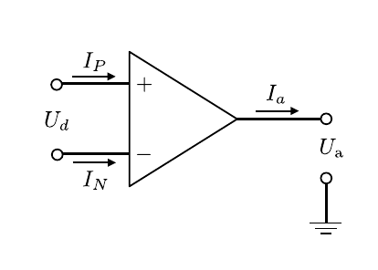
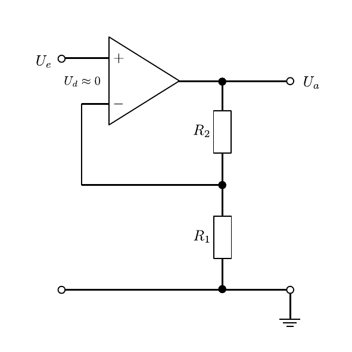
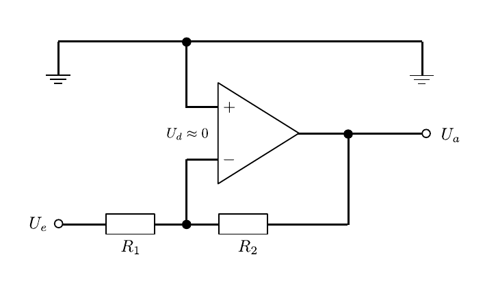

# Hinweise für den Versuch Transistor und Operationsverstärker

## Einführung Operationsverstärker

Ein [Operationsverstärker](https://de.wikipedia.org/wiki/Operationsverst%C3%A4rker) (OPV) ist ein aus mehreren Transistoren bestehendes [Netzwerk](https://de.wikipedia.org/wiki/Netzwerk_(Elektrotechnik)). Ein Beispiel für den inneren Aufbau eines OPV ist die Innenbeschaltung des in den 1960er Jahren entwickelten OPV vom Typ $\mu\mathrm{A}741$, wie [hier](https://gitlab.kit.edu/kit/etp-lehre/p2-praktikum/students/-/raw/main/Operationsverstaerker/figures/OpAmpTransistorLevel_Colored.png) gezeigt (Quelle [Wikipedia](https://commons.wikimedia.org/wiki/File:OpAmpTransistorLevel_Colored.svg)). In der Praxis wird der OPV als Blackbox mit wohl definiertem Ein- und Ausgangsverhalten verwendet. Das Schaltsymbol ist in **Abbildung 1** gezeigt:

---

 

**Abbildung 1**: (Schaltsymbol eines OPV und Definition der relevanten Ströme und Spannungen. Die Beschaltung im Inneren, sowie die Versorgungsspannung(en) werden in Schaltbildern i.a. nicht gezeigt)

---

Der OPV besitzt **mindestens fünf Klemmen**: 

- Einen (Minus) invertierenden und einen (Plus) nicht-invertierenden Signaleingang. 
- Einen Signalausgang. 
- Mindestens zwei (in Schaltbildern nicht gezeigte) Anschlüsse zur externen Spannungsversorgung. 
- Je nach Komplexität des OPV können noch weitere Klemmen vorhanden sein. 

Im allgemeinen ist der Plus-Eingang als hochohmiger Spannungseingang ausgeführt; der Minus-Eingang ist je nach OPV-Typ ebenfalls ein hochohmiger Spannungs- oder ein niederohmiger Stromeingang. Der OPV kann i.a. in guter Näherung als [ideale Strom- oder Spannungsquelle](https://gitlab.kit.edu/kit/etp-lehre/p1-praktikum/students/-/blob/main/Elektrische_Messverfahren/doc/Hinweise-Spannungsquellen.md) (relativ zum Massenpotential) angesehen und verwendet werden. Die häufigste Verwendung ist die als **Spannungsverstärker** (engl. *voltage feedback operational amplifier*, VFA) mit zwei hochohmigen Spannungseingängen. 

### Definition relevanter Größen

Der Stromfluss in den Plus-Eingang wird im Folgenden mit $I_{P}$ bezeichnet, der Stromfluss in den Minus-Eingang mit $I_{N}$, die anliegenden Spannungen werden entsprechend mit $U_{P}$ und $U_{N}$ bezeichnet; $U_{d}=U_{P}-U_{N}$ ist die Differenzspannung zwischen Minus- und Plus-Eingang; $I_{a}$ und $U_{a}$ bezeichnen, je nach OPV-Typ den Strom oder die Spannung am Ausgang. Die Spannungsverstärkung erfolgt als 
$$
\begin{equation*}
U_{a} = v_{0}\left(U_{P}-U_{N}\right) + v_{\mathrm{Gl}}\,\frac{U_{P}+U_{N}}{2},
\end{equation*}
$$
wobei man $v_{0}$  als **Leerlaufverstärkung** und $v_{\mathrm{Gl}}$ als **Gleichtaktverstärkung** bezeichnet. Beides sind OPV-spezifische Größen. In Datenblättern zu OPVs wird statt der Gleichtaktverstärkung auch die Gleichtaktunterdrückung (*common mode rejection ratio*, CMRR)
$$
\begin{equation*}
G = 20\,\ln\left(\frac{v_{0}}{v_{\mathrm{Gl}}}\right)
\end{equation*}
$$
in [Dezibel $\mathrm{dB}$](https://de.wikipedia.org/wiki/Bel_(Einheit)) angegeben.

Bei der Verwendung von OPVs unterscheidet man zwei Hauptbetriebsarten: 

- Den invertierenden Betrieb mit $U_{P}=0$ und $U_{a}=-v_{0}\,U_{N}$; sowie
- den nicht-invertierenden Betrieb mit $U_{N}=0$ und $U_{a}=v_{0}\,U_{P}$,

das Eingangssignal $U_{e}$ liegt also entweder als $U_{P}$ am Plus- oder als $U_{N}$ am Minus-Eingang an während der jeweils andere Eingang auf Masse liegt.

### Idealer und realer OPV

Bei einem idealen OPV ist sowohl $v_{\mathrm{Gl}}$, also auch der Ausgangswiderstand 0, während sowohl $v_{0}$ also auch der Eingangswiderstand unendlich groß sind. Zudem hängt die Verstärkung idealerweise nicht von der Frequenz des Signals ab. In der folgenden Tabelle sind einige charakteristische Eigenschaften von idealen und realen OPVs gegenübergestellt: 

| Eigenschaft                 | idealer OPV | realer OPV                               |
| :-------------------------- | ----------- | ---------------------------------------- |
| $v_{0}$                     | $\infty$    | $10^{5}\ldots10^{8}$                     |
| $v_{\mathrm{Gl}}$           | $0$         | $0.1\ldots 3$                            |
| $R_{d}$                     | $\infty$    | $10^{7}\ \Omega\ldots 10^{12}\ \Omega$   |
| $R_{a}$                     | $0$         | $10\ \Omega\ldots 10^{3}\ \Omega$        |
| $I_{P}^{(0)},\ I_{N}^{(0)}$ | $0$         | $0.1\,\mathrm{nA}\ldots 25\ \mathrm{nA}$ |

Dabei bezeichnen die Größen $I_{N}^{(0)}$ und $I_{P}^{(0)}$ potentielle *offset*-Ströme auf den Eingängen aufgrund baulicher Asymmetrien. 

Zudem ist die Verstärkung beim realen OPV oberhalb einer charakteristischen Grenzfrequenz $\nu_{\mathrm{G}}$ frequenzabhängig. Darunter garantiert der Hersteller i.a. ideale Unterdrückung der Frequenzabhängigkeit.  

### Goldene Regeln

Zur (ungefähren) Dimensionierung, d.h. zur Beschaltung mit konkreten äußeren Widerständen, von OPV-Schaltkreisen betrachtet man den OPV als ideal. In diesem Fall gelten i.a. die folgenden **Goldenen Regeln**:

- Die Differenzspannung zwischen den Eingängen des OPV ist Null: $U_{d}=0$;
- Durch die Eingänge des OPV fließt kein Strom: $R_{d}=R_{P}=R_{N}=\infty$;
- Bis zum maximal zulässigen Ausgangsstrom $𝐼_{a}^{\mathrm{max}}$ ist der OPV beliebig belastbar: $R_{a}=0$. Im Gegenzug hängt $U_{a}$ von der Last, also von $I_{a}$ ab. 

### Einsatz und Dimensionierung

Ohne äußere Beschaltung des OPV wäre aufgrund der hohen Verstärkung $U_{a}$ je nach $U_{e}$ entweder maximal oder Null. Aufgrund dieser Eigenschaft werden OPVs auch als **Schalter** oder [**Komparatoren**](https://de.wikipedia.org/wiki/Komparator_(Analogtechnik)) eingesetzt.

Um den OPV als Verstärker zu betreiben verhindert man dieses Verhalten durch äußere Beschaltung, mit der man, analog zum Transistor, $v_{0}$ durch **Gegenkopplung** kontrolliert reduziert. Bei der Gegenkopplung wird ein Teil von $U_{a}$ mit invertiertem Vorzeichen so auf den Eingang des OPV zurückgeführt, dass die Schaltung insgesamt Veränderungen des Eingangssignals entgegenwirkt. Bei allen Verstärkerschaltungen wird daher immer der Ausgang auf den Minus-Eingang gekoppelt. Bei Gegenkopplung steigt $U_{a}$ nur so lange an, bis $U_{d}$ auf Null abfällt. **Analog zum Transistor hängt der Verstärkungsfaktor $v_{U}$ der resultierenden Schaltung nicht mehr von $v_{0}$, sondern nur noch von der äußeren Beschaltung ab.** 

Die ungefähre Dimensionierung des Schaltkreises erfolgt unter Anwendung der oben erwähnten [**Goldenen Regeln**](https://de.wikipedia.org/wiki/Operationsverst%C3%A4rker). Die exakte Justierung wird daraufhin experimentell vorgenommen. 

## Nicht-invertierender Verstärker

Beim nicht-invertierenden Verstärker (**Elektrometerverstärker**) weist das Ausgangssignal die gleiche Polarität auf, wie das Eingangssignal. Das Eingangssignal liegt also auf dem Plus-Eingang des OPV, während der Minus-Eingang auf Masse liegt. Ein Teil des Ausgangssignals wird zur Rückkopplung auf den Minus-Eingang zurückgeführt. Die Grundschaltung ist in **Abbildung 2** gezeigt:

---

**Abbildung 2**: (Grundschaltung des nicht-invertierenden Verstärkers)

---

Die Verstärkung ergibt sich aus der **ersten goldenen Regel** ($U_{d}=0$), wonach am Minus-Eingang des OPV ebenfalls $U_{P}$ anliegt. Nach den [Kirchhoffschen Regeln](https://de.wikipedia.org/wiki/Kirchhoffsche_Regeln) ergibt sich für die Spannungsverstärkung: 
$$
\begin{equation*}
\begin{split}
&U_{e} = I\, R_{1};\qquad U_{a} = I\, (R_{1} + R_{2})\\
&\\
&v_{U} = \frac{U_{a}}{U_{e}} = \frac{R_{1}+R_{2}}{R_{1}} = 1+\frac{R_{2}}{R_{1}}
\end{split}
\end{equation*}
$$
### Invertierender Verstärker

Die Grundschaltung des invertierenden Verstärkers ist in **Abbildung 3** gezeigt: 

---

**Abbildung 3**: (Grundschaltung des invertierenden Verstärkers)

---

Das Eingangssignal liegt in diesem Fall auf dem Minus-Eingang des OPV, während der Plus-Eingang auf Masse liegt. Das Ausgangssignal $U_{a}$ wird zur Rückkopplung teilweise auf den invertierenden Eingang zurückgeführt. 

Zur Berechnung der Verstärkung verwenden wir wieder die **erste goldene Regel** ($U_{d}=0$), wonach am Minus-Eingang des OPV die gleiche Spannung anliegt, wie am Plus-Eingang. Da der Plus-Eingang jedoch auf Masse liegt muss dies auch für den Minus-Eingang gelten. Man spricht in diesem Fall von **virtueller Masse** am Minus-Eingang. Nach den [Kirchhoffschen Regeln](https://de.wikipedia.org/wiki/Kirchhoffsche_Regeln) muss $U_{e}$ vollständig über $R_{1}$ abfallen, das gleiche gilt für $U_{a}$ und $R_{2}$:
$$
\begin{equation}
\begin{split}
&U_{e} = I\,R_{1},\qquad U_{a} = -I\,R_{2};\\
&\\
&U_{a} = -\frac{R_{2}}{R_{1}}\,U_{e}.\\
&\\
&v_{U} = \frac{U_{a}}{U_{e}} = -\frac{R_{2}}{R_{1}}
\end{split}
\end{equation}
$$
Das Minuszeichen in Gleichung **(1)** folgt aus der entgegengesetzten Stromrichtung vom jeweils signalführenden (nicht geerdeten) Pol auf Masse. Durch das Vorzeichen wird die Invertierung des Eingangssignals, als Phasenverschiebung um $\pi$ ($e^{i\pi}=-1$) explizit sichtbar. 

Der invertierende Verstärker ist weiter verbreitet, als der nicht-invertierende Verstärker. Die Verstärkung der Schaltung ist intuitiver zu berechnen und die Schaltung lässt sich intuitiver erweitern.

## Messung von $Z_{e}$ und $Z_{a}$

Die Messungen von $Z_{e}$ und $Z_{a}$ laufen analog zur [Emitter-](https://gitlab.kit.edu/kit/etp-lehre/p1-praktikum/students/-/blob/main/Transistor_und_Operationsverstaerker/doc/Hinweise-Emitterschaltung.md) und [Kollektogrundschaltung](https://gitlab.kit.edu/kit/etp-lehre/p1-praktikum/students/-/blob/main/Transistor_und_Operationsverstaerker/doc/Hinweise-Kollektorschaltung.md) eines einzelnen Transistors ab.

## Essentials

Was Sie ab jetzt wissen sollten:

- Heutzutage ist der OPV das Schaltelement der Wahl zur Signalverstärkung. 
- Wie bei der Emitterschaltung eines einzelnen Transistors wird die **Verstärkung des OPV durch Gegenkopplung kontrolliert gedrosselt**, um den OPV als linearen Verstärker betreiben zu können. 
- Wie bei der Emitterschaltung eines einzelnen Transistors hängt in diesem Fall die **Verstärkung nicht mehr von den Eigenschaften des OPV**, sondern nur noch von der Beschaltung mit äußeren Widerständen ab.
- Üblich ist der Gebrauch als **invertierender oder nicht-invertierender Spannungsverstärker**.  

## Testfragen

1. Welche Verfahren würden Sie für die Messung von $Z_{e}$ and $Z_{a}$ konkret verwenden?
2. Ihr Signal besteht aus einer geringen Aufladung eines Kondensators. Was passiert, wenn Sie versuchen diese Aufladung als Spannungsantieg mit einem Spannungsmessgerät mit moderatem Innenwiderstand zu messen?
3. Wie ändert sich die Situation, wenn Sie das Signal durch einen OPV vom Spannungsmessgerät entkoppeln? 

# Navigation

[Main](https://gitlab.kit.edu/kit/etp-lehre/p1-praktikum/students/-/tree/main/Transistor_und_Operationsverstaerker)

