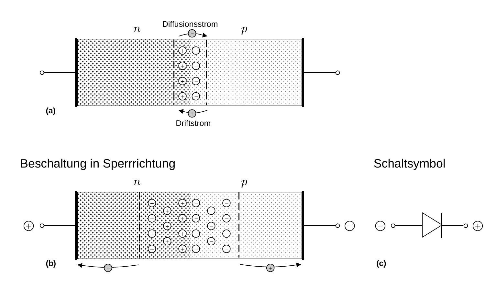
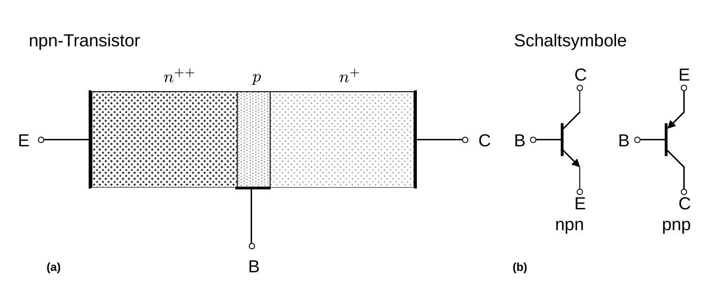
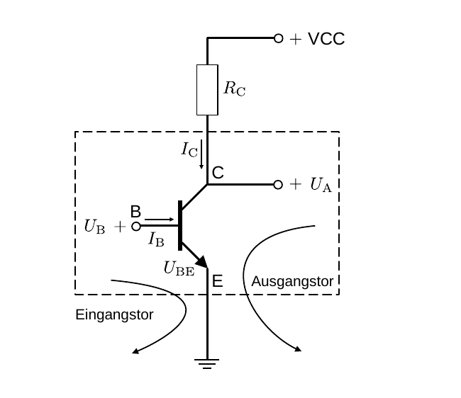

# Hinweise für den Versuch Transistor und Operationsverstärker

## Halbleiter

Silizium (Si) und Germanium (Ge) befinden sich in der vierten Hauptgruppe des [Periodensystems](https://de.wikipedia.org/wiki/Periodensystem). Beide Elemente sind **vierwertig** (d.h. sie besitzen vier [Valenzelektronen](https://de.wikipedia.org/wiki/Valenzelektron)). Sie weisen die Kristallstruktur von Diamant auf. Jedes Valenzelektron geht dabei eine [kovalente Bindung](https://de.wikipedia.org/wiki/Kovalente_Bindung) zu seinen Nachbaratomen ein. Bei beiden Materialien handelt es sich um **Halbleiter**, die in reinem Zustand (d.h. als Einkristalle) und bei Zimmertemperatur eine sehr geringe Leitfähigkeit besitzen. Durch gezieltes Einbringen von Fremdatomen in den Kristall ([Dotierung](https://de.wikipedia.org/wiki/Dotierung)) kann die Leitfähigkeit dieser Halbleiter erheblich gesteigert werden. 

- Bringt man **fünfwertige Atome** (aus der fünften Hauptgruppe), wie z.B. Phosphor (P) in den Kristall ein, um jeweils ein Si-Atom im Gitter zu ersetzen, gehen vier der fünf Valenzelektronen des P-Atoms eine kovalente Bindung mit den benachbarten Si-Atomen ein. Das fünfte Valenzelektron ist nur schwach gebunden, so dass es durch thermische Anregung gelöst werden kann. Es kann sich daraufhin frei durch den Kristall bewegen, wohingegen die Atomrümpfe fest in die Kristallstruktur eingebunden sind. Man bezeichnet diese Art der Dotierung als **n-Dotierung** und die Elemente der fünften Hauptgruppe als **[Donatoren](https://de.wikipedia.org/wiki/Halbleiter#Donatoren_und_Akzeptoren)**, einen solchen Halbleiter bezeichnet man als **n-Halbleiter**.
- Bringt man **dreiwertige Atome** (aus der dritten Hauptgruppe), wie z.B. Bohr (B) in den Kristall ein, um jeweils ein Si-Atom im Gitter zu ersetzen, steht ein Valenzelektron zu wenig zur Verfügung, um vier kovalente Bindungen mit den Nachbaratomen einzugehen, ein Si-Atom aus der Nachbarschaft des Störatoms bleibt also ungepaart. Dadurch entsteht eine Störstelle, in die Valenzelektronen benachbarter Si-Atome eintreten können. Auch solche Störstellen sind, als [Defektelektronen](https://de.wikipedia.org/wiki/Defektelektron) im Kristall frei beweglich, wohingegen der Atomrumpf fest in die Kristallstruktur eingebunden ist. Man bezeichnet diese Art der Dotierung als **p-Dotierung** und die Elemente der dritten Hauptgruppe als [**Akzeptoren**](https://de.wikipedia.org/wiki/Halbleiter#Donatoren_und_Akzeptoren), einen solchen Halbleiter bezeichnet man als **p-Halbleiter**.   

## Halbleiterdiode

Fügt man einen p- mit einem n-Halbleiter zusammen entsteht eine [Halbleiterdiode](https://de.wikipedia.org/wiki/Diode), wie in **Abbildung 1** gezeigt:

---

**Abbildung 1**: (Skizze einer Halbleiterdiode. Abbildung (a) zeigt die Diode ohne anliegende äußere Spannung. Abbildung (b) zeigt die Diode mit anliegender Spannung in **Sperrrichtung**. Das Schaltsymbol für die Diode ist in Abbildung (c) gezeigt)

---

Ohne äußere Spannung diffundieren Elektronen auf die p- und Defektelektronen auf die n-dotierte Seite der Grenzfläche, wodurch sich eine elektrische Spannung aufbaut, die diesem [Diffusionsstrom](https://de.wikipedia.org/wiki/Diffusionsstrom) entgegenwirkt. Ab der **[Schwellen- oder Knickspannung](https://de.wikipedia.org/wiki/Schwellenspannung)** $U_{D}$ kommt dieser Diffusionsstrom zum Erliegen. Für Si gilt
$$
\begin{equation}
U_{D}\approx-0.7\,\mathrm{V},
\end{equation}
$$
für Ge gilt $U_{D}\approx-0.3\,\mathrm{V}$, jeweils bei Zimmertemperatur. Aufgrund der gegenseitigen Neutralisation von Elektronen und Defektelektronen ist das Ergebnis eine an freien Ladungsträgern verarmte Grenzschicht, die **Verarmungszone**, **[Raumladungszone](https://de.wikipedia.org/wiki/Raumladungszone)** oder **Sperrschicht** genannt wird. Man kann die Diode in zwei Richtungen beschalten:

- Legt man eine positive Spannung auf Seiten des n- und eine negative Spannung auf Seiten des p-Halbleiters an, wird die Diode in **Sperrrichtung** betrieben. In diesem Fall werden in beide Richtungen weitere freie Ladungsträger aus der Grenzschicht abgezogen und die Verarmungszone vergrößert sich. Es fließt nur ein sehr schwacher [**Sperrstrom**](https://de.wikipedia.org/wiki/Sperrstrom), der von der ständigen, geringen, thermischen Erzeugung freier Ladungsträger herrührt. 
- Legt man eine negative Spannung auf Seiten des n- und eine positive Spannung auf Seiten des p-Halbleiters an, wird die Diode in **Durchlassrichtung** betrieben und es werden ab einer Spannung $U_{F}\gtrsim U_{D}$ mit steigender Spannung zunehmend Ladungsträger durch die Grenzschicht zwischen n- und p-Halbleiter getrieben. Es fließt ein spannungsabhängiger Durchlassstrom $I_{D}$. 

Durch eine Diode kann Strom also **nur in einer Richtung** fließen. Die [Kennlinie](https://de.wikipedia.org/wiki/Diode#Kennlinie) der Diode kann durch die [Shockley-Gleichung](https://de.wikipedia.org/wiki/Shockley-Gleichung) beschrieben werden:
$$
\begin{equation}
\begin{split}
&I_{D}(U_{F}) = I_{S}(T)\left(e^{\frac{U_{F}}{n\,U_{T}}}-1\right);\\
&\\
&\text{mit:}\\
&\\
&U_{T}=\frac{k_{B}\,T}{e},
\end{split}
\end{equation}
$$
wobei $I_{S}(T)$ dem temperaturabhängigen Sättigungsstrom (Sperrstrom), $n\approx 1\ldots 2$ dem Emissionskoeffizienten und  $U_{T}$ der Temperaturspannung entsprechen. $U_{F}$ bezeichnet man auch als Flussspannung.  

Das elektrische Schaltsymbol der Diode ist in **Abbildung 1c** gezeigt. Der Pfeil weist in Durchlassrichtung des technischen Stroms. Die Kathode der Diode ist bei konkreten Bauteilen i.a. durch einen [silbernen Ring](https://de.wikipedia.org/wiki/Diode#/media/Datei:Diode_pinout_de.svg) gekennzeichnet.

## Transistor

Verbindet man zwei verschieden stark dotierte n-Halbleiter von zwei Seiten mit einer dünnen, p-dotierten Grenzschicht, wie in **Abbildung 2** gezeigt, erhält man einen [**bipolaren npn-Transistor**](https://de.wikipedia.org/wiki/Bipolartransistor).  

---

**Abbildung 2**: (Schematische Darstellung eines bipolaren npn-Transistors (a). Die Schaltsymbole für den bipolaren Transistor sind in Abbildung (b) gezeigt)

---

In **Abbildung 2a** ist die rechte Seite n- und die linke Seite *stark* n-dotiert. Im Fall eines pnp-Transistors sind die Dotierungen entsprechend von n nach p oder p nach n umzukehren. Die elektrischen Schaltsymbole für beide Transistorarten sind in **Abbildung 2b** gezeigt. 

Am Transistor befinden sich drei Klemmen, die als (E) **Emitter**, (C) **Kollektor** und (B) **Basis** bezeichnet werden. Damit kann der Transistor als elektrisches [Netzwerk](https://de.wikipedia.org/wiki/Netzwerk_(Elektrotechnik)) mit drei Anschlüssen aufgefasst werden. Zwei Klemmen können in der Vierpol-Theorie zu einem *Tor* zusammengefasst werden, wenn aus der einen Klemme der gleiche Strom hinaus fließt, der in die andere Klemme hinein fließt. Nach dieser Einordnung wird der Transistor auch als [Zweitor](https://de.wikipedia.org/wiki/Zweitor), mit der Besonderheit bezeichnet, dass eine der drei Klemmen beiden Toren gemeinsam ist. Je nachdem, welche Klemme dies ist, unterscheidet man drei **Transistorgrundschaltungen** die 

- **Emitterschaltung**, 
- **Basisschaltung** und 
- **Kollektorschaltung**, 

von denen v.a. die **Emitter- und Kollektorschaltungen** in der Elektrotechnik von Relevanz sind. 

### Emitterschaltung

Wir erklären die Funktionsweise des bipolaren Transistors anhand der **Emitterschaltung** eines bipolaren npn-Transistors, wie in **Abbildung 3** gezeigt:

---

**Abbildung 3**: (Grundbeschaltung eines bipolaren npn-Transistors in der Emitterschaltung. Das Eingangstor liegt zwischen B und E. Das Ausgangstor liegt zwischen C und E. E ist beiden Toren gemeinsam)

---

- Der BE-Stromkreis bezeichnet das Eingangs-, der CE-Stromkreis das Ausgangstor. 
- E ist beiden Toren gemeinsam und liegt i.a. auf Masse. 
- An C liegt eine positive Versorgungsspannung z.B. von $\mathrm{VCC}=+12\ \mathrm{V}$ an. 

Damit ist die BE-Diode in **Durchlass-** und die BC-Diode in **Sperrrichtung** geschaltet. Liegt an B keine Spannung an, ist der Transistor *selbstsperrend*, d.h. mindestens eine Diode (im Fall des hier diskutierten npn-Transistors die BC-Diode) ist in Sperrrichtung geschaltet. Eine bereits geringe mit einem kleinen **Basisstrom** $I_{\mathrm{B}}$ assoziierte Spannung $U_{\mathrm{B}}$ an B kann allerdings zu einem erheblichen Fluss von Ladungsträgern zwischen E und C und damit zu einem hohen **Kollektorstrom** $I_{\mathrm{C}}$ führen. Dabei können, je nach Transistorart, sowohl Elektronen als auch Defektelektronen zum Stromfluss beitragen. Die Spannung $U_{\mathrm{A}}$ kann als verstärktes Ausgangssignal von $U_{\mathrm{B}}$ abgegriffen werden. 

### Funktionsweise

Liegt zwischen E und C eine Spannung $\mathrm{VCC}\gt 0$ an wird die Sperrschicht der BE-Diode zwar verringert, die Sperrschicht der BC-Diode jedoch zur gleichen Zeit stark vergrößert. Zwischen E und C fließt nur ein geringer Kollektorstrom $I_{\mathrm{C}}$, der Sperrstrom $I_{D}$ der BC-Diode. In der Sperrschicht der BE-Diode wirkt im Gleichgewichtszustand $U_{D}$ der Diffusion freier Ladungsträger entgegen. Entscheidend für die Eigenschaften des Transistors ist die Basis-Emitter-Spannung $U_{\mathrm{BE}}$. Legt man ans Eingangstor eine Basisspannung $U_{\mathrm{B}}$ an, so dass $U_{\mathrm{BE}}=U_{\mathrm{B}}+U_{D}\gtrsim 0$, wird die BE-Diode leitend. Man bezeichnet diesen Betrieb des Transistors als **Forwärtsbetrieb**. 

Wie bei der einfachen pn-Halbleiterdiode basiert diese Leitung auf zwei Effekten: 

- Zum einen werden Defektelektronen aus B in E injiziert. Der dadurch entstehende Strom ist allerdings sehr gering und nimmt mit der [Diffusionslänge](https://de.wikipedia.org/w/index.php?title=Diffusionslänge&action=edit&redlink=1) der Defektelektronen ab. Diese rekombinieren daraufhin mit Elektronen in E. 
- Zum anderen werden Elektronen aus E in B injiziert. Da E höher als B dotiert ist, überwiegt der Elektronenstrom von E nach B. 

Aufgrund der geringen räumlichen Ausdehnung von B — die bei der Herstellung des Transistors kleiner als die Diffusionslänge der Ladungsträger im Material zu wählen ist — rekombinieren nur wenige der Elektronen mit den Defektelektronen in B. Der bei weitem größte Anteil der Elektronen (${\gg} 90\%$) diffundiert stattdessen durch B hindurch, in die Sperrschicht der BC-Diode, wo sie wegen des großen Potentialabfalls zwischen B und C weiter nach C [driften](https://de.wikipedia.org/wiki/Driftgeschwindigkeit). In Form von $I_{\mathrm{C}}$ fließt auf diese Weise ein großer Teil der Elektronen von E nach C ab, wobei $I_{\mathrm{C}}$ durch geringe Ströme $I_{\mathrm{B}}$ gesteuert werden kann. Man bezeichnet diese Konstellation als **Stromsteuerung**. 

### Einsatz

Transistoren sind für die folgenden Anwendungen im Einsatz als:

- **Schalter**, um mit geringen Gleichströmen deutlich größere Ströme ein- und auszuschalten.
- **Spannungsverstärker**, um aus kleinen Spannungsänderungen (z.B. am Eingang eines Oszilloskops) deutlich größere proportionale Spannungsänderungen (z.B. an den Ablenkplatten eines Oszilloskops) zu erhalten.
- **Leistungsverstärker**, um mit geringer Eingangsleistung (z.B. von einem Mikrophon als Quelle) einen Verbraucher mit großer Leistung (z.B. einen Lautsprecher) amplitudengetreu zu betreiben. Hier erfolgt die Verstärkung sowohl der Spannung, als auch des Stroms.
- **Impedanzwandler**, um an ein Gerät mit geringer Eingangsimpedanz z.B. zur Weiterverarbeitung eines Signals an eine Quelle mit großer Ausgansimpedanz anzuschließen.

In diesem Versuch, werden sie die Grundbeschaltung von Transistoren zur Spannungsverstärkung und zur Impedanzwandlung kennenlernen. In der Praxis verwendet man heutzutage keine einzelnen sondern Gruppen zahlreicher Transistoren, die z.B, in **Operationsverstärkern** zusammengefasst sind.  

## Essentials

Was Sie ab jetzt wissen sollten:

- Der bipolare Transistor ist ein Bauelement aus der Halbleitertechnik. 
- Er besteht aus **zwei dotierten Halbeiterübergängen** (npn oder pnp). Man verwendet ihn u.a. zur **Signalverstärkung** oder **Impedanzwandlung**. 

## Testfragen

1. Was ist der Unterschied zwischen $U_{\mathrm{B}}$ und $U_{\mathrm{BE}}$?
2. Gibt es einen ähnlichen Unterschied zwischen $U_{\mathrm{A}}$ und $U_{\mathrm{CE}}$?
3. Wie ändert sich **Abbildung 1** für einen bipolaren pnp-Transistor?  

# Navigation

[Main](https://gitlab.kit.edu/kit/etp-lehre/p1-praktikum/students/-/tree/main/Transistor_und_Operationsverstaerker)
