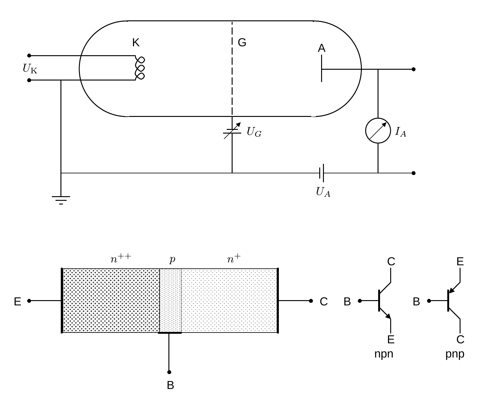
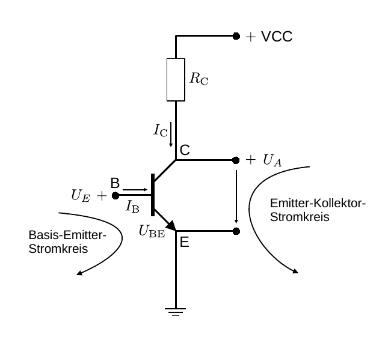
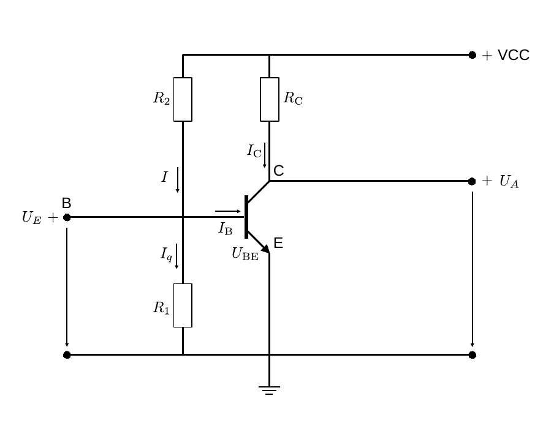
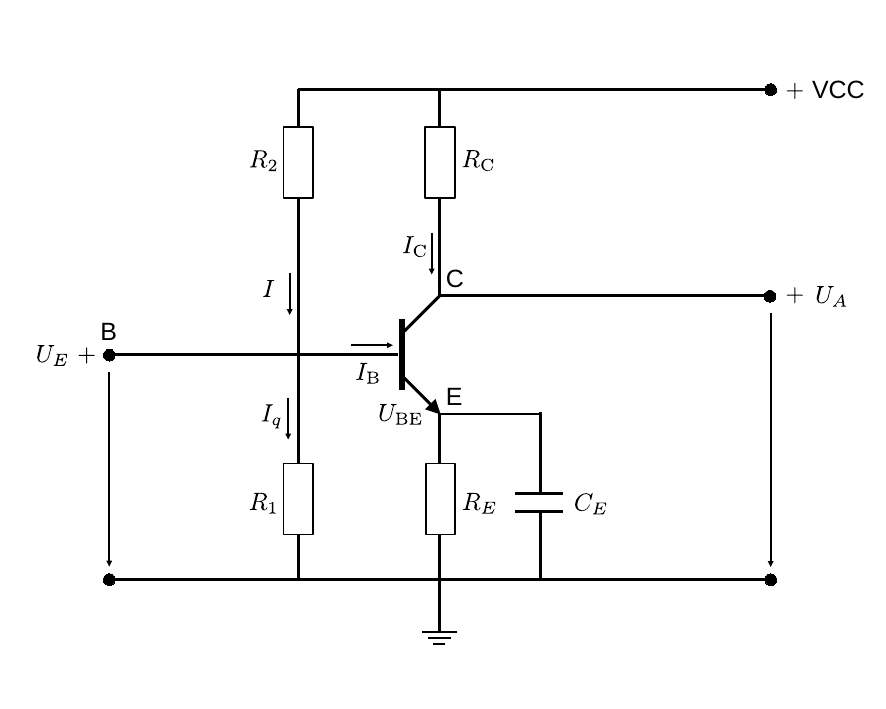
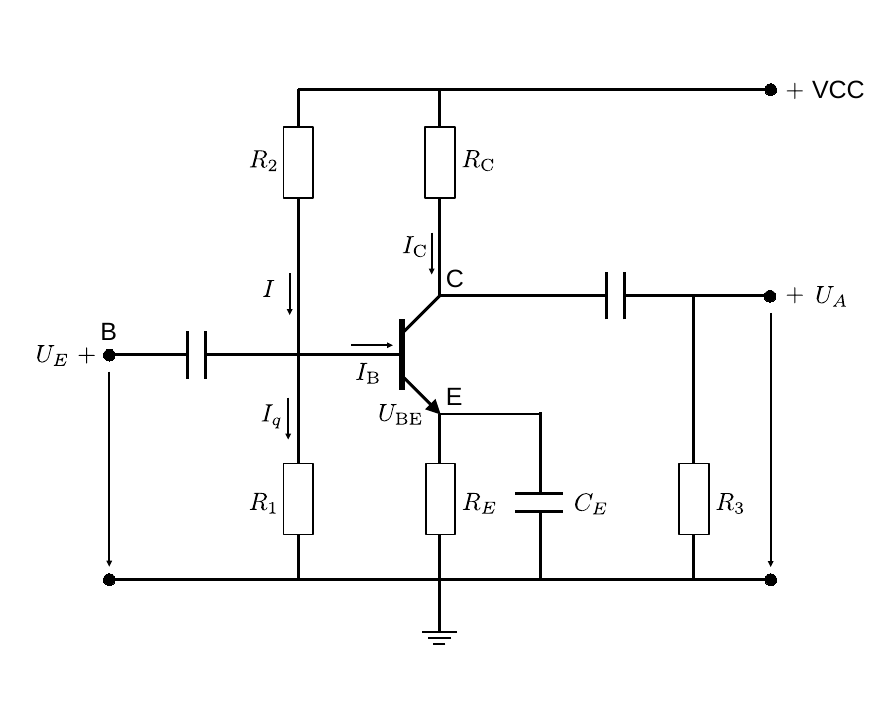
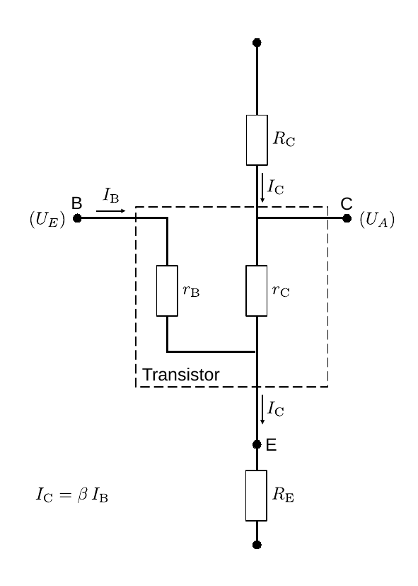

# Hinweise für den Versuch Operationsverstärker

## Verstärker

Ein [Verstärker](https://de.wikipedia.org/wiki/Verst%C3%A4rker_(Elektrotechnik)) ist ein in der Elektrotechnik verwendetes aktives elektronisches Bauelement, dass den zeitlichen Verlauf eines Eingangssignals mit erhöhter Leistung treu wiedergibt. "Aktiv" bedeutet, dass das Bauelement über eine eigene Spannungsversorgung verfügt. Eine wichtige Eigenschaft eines Verstärkers ist seine **Linearität**, d.h. ein um den Faktor $\alpha$ steigendes Eingangssignal wird (dem Betrag nach) auch als ein um den Faktor $\alpha$ steigendes Ausgangssignal wiedergegeben, sowie die **Bandbreite**, d.h. der Frequenzbereich, in dem er einsetzbar ist.

## Röhrenverstärker

Der grundsätzliche Aufbau eines Röhrenverstärkers ([Elektronenröhre](https://de.wikipedia.org/wiki/Elektronenr%C3%B6hre#Funktionsweise)) ist in **Abbildung 1** oben gezeigt:

**Abbildung 1**: (Schematische Darstellung eines (oben) Röhrenverstärkers und (unten) bipolaren npn-Transistors. Rechts unten sind die Schaltbilder für einen bipolaren npn- und pnp-Transistor gezeigt. Die Pfeilrichtungen in den Schaltbildern entsprechen den technischen Stromrichtungen)

---

Beim im Bild dargestellten Röhrenverstärker handelt es sich zunächst um einen Stromverstärker. An der Glühkathode (K) einer Vakuumröhre werden Elektronen freigesetzt und als freier Elektronenstrahl i.a. unter Hochspannung zur Anode (A) hin beschleunigt. An A ist der Elektronenstrahl als Strom $I_{A}$ messbar. Bereits sehr geringe Änderungen einer variablen, an der Gitterelektrode (G) anliegenden Steuerspannungen $U_{G}$ können durch diese Anordnungen als verstärktes Signal auf $I_{A}$ übertragen werden. Der Röhrenverstärker hat die Strom-Spannungs-Kennlinie einer Diode, die nur in einem begrenzten Bereich näherungsweise linear ist. Die Verstärkung hängt vom gewählten Arbeitspunkt in diesem Bereich ab und liegt i.a. in der Größenordnung von $\mathcal{O}(10-100)$. 

## Bipolartransistor

### Funktionsweise

Ein [Transistor](https://de.wikipedia.org/wiki/Transistor) funktioniert nach dem gleichen Prinzip, wie der Röhrenverstärker. Der [Bipolartransistor](https://de.wikipedia.org/wiki/Bipolartransistor) (engl. *bipolar junction transistor*, BJT), den wir im Rahmen dieses Versuchs diskutieren, besteht aus zwei gegeneinander geschalteten pn-[Halbleiterdioden](https://de.wikipedia.org/wiki/Diode). Je nach [Dotierung](https://de.wikipedia.org/wiki/Dotierung) unterscheidet man npn- von pnp-Transistoren. In **Abbildung 1** unten ist ein npn-Transistor gezeigt. Dabei ist die rechte Seite n- und die linke Seite stark n-dotiert; dazwischen befindet sich eine dünne p-dotierte Grenzschicht. Im Fall des pnp-Transistors sind die Dotierungen entsprechend zu vertauschen. Die elektrischen Schaltsymbole für beide Transistorarten sind in **Abbildung 1** unten rechts gezeigt. 

Am Transistor befinden sich, wie beim Röhrenverstärker, drei Anschlüsse: der linke Anschluss (E) wird als Emitter bezeichnet, der rechte (C) als Kollektor und der mittlere (B) als Basis. In der Schaltung, liegt E auf Masse ($\perp$), während an C eine positive Versorgungsspannung z.B. von $\text{VCC}=10\ \mathrm{V}$ anliegt. Damit ist die BE-Diode in Durchlass- und die BC-Diode in Sperrrichtung geschaltet. Liegt an B keine Spannung an, ist der BJT *selbstsperrend*, d.h. mindestens eine Diode (im Fall des hier diskutierten npn-Transistors die BC-Diode) ist in Sperrrichtung geschaltet. Eine bereits geringe mit einem kleinen Basisstrom $I_{\mathrm{B}}$ assoziierte Spannung $U_{\mathrm{BE}}$ an B kann allerdings zu einem erheblichen Fluss von Ladungsträgern zwischen E und C und damit zu einem hohen Kollektorstrom $I_{\mathrm{C}}$ führen. Dabei können, je nach Transistorart, sowohl Elektronen als auch [Defektelektronen](https://de.wikipedia.org/wiki/Defektelektron) zum Stromfluss beitragen. Eine Skizze zur Beschaltung eines npn-Transistors ist in **Abbildung 2** gezeigt:

**Abbildung 2**: (Beschaltung eines npn-Transistors)

---

Wir unterscheiden den BE- vom EC-Stromkreis. Am BE-Stromkreis hat der Transistor den Innenwiderstand $r_{\mathrm{B}}$, am EC-Stromkreis den Innenwiderstand $r_{\mathrm{C}}$. Liegt zwischen E und C eine Spannung $U_{A}\gt 0$ an wird die [Sperrschicht](https://de.wikipedia.org/wiki/Raumladungszone) der BE-Diode zwar verringert, die Sperrschicht der BC-Diode jedoch zur gleichen Zeit vergrößert. Zwischen E und C fließt nur ein geringer Kollektorstrom $I_{\mathrm{C}}$, äquivalent zum [Sperrstrom](https://de.wikipedia.org/wiki/Sperrstrom) der BC-Diode. In der Sperrschicht der BC-Diode wirkt im Gleichgewichtszustand die materialspezifische [Diffusionsspannung](https://de.wikipedia.org/wiki/Diffusionsspannung) $U_{D}$ intrinsisch der Diffusion von Elektronen und Defektelektronen entgegen. Diese beträgt für Silizium $U_{D}\approx0.7\ \mathrm{V}$. Legt man an den BE-Stromkreis eine Spannung $(U_{E}=)U_{\mathrm{BE}}\gtrsim U_{D}$ an wird die BE-Diode leitend. Wie bei der einfachen pn-Halbleiterdiode basiert die Leitung auf zwei Effekten: 

- Zum einen werden Defektelektronen aus B in E injiziert. Der dadurch entstehende Strom ist allerdings sehr gering und nimmt mit der [Diffusionslänge](https://de.wikipedia.org/w/index.php?title=Diffusionslänge&action=edit&redlink=1) der Defektelektronen ab. Die Defektelektronen rekombinieren daraufhin mit Elektronen in E. 
- Zum anderen werden Elektronen aus E in B injiziert. 

Da E höher als B dotiert ist, überwiegt der Elektronenstrom von E nach B. Aufgrund der geringen Ausdehnung von B — die kleiner als die Diffusionslänge der Ladungsträger zu wählen ist — rekombinieren nur wenige der Elektronen mit den Defektelektronen in B. Mehr als 90% der Elektronen diffundieren durch B in die  Sperrschicht der BC-Diode, wo sie wegen des großen Potentialabfalls zwischen B und C weiter nach C [driften](https://de.wikipedia.org/wiki/Driftgeschwindigkeit). In Form von $I_{\mathrm{C}}$ fließen auf diese Weise Elektronen von E nach C, wobei $I_{\mathrm{C}}$ durch geringe Ströme $I_{\mathrm{B}}$ gesteuert werden kann. Das Verhältnis
$$
\begin{equation}
\beta=\frac{I_{\mathrm{C}}}{I_{\mathrm{B}}},
\end{equation}
$$
das man als statischen [Stromverstärkungsfaktor](https://de.wikipedia.org/wiki/Mathematische_Beschreibung_des_Bipolartransistors#Stromverst%C3%A4rkungsfaktor) bezeichnet, hängt vom Transistortyp, $|I_{\mathrm{C}}|$ und, wie im Folgenden diskutiert, von der Temperatur ab. Es kann Werte zwischen 4 und 1000 annehmen. 

Der Name **Transistor** geht auf den englischen Begriff *transfer resistor* zurück, der die Eigenschaft des Transistors als von außen steuerbarem, elektrischem (Innen-)Widerstand $r_{\mathrm{E}}$ im EC-Stromkreis charakterisiert: 

- Für $U_{\mathrm{BE}}\lesssim U_{D}$ befindet sich der Transistor im EC-Stromkreis im Sperrbetrieb, d.h. $r_{\mathrm{E}}\gg 0$. 
- Für $U_{\mathrm{BE}}\gtrsim U_{D}$ befindet sich der Transistor im EC-Stromkreis im Sättigungssbetrieb, d.h. $r_{\mathrm{E}}\approx 0$. 
- Für $U_{\mathrm{BE}}\approx U_{D}$ hängt $r_{\mathrm{E}}$ stark von $I_{B}$ und damit von $U_{\mathrm{BE}}$ ab.

Ein optimaler Arbeitspunkt für den Betrieb ist für ein Eingangssignal erreicht, für das $r_{\mathrm{E}}$ die Hälfte des Maximalwerts annimmt. In diesem Fall ist $r_{\mathrm{E}}=R_{\mathrm{C}}$. Im BE-Stromkreis gilt immer $r_{\mathrm{BE}}\approx 0$ (die BE-Diode wird in Durchlassrichtung betrieben). **Der npn-Transistor kann nur Spannungen von $U_{\mathrm{EB}}\gtrsim U_{D}$ verstärken.**

### Stromgegengekoppelte Emitterschaltung

#### Problembeschreibung

Der Halbleitertransistor gehört zu den sog. [Heißleitern](https://de.wikipedia.org/wiki/Hei%C3%9Fleiter), deren ohmscher Widerstand mit zunehmender Temperatur nicht zu-, sondern abnimmt. Der Stromfluss $I_{\mathrm{C}}$ führt zur Erwärmung des Transistors und damit zu sinkenden Widerständen $r_{\mathrm{B}}$ und $r_{\mathrm{E}}$. Bei gleicher Basisspannung $U_{\mathrm{BE}}$ und einer Temperaturerhöhung um $10^{\circ}\mathrm{C}$ nimmt $I_{\mathrm{B}}$ durchschnittlich um den Faktor 2 zu. Eine Erhöhung von $I_{\mathrm{B}}$ führt wiederum zu einer Erhöhung von $I_{\mathrm{C}}$, wodurch die Temperatur weiter ansteigt. Der Stromverstärkungsfaktor $\beta$ und der Arbeitspunkt für den Transistor hängen also, z.T. stark von der Betriebstemperatur des Transistors ab. Zu starke Erwärmung kann sogar zur Zerstörung des Transistors führen. Es erweist sich daher als notwendig $\beta$ kontrolliert zu drosseln. Dies erfolgt am sichersten mit Hilfe der **stromgegengekoppelten Emitterschaltung**. 

#### Stabilisierung von $U_{E}$ und Wahl des Arbeitspunkts durch Spannungsteilung

Der erste Schritt zum Aufbau der Schaltung besteht darin $U_{E}=U_{\mathrm{BE}}$, wie in **Abbildung 3** dargestellt, mit Hilfe eines Spannungsteilers zu stabilisieren:  

**Abbildung 3**: (Realisierung der Basisspannung $U_{E}=U_{\mathrm{BE}}$ durch Teilung der Versorgungsspannung VCC)

---

In der Schaltung wird VCC mit B gekoppelt, die Widerstände $R_{1}$ und $R_{2}$ realisieren einen [Spannungsteiler](https://de.wikipedia.org/wiki/Spannungsteiler). Zwischen $R_{1}$ und $R_{2}$ teilt sich der Strom $I$ in $I_{\mathrm{B}}$ und den Querstrom $I_{q}$ auf. Wählt man $R_{2}\ll r_{\mathrm{B}}$ so, dass $I_{\mathrm{B}}\ll I_{q}$ kann der Spannungsteiler in guter Näherung als unbelastet angenommen werden, d.h. es gilt 
$$
\begin{equation*}
U_{E}\approx U_{R_{1}}(=I_{q}R_{1}),
\end{equation*}
$$
d.h. durch diese Maßnahme wird $U_{E}$ stabilisiert. 

Zudem kann $U_{E}(\gtrsim U_{D})$ durch die Wahl von $R_{1}$ und $R_{2}$ auf den gewünschten **Arbeitspunkt** geregelt werden, was sich v.a. bei bipolaren Signalen empfiehlt, da der Transistor Signale kleiner als $U_{D}$ nicht verstärkt, sondern wie eine Diode gleichrichtet. Es empfiehlt sich also dem Eingangssignal einen geeigneten *offset* zu geben, so dass das Ausgangssignal weder nach unten noch nach oben beschnitten wird oder in die Sättigung des Transistors gerät. Dies ist für $r_{\mathrm{C}}=R_{\mathrm{C}}$ der Fall.   

#### (Gleich-)Stromgegenkopplung

Der zweite Schritt besteht darin, wie in **Abbildung 4** dargestellt, auf der Seite des Emitters einen Widerstand $R_{E}$ einzubringen: 

**Abbildung 4**: (Einbringen des Emitterwiderstands $R_{E}$)

---

Erhöht sich die Temperatur sinkt, aufgrund der Eigenschaften des Transistors, $r_{\mathrm{B}}$, wodurch sich $I_{\mathrm{B}}$ erhöht, was einen weiteren Anstieg von $I_{\mathrm{C}}$ und damit eine weitere Temperaturerhöhung zur Folge hätte. Über $R_{E}$ fällt nun aber die Spannung
$$
\begin{equation*}
U_{R_{E}} = I_{\mathrm{C}}R_{E}
\end{equation*}
$$
ab. Nach den [Kirchhoffschen Regeln](https://de.wikipedia.org/wiki/Kirchhoffsche_Regeln) gilt zudem: 
$$
\begin{equation*}
U_{E}\approx U_{R_{1}} = U_{\mathrm{BE}}+U_{R_{E}}.
\end{equation*}
$$
Die Basisspannung $U_{E}$ ist stabil durch den Spannungsteiler vorgegeben und $U_{\mathrm{EB}}$ nimmt in dem Maße ab, in dem $U_{R_{E}}$ zunimmt, was wiederum die Reduktion von $I_{\mathrm{C}}$ zur Folge hat. Man bezeichnet diese Beschaltung als **Stromgegenkopplung**. 

Bringt man, wie in **Abbildung 5** gezeigt, parallel zu $R_{E}$ einen Emitter-Kondensator $C_{E}$ in die Schaltung ein wird $R_{E}$ bedingt durch die frequenzabhängige Impedanz 
$$
\begin{equation*}
Z_{C}=\frac{1}{i\omega\,C}
\end{equation*}
$$
des Kondensators für höherfrequente Signale überbrückt:

**Abbildung 5**: (Gleichstromgegengekoppelte Emitterschaltung)

---

Man spricht in diesem Fall von einer **gleichstromgegengekoppelten Emitterschaltung**. Diese führt im Vergleich zur stromgekoppelten Emitterschaltung zu einer höheren Signalerstärkung, bei der sich zeitlich ändernde Signale annähernd mit $\beta$ verstärkt werden. 

#### Potentialtrennung

Im letzten Schritt empfieht es sich sowohl das Ein- als auch das Ausgangspotential durch Kondensatoren vom Rest der Beschaltung zu trennen, wie in **Abbildung 6** gezeigt:  

**Abbildung 6**: (Schaltung des einstufigen gleichstromgegengekoppelten Transistorverstärkers)

---

Die Trennung durch die Kondensatoren filtert vorhandene Gleichsspannungen aus und entfernt so auch den *offset* der sich durch die Wahl des Arbeitspunktes ergibt.

### Verstärkung der Transistorschaltung

Zur Herleitung der Spannungsverstärkung $v_{U}$ der Transistorschaltung (ohne $C_{\mathrm{E}}$) aus **Abbildung 6** verwenden wir ein einfaches Modell zur Beschreibung des Kleinsignalverhaltens der Schaltung ([Kleinsignal-Ersatzschaltbild](https://de.wikipedia.org/wiki/Kleinsignal-Ersatzschaltbild)). Dabei legen wir alle Potentialquellen auf Masse und tauschen alle nichtlinearen Bauelemente, wie Transistoren und Dioden, durch lineare Ersatzschaltungen aus. Ein Transistor wird beispielsweise durch seine Innenwiderstände $r_{\mathrm{B}}$ und $r_{C}$ charakterisiert. Das resultierende Ersatzschaltbild des mit $R_{\mathrm{E}}$ und $R_{\mathrm{C}}$ beschalteten Transistors ist in **Abbildung 7** gezeigt:

**Abbildung 7**: (Ersatzschaltung zur Beschreibung des Kleinsignalverhaltens des Transistors bei äußerer Beschaltung durch $R_{\mathrm{E}}$ und $R_{\mathrm{C}}$)

---

Dabei haben wir zur weiteren Vereinfachung der Schaltung auf die äußere Beschaltung durch den Spannungsteiler und die zusätzlichen Kondensatoren, die jeweils nicht zur Verstärkung beitragen, verzichtet. Im Folgenden werden wir die Gesamtimpedanzen der BE- und EC-Stromkreise berechnen mit deren Hilfe wir vom Stromverstärkungsfaktor $\beta$ auf $v_{U}$ schließen werden. Hierzu machen wie die folgenden zwei Annahmen:

- $r_{\mathrm{C}}\gg r_{\mathrm{B}},\ R_{\mathrm{C}},\ R_{\mathrm{E}}$, d.h. $r_{\mathrm{C}}$ ist viel größer, als alle anderen Widerstände im Netzwerk;
- $r_{\mathrm{B}}\ll r_{\mathrm{C}},\ R_{\mathrm{C}},\ R_{\mathrm{E}}$, d.h. $r_{\mathrm{B}}$ ist viel kleiner, als alle anderen Widerstände im Netzwerk.

Damit lassen sich $U_{E}$ und $U_{A}$ wie folgt berechnen:
$$
\begin{equation*}
\begin{split}
&\text{Im EB-Stromkreis:}\\
&\\
&U_{E} = I_{\mathrm{B}}\,r_{\mathrm{B}} + 
\beta\,I_{\mathrm{B}}\,\left(\frac{1}{R_{\mathrm{E}}}+ \underbrace{\frac{1}{r_{\mathrm{C}}}}\right)^{-1};\\
&\hphantom{ccccccccccccccccccccccccccc}\approx0\\
&\\
&\hphantom{U_{E}}\approx 
\underbrace{I_{\mathrm{B}}\,r_{\mathrm{B}}} +
\beta\,I_{\mathrm{B}}\,R_{\mathrm{E}}
\approx
\beta\,I_{\mathrm{B}}\,R_{\mathrm{E}}.\\
&\hphantom{cccccc}\approx0\\
&\\
&\text{Im EC-Stromkreis:}\\
&\\
&U_{A} = \beta\,I_{\mathrm{B}}\left(
\frac{1}{R_{\mathrm{C}}} + 
\left(r_{\mathrm{C}} + 
\left(\frac{1}{R_{\mathrm{E}}} + \underbrace{\frac{\beta}{r_{\mathrm{B}}}}\right)^{-1}\right)^{-1}\right);\\
&\hphantom{ccccccccccccccccccccccccccccccccccc}\approx0\\
&\\
&\hphantom{U_{A}} \approx \beta\,I_{\mathrm{B}}\left(
\frac{1}{R_{\mathrm{C}}} + 
\frac{1}{r_{\mathrm{C}} + R_{\mathrm{E}}
}\right)^{-1}\approx \beta\,I_{\mathrm{B}}\,R_{\mathrm{C}},\\
\end{split}
\end{equation*}
$$
  woraus sich der einfache Zusammenhang
$$
\begin{equation*}
\begin{split}
v_{U} = \frac{U_{A}}{U_{E}} \approx \frac{\beta\,I_{\mathrm{B}}\,R_{\mathrm{C}}}{\beta\,I_{\mathrm{B}}\,R_{\mathrm{E}}}=\frac{R_{\mathrm{C}}}{R_{\mathrm{E}}}
\end{split}
\end{equation*}
$$
ergibt. Für kleine Signale hängt $v_{U}$ nicht mehr von den Materialeigenschaften des eigentlichen Transistors, der teilweise erhebliche Fertigungstoleranzen aufweisen kann, ab. Stattdessen besteht die Abhängigkeit nur noch von der äußeren Beschaltung durech die Widerstände $R_{\mathrm{C}}$ und $R_{\mathrm{E}}$.

  

## Operationsverstärker

Ein Operationsverstärker (OPV) ist eine integrierte Schaltung bestehend aus mehreren Transistoren und i.a. einem externen Rückkopplungsnetzwerk. Die [Darlington-Schaltung](https://de.wikipedia.org/wiki/Darlington-Schaltung), als eines der einfachsten Netzwerke zur Verstärkung (ohne Rückkopplung), ist in **Abbildung 3** dargestellt: 

**Abbildung 3**: (Darlington-Schaltung aus npn-Transistoren)

---

Dabei steuert der Ausgang des ersten (als [Emitterfolger](https://de.wikipedia.org/wiki/Transistorgrundschaltungen#Emitterfolger)) den Eingang des zweiten Transistors. Die Verstärkungsfaktoren beider Transistoren können in diesem Fall in etwa multipliziert werden: 
$$
\begin{equation*}
\beta \approx \beta_{1}\cdot\beta_{2}.
\end{equation*}
$$
Ohne äußere Beschaltung wäre $U_{\mathrm{EC}}$ abhängig von $U_{\mathrm{EB}}$ entweder maximal oder Null. Durch äußere Beschaltung verhindert man dieses Verhalten, wobei man den maximal erreichbaren Verstärkungsfaktor der Schaltung durch Gegenkopplung kontrolliert reduziert. Der (Strom-) Spannungsverstärkungsfaktor $v_{I}$ ($v_{U}$) der resultierenden Schaltung hängt dann nicht mehr vom oftmals ohnehin nicht sonderlich serienstabilen Verstärkungsfaktor $\beta$ des OPV sondern nur noch von der äußeren Beschaltung ab. Die Schaltsymbolik für einen OPV ist in **Abbildung 4** gezeigt: 

**Abbildung 4**: (Schaltsymbol eines Operationsverstärkers und Nomenklatur der anliegenden Ströme und Spannungen)

---

Der OPV besitzt i.a. mindestens fünf Pole, einen ($\ominus$) invertierenden und einen ($\oplus$) nicht-invertierenden Eingang, einen Ausgang und zwei (i.a. im Schaltbild nicht gezeigte) Anschlüsse zur externen Spannungsversorgung. I.a. ist der $\oplus$-Eingang als hochohmiger Spannungseingang ausgeführt; der $\ominus$-Eingang ist je nach OPV-Typ ebenfalls ein hochohmiger Spannungseingang oder ein niederohmiger Stromeingang. Entsprechend ist der Ausgang des OPV entweder als hochohmiger Stromausgang oder niederohmiger Spannungsausgang ausgelegt. 

Der Stromfluss in den $\oplus$-Eingang wird im Folgenden mit $I_{P}$ bezeichnet, der Stromfluss in den $\ominus$-Eingang mit $I_{N}$, $U_{D}$ bezeichnet die Differenzspannung zwischen $\ominus$- und $\oplus$-Eingang und $I_{a}$ und $U_{a}$ bezeichnen Strom und Spannung des Ausgangs. Bei Gegenkopplung steigt $U_{a}$ nur so lange an, bis $U_{D}$ über das Rückkopplungsnetzwerk auf Null abfällt.

# Navigation

[Main](../Operationsverstaerker.ipynb)